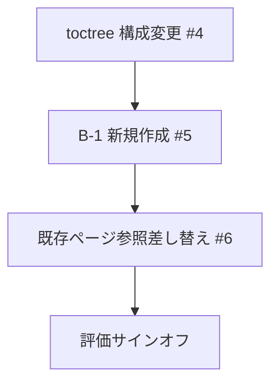

# ntf-yaml-support — design notes

Not read at runtime — for whoever maintains the procedures and needs to judge whether a step is still
right when requirements change.

## Context & constraints

NTF（Nablarchテスティングフレームワーク）解説書はテストデータ仕様が10本以上のRSTファイルに散在しており、
YAML対応追加にあたって単純に各ファイルへ追記する方法ではさらに重複と散在が悪化する。
既存の Sphinx ビルド環境（1.8.6、sphinx-tabs 非対応）で動作させる必要がある。

## Approach

- **Excel/YAML 並列表示は「Excelの場合」「YAMLの場合」見出し分け** — sphinx-tabs タブ切り替えより選択。
  sphinx-tabs が Sphinx 1.8.6 環境に未導入であり、導入コストが見合わないため。

- **テストデータ仕様を B-1「テストデータの記述方法」1ページに集約** — 各処理方式別ファイルへの分散追記より選択。
  現状の散在を解消しつつ YAML を加えると重複がさらに悪化するため、集約してから両対応する方が保守性が高い。

- **ディレクトリ構造は既存パスを維持し toctree のみ組み替え** — ファイル移動より選択。
  ファイル移動は既存の外部リンク・ブックマークを壊す可能性があり、toctree 付け替えで同等の構成変更が実現できるため。

- **B-2「テストデータの記述例」はタスク追加時に検討** — B-1 と同時作成より選択。
  B-1 の内容が固まってから例示ページの構成を決める方が手戻りが少ないため。

## Structure

| Actor | Responsibility |
|---|---|
| `06_TestFWGuide/` 配下 RST | テストデータ仕様・設定・Tips を格納する既存ディレクトリ |
| `06_TestFWGuide/testdata/` 配下 RST（新規） | B-1「テストデータの記述方法」の各節（overview〜values）|
| `input/` 配下 MD | YAML 仕様の正典資料（ntf-testdata-doc.md 等）|

## Flow

## Open questions

- B-2「テストデータの記述例」ページの要否・タイミング（B-1 完成後に検討）
- `05_UnitTestGuide/` 配下への影響範囲（#6 着手時に確定）
