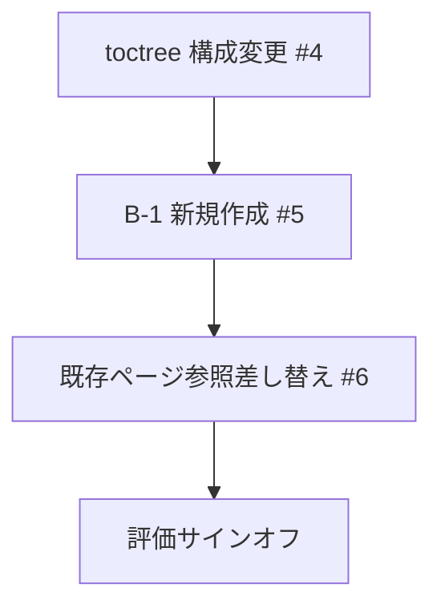

# ntf-yaml-support — design notes

Not read at runtime — for whoever maintains the procedures and needs to judge whether a step is still
right when requirements change.

## Context & constraints

NTF（Nablarchテスティングフレームワーク）解説書はテストデータ仕様が10本以上のRSTファイルに散在しており、
YAML対応追加にあたって単純に各ファイルへ追記する方法ではさらに重複と散在が悪化する。
既存の Sphinx ビルド環境（1.8.6、sphinx-tabs 非対応）で動作させる必要がある。

## Approach

- **Excel/YAML 並列表示は「Excelの場合」「YAMLの場合」見出し分け** — sphinx-tabs タブ切り替えより選択。
  sphinx-tabs が Sphinx 1.8.6 環境に未導入であり、導入コストが見合わないため。

- **テストデータ仕様を B-1「テストデータの記述方法」1ページに集約** — 各処理方式別ファイルへの分散追記より選択。
  現状の散在を解消しつつ YAML を加えると重複がさらに悪化するため、集約してから両対応する方が保守性が高い。

- **ディレクトリ構造は既存パスを維持し toctree のみ組み替え** — ファイル移動より選択。
  ファイル移動は既存の外部リンク・ブックマークを壊す可能性があり、toctree 付け替えで同等の構成変更が実現できるため。

- **B-2「テストデータの記述例」はタスク追加時に検討** — B-1 と同時作成より選択。
  B-1 の内容が固まってから例示ページの構成を決める方が手戻りが少ないため。

## Structure

| Actor | Responsibility |
|---|---|
| `06_TestFWGuide/` 配下 RST | テストデータ仕様・設定・Tips を格納する既存ディレクトリ |
| `06_TestFWGuide/testdata/` 配下 RST（新規） | B-1「テストデータの記述方法」の各節（overview〜values）|
| `input/` 配下 MD | YAML 仕様の正典資料（ntf-testdata-doc.md 等）|

## Flow



## Open questions

- B-2「テストデータの記述例」ページの要否・タイミング（B-1 完成後に検討）
- `05_UnitTestGuide/` 配下への影響範囲（#6 着手時に確定）

---

## 新構成ツリー

タイトルはアプリケーションフレームワーク側（「ウェブアプリケーション編」「Nablarchバッチアプリケーション」等）と同じパターンに揃える。読者の誘導はタイトルではなく index.rst の本文で行う。

```
テスティングフレームワーク（index.rst）
│  ※本文で「FW の概要・設定はXXを、テスト実装はXXを参照」と誘導
│
├── Nablarchテスティングフレームワークとは    ★タイトル確定★
│   │  ※アーキテクト向け。FW の仕組み・設定・導入
│   │
│   ├── A-1. テスティングフレームワーク概要
│   │       FW の特徴・制約・クラス構成・処理フロー
│   │       ※現: 01_Abstract.rst の前半（特徴・FW構成表）
│   │
│   ├── A-2. テストクラスの設定
│   │   ├── A-2-1. データベースを使用するクラスのテスト（DbAccessTestSupport）
│   │   ├── A-2-2. リクエスト単体テスト用クラス（Web/REST/バッチ）
│   │   └── A-2-3. リクエスト単体テスト用クラス（メッセージング各種）
│   │       ※現: 06_TestFWGuide/02_*.rst の「クラス構成・設定」部分
│   │
│   ├── A-3. テストデータの形式                ★新規★
│   │       Excel / YAML の違い・どちらを使うか・プロジェクト統一方針
│   │
│   ├── A-4. JUnit 5用拡張機能
│   │       ※現: JUnit5_Extension.rst そのまま
│   │
│   ├── A-5. マスタデータ復旧機能
│   │       ※現: 04_MasterDataRestore.rst そのまま
│   │
│   └── A-6. テストツール
│           ※現: 08_TestTools/ そのまま
│
└── テストの実装方法                           ★タイトル確定★
    │  ※開発者向け。テストコードの書き方・テストデータの作り方
    │
    ├── B-1. テストデータの記述方法             ★最大の変更点・1ページ★
    │       テストデータの構造・データブロック種別・testShots・
    │       テーブルデータ・ファイルデータ・メッセージング・値の記述方法
    │       ※現在10本以上に散在 → 1ページに集約
    │       ※主素材: input/ntf-testdata-doc.md 全章（§1〜10）
    │
    ├── B-2. テストデータの記述例               ★新規・1ページ★
    │       Excel / YAML 対比例を一覧。仕様を調べるなら B-1、写して使うなら B-2
    │       ※主素材: input/ntf-testdata-doc-examples-*.md 6本をまとめる
    │
    ├── B-3. クラス単体テストの実装方法
    │       ※現: 05_UnitTestGuide/01_ClassUnitTest/ ほぼそのまま
    │       ※「テストデータの書き方」節 → B-1 参照に置換
    │
    ├── B-4. リクエスト単体テストの実装方法
    │       ※現: 05_UnitTestGuide/02_RequestUnitTest/
    │       ※各ページの「テストデータの書き方」節 → B-1 参照に置換
    │
    ├── B-5. 取引単体テストの実装方法
    │       ※現: 05_UnitTestGuide/03_DealUnitTest/ ほぼそのまま
    │       ※「テストデータの書き方」節 → B-1 参照に置換
    │
    └── B-6. 目的別API使用方法
            ※現: 06_TestFWGuide/03_Tips.rst → 開発者向けに移動
            ※Excel 固有表現をテストデータファイル表現に修正
```

### タイトル確定の根拠

| タイトル | 根拠 |
|---|---|
| `Nablarchテスティングフレームワークとは` | 「Nablarchバッチアプリケーション」と同じく **「何のFWか」を先頭に置く** パターン |
| `テスティングフレームワーク概要` | FW名を繰り返さない。「自動」は「テスティングフレームワーク」から自明なため不要 |
| `テストの実装方法` | 内容が「テストコードを書く・テストデータを作る」という実装行為。「実施」はQAプロセスのニュアンスで内容とズレがある |

---

## 新旧マッピング表

既存ファイルの内容が新構成のどこに移るかを示す。

| # | 既存ファイル | 内容カテゴリ | 新構成の移動先 | 処理方針 |
|---|---|---|---|---|
| 1 | `06_TestFWGuide/01_Abstract.rst` § 特徴・構成表 | FW の仕組み | **A-1** | 抜粋・移動 |
| 2 | `06_TestFWGuide/01_Abstract.rst` § 命名規約・データタイプ一覧・特殊記法・注意事項 | テストデータ仕様 | **B-1**（Excel+YAML対応に拡充）、記述例は **B-2** | 集約・拡充 |
| 3 | `06_TestFWGuide/02_DbAccessTest.rst` § クラス構成・仕組み説明 | テストクラス基盤 | **A-2-1** | 抜粋・移動 |
| 4 | `06_TestFWGuide/02_DbAccessTest.rst` § API 使い方・記述例 | テスト実装方法 | **B-2** に残置 or 参照化 | 検討 |
| 5 | `06_TestFWGuide/02_RequestUnitTest.rst` | リクエスト単体テスト基盤 | **A-2-2** | 移動 |
| 6 | `06_TestFWGuide/RequestUnitTest_batch.rst` | バッチ用クラス設定 | **A-2-2** | 移動 |
| 7 | `06_TestFWGuide/RequestUnitTest_rest.rst` | REST 用クラス設定 | **A-2-2** | 移動 |
| 8 | `06_TestFWGuide/RequestUnitTest_real.rst` | メッセージング受信用クラス設定 | **A-2-3** | 移動 |
| 9 | `06_TestFWGuide/RequestUnitTest_send_sync.rst` | メッセージング送信用クラス設定 | **A-2-3** | 移動 |
| 10 | `06_TestFWGuide/RequestUnitTest_http_send_sync.rst` | HTTP 送信差分説明 | **A-2-3** | 移動 |
| 11 | `06_TestFWGuide/03_Tips.rst` | 目的別 API / Tips | **B-6** | 開発者向けに移動、Excel→テストデータファイル表現に修正 |
| 12 | `06_TestFWGuide/04_MasterDataRestore.rst` | マスタデータ復旧 | **A-5** | そのまま移動 |
| 13 | `06_TestFWGuide/JUnit5_Extension.rst` | JUnit 5 拡張 | **A-4** | そのまま移動 |
| 14 | `05_UnitTestGuide/01_ClassUnitTest/index.rst` | クラス単体テスト概要 | **B-3** | そのまま |
| 15 | `05_UnitTestGuide/01_ClassUnitTest/01_entityUnitTest/01_*.rst` | エンティティ単体テスト（Bean Validation） | **B-3** | テストデータの書き方 → B-1 参照に |
| 16 | `05_UnitTestGuide/01_ClassUnitTest/01_entityUnitTest/02_*.rst` | エンティティ単体テスト（Nablarch Validation） | **B-3** | テストデータの書き方 → B-1 参照に |
| 17 | `05_UnitTestGuide/01_ClassUnitTest/02_componentUnitTest.rst` | コンポーネント単体テスト | **B-3** | テストデータの書き方 → B-1 参照に |
| 18 | `05_UnitTestGuide/02_RequestUnitTest/index.rst` | リクエスト単体テスト概要 | **B-4** | そのまま |
| 19 | `05_UnitTestGuide/02_RequestUnitTest/batch.rst` | バッチリクエスト単体テスト | **B-4** | 「テストデータの書き方」節 → B-1 参照に |
| 20 | `05_UnitTestGuide/02_RequestUnitTest/rest.rst` | REST リクエスト単体テスト | **B-4** | 「テストデータの書き方」節 → B-1 参照に |
| 21 | `05_UnitTestGuide/02_RequestUnitTest/real.rst` | 同期応答受信 | **B-4** | 「テストデータの書き方」節 → B-1 参照に |
| 22 | `05_UnitTestGuide/02_RequestUnitTest/http_real.rst` | HTTP 同期応答受信 | **B-4** | 「テストデータの書き方」節 → B-1 参照に |
| 23 | `05_UnitTestGuide/02_RequestUnitTest/send_sync.rst` | 同期応答送信 | **B-4** | 「テストデータの書き方」節 → B-1 参照に |
| 24 | `05_UnitTestGuide/02_RequestUnitTest/delayed_send.rst` | 応答不要送信 | **B-4** | 軽微 |
| 25 | `05_UnitTestGuide/02_RequestUnitTest/delayed_receive.rst` | 応答不要受信 | **B-4** | 軽微 |
| 26 | `05_UnitTestGuide/02_RequestUnitTest/http_send_sync.rst` | HTTP 同期応答送信 | **B-4** | 「テストデータの書き方」節 → B-1 参照に |
| 27 | `05_UnitTestGuide/02_RequestUnitTest/mail.rst` | メール送信テスト | **B-4** | 軽微修正 |
| 28 | `05_UnitTestGuide/02_RequestUnitTest/fileupload.rst` | ファイルアップロードテスト | **B-4** | 軽微修正 |
| 29 | `05_UnitTestGuide/02_RequestUnitTest/double_transmission.rst` | 2重送信防止テスト | **B-4** | 変更なし |
| 30 | `05_UnitTestGuide/03_DealUnitTest/batch.rst` | バッチ業務単体テスト | **B-5** | 「テストデータの書き方」節 → B-1 参照に |
| 31 | `05_UnitTestGuide/03_DealUnitTest/send_sync.rst` | 同期応答送信 業務単体テスト | **B-5** | 「テストデータの書き方」節 → B-1 参照に |
| 32 | `05_UnitTestGuide/03_DealUnitTest/http_send_sync.rst` | HTTP 同期応答送信 業務単体テスト | **B-5** | 「テストデータの書き方」節 → B-1 参照に |
| 33 | `05_UnitTestGuide/03_DealUnitTest/real.rst` | 同期応答受信 業務単体テスト | **B-5** | そのまま |
| 34 | `05_UnitTestGuide/03_DealUnitTest/rest.rst` | REST 業務単体テスト | **B-5** | そのまま |
| 35 | `05_UnitTestGuide/03_DealUnitTest/delayed_send.rst` | 応答不要送信 業務単体テスト | **B-5** | そのまま |
| 36 | `05_UnitTestGuide/03_DealUnitTest/delayed_receive.rst` | 応答不要受信 業務単体テスト | **B-5** | そのまま |
| 37 | `08_TestTools/01_HttpDumpTool/` | HTTP dump ツール | **A-6** | そのまま |
| 38 | `08_TestTools/02_MasterDataSetup/` | マスタデータセットアップツール | **A-6** | そのまま |
| 39 | `08_TestTools/03_HtmlCheckTool/` | HTML チェックツール | **A-6** | そのまま |
| ★ | *(新規)* | テストデータの形式（Excel / YAML） | **A-3** | 新規作成 |
| ★ | *(新規、ntf-testdata-doc.md 主素材)* | テストデータの記述方法（仕様リファレンス） | **B-1** | ntf-testdata-doc.md を RST 化、1ページ |
| ★ | *(新規、examples 6本 主素材)* | テストデータの記述例（Excel/YAML 対比） | **B-2** | examples 6本をまとめて RST 化、1ページ |

---

## input/ 資料と新構成の対応

| input/ ファイル | 内容 | 用途 |
|---|---|---|
| `ntf-testdata-doc.md` | テストデータ仕様リファレンス全体（Excel/YAML 両対応） | B-1 全体の主素材 |
| `ntf-testdata-doc-examples-overview.md` | 全体像・groupId の記述例 | B-1-1 に掲載 |
| `ntf-testdata-doc-examples-testshots.md` | 処理方式別 testShots カラム仕様と記述例 | B-1-3 に掲載 |
| `ntf-testdata-doc-examples-table.md` | テーブルデータの Excel/YAML 記述例 | B-1-4 に掲載 |
| `ntf-testdata-doc-examples-file.md` | ファイルデータの Excel/YAML 記述例 | B-1-5 に掲載 |
| `ntf-testdata-doc-examples-messaging.md` | メッセージングデータの Excel/YAML 記述例 | B-1-6 に掲載 |
| `ntf-testdata-doc-examples-special.md` | 特殊値・ディレクティブ・ヘッダ/コメント の Excel/YAML 記述例 | B-1-7 に掲載 |
| `ntf-doc-terms.md` | 用語リファレンス（既存解説書からの用語引き表） | 執筆時の用語統一チェックに使用（ページには掲載しない） |
| `ntf-testdata-loading.md` | FW 内部の読み込み機構（4段階変換・クラス設計） | 使用しない（内部設計書） |
| `testdata-converter-design.md` | Excel/YAML 変換ツール設計書 | 使用しない（内部設計書） |

---

## 品質担保チェックリスト

### Phase 1: 新構成への移行確認

- [ ] 新旧マッピング表の全39項目（＋新規2項目）が新構成に存在するか確認
- [ ] 既存 RST の toctree 参照が全て有効か（`make html` でエラーなし）
- [ ] 既存の内部リンク（`:ref:` ラベル）が移動後も有効か
- [ ] `05_UnitTestGuide/` と `06_TestFWGuide/` 間のクロス参照が壊れていないか

### Phase 2: B-1 コンテンツ品質

- [ ] ntf-testdata-doc.md の全章（§1〜10）が B-1 に対応する節を持つか
- [ ] 全 example ファイル（6本）の記述例が B-1 に掲載されているか
- [ ] Excel 記述例と YAML 記述例が全節に揃っているか（片方だけになっていないか）
- [ ] testShots カラム仕様が処理方式ごとに揃っているか

### Phase 3: 用語・トンマナ

- [ ] `ntf-doc-terms.md` の用語（データタイプ、グループ ID、testShots 等）が統一されているか
- [ ] 「Excelファイル」→「テストデータファイル」への置換が B-1 を除く全ページで完了しているか
- [ ] Excel 固有の用語（シート・セル・罫線）が単独で使われていないか

### Phase 4: ビルド確認

- [ ] `make html` がエラーなし
- [ ] 生成された HTML で A 章・B 章が index から正しくリンクされているか
- [ ] B-1 の各節間のリンクが有効か
