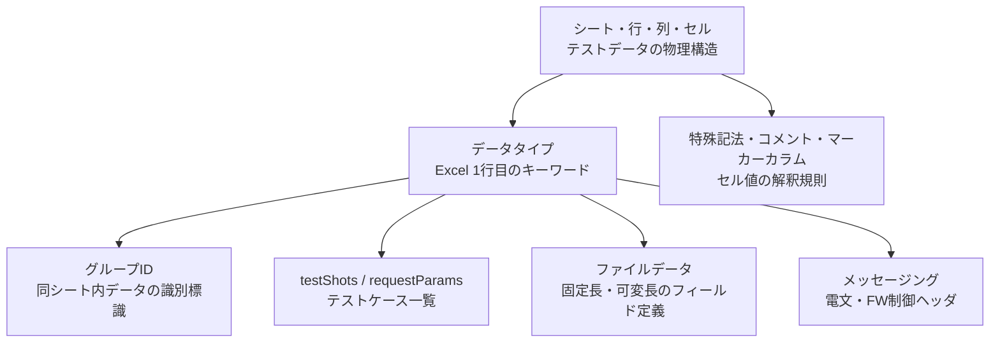

# NTF 解説書（v6）用語リファレンス

NTF（自動テストフレームワーク）解説書から抽出した用語の引き表。`ntf-testdata-doc.md` の見直しで、解説書の正式な用語名・表記・仕様を引くために使う。

取得元の解説書 URL ベース:
`https://nablarch.github.io/docs/LATEST/doc/development_tools/testing_framework/guide/development_guide/`

取得対象は `06_TestFWGuide/` 配下、補足参照は `05_UnitTestGuide/` 配下。各用語の出典ページは見出し直下に示す。

---

## 用語ドメインの全体像



データタイプが解析の起点（Excel 1 行目の `データタイプ=値`）で、グループ ID・testShots・ファイルデータ・メッセージングはいずれもデータタイプに紐づく。特殊記法・コメント・マーカーカラムはセル値の解釈規則として全データタイプに横断的にかかる。

---

## データタイプ（Data Types）

出典: `06_TestFWGuide/01_Abstract.html`

フレームワークが認識する固定キーワード。データ 1 行目に `データタイプ=値` の形式で記載する。

| データタイプ | 設定値 | 用途 |
|---|---|---|
| `SETUP_TABLE` | テーブル名 | テスト前に DB へ登録する準備データ |
| `EXPECTED_TABLE` | テーブル名 | テスト後の DB 期待値（省略カラムは比較対象外） |
| `EXPECTED_COMPLETE_TABLE` | テーブル名 | テスト後の DB 期待値（省略カラムにはデフォルト値を適用して比較） |
| `LIST_MAP` | 一意の ID | `List<Map<String,String>>` 形式で取得するデータ |
| `SETUP_FIXED` | ファイルパス | 固定長ファイルの事前準備データ |
| `EXPECTED_FIXED` | ファイルパス | 固定長ファイルの期待値 |
| `SETUP_VARIABLE` | ファイルパス | 可変長ファイルの事前準備データ |
| `EXPECTED_VARIABLE` | ファイルパス | 可変長ファイルの期待値 |
| `EXPECTED_REQUEST_HEADER_MESSAGES` | リクエスト ID | 要求電文（ヘッダ）の期待値（固定長ファイル形式） |
| `EXPECTED_REQUEST_BODY_MESSAGES` | リクエスト ID | 要求電文（本文）の期待値（固定長ファイル形式） |
| `RESPONSE_HEADER_MESSAGES` | リクエスト ID | 応答電文（ヘッダ）データ（固定長ファイル形式） |
| `RESPONSE_BODY_MESSAGES` | リクエスト ID | 応答電文（本文）データ（固定長ファイル形式） |

`MESSAGE` 系データタイプには、固定 ID として `setUpMessages`／`expectedMessages` も使う（メッセージング処理テスト）。

---

## シート・行・列・セル

出典: `06_TestFWGuide/01_Abstract.html`

| 用語 | 定義 |
|---|---|
| ファイル名 | テストクラス名と同一（拡張子のみ `.xlsx`） |
| シート名 | テストメソッド名と同一 |
| setUpDb シート | テストクラス共通の DB 初期値を記載する特殊シート名（テストメソッド実行前に自動投入） |
| 1 行目（データタイプ行） | `データタイプ=値` を記述する行 |
| 2 行目（ヘッダ行） | カラム名（Map のキー）を記述する行 |
| 3 行目以降（データ行） | 実データ・レコードを記述する行 |
| カラム | Excel の列に対応する概念（フィールド名） |
| セル | 個々の入力値の単位。書式は全て文字列として記述する |

2 行目以降の具体構造はデータタイプごとに異なる（後述「データタイプ別の行構造」）。

---

## セル値の解釈規則（特殊記法・マーカーカラム・コメント）

出典: `06_TestFWGuide/01_Abstract.html`

### 特殊記法

| 記述 | 変換内容 |
|---|---|
| `null` | null 値 |
| `"null"` | 文字列 `null`（前後のダブルクォートを除去） |
| `""` | 空文字列 |
| `${systemTime}` | システム日時（実行時に挿入） |
| `${setUpTime}` | コンポーネント設定ファイルで定めた固定タイムスタンプ |
| `${文字種,文字数}` | 指定文字種・文字数で生成（例: `${半角英字,5}`） |
| `${binaryFile:パス}` | 指定パスのバイナリファイル内容（BLOB 列用） |
| `\\r` | CR 改行コード |
| `\\n` | LF 改行コード |

### マーカーカラム

カラム名を半角角括弧で囲む（例: `[no]`）と、そのカラムはテスト実行時に読み込まれない。Excel 上の可読性向上（行番号表示など）に使う視覚的マーカー。

### コメント

セル値の `//` 以降はフレームワークが読み込まない（ドキュメント注釈用途）。

### 日付記述フォーマット

`yyyyMMddHHmmssSSS` または `yyyy-MM-dd HH:mm:ss.SSS`。ミリ秒・時刻部分は省略可能。

### 設計原則（用語として登場する概念）

- テスト独立性: テストメソッドの実行順序に依存しない設計
- データ集約: テストデータは全て Excel に記述
- データタイプまとめ記述: 複数データタイプ使用時は種類ごとにまとめる（混在するとデータ読み込みが途中で終了する）

---

## グループ ID

出典: `06_TestFWGuide/02_RequestUnitTest.html`

同じシート内に記載したデータを識別する標識。`setUpTable`・`expectedSearch`・`expectedTable` などのカラムでグループ ID を参照し、対応するデータセットを紐付ける。

- 書式: `データタイプ[グループID]=値`（例: `SETUP_TABLE[case_001]=EMPLOYEE_TABLE`）
- `default`: デフォルトグループ ID（省略時に使用される）

---

## データタイプ別の行構造

### DB 系（SETUP_TABLE / EXPECTED_TABLE / EXPECTED_COMPLETE_TABLE / LIST_MAP）

出典: `06_TestFWGuide/02_DbAccessTest.html`

いずれも 1 行目に `データタイプ=値`、2 行目にカラム名（Map のキー）、3 行目以降にデータ行を置く。

| データタイプ | 2 行目 | 3 行目以降 |
|---|---|---|
| `SETUP_TABLE=テーブル名` | カラム名（複数列） | 登録レコード |
| `LIST_MAP=任意のID` | Map のキー（SELECT 句で指定したカラム名） | 期待結果（SELECT 対象カラムは全て記述必須） |
| `EXPECTED_TABLE=テーブル名` | カラム名 | 期待値（省略カラムは比較対象外） |
| `EXPECTED_COMPLETE_TABLE=テーブル名` | カラム名 | 期待値（省略カラムにはデフォルト値が格納されているものとして比較） |

#### デフォルト値

| データ型 | デフォルト値 |
|---|---|
| 数値型 | `0` |
| 文字列型 | 半角スペース |
| 日付型 | `1970-01-01 00:00:00.0` |

カスタマイズは `BasicDefaultValues` クラスで設定。

#### カラム省略の制約

- 主キーカラムは省略不可。
- 省略カラムへのデフォルト値適用は `EXPECTED_COMPLETE_TABLE` のみ（`EXPECTED_TABLE` では省略カラムを比較対象外とする）。

#### タイムスタンプ形式

`java.sql.Timestamp` 型: `yyyy-mm-dd hh:mm:ss.fffffffff`（f は 9 桁ナノ秒）

#### マスタデータ復旧機能

外部キー設定テーブルの親子関係データを扱う際に利用する機能。読み取り専用マスタを共通ファイルで再利用する場合にも用いる。

### 固定長ファイル（SETUP_FIXED / EXPECTED_FIXED）

出典: `06_TestFWGuide/RequestUnitTest_batch.html`、`05_UnitTestGuide/02_RequestUnitTest/batch.html`

```
SETUP_FIXED[グループID]=ファイルパス

[ディレクティブ行]   ← text-encoding, record-separator 等
[レコード種別行]
[フィールド名称行]
[データ型行]         ← 日本語表記（例: 半角英字）
[フィールド長行]
[データ行]
```

- バイナリデータは 16 進数形式（例: `0x4AD`）で記述。`0x` プレフィックスがない場合は文字列として解釈。
- 指定したフィールド長に対してデータのバイト長が短い場合、フィールドのデータ型に応じたパディングが行われる。

### 可変長ファイル（SETUP_VARIABLE / EXPECTED_VARIABLE）

出典: `06_TestFWGuide/RequestUnitTest_batch.html`、`05_UnitTestGuide/02_RequestUnitTest/batch.html`

```
SETUP_VARIABLE[グループID]=ファイルパス

[ディレクティブ行]
[レコード種別行]
[フィールド名称行]
[データ型行]
（フィールド長行は存在しない）
[データ行]
```

固定長との違いはフィールド長を記載しない点。

### ファイルデータのフィールド定義用語

| 用語 | 定義 |
|---|---|
| レコード種別行 | ファイルデータのレコード種別を示す行 |
| フィールド名称行 | 各フィールド名称を並べた行 |
| データ型行 | フィールドのデータ型を示す行（日本語表記例: 「半角英字」） |
| フィールド長行 | 各フィールドのバイト長を示す行（固定長のみ存在） |
| データ行 | 実データを並べた行 |
| パディング | フィールド長に対してデータのバイト長が短い場合に自動補完される処理 |

### ディレクティブ

出典: `06_TestFWGuide/RequestUnitTest_batch.html`

ファイル／電文フォーマット定義の設定行。コンポーネント設定でデフォルト値を map 形式で指定可能。

| ディレクティブキー | 対象 | 説明 |
|---|---|---|
| `text-encoding` | 共通 | 文字エンコーディング（例: `Windows-31J`） |
| `record-separator` | 共通 | レコード区切り文字（例: `CRLF`） |
| `quoting-delimiter` | 可変長 | 引用符区切り文字 |
| `file-type` | メッセージ | 電文全体を文字列として扱うか項目単位で分割するかの制御（`Fixed` / `XML` / `JSON` 等） |
| `record-length` | 固定長 | レコード長。フィールド長から自動計算のため記載不要な場合あり |

デフォルト値設定のコンポーネントプロパティ:
- `defaultDirectives`（共通）
- `fixedLengthDirectives`（固定長専用）
- `variableLengthDirectives`（可変長専用）

---

## testShots / requestParams（テストケース一覧）

`LIST_MAP` データタイプで定義するテストケース一覧。固定 ID `testShots` と `requestParams` を持ち、カラム構成はテスト種別ごとに異なる。

| 用語 | 定義 |
|---|---|
| `testShots` | テストケース一覧の `LIST_MAP` ID（固定値） |
| `TestShot` | テストケース 1 件分の情報を格納・実行するクラス |
| `requestParams` | リクエストパラメータの `LIST_MAP` ID（固定値） |
| 行単位の関連付け | testShots と requestParams は同じ行番号で対応する |

### testShots カラム一覧（ウェブアプリケーション）

出典: `06_TestFWGuide/02_RequestUnitTest.html`、`05_UnitTestGuide/02_RequestUnitTest/index.html`

| カラム名 | 必須 | 説明 |
|---|---|---|
| `no` | ✓ | テストケース番号（1 からの連番） |
| `description` | ✓ | テストケースの説明。HTML ダンプファイル名に使用される |
| `context` | ✓ | リクエスト ID・ユーザ・HTTP メソッドを記載 |
| `cookie` | - | Cookie 情報 |
| `queryParams` | - | クエリパラメータ情報 |
| `isValidToken` | - | トークン設定の要否（`true` / `false`） |
| `setUpTable` | - | テストケース実行前の DB 登録用グループ ID |
| `expectedStatusCode` | ✓ | 期待する HTTP ステータスコード |
| `expectedMessageId` | - | 期待するメッセージ ID（複数の場合はカンマ区切り） |
| `expectedSearch` | - | 期待する検索結果のグループ ID（`SqlResultSet` 型、リクエストスコープキー `searchResult`） |
| `expectedTable` | - | 期待するテーブル状態のグループ ID |
| `forwardUri` | - | 期待するフォワード先 URI |
| `expectedContentLength` | - | ダウンロード時のコンテンツレングス期待値 |
| `expectedContentType` | - | ダウンロード時のコンテンツタイプ期待値 |
| `expectedContentFileName` | - | ダウンロード時のファイル名期待値 |
| `expectedMessage` | - | メッセージ同期送信時の要求電文グループ ID |
| `responseMessage` | - | メッセージ同期送信時の応答電文グループ ID |
| `expectedMessageByClient` | - | HTTP メッセージ同期送信時の要求電文グループ ID |
| `responseMessageByClient` | - | HTTP メッセージ同期送信時の応答電文グループ ID |

#### requestParams の仕様

- `LIST_MAP=requestParams` として定義。HTTP リクエストパラメータを表す。
- パラメータが不要なテストケースでもダミー行の定義が必須。
- 1 つのキーに複数の値を指定する場合はカンマ区切り。カンマ自体を含める場合は `\\` でエスケープ。

### testShots カラム一覧（バッチ処理）

出典: `06_TestFWGuide/RequestUnitTest_batch.html`、`05_UnitTestGuide/02_RequestUnitTest/batch.html`

| カラム名 | 必須 | 説明 |
|---|---|---|
| `no` | ✓ | テストケース番号（1 からの連番） |
| `description` | ✓ | テストケースの説明 |
| `expectedStatusCode` | ✓ | 期待するステータスコード |
| `diConfig` | ✓ | バッチ実行時のコンポーネント設定ファイルへのパス |
| `requestPath` | ✓ | バッチ実行時のリクエストパス |
| `userId` | ✓ | バッチ実行ユーザ ID |
| `setUpTable` | - | テスト前の DB 登録用グループ ID |
| `setUpFile` | - | 入力用ファイル作成時に参照するデータのグループ ID |
| `expectedTable` | - | 期待する DB 状態のグループ ID |
| `expectedFile` | - | 出力ファイルの期待値データのグループ ID |
| `expectedLog` | - | 期待するログメッセージを記載した `LIST_MAP` の ID |
| `args[n]` | - | コマンドライン引数（n は 0 以上の整数、連続した添字が必要） |

### testShots カラム一覧（メッセージング受信）

出典: `06_TestFWGuide/RequestUnitTest_real.html`、`05_UnitTestGuide/02_RequestUnitTest/real.html`

| カラム名 | 必須 | 説明 |
|---|---|---|
| `no` | ✓ | テストケース番号（1 からの連番） |
| `description` | ✓ | テストケースの説明 |
| `expectedStatusCode` | ✓ | 期待するステータスコード |
| `diConfig` | ✓ | コンポーネント設定ファイルパス |
| `requestPath` | ✓ | リクエストパス（常駐バッチ） |
| `userId` | ✓ | 実行ユーザ ID |
| `setUpTable` | - | テスト前の DB 初期化用グループ ID |
| `expectedTable` | - | 期待する DB 状態のグループ ID |
| `expectedLog` | - | 期待するログメッセージ ID |

### ログ検証（expectedLog）

出典: `06_TestFWGuide/RequestUnitTest_batch.html`

`LIST_MAP=expectedLogMessages` として定義し、以下のカラムを含む（AND 条件で評価）。

| カラム名 | 説明 |
|---|---|
| `logLevel` | 期待するログレベル |
| `message1` | 期待するログに含まれる文言（複数設定可: `message1`, `message2`, ...） |

---

## メッセージング

### 基本用語

| 用語 | 定義 |
|---|---|
| 電文 | メッセージング処理のメッセージ |
| 要求電文 | 送信するメッセージ（リクエスト） |
| 応答電文 | 受信するメッセージ（レスポンス） |
| 電文種別 | 要求電文／応答電文の分類 |
| フレームワーク制御ヘッダ | メッセージに付与される制御情報（`requestId` 等） |
| メッセージボディ | フレームワーク制御ヘッダ以降の実データ部分 |
| `setUpMessages` | メッセージング受信テストにおける要求電文 ID（固定値） |
| `expectedMessages` | メッセージング受信テストにおける応答電文期待値 ID（固定値） |
| `no`（電文側） | 複数電文送信時の連番・送信順序を示す電文内フィールド |

### メッセージデータ構造（受信: setUpMessages / expectedMessages）

出典: `06_TestFWGuide/RequestUnitTest_real.html`、`05_UnitTestGuide/02_RequestUnitTest/real.html`

`MESSAGE=setUpMessages` または `MESSAGE=expectedMessages` として定義。

セクション 1 ─ ディレクティブ行:
- `text-encoding`（文字エンコーディング）
- `record-separator`（レコード区切り）
- `requestId`（フレームワーク制御ヘッダ: リクエスト識別子）
- `file-type`（電文種別の解釈方式）

セクション 2 ─ メッセージボディ:
- 1 行目: フィールド名称（先頭セルは `no`）
- 2 行目: データ型（先頭セルは空白）
- 3 行目: フィールド長（先頭セルは空白）
- 4 行目以降: 実データ（先頭セルは通番）

#### `FwHeaderDefinition` / `fwHeaderDefinition`

- `FwHeaderDefinition` 実装クラスが `fwHeaderDefinition` という名前でコンポーネント登録されていることが前提。
- 異なる名称の場合は `getFwHeaderDefinitionName()` メソッドをオーバーライドする。

### メッセージデータタイプ（同期応答メッセージ送信）

出典: `06_TestFWGuide/RequestUnitTest_send_sync.html`、`05_UnitTestGuide/02_RequestUnitTest/send_sync.html`

| データタイプ | 設定値 | 用途 |
|---|---|---|
| `EXPECTED_REQUEST_HEADER_MESSAGES` | リクエスト ID | 要求電文ヘッダの期待値 |
| `EXPECTED_REQUEST_BODY_MESSAGES` | リクエスト ID | 要求電文本文の期待値 |
| `RESPONSE_HEADER_MESSAGES` | リクエスト ID | 応答電文ヘッダデータ |
| `RESPONSE_BODY_MESSAGES` | リクエスト ID | 応答電文本文データ |

グループ ID 付き書式例: `EXPECTED_REQUEST_BODY_MESSAGES[グループID]=リクエストID`

電文データの行構造: `no` カラム（複数電文送信時の連番・送信順序） → フィールド名称行 → データ型行（日本語表記例: 「半角英字」） → フィールド長行 → データ行。

ディレクティブの記載不要項目:
- `file-type`（テスティングフレームワークが固定長のみ対応）
- `record-length`（フィールド長から自動計算）

### 障害系テスト用特殊値

応答電文の最初のフィールド（`no` 除く）に設定する。

| 設定値 | 発生する例外 |
|---|---|
| `errorMode:timeout` | `MessageSendSyncTimeoutException`（タイムアウトシミュレート） |
| `errorMode:msgException` | `MessagingException`（メッセージ受信エラーシミュレート） |

### 制約事項（同期応答メッセージ送信）

- フィールド名称に重複は許容されない。
- 複数レコード電文の場合「ヘッダ → 本文」を交互に記載する必要がある。
- `expectedMessage` および `responseMessage` が空欄で送信が行われた場合、テストは失敗する。

### HTTP 同期応答メッセージ送信の用語読み替え

出典: `06_TestFWGuide/RequestUnitTest_http_send_sync.html`

「同期応答メッセージ送信処理テスト」との差分のみ。基本は同期応答メッセージ送信を参照。

| 標準用語（同期応答メッセージ送信） | HTTP 版の対応用語 |
|---|---|
| 同期応答メッセージ送信 | HTTP 同期応答メッセージ送信 |
| `MockMessagingContext` | `MockMessagingClient` |
| `RequestTestingMessagingProvider` | `RequestTestingMessagingClient` |

---

## テスト種別と主要クラス

### テスト種別の正式名称

| 正式名称 | 内容 |
|---|---|
| クラス単体テスト | Action/Component の単体テスト |
| リクエスト単体テスト（ウェブアプリケーション） | HTTP リクエスト 1 件単位のテスト（シンクライアント型）。Ajax 等のリッチクライアントは未対応 |
| リクエスト単体テスト（RESTful ウェブサービス） | REST API の 1 リクエスト単位テスト |
| リクエスト単体テスト（バッチ処理） | バッチ処理の 1 バッチ起動単位テスト |
| リクエスト単体テスト（メッセージ受信処理） | 電文受信 1 件単位テスト |
| リクエスト単体テスト（同期応答メッセージ送信処理） | 同期応答電文送信の 1 リクエスト単位テスト |
| リクエスト単体テスト（HTTP 同期応答メッセージ送信処理） | HTTP 同期応答電文送信の 1 リクエスト単位テスト |
| 取引単体テスト | 複数リクエストをまたぐ業務取引単位のテスト |

### DB アクセステスト

出典: `06_TestFWGuide/02_DbAccessTest.html`

| 分類 | 操作 | 検証・要件 |
|---|---|---|
| 参照系テスト | SELECT | `setUpDb` で準備データを投入し、`assertSqlResultSetEquals` で検証。コミット処理は不要 |
| 更新系テスト | INSERT / UPDATE / DELETE | 実行後に `commitTransactions()` が必須。`assertTableEquals` で検証 |

| メソッド | 用途 |
|---|---|
| `setUpDb(String sheetName)` | シート内の全 SETUP_TABLE を処理して準備データを投入 |
| `assertSqlResultSetEquals(sheetName, mapId, SqlResultSet)` | 参照結果を LIST_MAP と比較（レコード順序を厳密に比較） |
| `assertTableEquals(sheetName)` | 更新後 DB を EXPECTED_TABLE と比較（主キーで照合、順序不問） |
| `commitTransactions()` | トランザクションをコミット（更新系テストで必須） |

### リクエスト単体テスト（ウェブアプリケーション）の主要クラス

出典: `06_TestFWGuide/02_RequestUnitTest.html`、`05_UnitTestGuide/02_RequestUnitTest/index.html`

| クラス名 | 役割 |
|---|---|
| `DbAccessTestSupport` | DB 関連の準備データ投入・検証機能 |
| `HttpServer` | 内蔵サーブレットコンテナ（内蔵サーバ） |
| `HttpRequestTestSupport` | リクエスト単体テスト用アサート提供 |
| `BasicHttpRequestTestTemplate` | テストソース記述量を削減するテンプレートクラス |
| `TestCaseInfo` | データシートに定義されたテストケース情報を格納するクラス |

シート構成: `setUpDb` シート（テストクラス共通 DB 初期値）、`testShots` シート（テストケース一覧、`LIST_MAP` ID は `testShots`）、`requestParams` シート（HTTP リクエストパラメータ、`LIST_MAP` ID は `requestParams`）。

#### HTML ダンプ出力

- デフォルト出力先: `./tmp/html_dump`
- ディレクトリ構造: テストクラスごとのディレクトリ／テストケース説明と同名の HTML ファイル
- CSS・画像等のリソースも同ディレクトリに出力。

#### コンポーネント設定の主要項目

| 項目名 | デフォルト値 | 説明 |
|---|---|---|
| `htmlDumpDir` | `./tmp/html_dump` | HTML ダンプの出力先 |
| `webBaseDir` | `../main/web` | ウェブアプリケーションルート |
| `userIdSessionKey` | `user.id` | ユーザ ID を格納するセッションキー |
| `dumpVariableItem` | `false` | JSESSIONID・トークンのダンプ出力制御 |
| `checkHtml` | `true` | HTML チェック実施フラグ |

### リクエスト単体テスト（RESTful ウェブサービス）

出典: `06_TestFWGuide/RequestUnitTest_rest.html`

| クラス名 | 役割 |
|---|---|
| `RestTestSupport` | DB 機能を含む完全版スーパクラス |
| `SimpleRestTestSupport` | DB 不要な場合の簡略版スーパクラス |
| `RestMockHttpRequest` | リクエスト構築に使用するオブジェクト |

- リクエスト構築（流れるようなインターフェース）: `get` / `post` / `put` / `patch` / `delete` および汎用の `newRequest` で `RestMockHttpRequest` を生成。
- 結果検証: `assertStatusCode`（HTTP ステータスコード）、`readTextResource`（ファイルベースの期待値読み込み）。レスポンスボディは JSONAssert・json-path-assert・XMLUnit 等の外部ライブラリを推奨。
- 必須モジュール: `nablarch-testing-rest`・`nablarch-testing-default-configuration`・`nablarch-testing-jetty12`。

### リクエスト単体テスト（バッチ処理）

出典: `06_TestFWGuide/RequestUnitTest_batch.html`、`05_UnitTestGuide/02_RequestUnitTest/batch.html`

| クラス名 | 役割 |
|---|---|
| `StandaloneTestSupportTemplate` | コンテナ外処理のテスト環境を提供 |
| `BatchRequestTestSupport` | テスト準備・アサート提供 |
| `TestShot` | テストケース 1 件分の情報を格納・実行するクラス |
| `MainForRequestTesting` | テスト用メインクラス |

常駐バッチテスト時のハンドラ変更: `RequestThreadLoopHandler` を `OneShotLoopHandler` に変更する（セットアップした要求データ全件処理後にバッチ実行が終了するため）。

### リクエスト単体テスト（メッセージ受信処理）

出典: `06_TestFWGuide/RequestUnitTest_real.html`、`05_UnitTestGuide/02_RequestUnitTest/real.html`

| クラス名 | 役割 |
|---|---|
| `StandaloneTestSupportTemplate` | コンテナ外処理のテスト環境を提供 |
| `TestShot` | テストケース 1 件分の情報を格納・実行するクラス |
| `MessagingRequestTestSupport` | 同期応答メッセージ用スーパクラス |
| `MessagingReceiveTestSupport` | 応答不要メッセージ用スーパクラス |

### リクエスト単体テスト（同期応答メッセージ送信処理）

出典: `06_TestFWGuide/RequestUnitTest_send_sync.html`、`05_UnitTestGuide/02_RequestUnitTest/send_sync.html`

| クラス名 | 役割 |
|---|---|
| `StandaloneTestSupportTemplate` | Action 実行後に `MockMessagingContext` で要求メッセージを検証 |
| `AbstractHttpRequestTestTemplate` | HTTP ベース処理用スーパクラス |
| `RequestTestingMessagingProvider` | 要求メッセージ検証・応答メッセージ生成 |
| `MessageSender` | 同期応答メッセージ送信処理コンポーネント |
| `TestDataConvertor` | Excel から読み込んだテストデータの編集インターフェース |
| `MockMessagingContext` | モックメッセージングコンテキスト |

---

## その他のフレームワーク固有用語

| 用語 | 定義 |
|---|---|
| 内蔵サーバ | テスト時に使用するサーブレットコンテナ（`HttpServer`） |
| リクエストスコープ | HTTP リクエスト単位のスコープ（例: 検索結果格納キー `searchResult`） |
| `BasicDefaultValues` | デフォルト値設定をカスタマイズするクラス |
| `FixedSystemTimeProvider` | システム日時を固定値に設定するコンポーネント（形式: `yyyyMMddHHmmss`） |
| `FastTableIdGenerator` | シーケンスオブジェクト採番をテーブル採番に置き換えるコンポーネント |
| `nablarch.test.resource-root` | テストデータ読み込みディレクトリの設定キー（セミコロン区切りで複数指定可） |
| `BasicAdvice` | `execute(Advice advice)` で使用するコールバック実装クラス |
| `beforeExecute()` | リクエスト送信前コールバック |
| `afterExecute()` | リクエスト送信後コールバック |
