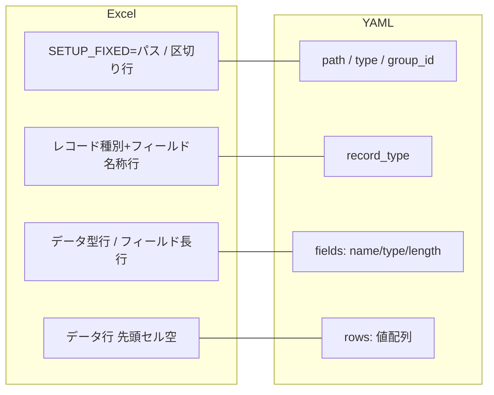

# NTF テストデータ解説書 — 記述例（ファイルデータ）

ファイルデータ（固定長／可変長）のテストデータを Excel と YAML で書くための記述例集です。該当するシナリオの節を引いて、Excel 表と YAML を写して使います。

## 全体像

各形式は同じ NTF 仕様上の意味を別の記法で表します。中核要素の対応は次のとおり。



| 節 | シナリオ | 引くきっかけ |
|---|---|---|
| [6.1](#61-固定長ファイル) | 固定長ファイル | 入出力とも固定長の基本形 |
| [6.2](#62-エンコーディング指定付き固定長ファイル) | エンコーディング指定 | `text-encoding` 等のディレクティブを付ける |
| [6.3](#63-groupid-付き固定長ファイル) | groupId 付き | ケースごとに入力ファイルを使い分ける |
| [6.4](#64-可変長ファイル) | 可変長ファイル | CSV など区切り文字形式 |
| [6.5](#65-複数レコードレイアウト) | 複数レコードレイアウト | 1 ファイルに HEADER と DATA が混在 |
| [6.6](#66-空ファイル) | 空ファイル | 0 バイトのファイルを生成 |

形式間で共通する記法規則:

- フィールドは Excel では「レコード種別+フィールド名称行・データ型行・フィールド長行」の 3 行、YAML では `fields:` 配列の 1 要素（`name`／`type`／`length`）で定義します。
- データ値はパディングなしで記述します。フレームワークが自動付与します。
- YAML の `rows:` 各配列は `fields:` と**完全に同じ順序・件数**で値を並べます。
- Excel のデータ行は先頭セルを必ず空にします（Excel 固有の制約）。YAML に先頭要素を空にする制約はありません。

各節の YAML キーは上記を前提に、節固有の差分（ディレクティブ・groupId・レコード数）だけを示します。

---

<a name="file-data"></a>

## 6.1 固定長ファイル

注文データのバッチ処理テスト。固定長の入力ファイルを読み込んで処理し、結果を固定長の出力ファイルに書き出すことを確認するケース。

### Excel

| SETUP_FIXED=work/input.txt | | | | |
|---|---|---|---|---|
| データ | ID | COUNTER | MESSAGE | |
| | 半角 | 数値 | 半角 | |
| | 5 | 5 | 10 | |
| | 10001 | 10 | hello | |
| | 10002 | 20 | good bye. | |

| EXPECTED_FIXED=work/output.txt | | | | |
|---|---|---|---|---|
| データ | ID | COUNTER | MESSAGE | |
| | 半角 | 数値 | 半角 | |
| | 5 | 5 | 10 | |
| | 10001 | 11 | HELLO | |
| | 10002 | 21 | GOOD BYE. | |

### YAML

```yaml
setup_files:
  - path: work/input.txt
    type: fixed
    records:
      - record_type: データ
        fields:
          - {name: ID,      type: 半角, length: 5}
          - {name: COUNTER, type: 数値, length: 5}
          - {name: MESSAGE, type: 半角, length: 10}
        rows:
          - ["10001", "10", "hello"]
          - ["10002", "20", "good bye."]

expected_files:
  - path: work/output.txt
    type: fixed
    records:
      - record_type: データ
        fields:
          - {name: ID,      type: 半角, length: 5}
          - {name: COUNTER, type: 数値, length: 5}
          - {name: MESSAGE, type: 半角, length: 10}
        rows:
          - ["10001", "11", "HELLO"]
          - ["10002", "21", "GOOD BYE."]
```

---

## 6.2 エンコーディング指定付き固定長ファイル

MS932 エンコーディングで顧客データファイルを読み込むケース。ディレクティブでエンコーディングを明示指定します。

### Excel

| SETUP_FIXED=input/data.dat | | | |
|---|---|---|---|
| text-encoding | MS932 | | |
| DATA | USER_ID | USER_NAME | AMOUNT |
| | X | N | Z |
| | 10 | 20 | 10 |
| | 001 | 山田太郎 | 5000 |
| | 002 | 鈴木花子 | 3000 |

- ディレクティブ行はレコード定義より前に記述します（「キー | 値」の 2 セル構成）。

### YAML

```yaml
setup_files:
  - path: input/data.dat
    type: fixed
    directives:
      text-encoding: MS932
    records:
      - record_type: DATA
        fields:
          - {name: USER_ID,   type: 半角, length: 10}
          - {name: USER_NAME, type: 全角, length: 20}
          - {name: AMOUNT,    type: 数値, length: 10}
        rows:
          - ["001", "山田太郎", "5000"]
          - ["002", "鈴木花子", "3000"]
```

- ディレクティブは `directives:` オブジェクトの `key: value` 形式で記述します。

---

## 6.3 groupId 付き固定長ファイル

テストケースごとに異なる入力ファイルを使い分けるケース。groupId なしがデフォルトの 1 件処理、`case2` が追加データありの複数件処理に対応します。

### Excel

| SETUP_FIXED=work/input.txt | | | | |
|---|---|---|---|---|
| データ | ID | COUNTER | MESSAGE | |
| | 半角 | 数値 | 半角 | |
| | 5 | 5 | 10 | |
| | 10001 | 10 | hello | |

| SETUP_FIXED[case2]=work/input.txt | | | | |
|---|---|---|---|---|
| データ | ID | COUNTER | MESSAGE | |
| | 半角 | 数値 | 半角 | |
| | 5 | 5 | 10 | |
| | 20001 | 30 | morning | |

- groupId は `SETUP_FIXED[case2]=パス` のように指定します。

### YAML

```yaml
setup_files:
  - path: work/input.txt
    type: fixed
    records:
      - record_type: データ
        fields:
          - {name: ID,      type: 半角, length: 5}
          - {name: COUNTER, type: 数値, length: 5}
          - {name: MESSAGE, type: 半角, length: 10}
        rows:
          - ["10001", "10", "hello"]
  - group_id: case2
    path: work/input.txt
    type: fixed
    records:
      - record_type: データ
        fields:
          - {name: ID,      type: 半角, length: 5}
          - {name: COUNTER, type: 数値, length: 5}
          - {name: MESSAGE, type: 半角, length: 10}
        rows:
          - ["20001", "30", "morning"]
```

- groupId は `group_id:` フィールドで指定します。省略するとグループ ID なし（デフォルトグループ）扱いです。
- groupId なしと `group_id: case2` の 2 エントリが同一 `setup_files:` リストに並びます。

---

## 6.4 可変長ファイル

CSV 形式の顧客データファイルを入力として使うケース。フィールド区切り文字をディレクティブで指定します。

### Excel

| SETUP_VARIABLE=input/data.csv | | | |
|---|---|---|---|
| field-separator | , | | |
| DATA | USER_ID | USER_NAME | AMOUNT |
| | X | N | X |
| | 001 | 山田太郎 | 5000 |
| | 002 | 鈴木花子 | 3000 |

### YAML

```yaml
setup_files:
  - path: input/data.csv
    type: variable
    directives:
      field-separator: ","
    records:
      - record_type: DATA
        fields:
          - {name: USER_ID,   type: X}
          - {name: USER_NAME, type: N}
          - {name: AMOUNT,    type: X}
        rows:
          - ["001", "山田太郎", "5000"]
          - ["002", "鈴木花子", "3000"]
```

- 固定長との差異は `type: fixed` / `type: variable` と `length` の有無だけです。可変長では `fields:` の各要素から `length` を省略します。

---

<a name="multi-record"></a>

## 6.5 複数レコードレイアウト

1 ファイルに HEADER レコードと DATA レコードが混在する振込依頼ファイルを扱うケース。

### Excel

| SETUP_FIXED=input/multi.dat | | | |
|---|---|---|---|
| HEADER | SEQ | TYPE | |
| | X | X | |
| | 4 | 2 | |
| | H001 | 01 | |
| DATA | USER_ID | AMOUNT | NOTE |
| | X | Z | N |
| | 10 | 10 | 20 |
| | 001 | 5000 | 備考 |

- 同一セクション内でレコード種別+フィールド名称行を続けて書くと、複数レコードレイアウトになります。

### YAML

```yaml
setup_files:
  - path: input/multi.dat
    type: fixed
    records:
      - record_type: HEADER
        fields:
          - {name: SEQ,  type: X, length: 4}
          - {name: TYPE, type: X, length: 2}
        rows:
          - ["H001", "01"]
      - record_type: DATA
        fields:
          - {name: USER_ID, type: X, length: 10}
          - {name: AMOUNT,  type: Z, length: 10}
          - {name: NOTE,    type: N, length: 20}
        rows:
          - ["001", "5000", "備考"]
```

- `records:` 配列に複数のレコードレイアウトを並べます。

---

<a name="empty-file"></a>

## 6.6 空ファイル

出力ファイルがゼロ件のときに 0 バイトの空ファイルを生成することを確認するケース。

### Excel

| SETUP_FIXED=input/empty.dat | |
|---|---|
| text-encoding | MS932 |

- ディレクティブ行のみ記述してレコード定義以降を省略します。

### YAML

```yaml
setup_files:
  - path: input/empty.dat
    type: fixed
    directives:
      text-encoding: MS932
    records: []
```

- レコードは `records: []` と空配列で記述します。
