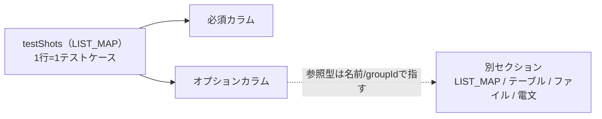

# NTF テストデータ解説書 — testShots カラム一覧

処理方式ごとの `testShots` カラムを引くためのリファレンス。どの処理方式でも `testShots` は `LIST_MAP` として記述する。

- [全体像](#overview)
- [共通カラム](#common)
- [ウェブアプリケーション](#web)
- [バッチ処理](#batch)
- [メッセージング](#messaging)
- [エンティティバリデーション](#entity)

---

<a name="overview"></a>

## 全体像

`testShots` の 1 行が 1 テストケース。カラムには値を直接書くものと、別セクション（`LIST_MAP` や各種テーブル／ファイル／電文セクション）の groupId・名前を指す参照型がある。処理方式ごとに必須カラムとオプションカラムが定まる。



各処理方式の対応クラス:

| 処理方式 | 対応クラス |
|---|---|
| ウェブアプリケーション | `HttpRequestTestSupport` |
| バッチ処理 | `BatchRequestTestSupport` |
| メッセージング | `MessagingRequestTestSupport` |
| エンティティバリデーション | `EntityTestSupport` |

---

<a name="common"></a>

## 共通カラム

ウェブ・バッチ・メッセージングで共通の必須カラム。エンティティバリデーションは別体系（[該当節](#entity)を参照）。

| カラム名 | 説明 |
|---|---|
| `no` | テストケース番号。空の場合はエラー |
| `description` | テストケースの説明（旧名 `case` も可）。`description` も `case` も未定義の場合はエラー |
| `expectedStatusCode` | 期待するステータスコード（ウェブは HTTP ステータスコード） |

以降の各処理方式の表では、固有カラムを示す。

---

<a name="web"></a>

## ウェブアプリケーション（HttpRequestTestSupport）

### 必須カラム

[共通カラム](#common)（`no`／`description`／`expectedStatusCode`）に加えて:

| カラム名 | 説明 |
|---|---|
| `isValidToken` | CSRF トークン制御フラグ（`1`: あり、`0`: なし） |
| `forwardUri` | 期待するフォワード先 URI |
| `context` | リクエスト ID・ユーザ・HTTP メソッドを記載した `LIST_MAP` 名。1エントリのみ有効。`REQUEST_ID` が空の場合は例外がスロー |

### オプションカラム

| カラム名 | 説明 | 空の場合 |
|---|---|---|
| `setUpDb` | この値と同じ名前の `LIST_MAP` を持つシートの全 `SETUP_TABLE` を、テストメソッド開始前に1回だけ INSERT | スキップ |
| `setUpTable` | この値と同じ groupId を持つ `SETUP_TABLE` セクションを収集して INSERT | スキップ |
| `expectedTable` | この値と同じ groupId を持つ `EXPECTED_TABLE`/`EXPECTED_COMPLETE_TABLE` セクションで DB を検証 | スキップ |
| `expectedSearch` | 検索結果期待値の groupId（対応する `LIST_MAP` セクションを収集） | スキップ |
| `expectedMessageId` | 期待するメッセージ ID（カンマ区切りで複数指定可） | スキップ |
| `requestParams` | HTTP リクエストパラメータの `LIST_MAP` 名。指定した LIST_MAP の行数がテストケース番号より少ない場合はエラー | — |
| `responseResult` | HTTP レスポンス（リクエストスコープ）期待値の `LIST_MAP` 名 | スキップ |
| `cookie` | Cookie 値の `LIST_MAP` 名。指定した LIST_MAP が空の場合はエラー | Cookie なし |
| `queryParams` | クエリパラメータの `LIST_MAP` 名。指定した LIST_MAP が空の場合はエラー | パラメータなし |
| `HTTP_METHOD` | HTTP メソッド | `"POST"` |
| `expectedContentLength` | 期待する Content-Length | スキップ |
| `expectedContentType` | 期待する Content-Type | スキップ |
| `expectedContentFileName` | 期待する Content-Disposition ファイル名 | スキップ |
| `expectedMessage` | この値と同じ groupId を持つ要求電文セクション（`EXPECTED_REQUEST_HEADER/BODY_MESSAGES`）で検証 | スキップ |
| `responseMessage` | この値と同じ groupId を持つ応答電文セクション（`RESPONSE_HEADER/BODY_MESSAGES`）をレスポンスとして返す | スキップ |
| `expectedMessageByClient` | HTTP 同期応答メッセージ送信の要求電文グループ ID | スキップ |
| `responseMessageByClient` | HTTP 同期応答メッセージ送信の応答電文グループ ID | スキップ |

### 記述例

#### Excel

| LIST_MAP=testShots | | | | | |
|---|---|---|---|---|---|
| no | description | isValidToken | expectedStatusCode | forwardUri | context |
| 1 | 正常ケース | 0 | 200 | /success | context001 |
| 2 | 認証エラー | 0 | 400 | /error | context002 |

| LIST_MAP=context001 | | |
|---|---|---|
| REQUEST_ID | USER_ID | HTTP_METHOD |
| REQ_001 | user001 | POST |

#### YAML

```yaml
list_maps:
  - id: testShots
    rows:
      - no: "1"
        description: "正常ケース"
        isValidToken: "0"
        expectedStatusCode: "200"
        forwardUri: "/success"
        context: "context001"
      - no: "2"
        description: "認証エラー"
        isValidToken: "0"
        expectedStatusCode: "400"
        forwardUri: "/error"
        context: "context002"
  - id: context001
    rows:
      - REQUEST_ID: "REQ_001"
        USER_ID: "user001"
        HTTP_METHOD: "POST"
```

---

<a name="batch"></a>

## バッチ処理（BatchRequestTestSupport）

### 必須カラム

[共通カラム](#common)（`no`／`description`／`expectedStatusCode`）に加えて:

| カラム名 | 説明 |
|---|---|
| `diConfig` | DI コンポーネント設定ファイルパス |
| `requestPath` | リクエストパス |
| `userId` | 実行ユーザ ID |

### オプションカラム

| カラム名 | 説明 | 空の場合 |
|---|---|---|
| `setUpDb` | この値と同じ名前の `LIST_MAP` を持つシートの全 `SETUP_TABLE` を、テストメソッド開始前に1回だけ INSERT | スキップ |
| `setUpTable` | この値と同じ groupId を持つ `SETUP_TABLE` セクションを収集して INSERT | スキップ |
| `expectedTable` | この値と同じ groupId を持つ `EXPECTED_TABLE`/`EXPECTED_COMPLETE_TABLE` セクションで DB を検証 | スキップ |
| `setUpFile` | この値と同じ groupId を持つ `SETUP_FIXED`/`SETUP_VARIABLE` セクションを入力ファイルとして配置 | スキップ |
| `expectedFile` | この値と同じ groupId を持つ `EXPECTED_FIXED`/`EXPECTED_VARIABLE` セクションで出力ファイルを検証 | スキップ |
| `expectedLog` | 期待ログの `LIST_MAP` 名。指定した LIST_MAP が空の場合はエラー | スキップ |
| `args[0]`, `args[1]`, ... | コマンドライン引数 | — |
| その他任意カラム | コマンドラインオプション | — |

### 記述例

#### Excel

| LIST_MAP=testShots | | | | | | |
|---|---|---|---|---|---|---|
| no | description | expectedStatusCode | diConfig | requestPath | userId | setUpFile |
| 1 | 正しく更新されます | 0 | nablarch/test/core/batch/BatchSample.xml | DBtoDBBatchSample | test | |
| 2 | 入力ファイルあり | 0 | nablarch/test/core/batch/BatchSample.xml | FileToFileBatchSample | test | case2 |

#### YAML

```yaml
list_maps:
  - id: testShots
    rows:
      - no: "1"
        description: "正しく更新されます"
        expectedStatusCode: "0"
        diConfig: "nablarch/test/core/batch/BatchSample.xml"
        requestPath: "DBtoDBBatchSample"
        userId: "test"
        setUpFile: ""
      - no: "2"
        description: "入力ファイルあり"
        expectedStatusCode: "0"
        diConfig: "nablarch/test/core/batch/BatchSample.xml"
        requestPath: "FileToFileBatchSample"
        userId: "test"
        setUpFile: "case2"
```

---

<a name="messaging"></a>

## メッセージング（MessagingRequestTestSupport）

### 必須カラム

[共通カラム](#common)（`no`／`description`／`expectedStatusCode`）に加えて:

| カラム名 | 説明 |
|---|---|
| `diConfig` | DI コンポーネント設定ファイルパス |
| `requestPath` | リクエストパス |
| `userId` | 実行ユーザ ID |

### オプションカラム

| カラム名 | 説明 | 空の場合 |
|---|---|---|
| `setUpDb` | この値と同じ名前の `LIST_MAP` を持つシートの全 `SETUP_TABLE` を、テストメソッド開始前に1回だけ INSERT | スキップ |
| `setUpTable` | この値と同じ groupId を持つ `SETUP_TABLE` セクションを収集して INSERT | スキップ |
| `expectedTable` | この値と同じ groupId を持つ `EXPECTED_TABLE`/`EXPECTED_COMPLETE_TABLE` セクションで DB を検証 | スキップ |
| `expectedMessage` | この値と同じ groupId を持つ要求電文セクション（`EXPECTED_REQUEST_HEADER/BODY_MESSAGES`）で検証 | スキップ |
| `responseMessage` | この値と同じ groupId を持つ応答電文セクション（`RESPONSE_HEADER/BODY_MESSAGES`）をレスポンスとして返す | スキップ |
| `expectedLog` | 期待ログの `LIST_MAP` 名。指定した LIST_MAP が空の場合はエラー | スキップ |

### 記述例

#### Excel

| LIST_MAP=testShots | | | | | | | |
|---|---|---|---|---|---|---|---|
| no | description | expectedStatusCode | diConfig | requestPath | userId | expectedMessage | responseMessage |
| 1 | 電文送受信テスト | 0 | batch-test-component-configuration.xml | BM21AA0106 | batch_user | case1 | res_case1 |

#### YAML

```yaml
list_maps:
  - id: testShots
    rows:
      - no: "1"
        description: "電文送受信テスト"
        expectedStatusCode: "0"
        diConfig: "batch-test-component-configuration.xml"
        requestPath: "BM21AA0106"
        userId: "batch_user"
        expectedMessage: "case1"
        responseMessage: "res_case1"
```

---

<a name="entity"></a>

## エンティティバリデーション（EntityTestSupport）

[共通カラム](#common)とは別体系。`no`／`description`／`expectedStatusCode` は使わない。

### 必須カラム

| カラム名 | 説明 |
|---|---|
| `title` | テストケースの説明 |
| `expectedMessageId1` | 期待するバリデーションメッセージ ID（複数ある場合は `expectedMessageId2`, `expectedMessageId3`, ... と連番で追加） |
| `propertyName1` | バリデーション対象プロパティ名（同上、連番で追加可能） |

### 関連予約 ID

| 予約 ID | 説明 |
|---|---|
| `params` | 入力パラメータ定義。`testShots` の行数と一致が必須 |

### 記述例

#### Excel

| LIST_MAP=testShots | | | |
|---|---|---|---|
| title | expectedMessageId1 | propertyName1 | |
| 必須チェック | errors.required | userName | |

#### YAML

```yaml
list_maps:
  - id: testShots
    rows:
      - title: "必須チェック"
        expectedMessageId1: "errors.required"
        propertyName1: "userName"
```
