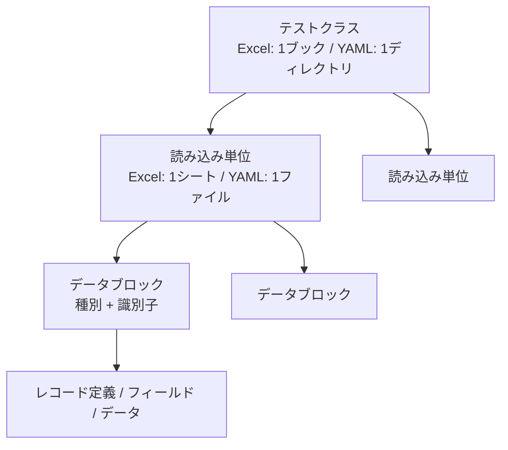
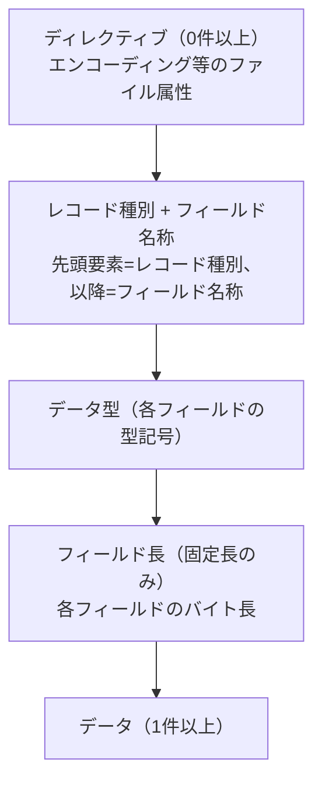

# NTF テストデータ リファレンス

Nablarch Testing Framework（NTF）が読み込むテストデータの記述仕様。Excel・YAML のどちらで書く場合にも共通して適用される。各節末尾のリンクから Excel 表と YAML コードブロックの対比例を参照できる。

---

## 目次

1. [全体像](#1-全体像)
2. [テストデータの基本構造](#2-テストデータの基本構造)
3. [データブロック識別](#3-データブロック識別)
4. [テストケース定義](#4-テストケース定義)
5. [テーブルデータ](#5-テーブルデータ)
6. [ファイルデータ](#6-ファイルデータ)
7. [メッセージングテストデータ](#7-メッセージングテストデータ)
8. [値の書き方](#8-値の書き方)
9. [ディレクティブ](#9-ディレクティブ)
10. [ヘッダ・コメント・空エントリ](#10-ヘッダコメント空エントリ)

---

## 1. 全体像

テストコード（Java）がテストデータファイルを読み込み、DB へのデータ投入・入力ファイルの配置・期待値との比較を行う。テストデータには **テストケース**・**セットアップ**・**検証** の3用途のデータを記述し、いずれも **データブロック** 単位で管理する。

| 用途 | 内容 | 主なデータブロック |
|---|---|---|
| テストケース | 1エントリ1ケースの実行条件（ウェブ:「ユーザ ID・期待ステータスコード・期待フォワード先 URI」、バッチ:「リクエストパス・ユーザ ID・DI コンフィグ・期待ステータスコード」など） | `LIST_MAP=testShots` |
| セットアップ | テスト前に投入するデータ（DB INSERT、固定長・可変長ファイルの入力） | `SETUP_TABLE` / `SETUP_FIXED` / `SETUP_VARIABLE` |
| 検証 | テスト後の期待値（DB・出力ファイル・電文・ログ・検索結果） | `EXPECTED_*` / `RESPONSE_*` |

データの格納階層は次のとおり。テストクラス1つ分のデータが読み込み単位（Excel は1シート／YAML は1ファイル）に分かれ、その中に複数のデータブロックが共存する。



データブロックは **種別**（`SETUP_TABLE` など14種）と **識別子の値**（テーブル名・ファイルパス・ID など）の組み合わせで区別する。詳細は [3章](#3-データブロック識別)。

→ [Excel / YAML Example](ntf-testdata-doc-examples-overview.md#overview)

---

## 2. テストデータの基本構造

テストデータはテストクラスと1対1で対応する。

| 形式 | テストクラス対応 | 読み込み単位 |
|---|---|---|
| Excel | 同名の1ブック（`.xls`） | 1シート |
| YAML | 同名のディレクトリ | 1ファイル（Excel の1シートに相当） |

```
【Excel】                              【YAML】
src/test/java/com/example/            src/test/java/com/example/
  FooTest.xls                           FooTest/
    ├── case01  ← シート                  ├── case01.yaml  ← ファイル
    └── case02  ← シート                  └── case02.yaml  ← ファイル
```

1読み込み単位の中に、テストケース・セットアップ・検証の複数データブロックを共存させて記述する。

YAML ファイルは **YAML 1.2** に準拠する。YAML 1.1 との主な違いとして、`yes` / `no` / `on` / `off` は真偽値ではなく文字列として扱われる。

### ファイルの読み込みルール

| 項目 | Excel | YAML |
|---|---|---|
| ファイルなし時 | エラー | ファイルが存在しない、またはパース失敗時はエラー |
| 空ファイル時 | 空シートは存在しないシート扱い | 空ファイル（0バイト）は空データ扱い（エラーにならない） |
| 値の書き方 | セルは必ず**文字列書式**。数値・日付書式の動作は保証しない | 値は必ず**ダブルクォートで囲む** |

---

## 3. データブロック識別

### 3.1 識別の構成要素

各データブロックは **データブロック種別**（[3.2](#32-データブロック種別の一覧) の14種）と **識別子の値**（テーブル名・ファイルパス・ID など）の2要素で識別される。

| 形式 | 記述方法 |
|---|---|
| Excel | データブロック先頭セルに `データブロック種別=識別子の値`。種別名で始まれば合致（前方一致）。例: `SETUP_TABLE=USER_MASTER` |
| YAML | 種別ごとの専用トップレベルキー（下表）。完全一致のため前方一致は発生しない |

YAML のトップレベルキー対応:

| データブロック種別 | YAML キー |
|---|---|
| `SETUP_TABLE` | `setup_tables` |
| `EXPECTED_TABLE` | `expected_tables` |
| `EXPECTED_COMPLETE_TABLE` | `expected_complete_tables` |
| `LIST_MAP` | `list_maps` |
| `SETUP_FIXED` / `SETUP_VARIABLE` | `setup_files` |
| `EXPECTED_FIXED` / `EXPECTED_VARIABLE` | `expected_files` |
| `MESSAGE` | `messages` |
| `EXPECTED_REQUEST_HEADER_MESSAGES` | `expected_request_header_messages` |
| `EXPECTED_REQUEST_BODY_MESSAGES` | `expected_request_body_messages` |
| `RESPONSE_HEADER_MESSAGES` | `response_header_messages` |
| `RESPONSE_BODY_MESSAGES` | `response_body_messages` |

```yaml
setup_tables:
  - table: USER_MASTER
    rows: ...
```

**同種データブロックの記述ルール**:

- YAML: 同一ファイル内のトップレベルキーの重複は禁止。同種データは同一キーにリストとして並べる（重複時はエラー）
- Excel: 同一シート内に同種データブロックを複数記述できる。DataType により全件収集または先着一致で収集される（[3.3](#33-同一ファイルシート内に複数のデータブロックを書く場合の注意) 参照）

### 3.2 データブロック種別の一覧

使用できる種別は以下の14種。

| データブロック種別 | 用途 | 同一 ID が複数ある場合 |
|---|---|---|
| `SETUP_TABLE` | INSERT 用テーブルデータ | 同じグループのものをすべて収集 |
| `EXPECTED_TABLE` | 比較用テーブルデータ（省略カラムは比較対象外） | 同じグループのものをすべて収集 |
| `EXPECTED_COMPLETE_TABLE` | 比較用テーブルデータ（省略カラムにデフォルト値補完） | 同じグループのものをすべて収集 |
| `LIST_MAP` | キーバリュー形式の汎用データ（テストケース定義・期待値等） | 最初の1件のみ有効（2件目以降は無視） |
| `SETUP_FIXED` | 固定長ファイルの入力データ | 同じグループのものをすべて収集 |
| `EXPECTED_FIXED` | 固定長ファイルの期待値データ | 同じグループのものをすべて収集 |
| `SETUP_VARIABLE` | 可変長ファイルの入力データ | 同じグループのものをすべて収集 |
| `EXPECTED_VARIABLE` | 可変長ファイルの期待値データ | 同じグループのものをすべて収集 |
| `MESSAGE` | メッセージング電文データ | 最初の1件のみ有効（2件目以降は無視） |
| `EXPECTED_REQUEST_HEADER_MESSAGES` | 要求電文ヘッダの期待値 | groupId 指定時は全件収集、ID 直接指定時は最初の1件 |
| `EXPECTED_REQUEST_BODY_MESSAGES` | 要求電文ボディの期待値 | groupId 指定時は全件収集、ID 直接指定時は最初の1件 |
| `RESPONSE_HEADER_MESSAGES` | 応答電文ヘッダデータ | groupId 指定時は全件収集、ID 直接指定時は最初の1件 |
| `RESPONSE_BODY_MESSAGES` | 応答電文ボディデータ | groupId 指定時は全件収集、ID 直接指定時は最初の1件 |
| `DEFAULT` | フレームワーク内部用（通常使用しない） | — |

### 3.3 同一ファイル（シート）内に複数のデータブロックを書く場合の注意

- **複数テーブルの INSERT**: `setup_tables` などの全件収集タイプは同一 groupId のものをすべて収集する。複数テーブルデータを並べて記述できる
- **データタイプの混在順序（YAML）**: YAML はトップレベルのセクションキー（`expected_tables` / `expected_complete_tables` 等）ごとに独立して取得する。記述順序や異なるセクションの交互記述に関わらず正しく読み込まれる
- **`LIST_MAP` / `MESSAGE` の重複 ID**: 同一 ID が複数ある場合は最初の1件のみ有効。2件目以降は無視

> **Excel との違い**: Excel（旧形式）は行を順に読む方式のため、同一シート内で別のデータタイプを挟むと後半が読み込まれない制約があった（解説書の旧 Doc-4）。YAML はセクションキーで構造化されるためこの制約はなく、移行時にデータタイプごとにまとめ直す必要はない。

グループの指定方法（groupId）は [4.3](#43-データブロックのグループ化groupid) を参照。

---

## 4. テストケース定義

### 4.1 testShots

`testShots` はテストケース定義の予約 ID。フレームワークがこの ID を自動的に読み込み、各エントリを1テストケースとして実行する。旧称 `testCases` も動作するが、新規作成では `testShots` を使う。

- テスト実行には `testShots` に1件以上のエントリが必要（0件はエラー）
- **Excel**: `LIST_MAP=testShots` データブロックに記述
- **YAML**: `list_maps:` 下の `id: testShots` エントリに記述

### 4.2 testShots のカラム仕様

カラムは処理方式によって異なる。各処理方式の詳細は以下を参照。

- [ウェブアプリケーション（HttpRequestTestSupport）](ntf-testdata-doc-examples-testshots.md#web)
- [バッチ処理（BatchRequestTestSupport）](ntf-testdata-doc-examples-testshots.md#batch)
- [メッセージング（MessagingRequestTestSupport）](ntf-testdata-doc-examples-testshots.md#messaging)
- [エンティティバリデーション（EntityTestSupport）](ntf-testdata-doc-examples-testshots.md#entity)

### 4.3 データブロックのグループ化（groupId）

複数のテストケースで異なるセットアップデータや期待値を使い分けたい場合、データブロックに **groupId** を付加してグループ化する。`testShots` の各カラム（`setUpTable` / `expectedTable` / `setUpFile` / `expectedFile` 等）に groupId の値を指定すると、そのテストケースでは対応する groupId を持つデータブロックだけが収集される。

| 形式 | 記述方法 |
|---|---|
| Excel | DataType 名の直後に `[groupId]`。例: `SETUP_TABLE[case01]=USER_MASTER` |
| YAML | `group_id:` フィールド |

```yaml
setup_tables:
  - group_id: case01
    table: USER_MASTER
    rows: ...
```

**制約**:

- `testShots` の各カラムで groupId を省略すると、groupId なしのデータブロック（デフォルトグループ）が収集される
- バッチ固有の動作として groupId に `"default"` を指定すると groupId なし扱いと同等になる（HTTP テスト・メッセージングテストでは適用されない）

→ [Excel / YAML Example](ntf-testdata-doc-examples-overview.md#groupid)

---

## 5. テーブルデータ

### 5.1 データの形式

各エントリはカラム名と値の組み合わせで記述する。省略したカラムには INSERT 時にデフォルト値が補完される。

**Excel**: 1行目にカラム名、2行目以降にデータ。

```
| SETUP_TABLE=テーブル名 | | |
| カラム1 | カラム2 | カラム3 |
| 値1     | 値2     | 値3     |
```

**YAML**: `rows:` 配列に各行をオブジェクトで記述。

```yaml
setup_tables:
  - table: テーブル名
    rows:
      - カラム1: "値1"
        カラム2: "値2"
        カラム3: "値3"
```

**YAML 必須キー**: `setup_tables` / `expected_tables` / `expected_complete_tables` の各エントリには `table` キーが必須（省略時エラー）。

→ [Excel / YAML Example](ntf-testdata-doc-examples-table.md#table-data)

### 5.2 SETUP_TABLE

DB への INSERT 用データ。

- 各エントリのカラム名と値を記述する
- **主キーカラムは省略しない**。省略すると型に応じたデフォルト値（数値型は `"0"`、文字型はスペース等）が INSERT される

**null 値・空文字の動作**:

| 値の指定 | Excel | YAML |
|---|---|---|
| null（Java null） | セルに `null`（大文字小文字不問） | アンクォートの `null`（`"null"` でも同結果） |
| 空文字 | セルを空にする | `""` |
| 日付型カラムの空文字 | セルを空にする → `null` 扱い | `""` → `null` 扱い |

→ [Excel / YAML Example](ntf-testdata-doc-examples-table.md#setup-table)

### 5.3 EXPECTED_TABLE

テスト後の DB 状態と比較するデータ。

- **省略したカラムは比較対象外**。検証したいカラムだけを列挙できる

→ [Excel / YAML Example](ntf-testdata-doc-examples-table.md#expected-complete-table)

### 5.4 EXPECTED_COMPLETE_TABLE

省略カラムにデフォルト値を補完してから比較するデータ。

| カラム型 | デフォルト値 |
|---|---|
| 数値型 | `"0"` |
| 固定長文字列型（CHAR, NCHAR） | 半角スペース × カラム長 |
| 可変長文字列型（VARCHAR 等） | `" "`（半角スペース1文字） |
| 日付型 | epoch 起点（JVM タイムゾーン依存。JST 環境では `"1970-01-01 09:00:00.0"`） |
| バイナリ型 | 10バイトのゼロバイト列の HexString |
| Boolean 型 | `"false"` |

**注意**: DATE カラムのデフォルト値は JVM のタイムゾーン設定に依存する。JST 環境と UTC 環境では値が異なる。

**Excel 混在禁止**: Excel では `EXPECTED_TABLE` と `EXPECTED_COMPLETE_TABLE` を同一シート内で混在させると後半のデータが読み込まれない。同じ種別をまとめて記述する。YAML では `expected_tables` と `expected_complete_tables` は別キーのため混在可能。

→ [Excel / YAML Example](ntf-testdata-doc-examples-table.md#expected-complete-table)

### 5.5 LIST_MAP

キーバリュー形式の汎用データ。テストケース定義（`testShots`）・リクエストパラメータ・期待値オブジェクト・期待ログなど様々な用途で使う。

**Excel**:

```
| LIST_MAP=testShots | | |
| no | description | status |
| 1  | 正常系       | active |
| 2  | 異常系       | error  |
```

**YAML**:

```yaml
list_maps:
  - id: testShots
    rows:
      - no: "1"
        description: "正常系"
        status: "active"
      - no: "2"
        description: "異常系"
        status: "error"
```

- ID は完全一致で検索される
- 同一ファイル内で同一 ID の重複エントリは先着一致、2件目以降は無視
- 指定 ID のエントリが存在しない場合は空データ扱い（エラーにならない）

主な予約 ID は [4章](#4-テストケース定義) を参照。

→ [Excel / YAML Example](ntf-testdata-doc-examples-table.md#list-map)

---

## 6. ファイルデータ

### 6.1 固定長・可変長の統合

セットアップ用ファイルデータ（`SETUP_FIXED` / `SETUP_VARIABLE`）は固定長・可変長の区別なくまとめて収集される。期待値ファイル（`EXPECTED_FIXED` / `EXPECTED_VARIABLE`）も同様。固定長か可変長かはデータブロック内の記述で区別される。

**YAML 必須キー**: `setup_files` / `expected_files` の各エントリには `path` キーが必須（省略時エラー。`table` キーと同様）。

### 6.2 ファイルデータブロックの構造

ファイルデータブロックは次の順序で記述する。



**Excel 固有の制約**: データの先頭要素は必ず空（null または空文字）にする。YAML にこの制約はない。

**Excel の記述例**（各セルを `|` で区切って表示）:

```
行1: SETUP_FIXED=work/input.txt  [空]     [空]
行2: text-encoding               MS932   [空]
行3: DATA                        USER_ID  AMOUNT
行4: [空]                        半角     数値
行5: [空]                        10       10
行6: [空]                        001      5000
```

**YAML の記述例**:

```yaml
setup_files:
  - path: work/input.txt
    type: fixed
    directives:
      text-encoding: MS932
    records:
      - record_type: DATA
        fields:
          - {name: USER_ID, type: 半角, length: 10}
          - {name: AMOUNT,  type: 数値, length: 10}
        rows:
          - ["001", "5000"]
```

- `fields:` の各要素は `{name: フィールド名, type: データ型, length: バイト長}` の形式
- **`type` は日本語型名称（`半角`, `全角`, `数値` 等）で記述する**（[8.10](#810-データ型マッピング) 参照）。Excel と同じ表記であり、変換ツールも Excel の型名称をそのまま出力する
- `length` は整数（`length: 10`）または文字列（`length: "10"`）どちらでも有効。変換ツールが生成した YAML は文字列形式（`"10"`）
- `rows:` の各行は配列形式で、`fields:` と**同じ順序・同じ件数**で値を並べる
- `rows:` 内の値はダブルクォートで囲む（[8章](#8-値の書き方) 参照）

→ [Excel / YAML Example](ntf-testdata-doc-examples-file.md#file-data)

### 6.3 固定長ファイル固有の仕様

- フィールド名称・データ型・フィールド長の3リストが同サイズで必須
- 1ファイルデータブロック内の全レコード定義は同一レコード長でなければならない（違反時エラー）
- フィールド値がフィールド長を超えた場合はエラー

### 6.4 可変長ファイル固有の仕様

- フィールド名称・データ型の2リストが同サイズで必須。フィールド長は不要
- **空エントリの動作**: ファイルデータの空エントリ（先頭フィールドが空の行）はデータ行として扱われる。可変長は全フィールドが `""` のレコードとして保持され、固定長はスペースパディングされた定長レコードとして書き出される（テーブルデータの空行スキップとは異なる。[10.5](#105-空エントリのスキップ) 参照）

### 6.5 複数レコードレイアウト

1ファイルデータブロック内に複数のレコードレイアウトを連続して記述できる。データの後ろに新たなレコード種別とフィールド名称を書くと、新しいレコードレイアウトとして扱われる。

→ [Excel / YAML Example](ntf-testdata-doc-examples-file.md#multi-record)

### 6.6 空ファイル

0バイトの空ファイルを表現するには、ディレクティブのみを記述してレコード定義を省略する。

→ [Excel / YAML Example](ntf-testdata-doc-examples-file.md#empty-file)

### 6.7 `"-"` 長フィールド

フィールド長に `"-"` を指定すると、追加された全レコードの最大バイト長に自動拡張される。値は改行コードと前後空白が除去される。

### 6.8 エラーになるケース

- 同一レコード種別内でフィールド名称が重複している
- フィールド名称リストまたはデータ型リストが未指定または空
- フィールド名称・データ型・フィールド長リストのサイズが一致していない
- 存在しないフィールド名称を指定している
- データ要素数が不正
- ディレクティブまたはレコード種別/フィールド名称定義の要素数が2未満
- ファイルの読み込みに失敗した（IO エラー）
- 日付型カラムの値が日付として解析できない

---

## 7. メッセージングテストデータ

### 7.1 sendSyncTestData の配置規則

テストデータファイルは `sendSyncTestData/{requestId}/message` というパスに配置する（末尾の `message` は固定のパスセグメント）。

- **Excel**: `MESSAGE=sendSyncTestData/{requestId}/message` をデータブロック識別子として記述
- **YAML**: `messages:` の `id:` に `sendSyncTestData/{requestId}/message` を指定

### 7.2 FW 制御ヘッダフィールド

> **適用範囲**: `fw_header:` マップは `messages`（MESSAGE: MockMessaging 経路の要求/応答電文）でのみ使用する。`expected_request_header_messages` / `expected_request_body_messages` / `response_header_messages` / `response_body_messages` の4種では使用しない。これらは `requestId` 等のヘッダフィールドも含めて `records` の `fields:`/`rows:` にフィールド単位（型・長さつき）で記述する（[7.x EXPECTED/RESPONSE 系の記述](#) 参照）。両者はテスト手法が異なる（値の指定 か フィールド単位の検証/生成 か）ため表現も異なる。

FW 制御ヘッダのフィールド名は**プロジェクトごとに異なる**。フレームワーク標準では4種が既定値だが固定ではなく、`SystemRepository` の `reader.fwHeaderfields` キーでプロジェクトが任意の名前に変更できる（例: `reader.fwHeaderfields=requestId,addHeader`）。

- 既定値の例: `requestId`, `userId`, `resendFlag`, `resultCode`

| 形式 | 記述方法 |
|---|---|
| Excel | フィールド名称行（`no` 行）より前に `| フィールド名 | 値 |`（ディレクティブと同じ「名前｜値」形式） |
| YAML | `fw_header:` マップ（キー: 値）。キー名は固定でなく任意（`reader.fwHeaderfields` 設定に合わせる） |

```yaml
messages:
  - id: requestMessages
    directives:
      text-encoding: Windows-31J     # ディレクティブはここに書く
    fw_header:                        # FW制御ヘッダは名前: 値のマップ（キーは任意）
      requestId: hoge
      userId: moge
    records:
      - record_type: default          # MessageParser は record_type を無視する（7.10 参照）
        fields:
          - {name: ユーザ名, type: 全角, length: 50}
          - {name: 備考,     type: 全角, length: 200}
          - {name: FILLER,   type: 半角, length: 252}
        rows:
          - ["電文太郎", "特筆なし", ""]
```

- **`directives:`（`text-encoding` 等）と `fw_header:`（`requestId` 等）は別キー。** Excel ではどちらも「名前｜値」の行だが、FW 制御ヘッダはフレームワークが電文ヘッダとして分離して扱うため YAML では区別する
- **`fw_header:` のキーはすべて FW 制御ヘッダとして扱われる。** ランタイムは `fw_header:` マップをそのまま FW ヘッダとして使い、`reader.fwHeaderfields` でフィルタリングして取り捨てることはしない（記述したものが黙って消えない）
- 電文ボディのフィールドは従来どおり `records:` の `fields:`/`rows:` に記述する

### 7.3 HEADER / BODY MESSAGES の構造と件数制約

- `EXPECTED_REQUEST_HEADER_MESSAGES` と `EXPECTED_REQUEST_BODY_MESSAGES` のエントリ数（rows 合計）は一致が必須（不一致時エラー）
- HTTP 同期応答メッセージ（`response_body_messages`）の各データエントリは文字列長が同一である必要がある

### 7.4 no 行（フィールド名称行）と errorMode

**電文の行構造**: ディレクティブ群・FW 制御ヘッダの後、`no` で始まる行がフィールド名称行。以降、データ型行・フィールド長行・データ行が続く（公式仕様の電文表書式に準拠）。

- **Excel**: フィールド名称行の先頭セルに `no` を記述。データ行の先頭セル（`no` カラム）はフレームワークが除去しデータとして保存しない
- **YAML**: フィールド名称は `fields:`、データは `rows:` に記述（`no` カラム自体は YAML の構造に現れない）

**errorMode（RESPONSE 系・MockMessaging 経路のみ）**:

- `response_header_messages` / `response_body_messages` で、データ行の先頭値が `errorMode:timeout` または `errorMode:msgException` の場合、そのエントリは送受信エラーをシミュレートするマーカーとして扱われる
- errorMode 行は `fw_header:` の分離とは独立した別の仕組み。`fw_header:` を分離した後も errorMode 行はそのまま機能する
- `RequestTestingSendSyncSupport` 経路（GroupMessageParser）では errorMode は使用されない

### 7.5 複数回送信

N 回送信する場合は、ヘッダ件数とボディ件数をともに N 件ずつ記述する。同一リクエスト ID で複数回送信する場合は `no` 値を変えて連続記述し、送信順序と `no` 値を一致させる。

### 7.6 メッセージの groupId 収集

同一 groupId を持つ複数のメッセージプールを収集する。識別子の値をリクエスト ID として使用する。

### 7.7 ステータスコード

ステータスコードカラムがない場合はデフォルト値 `"200"` が使用される。Excel・YAML 両方で共通。

### 7.8 フォーマット定義ファイルの命名規則

- 応答電文: `{requestId}_RECEIVE`
- 要求電文: `{requestId}_SEND`

### 7.9 アサート方式の切り替え

`SystemRepository` の `messaging.assertAsMapFileType` キーの設定値に応じてアサート方式が切り替わる。未設定時のデフォルトは `"Fixed"` 形式（項目単位アサート）。

### 7.10 record_type の扱い

`messages` / `expected_request_*_messages` / `response_*_messages` の `record_type` 値は、フレームワーク内部で常に `"default"` に置き換えられる。

- **Excel**: フィールド名称行の先頭セルに任意の値を記述できる（装飾的なメタデータ扱い）
- **YAML**: `record_type:` に任意の値を記述できる（可読性のためだけで実行時挙動に影響しない）

> **注意**: 旧版では FW 制御ヘッダを `record_type: FW_HEADER` のレコードとして表していたが、本仕様では FW 制御ヘッダは `fw_header:` マップで記述する（[7.2](#72-fw-制御ヘッダフィールド) 参照）。`record_type` に特別な予約値はない。

→ [Excel / YAML Example](ntf-testdata-doc-examples-messaging.md#messaging)

---

## 8. 値の書き方

### 8.1 値の種類と Excel / YAML 対比

| 値の種類 | Excel での記述 | YAML での記述 | 備考 |
|---|---|---|---|
| 通常の文字列 | `abc` | `"abc"` | YAML はクォート必須（型変換防止） |
| null（DB に null を格納） | `null`（大文字小文字不問） | `null`（クォートなし） | YAML の `"null"`（クォートあり）も同結果 |
| 空文字 | 空セル | `""` | |
| 先頭ゼロ付き数値 | `001` | `"001"` | YAML でクォートなしだと `1` に型変換される |
| `true` / `false`（文字列） | `true` | `"true"` | YAML でクォートなしだと真偽値に型変換される |
| 半角スペース1文字 | `" "`（セルに `"` space `"` と入力） | `" "` | 外側クォートが除去されてスペースになる |
| ダブルクォート1文字 | `"""`（セルに `"` `"` `"` と入力） | `'"'`（YAML シングルクォート） | |
| 日時プレースホルダ | `${systemTime}` | `"${systemTime}"` | 完全一致のみ変換。[8.4](#84-datetimeinterpreter-の完全一致制約) 参照 |
| バイナリファイル参照 | `${binaryFile:path}` | `"${binaryFile:path}"` | パスはどちらもデータファイルのディレクトリ基準。[8.6](#86-binaryfileinterpreter-のパス基準) 参照 |
| 文字種生成 | `${半角英字,10}` | `"${半角英字,10}"` | [8.5](#85-文字種生成の有効文字種) 参照 |
| 改行文字（CR） | `\\r` | `"\\r"` | LineSeparatorInterpreter が変換（デフォルト設定は CR のみ） |

**YAML のクォートルール**:

- `rows:` 内のすべてのデータ値は**必ずダブルクォートで囲む**。クォートなしだと SnakeYAML が数値・真偽値に型変換する
- `null` のみクォートなしで記述（ただし `"null"` でも同じく Java null になる）
- `type:`, `record_type:`, `path:` 等のスキーマ構造値はクォート不要

**Excel のセル書式**: セルは必ず**文字列書式**で記述する。数値・日付書式の動作は保証されない。

### 8.2 インタープリタチェーンの仕組み

テストデータの値はパース時にインタープリタチェーンを通過して変換される。DI 設定で注入されたインタープリタが順番に適用される。

### 8.3 インタープリタ一覧

| インタープリタ | 変換内容 |
|---|---|
| `NullInterpreter` | `null` / `NULL` / `Null`（大文字小文字不問）→ Java null |
| `QuotationTrimmer` | 半角または全角ダブルクォートで前後が囲まれた場合のみ外側1層を除去 |
| `DateTimeInterpreter` | `${systemTime}` / `${updateTime}` / `${setUpTime}` の完全一致のみ変換 |
| `LineSeparatorInterpreter` | `\\r` → CR（0x0D）に変換（デフォルト設定）。`setMatchPattern` / `setLineSeparator` で変換対象・変換後の改行コードを変更可能 |
| `BinaryFileInterpreter` | `${binaryFile:パス}` でファイル内容をバイナリ読み込みし HexString に変換。パスはデータファイル（Excel / YAML）のディレクトリからの相対パス |
| `BasicJapaneseCharacterInterpreter` | `${文字種,文字数}` 形式で文字列生成 |
| `CompositeInterpreter` | 文字列中の `${...}` 要素を個別解釈して置換 |

### 8.4 DateTimeInterpreter の完全一致制約

`DateTimeInterpreter` は完全一致のみ変換する。部分文字列は変換されない。文字列中の `${...}` を置換するには `CompositeInterpreter` との組み合わせが必要。

### 8.5 文字種生成の有効文字種

14種類の文字種が使用できる: 半角英字 / 半角数字 / 半角記号 / 半角カナ / 全角英字 / 全角数字 / 全角ひらがな / 全角カタカナ / 全角漢字 / 全角記号その他 / 中国語 / サロゲートペア / 改行 / 外字。

上記以外の文字種を指定するとエラーになる。

### 8.6 BinaryFileInterpreter のパス基準

`${binaryFile:パス}` のパスは**テストデータファイルのディレクトリ**からの相対パス。Excel・YAML 両方で同じ動作。

| 形式 | 基準ディレクトリ |
|---|---|
| Excel | Excel ファイル（`.xls` / `.xlsx`）が置かれているディレクトリ |
| YAML | YAML ファイル（`.yaml`）が置かれているディレクトリ |

### 8.7 日付型カラムの記述形式と境界値

有効な記述形式:

- `yyyyMMddHHmmssSSS`（17文字）
- 後置0埋め短縮形
- JDBC タイムスタンプエスケープ形式（5文字目が `-`）

`java.sql.Timestamp` 型カラムの期待値は末尾 `.0` が必須（例: `"2010-01-01 12:34:56.0"`）。末尾 `.0` がないとアサートが失敗する。

→ [Excel / YAML Example](ntf-testdata-doc-examples-special.md#datetime)

### 8.8 バイナリデータの記述

`0x` プレフィクス付き16進数で記述できる。`0x` がない場合は文字列としてエンコードされる。

### 8.9 X9/SX9 型フィールドの記述

パディング文字・符号を含めた実際のバイト列表現（固定長フォーマットの実値）をそのまま記述する。

### 8.10 データ型マッピング

フィールドのデータ型は以下の日本語型名称で指定する。使用できない型名称を指定するとエラーになる。

| 型名称 | 型記号 | 用途 |
|---|---|---|
| `半角英字` / `半角数字` / `半角記号` / `半角カナ` / `半角英数字` / `半角英数字記号` / `半角` | `X` | 半角文字 |
| `全角英字` / `全角数字` / `全角ひらがな` / `全角カタカナ` / `全角漢字` / `全角` | `N` | 全角文字 |
| `全半角` | `XN` | 全角・半角混在 |
| `数値` / `符号無ゾーン10進数` | `Z` | ゾーン10進数（符号なし） |
| `符号付ゾーン10進数` | `SZ` | ゾーン10進数（符号あり） |
| `符号無パック10進数` | `P` | パック10進数（符号なし） |
| `符号付パック10進数` | `SP` | パック10進数（符号あり） |
| `符号無数値` | `X9` | バイナリ表現の数値（符号なし） |
| `符号付数値` | `SX9` | バイナリ表現の数値（符号あり） |
| `バイナリ` | `B` | バイナリデータ |

`TEST_{型名称}` という名前のデータ型を定義すると、同名の基底型より優先して使用される（テスト専用の型定義に使う）。

---

## 9. ディレクティブ

### 9.1 ディレクティブの構成

ディレクティブは「キー名・値」の2要素で記述する（最低2要素必要）。

- **Excel**: ファイルデータブロックの先頭（レコード定義より前）に `| キー名 | 値 |` の形で記述
- **YAML**: `directives:` オブジェクトに `key: value` 形式で記述

### 9.2 固定長ファイルのディレクティブ

有効なキーは以下に限定される。無効なキーを指定するとエラーになる。

| ディレクティブキー | 説明 |
|---|---|
| `file-type` | 自動設定（`"Fixed"`）。通常は記述不要 |
| `text-encoding` | ファイルの文字エンコーディング |
| `record-length` | フィールド長合計から自動計算。通常は記述不要 |
| `record-separator` | レコード区切り文字 |
| `positive-zone-sign-nibble` | ゾーン10進数の正符号ニブル |
| `negative-zone-sign-nibble` | ゾーン10進数の負符号ニブル |
| `positive-pack-sign-nibble` | パック10進数の正符号ニブル |
| `negative-pack-sign-nibble` | パック10進数の負符号ニブル |
| `required-decimal-point` | 小数点を必須とするか（`true` / `false`） |
| `fixed-sign-position` | 符号を固定位置に置くか（`true` / `false`） |
| `required-plus-sign` | 正符号を出力するか（`true` / `false`） |

→ [Excel / YAML Example](ntf-testdata-doc-examples-file.md#file-data)

### 9.3 可変長ファイルのディレクティブ

有効なキーは以下に限定される。無効なキーを指定するとエラーになる。

| ディレクティブキー | 説明 |
|---|---|
| `file-type` | 自動設定（`"Variable"`）。通常は記述不要 |
| `text-encoding` | ファイルの文字エンコーディング |
| `record-separator` | レコード区切り。`NONE` / `CR` / `LF` / `CRLF` または任意リテラル文字列が有効 |
| `field-separator` | フィールド区切り文字。デフォルトは `","`。`"\\t"` 指定でタブ文字。**1文字のみ有効**（2文字以上はエラー） |
| `quoting-delimiter` | クォート文字 |
| `ignore-blank-lines` | 空行を無視するか |
| `requires-title` | タイトル行の有無 |
| `max-record-length` | レコードの最大長 |
| `title-record-type-name` | タイトルレコードの種別名 |

→ [Excel / YAML Example](ntf-testdata-doc-examples-file.md#file-data)

### 9.4 デフォルトディレクティブの DI 設定

`SystemRepository` への DI 設定で、全ファイル共通または種別専用のデフォルトディレクティブを一括設定できる。

| DI キー | 適用対象 |
|---|---|
| `defaultDirectives` | 全ファイル共通のデフォルト |
| `fixedLengthDirectives` | 固定長ファイル専用。`defaultDirectives` より後に上書き適用される |
| `variableLengthDirectives` | 可変長ファイル専用 |

→ [Excel / YAML Example](ntf-testdata-doc-examples-special.md#directive)

---

## 10. ヘッダ・コメント・空エントリ

### 10.1 ヘッダの構造

ヘッダにはカラム名を列挙する。

- ヘッダ末尾の空カラムは除去される（末尾カラムの省略が可能）
- データエントリがヘッダより少ない場合、不足分は空文字 `""` で補完される

### 10.2 マーカーカラム

カラム名が `[カラム名]` 形式（角括弧で囲まれた名前）のカラムはマーカーカラムとして扱われ、DB 操作から除外される。

| 形式 | 除外対象 |
|---|---|
| Excel | `SETUP_TABLE` / `EXPECTED_TABLE` / `LIST_MAP` すべて |
| YAML | `setup_tables` / `expected_tables` / `list_maps` すべて |

### 10.3 エントリ単位のコメント

エントリをコメントとしてマークすると、そのエントリ全体がスキップされる。

- **Excel**: 先頭要素が `//` で始まる行はスキップされる
- **YAML**: `#` がコメント記号（行頭・行末どちらにも使える）

### 10.4 要素途中からのコメント（Excel 固有）

- **Excel**: 先頭以外の要素が `//` で始まる場合、その要素以降が切り捨てられる
- **YAML**: `#` を行末に書いて同等の記述ができる（例: `NUMBER_COL: "100"  # 数値カラム`）

### 10.5 空エントリのスキップ

全要素が null または空文字のエントリは読み飛ばされる。

- **Excel**: 行の全セルが空の場合にスキップされる
- **YAML**: `rows:` 内の要素が空マッピング（`{}`）またはすべての値が空文字の場合にスキップされる

→ [Excel / YAML Example](ntf-testdata-doc-examples-special.md#header-comment)
