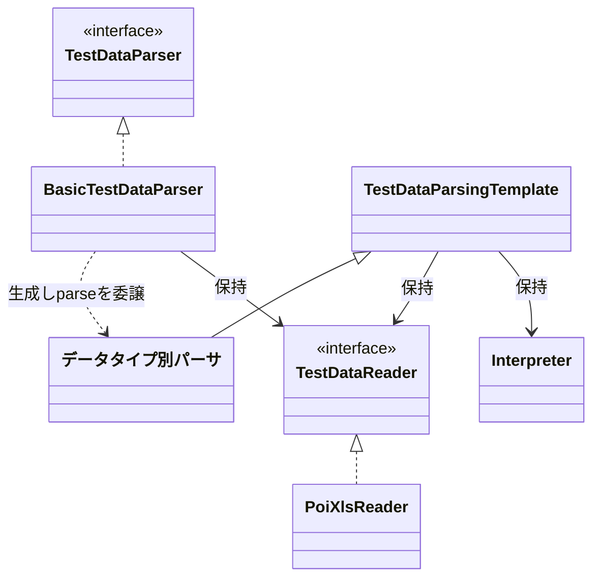
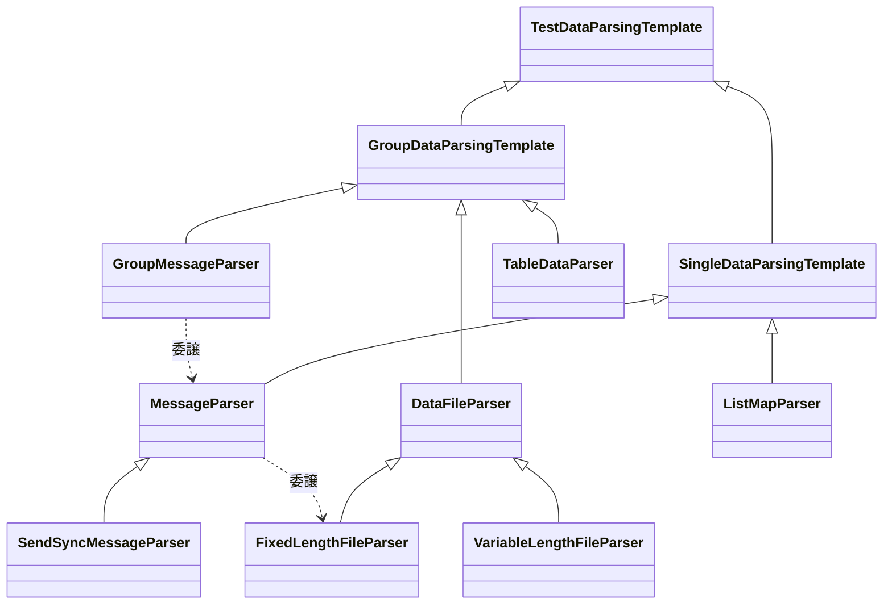
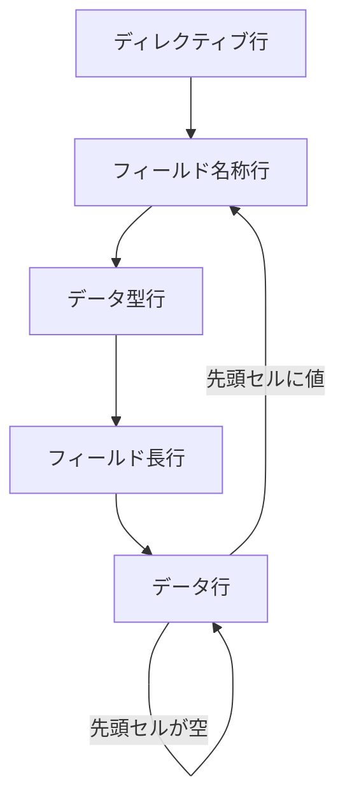
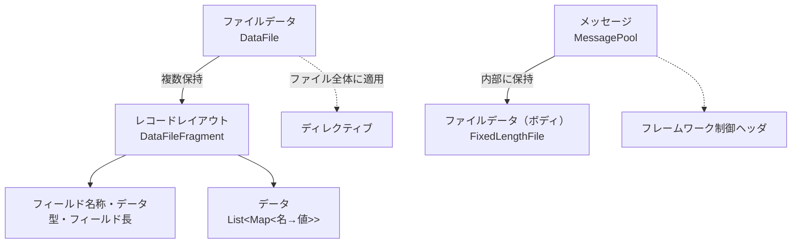

# NTF テストデータ読み込み機構

NTF 本体が Excel のテストデータを読み解き、構造化オブジェクトへ変換するまでを解説します。
利用者向けの「テストデータの書き方」（`ntf-testdata-doc.md`）が表側だとすれば、本書はその裏側──本体がどう動くか──です。読み終えると、**どの段階で何が変換・整形され、どこから元の値に戻せなくなるか**を追えるようになります。

- **用語**：NTF 解説書（`ntf-doc-terms.md`）に準拠（データタイプ、ヘッダ行、データ行、ディレクティブ、電文 など）
- **対象範囲**：NTF 本体（`nablarch.test.core.reader`）の読み込み経路。変換ツール・YAML 経路は対象外

---

## 1. 読み込みの4段階

Excel の1シートは、4つの段階を経て構造化オブジェクトになる。

利用者は入口インタフェース `TestDataParser` 経由でデータを取得する。各段階を束ねるクラスの関係は次のとおり。

図の各クラスと、4段階での役割の対応は次のとおり。

| 段 | 担当クラス | 役割 |
|---|---|---|
| 入口 | `TestDataParser` | 利用者の窓口 |
| ① 読む | `PoiXlsReader` | Excel シートを1行ずつ文字列のリストにする |
| ② 掃除する | `TestDataParsingTemplate` | コメント・空行を除いて意味のある行だけ残す |
| ③ 変換する | 各 `Interpreter` | 特殊記法を実値へ変換する |
| ④ 組み立てる | データタイプ別パーサ（次章）| 構造化オブジェクトへ組み立てる |

押さえるべき勘所は3点。

- **①〜③はすべてのデータタイプで共通**。同じ経路を必ず通る。
- **分岐するのは④だけ**。データタイプ（`データタイプ=値` の1行目）を見て、対応する組み立て方を選ぶ。
- **③の変換は④より前にセル単位で完了している**（詳細は3章）。④へ渡るのは実値へ変換済みのデータである。

---

## 2. データタイプと組み立て方の対応

④で分岐する先は、データタイプごとに異なる。ただし**組み立て方は実質2系統に集約される**。

④を担当するパーサは、共通の `TestDataParsingTemplate` を頂点とする継承ツリーを成す。
データブロックの選び方（Single / Group、7章）で枝が分かれ、その先に各データタイプのパーサが位置する。

| データタイプ | 構造化オブジェクト | 組み立て方 | 担当パーサ |
|---|---|---|---|
| `SETUP_FIXED` / `EXPECTED_FIXED` | 固定長ファイル | 状態機械 | `FixedLengthFileParser` |
| `SETUP_VARIABLE` / `EXPECTED_VARIABLE` | 可変長ファイル | 状態機械 | `VariableLengthFileParser` |
| `MESSAGE` / `*_MESSAGES`（電文各種） | メッセージ | 状態機械（ファイルデータを内部再利用）| `MessageParser` 系 |
| `SETUP_TABLE` / `EXPECTED_TABLE` / `EXPECTED_COMPLETE_TABLE` | テーブルデータ | ヘッダ行＋データ行 | `TableDataParser` |
| `LIST_MAP` | `List<Map>` | ヘッダ行＋データ行 | `ListMapParser` |

図から読み取れる、構造上の勘所は次の2つ。

- **固定長と可変長の違いは、フィールド長行の有無だけ**（4章）。共通の親が組み立ての大半を担う。
- **メッセージは独自の組み立てを持たず、固定長ファイルの仕組みを再利用している**。電文のボディを固定長ファイルとして読み込み、フレームワーク制御ヘッダを添えて包み直すだけである。種別ごとに追うと別物に見えるが、実体はファイルデータの組み立てに集約されている。

---

## 3. 値の変換と整形

入力ファイルの値は、**そのまま構造化オブジェクトに渡るものと、変換・整形されるものがある**。
変換には、全データタイプ共通のもの（③）と、組み立て時にデータタイプごとに行われるもの（④）の2種類がある。

### ③ 共通変換：特殊記法を実値へ（全データタイプ共通）

`TestDataParsingTemplate` が、掃除後の各セルを順に `Interpreter` のチェーンへ通す。
**特殊記法に該当するセルだけが変換され、それ以外のセルはそのまま通る**（どの `Interpreter` にもマッチしなければ素通りする）。

| 記法の例 | 変換結果 |
|---|---|
| `null` | null 値 |
| `${systemTime}` ほか日時記法 | システム時刻などの実日時 |
| `${文字種,文字数}`（例 `${全角英字,10}`）| 条件に合う文字列 |
| `${半角数字,4}-${半角数字,4}` | 各記法を変換し連結した文字列 |
| `"..."`（ダブルクォート囲み）| 引用符を除いた中身 |
| （改行コード記法）| Excel で書けない改行コードに補正 |
| （ファイル参照記法）| 参照先のファイルデータ |

### ④ 個別整形：組み立て時にデータタイプごとに（値の整形・補完）

③が「人間用記法→実値」の意味変換であるのに対し、④は**行・セルの構造的な整形や、省略値の補完**であり、性質が異なる。

| 対象 | 整形・補完の内容 |
|---|---|
| ファイル・メッセージ | 行末の空セルを取り除く |
| メッセージ | レコード種別が空欄の行に、既定のレコード種別を補う |
| テーブル | マーカーカラムを除外する（5章）|
| テーブル | DB 登録時、値が省略されたカラムにデフォルト値を補完する |

### ③は不可逆、④は非破壊

③と④では、元の値の残り方が異なる。

- **③（共通変換）は不可逆**。変換後の値だけがキャッシュ（8章）に保持され、変換前の生の値を残す仕組みはない。一度変換すると、変換前には戻せない。
- **④（個別整形）は非破壊**。整形は③変換後のデータの**コピー**に対して行われ、入力側（キャッシュ上の③変換後データ）は書き換えられない。同じシートを取得し直せば、整形前（③変換後）の状態から組み立てをやり直せる。

つまり「整形前」に戻せるのは④までで、さかのぼれるのは③変換後の状態まで。③変換前の生の値には、どちらの場合も戻せない。

---

## 4. 状態機械による組み立て（ファイル・メッセージ）

ファイルデータと電文は、1レコードレイアウトを次の順序で読み進めて組み立てる。

勘所となるのは次の2点。

- **データ行かどうかは「先頭セルが空か」で決まる**。先頭セルに値があれば、それは次のレコードレイアウトのフィールド名称行とみなされる。
- **可変長はフィールド長行を持たない**。データ型行の次に、フィールド長行を飛ばしてデータ行へ進む。固定長との差はこの一点のみ。

電文の場合は、上記で組み立てたボディから、フレームワーク制御ヘッダに該当するフィールドを分離して保持する。

### 組み立て先のデータモデル（ファイル・メッセージ）

状態機械が積み上げた結果は、入れ子の構造化オブジェクトに保持される。
ファイルデータが最も階層が深く、メッセージはこれを内部に抱える。

| 保持先 | 何を持つか | 対応クラス |
|---|---|---|
| ファイルデータ | 複数のレコードレイアウト ＋ ディレクティブ（ファイル全体の書式設定）＋ ファイルパス | `DataFile`（`FixedLengthFile` / `VariableLengthFile` が継承）|
| レコードレイアウト | レコード種別 ＋ フィールド名称・データ型・フィールド長 ＋ データ（行の並び）| `DataFileFragment` |
| データ（1行） | フィールド名称をキー、変換済みの実値を値とする対応 | `Map<String,String>`（`Fragment` 内に行数分）|
| メッセージ | ボディ（ファイルデータそのもの）＋ フレームワーク制御ヘッダ（分離して保持）| `MessagePool`（`FixedLengthFile` を内包）|

勘所は、**1ファイルが複数のレコードレイアウトを持てる**こと。
ヘッダ・データ・トレーラのように種別の異なるレコードが混在するファイルは、種別ごとに1レコードレイアウトとして分かれて保持される。
状態機械が「先頭セルに値のある行＝次のレコードレイアウトの始まり」と判定するのは、この複数レイアウトを切り分けるためである。

---

## 5. ヘッダ行＋データ行による組み立て（テーブル・LIST_MAP）

テーブルデータと `LIST_MAP` は、先頭のヘッダ行を押さえ、以降の各行をヘッダと対応づける。

- **マーカーカラム**（ヘッダ行で `[...]` と半角角括弧で囲んだ列）は、組み立て時に読み込み対象から除外される。Excel 上の見た目のためだけに存在する列を、構造化オブジェクトに含めないための仕組み。

### 組み立て先のデータモデル（テーブル・LIST_MAP）

| データタイプ | 保持先 | 何を持つか | 対応クラス |
|---|---|---|---|
| テーブル | テーブルデータ | テーブル名 ＋ カラム名 ＋ 行の並び | `TableData` |
| `LIST_MAP` | `List<Map>` | 1行 = フィールド名→値の対応。これを行数分並べたもの | `List<Map<String,String>>` |

ファイルデータが「レコードレイアウトの入れ子」を持つのに対し、こちらは**フラットな行の並び**である。
データタイプによって保持モデルの形が異なる点が、両系統の構造上の違いである。

---

## 6. 入口 API がまとめる単位

利用者が呼ぶ入口の API（`TestDataParser`）は、複数のデータタイプを1つの結果にまとめて返すことがある。
ここはデータタイプと API が1対1ではないため、実装を追わないと気づきにくい。

- **準備ファイルの取得**（`getSetupFile`）：固定長（`SETUP_FIXED`）と可変長（`SETUP_VARIABLE`）を**まとめて**1つのファイルデータのリストとして返す。
- **テーブル期待値の取得**（`getExpectedTableData`）：`EXPECTED_TABLE` と `EXPECTED_COMPLETE_TABLE` を**マージして**返す。後者は、省略カラムにデフォルト値を補完してから統合される。

---

## 7. データブロックの選び方（Single / Group）

④では、目的のデータブロックをシートから選び出す。選び方は2方式あり、データタイプごとに決まっている。

| 方式 | 選び方 | 該当データタイプ |
|---|---|---|
| Single | データタイプとIDが完全一致する**最初の1ブロック**を取得 | `LIST_MAP`、`MESSAGE` 等 |
| Group | `データタイプ + groupId + '='` で前方一致する**複数ブロック**を収集 | テーブル、ファイル 等 |

> 補足：解説書の「複数のデータタイプを使用する場合は種類ごとにまとめて記述する」という規約は、
> この選び方に由来する。混在して書くと、読み込みが途中で打ち切られるデータタイプがある。

---

## 8. 再解析を避けるキャッシュ

①〜③（読む・掃除・変換）を終えた結果は、`ファイル名/シート名` をキーにキャッシュされる。
同じシートから複数のデータブロックを取得する場合でも、Excel の読み込みと特殊記法変換は1回で済む。

---

## さいごに

要点は3つ。**①〜③は全データタイプ共通で、分岐するのは④だけ**。**組み立て方は実質2系統**（状態機械＝ファイル・メッセージ／ヘッダ行＋データ行＝テーブル・LIST_MAP）に集約され、メッセージも独自の組み立てを持たず固定長ファイルを再利用する。そして**③（特殊記法変換）は不可逆、④（個別整形）は非破壊**で、戻せるのは③変換後までという境界がある。

この境界が本書の肝である（③を通すと記法のまま戻せなくなる）。境界をどう扱うかは変換ツール設計（[testdata-converter-design.md](testdata-converter-design.md)）を参照。

限界として、本書は NTF 本体（`nablarch.test.core.reader`）の **Excel 読み込み経路のみ**を扱う。変換ツール・YAML 経路、各データタイプの記法そのもの（`ntf-testdata-doc.md`）は対象外。
