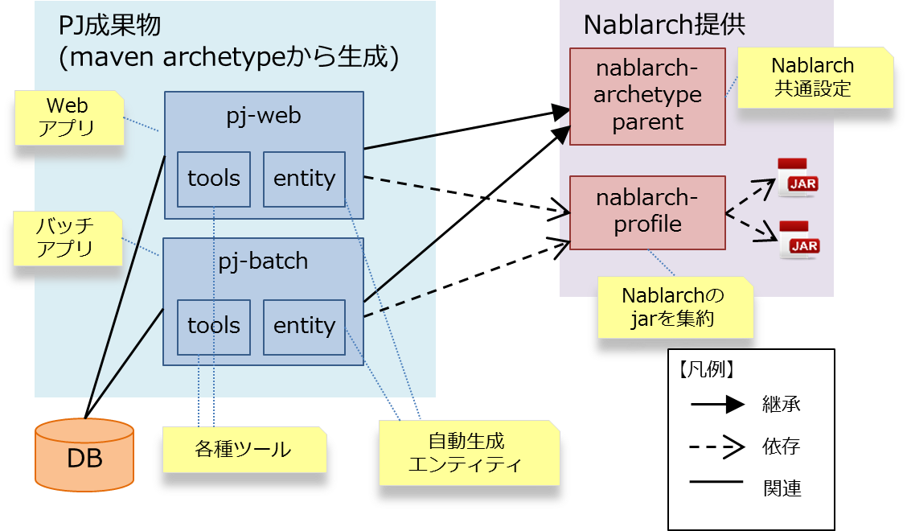

=======================
Mavenアーキタイプの構成
=======================
本章では、Nablarchの提供するMavenアーキタイプの構成と、各ディレクトリ・ファイルの概要を記載する。

.. contents:: 目次
  :depth: 2
  :local:

--------------
全体構成の概要
--------------

Nablarchでは、以下のアーキタイプを提供している。なお、アーキタイプのグループIDはすべて ``com.nablarch.archetype`` である。

.. list-table::
  :header-rows: 1
  :class: white-space-normal
  
  * - アーティファクトID
    - 説明
  * - nablarch-web-archetype
    - ウェブアプリケーション実行制御基盤を利用する場合のアーキタイプ
  * - nablarch-jaxrs-archetype
    - RESTfulウェブサービス実行制御基盤を利用する場合のアーキタイプ
  * - nablarch-batch-ee-archetype
    - JSR352に準拠したバッチアプリケーションフレームワークを使用する場合のアーキタイプ
  * - nablarch-batch-archetype
    - Nablarch独自のバッチアプリケーション実行制御基盤を利用する場合のアーキタイプ

nablarch-web-archetypeとnablarch-batch-archetypeのアーキタイプを使用し、
プロジェクト生成中に入力する ``artifactId`` に、 ``pj-web`` , ``pj-batch`` をそれぞれ指定した場合、以下のような構成となる。

.. list-table::
  :header-rows: 1
  :class: white-space-normal
  :widths: 7,6,16

  * - Mavenプロジェクト名
    - パッケージング
    - 用途
  * - pj-web
    - war
    - ウェブアプリケーション実行制御基盤を利用するアプリケーションを開発する。
      
      最終的に、warファイルとしてアプリケーションサーバにデプロイされる単位で作成する。
  * - pj-batch 
    - jar
    - Nablarch独自のバッチアプリケーション実行制御基盤を利用するアプリケーションを開発する。
    

.. tip::

  自動生成エンティティは `gsp-dba-maven-plugin(外部サイト) <https://github.com/coastland/gsp-dba-maven-plugin>`_ を使用した場合に生成される。
  使用する場合は、:doc:`../addin_gsp` に記載されている設定を行う必要がある。

----------------
各構成要素の詳細
----------------

.. _about_maven_parent_module:

nablarch-archetype-parent(親プロジェクト)
=========================================

概要
----

nablarch-archetype-parentは、各アーキタイプから作成したプロジェクトの親となるプロジェクトである。

このプロジェクトを利用者が直接書き換えることは無い。

本プロジェクトには、主に以下の設定が記述されている。

* 各種Mavenプラグインのバージョン
* 各種ツールが使用するファイルのパス

nablarch-archetype-parentの所在
-------------------------------

アーキタイプから生成したプロジェクトを一度でもビルドしたことがあれば、以下の階層下にnablarch-archetype-parentのpom.xmlがキャッシュされている。
nablarch-archetype-parentに記載された設定を確認したい場合は、キャッシュされたpom.xmlを確認すると良い。

.. code-block:: text

  <ホームディレクトリ>/.m2/repository/com/nablarch/archetype/

pj-webプロジェクト
==================

ウェブアプリケーションのwarファイルとしてパッケージングされるプロジェクト。

プロジェクトの構成
------------------

.. code-block:: text

    myapp-web
    |
    |   pom.xml                     … Mavenの設定ファイル
    |   README.md                   … 本プロジェクトの補足説明(読み終わったら削除可)
    |
    +---db                          … 疎通アプリケーション用のDDL及びInsert文。RDBMS別に格納されている。
    |
    +---h2
    |   +---bin                     … H2の起動に使用するファイルが格納されている。
    |   |
    |   \---db
    |           SAMPLE.mv.db        … H2のデータファイル。
    |           SAMPLE.mv.db.org    … H2のデータファイルのバックアップ。H2が起動しなくなった場合に「SAMPLE.mv.db」にコピーして使用する。
    |
    +---src
    |   +---env                     … 環境別の設定ファイルが格納されている。
    |   |
    |   +---main
    |   |   +---java                … 疎通確認用アプリケーションのクラスが格納されている。
    |   |   |
    |   |   +---resources           … 直下には開発環境・本番環境で共に使用する設定ファイルが格納されている。
    |   |   |   |
    |   |   |   +---entity          … ER図のサンプル。gsp-dba-maven-pluginを使用する際のサンプルデータとして用意している。
    |   |   |   |
    |   |   |   \---net             … ルーティングアダプタ用設定ファイルが格納されている。
    |   |   |
    |   |   \---webapp
    |   |       +---errorPages      … エラー画面のサンプルが格納されている。
    |   |       |
    |   |       +---test            … 疎通確認画面用のファイルが格納されている。
    |   |       |
    |   |       \---WEB-INF         … web.xmlが格納されている。
    |   |
    |   \---test
    |       +---java                … 疎通テスト用のユニットテストが格納されている。
    |       |
    |       \---resources           … 直下にはユニットテスト用の設定ファイルが格納されている。
    |           |
    |           +---data            … gsp-dba-maven-pluginを使用する際のサンプルデータとして用意している。
    |           |
    |           \---nablarch        … HTMLチェックツール用のデータが格納されている。
    |
    \---tools                       … Mavenと連携させて使用するツールの設定ファイルが格納されている。

pj-jaxrsプロジェクト
====================

RESTfulウェブサービスアプリケーションのwarファイルとしてパッケージングされるプロジェクト。

プロジェクトの構成
------------------

Webと同一であるため省略。

pj-batch-eeプロジェクト
=======================

JSR352に準拠したバッチアプリケーションのjarファイルとしてパッケージされるプロジェクト。

.. _firstStepBatchEEProjectStructure:

プロジェクトの構成
------------------

(ディレクトリ及びファイルの説明は、Web、batchに存在しない要素についてのみ記載)

.. code-block:: text

    myapp-batch-ee
    |
    |   pom.xml
    |   README.md
    |
    +---db
    |
    +---h2
    |   +---bin
    |   |
    |   \---db
    |           SAMPLE.mv.db
    |           SAMPLE.mv.db.org
    |
    +---src
    |   +---env
    |   |
    |   +---main
    |   |   +---java
    |   |   |
    |   |   \---resources
    |   |       |   batch-boot.xml              … バッチ起動時に使用する設定ファイル。
    |   |       |
    |   |       +---entity
    |   |       |
    |   |       \---META-INF
    |   |           |   beans.xml               … CDIを有効化するために必要なファイル。
    |   |           |
    |   |           +---batch-jobs
    |   |           |       sample-batchlet.xml … batchlet方式の疎通確認用アプリケーションのジョブファイル。
    |   |           |       sample-chunk.xml    … chunk方式の疎通確認用アプリケーションのジョブファイル。
    |   |           |       sample-etl.xml      … ETL機能のジョブファイル。
    |   |           |
    |   |           \---etl-config
    |   |                   sample-etl.json     … ETL機能のジョブの設定ファイル。

    |   |
    |   |
    |   \---test
    |       +---java
    |       |
    |       \---resources
    |           |
    |           +---data
    |
    \---tools

pj-batchプロジェクト
====================

Nablarchバッチアプリケーションのjarファイルとしてパッケージされるプロジェクト。

.. _firstStepBatchProjectStructure:

プロジェクトの構成
------------------

(ディレクトリ及びファイルの説明は、Webに存在しない要素についてのみ記載)

.. code-block:: text

    myapp-batch
    |
    |   pom.xml
    |   README.md
    |
    +---db
    |
    +---h2
    |   +---bin
    |   |
    |   \---db
    |           SAMPLE.mv.db
    |           SAMPLE.mv.db.org
    |
    +---src
    |   +---env
    |   |
    |   +---main
    |   |   +---java
    |   |   |
    |   |   +---resources
    |   |   |   |   batch-boot.xml              … 都度起動バッチ起動時に指定する設定ファイル。
    |   |   |   |   mail-sender-boot.xml        … メール送信バッチ起動時に指定する設定ファイル。
    |   |   |   |   resident-batch-boot.xml     … テーブルをキューとして使ったメッセージング起動時に指定する設定ファイル。
    |   |   |   |
    |   |   |   \---entity
    |   |   |
    |   |   \---scripts                         … バッチ等の起動に使用するためのシェルスクリプトファイル(使用は任意)。
    |   |
    |   \---test
    |       +---java
    |       |
    |       \---resources
    |           |
    |           +---data
    |           |
    |           \---nablarch
    |
    \---tools

.. _about_maven_web_batch_module:

各プロジェクト共通の設定
======================================

各Mavenプロジェクトそれぞれで下記のような設定を行っている。

* プロファイルの定義
* ビルドフェーズで実行するゴールの追加
* コンパイルに関する設定。以下のような設定が存在する。
    
  * 利用するJavaのバージョン
  * ファイルエンコーディング
  * JDBCドライバ
* :ref:`firstStepBuiltInTools` に記載されているツールの設定。以下のような設定が存在する。
  
  * `gsp-dba-maven-plugin(外部サイト) <https://github.com/coastland/gsp-dba-maven-plugin>`_ で利用するデータベース接続設定（JDBC接続URLやデータベーススキーマなど）
  * Nablarch Toolboxのツール実行設定（ 各Mavenプロジェクト配下のtoolsディレクトを参照している）
  * 使用不許可APIチェックツールを含むFindbugsの設定や、Checkstyle設定、カバレッジ設定 

以下に個々の詳細を示す。

.. _mavenModuleStructuresProfilesList:

プロファイル一覧
----------------

定義されているプロファイルの詳細については、各プロジェクトの ``pom.xml`` を参照。

以下に定義されているプロファイルを示す。

.. list-table::
  :header-rows: 1
  :class: white-space-normal
  :widths: 4,18

  * - プロファイル名
    - 概要
  * - dev
    - 開発環境用及び、ユニットテスト実行用のプロファイル。src/env/dev/resourcesディレクトリのリソースを使用する。
  * - prod
    - 本番環境用のプロファイル。src/env/prod/resourcesディレクトリのリソースを使用する。

.. tip::
   ``pom.xml`` 中のdevプロファイルにactiveByDefault要素が記述されており、デフォルトでdevプロファイルが使用されるようになっている。

^^^^^^^^^^^^^^^^^^^^
プロファイルの使い方
^^^^^^^^^^^^^^^^^^^^

これらのプロファイルは環境に応じた成果物を作成する際に使用する。

例えば、本番環境用のWARファイルを作成したい場合、
``pj-web``\ モジュール配下で、本番環境用プロファイルを指定してmvnコマンドを実行する。

以下にコマンドの例を示す。

.. code-block:: bash
                
   mvn package -P prod -DskipTests=true

.. tip ::

  上記コマンドでは、ユニットテストのスキップを指定している。

  「mvn package」実行時には、デフォルトではユニットテストも併せて行われるが、本番環境用のプロファイルではユニットテストの実行に失敗するためである。

ビルドフェーズに追加されているゴール一覧
----------------------------------------

Mavenのデフォルトのビルドフェーズ定義に加えて、以下のゴールが実行されるように設定されている。

設定の詳細については、各プロジェクトの ``pom.xml`` 及び、 :ref:`about_maven_parent_module` の ``pom.xml`` を参照のこと。

.. list-table::
  :header-rows: 1
  :class: white-space-normal
  :widths: 5,8,9

  * - ビルドフェーズ
    - ゴール
    - 概要
  * - initialize
    - jacoco:prepare-agent
    - JaCoCoの実行時エージェントを準備する。
  * - pre-integration-test
    - jacoco:prepare-agent-integration
    - 結合試験用にJaCoCoの実行時エージェントを準備する。
  * - verify
    - checkstyle:check
    - CheckStyleチェック
  * - verify
    - antrun:run
    - FindBugsチェック

.. tip::
  gsp-dba-maven-pluginの実行はMavenのビルドフェーズに紐づかないため、エンティティの自動生成など、gsp-dba-maven-pluginで実装されているゴールを実行したい場合は、ゴールを手動で実行すること。

コンパイルに関する設定
-----------------------------------

設定内容については、各プロジェクトの ``pom.xml`` 及び、 :ref:`about_maven_parent_module` の ``pom.xml`` を参照。

ツールの設定
-----------------------------------

ツールの設定は、``pom.xml`` (各プロジェクト及び、 :ref:`about_maven_parent_module` )に記載されているものと、toolsフォルダに存在するものがある。

以下にtoolsフォルダに含まれる主なディレクトリとファイルを示す。

.. list-table::
  :header-rows: 1
  :class: white-space-normal
  :widths: 9,20

  * - ディレクトリまたはファイル
    - 説明
  * - nablarch-findbugs.xml
    - FindBugsを実行する際に使用する設定ファイル
  * - nablarch-tools.xml
    - JSP静的解析ツール、使用許可API一覧作成ツールを実行する際に使用する設定ファイル
  * - static-analysis/checkstyle 
    - Checkstyleの設定ファイルが格納されている
  * - static-analysis/findbugs
    - FindBugsの設定ファイルが格納されている
  * - static-analysis/jspanalysis
    - JSP静的解析ツールの設定ファイルが格納されている。|br|
      本ディレクトリはpj-webのみに存在する

:ref:`about_maven_parent_module` に記載されているツールについては、 :ref:`firstStepBuiltInTools` を参照。

ビルド設定
==============================================

以下のような場合は、各モジュールのpom.xmlを変更する。

* モジュール個別で使用する依存ライブラリを追加・変更する。例えば、使用するNablarchのバージョンを変更するために、nablarch-bomのバージョンを修正する場合が該当する。
* モジュール個別で使用するMavenプラグインを追加・変更する。

使用するNablarchのバージョンを変更する場合の例
----------------------------------------------

以下にNablarch5u6を使用する場合の設定例を示す。

.. code-block:: xml

  <dependencyManagement>
    <dependencies>
      <dependency>
        <groupId>com.nablarch.profile</groupId>
        <artifactId>nablarch-bom</artifactId>

        <!--
        使用するNablarchのバージョンと対応したバージョンを指定する。
        この例は5u6を指定している。
        -->
        <version>5u6</version>

        <type>pom</type>
        <scope>import</scope>
      </dependency>
      …
  </dependencyManagement>

依存ライブラリ追加の例
----------------------

以下に\ ``pj-web``\ モジュールで暗号化ユーティリティを利用するために、nablarch-common-encryptionへの依存を追加する場合の例を示す。

なお、依存を追加する場合にはscopeの設定を適切に行うこと。scopeの設定を怠ると、ユニットテストでのみ使用するはずのモジュールが本番でも使用されるといった問題が起きる可能性がある。

.. code-block:: xml

  <dependencies>
  …
    <dependency>
      <groupId>com.nablarch.framework</groupId>
      <artifactId>nablarch-common-encryption</artifactId>
    </dependency>
  …
  </dependencies>

Nablarchのライブラリの場合、pom.xmlにバージョン番号は通常指定しなくても良い(nablarch-bomに対するバージョン指定により、個々のライブラリのバージョンが決定するため)。

.. _mavenModuleStructuresModuleDivisionPolicy:

----------------------------
【参考】プロジェクト分割方針
----------------------------

推奨するプロジェクト構成の方針
==============================

以下に推奨するプロジェクト構成の方針を示す。

* 作成するアプリケーションが一つの場合(ウェブのみ、バッチのみ等)は、それぞれ単体のプロジェクトで構成する。
* 社内用と社外用で二つのウェブアプリケーションを作成するようなケースでは、無理に一つのMavenプロジェクトにまとめず、個別にMavenプロジェクトを作ること。
* 複数のアプリケーションが存在し、共通化したいライブラリが存在する場合は、共通ライブラリを配置するMavenプロジェクトを作る。
* 実行制御基盤を追加した際は、実行制御基盤毎にMavenプロジェクトを作る。例えば、メッセージング実行制御基盤を使用したアプリケーションを追加する場合は、新しくMavenプロジェクトを作る。
* 必要以上にプロジェクトは分割しない。詳細は、 :ref:`mavenModuleStructuresProblemsOfExcessivelyDivided` を参照。

.. tip ::

  プロジェクトを分割する際には、リソースの重複が無い様に注意すること。

  例えば、`gsp-dba-maven-plugin(外部サイト) <https://github.com/coastland/gsp-dba-maven-plugin>`_ で使用するedmファイルを複数のMavenプロジェクトに混在させると、重複したEntityクラスが複数のMavenプロジェクトに存在することになる。

.. _mavenModuleStructuresProblemsOfExcessivelyDivided:

プロジェクトを過度に分割した場合の問題点
========================================

プロジェクトを過度に分割した場合の問題点を以下に示す。

* ビルド及びデプロイの手順が複雑になる。
* 結合テスト以降で、どのモジュールを組み合わせてテストしたか管理が複雑になる。

一般的には、Mavenプロジェクトは少ないほうが開発をスムーズに進めることが出来る。

.. |br| raw:: html

   