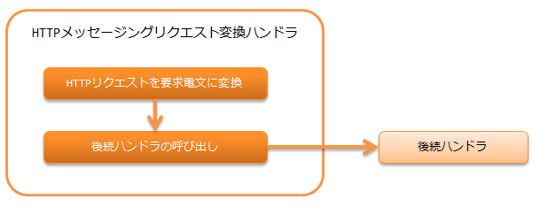

.. _http_messaging_request_parsing_handler:

HTTPメッセージングリクエスト変換ハンドラ
==================================================
.. contents:: 目次
  :depth: 3
  :local:

HTTPリクエスト(
:java:extdoc:`HttpRequest<nablarch.fw.web.HttpRequest>`
)を要求電文(
:java:extdoc:`RequestMessage<nablarch.fw.messaging.RequestMessage>`
)に変換するハンドラ。

本ハンドラでは、以下の処理を行う。

* HTTPリクエストを要求電文に変換する。
  詳細は、 :ref:`http_messaging_request_parsing_handler-convert` を参照。

処理の流れは以下のとおり。

  
ハンドラクラス名
--------------------------------------------------
* :java:extdoc:`nablarch.fw.messaging.handler.HttpMessagingRequestParsingHandler`

モジュール一覧
--------------------------------------------------
.. code-block:: xml

  <dependency>
    <groupId>com.nablarch.framework</groupId>
    <artifactId>nablarch-fw-messaging-http</artifactId>
  </dependency>

制約
------------------------------

:ref:`http_response_handler` より後ろに配置すること
  変換処理に失敗した場合は、ステータスコードを指定したレスポンスをクライアントに返すため、
  本ハンドラは :ref:`http_response_handler` より後ろに配置する必要がある。

:ref:`thread_context_handler` より後ろに配置すること
  スレッドコンテキスト上に設定されたリクエストIDをもとに、
  要求電文と応答電文の変換に使う
  :java:extdoc:`DataRecordFormatter<nablarch.core.dataformat.DataRecordFormatter>` の取得を行うため、
  :ref:`thread_context_handler` より後ろに本ハンドラを配置する必要がある。

.. _http_messaging_request_parsing_handler-convert:

HTTPリクエストを要求電文に変換する
--------------------------------------------------------------
変換内容を以下に示す。

.. list-table::
   :header-rows: 1
   :class: white-space-normal
   :widths: 30,30,40

   * - HTTPリクエスト(変換元)
     - 要求電文(変換先)
     - 補足

   * - リクエストID
     - 要求電文のリクエストパス
     -

   * - X-Message-Idリクエストヘッダ
     - 要求電文のメッセージID
     - このヘッダが存在しない場合は ``400`` をクライアントに返す。

   * - X-Correlation-Idリクエストヘッダ
     - 要求電文の関連メッセージID
     - このヘッダが存在しない場合は設定されない。

   * - 残りのリクエストヘッダ
     - 要求電文のプロトコルヘッダ
     -

   * - リクエストボディ
     - フレームワーク制御ヘッダとデータレコード
     - 詳細は、 :ref:`リクエストボディの変換<http_messaging_request_parsing_handler-convert_body>` を参照。

.. _http_messaging_request_parsing_handler-convert_body:

リクエストボディの変換
 リクエストボディの変換は、 :ref:`data_format` により行う。
 以下のルールでフォーマット定義ファイルを準備しておく必要がある。

  受信時のフォーマット定義ファイルの論理名
   <リクエストID> + "_RECEIVE"

  送信時のフォーマット定義ファイルの論理名
   <リクエストID> + "_SEND"

 デフォルトでは読み込んだデータを構造化データとして取り扱うが、
 フレームワーク制御ヘッダに対する各項目の設定は行わない。
 そのため、フレームワーク制御ヘッダに対する各項目を設定する場合、
 :java:extdoc:`StructuredFwHeaderDefinition<nablarch.fw.messaging.reader.StructuredFwHeaderDefinition>`
 をコンポーネント定義に追加し、電文からヘッダ情報を取得する際のキー情報を指定する。

 設定例を以下に示す。

 ポイント
   * キー情報は、
     :java:extdoc:`StructuredFwHeaderDefinition#fwHeaderKeys<nablarch.fw.messaging.reader.StructuredFwHeaderDefinition.setFwHeaderKeys(java.util.Map)>`
     プロパティに指定する。
   * :java:extdoc:`StructuredFwHeaderDefinition#fwHeaderKeys<nablarch.fw.messaging.reader.StructuredFwHeaderDefinition.setFwHeaderKeys(java.util.Map)>`
     プロパティには、キーにフィールド名、値に電文上の位置を指定する。
     電文上の位置は構造化データをMapに変換した後のキー情報を記述する。
     構造化データからMapに変換される際のキー情報については、 :ref:`data_format-structured_data` を参照。

 .. code-block:: xml

  <component class="nablarch.fw.messaging.handler.HttpMessagingRequestParsingHandler">
    <property name="fwHeaderDefinition" ref="fwHeaderDefinition"/>
  </component>

  <component name="fwHeaderDefinition"
             class="nablarch.fw.messaging.reader.StructuredFwHeaderDefinition">
    <property name="FwHeaderKeys">
      <map>
        <entry key="userId"     value="_nbctlhdr.userId"/>
        <entry key="resendFlag" value="_nbctlhdr.resendFlag"/>
        <entry key="statusCode" value="_nbctlhdr.statusCode"/>
      </map>
    </property>
  </component>

 また、固定長データや可変長データを取り扱う場合は標準フレームワーク制御ヘッダ定義を指定する。

 .. code-block:: xml

  <component name="fwHeaderDefinition"
             class="nablarch.fw.messaging.StandardFwHeaderDefinition" />

変換時の例外処理
 変換時に捕捉する例外と処理内容を以下に示す。
 以下に示していない例外については捕捉しない。

 :java:extdoc:`nablarch.fw.results.RequestEntityTooLarge`
  :ログレベル: INFO
  :レスポンス: 413
  :説明: リクエストボディのサイズ上限を超過したため、証跡ログとして記録する。
         そして、サイズ超過を表すため、HTTPステータスコードが *413*  のレスポンスを生成する。

 :java:extdoc:`nablarch.fw.messaging.MessagingException`
  :ログレベル: INFO
  :レスポンス: 413
  :説明: リクエストボディが不正なため、証跡ログとして記録する。
         そして、クライアントエラーを表すため、HTTPステータスコードが *400*  のレスポンスを生成する。

 :java:extdoc:`nablarch.core.dataformat.InvalidDataFormatException`
  :ログレベル: INFO
  :レスポンス: 413
  :説明: リクエストボディのフォーマットが不正なため、証跡ログとして記録する。
         そして、クライアントエラーを表すため、HTTPステータスコードが *400*  のレスポンスを生成する。

.. _http_messaging_request_parsing_handler-limit_size:

巨大なサイズのリクエストを防ぐ
--------------------------------------------------------------
巨大なサイズのリクエストボディがリクエストされると、
ディスクリソースが枯渇するなどが原因でシステムが正常に稼働しなくなる可能性がある。

このため、このハンドラではリクエストボディのサイズ上限を超過した場合には、
証跡としてINFOログを出力し、 ``413`` をクライアントに返す。

リクエストボディのサイズ上限は、バイト数で設定する。
設定を省略した場合は、 :java:extdoc:`Integer#MAX_VALUE<java.lang.Integer>` となる。

以下に設定例を示す。

.. code-block:: xml

  <component class="nablarch.fw.messaging.handler.HttpMessagingRequestParsingHandler">
    <!-- アップロードサイズ(Content-Length)の上限(約10M) -->
    <property name="bodyLengthLimit" value="10000000" />
  </component>
