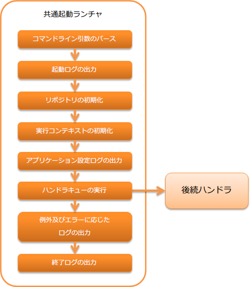

.. _`main`:

共通起動ランチャ
==================================================

.. contents:: 目次
  :depth: 3
  :local:

スタンドアロンで起動するアプリケーションの起点となるハンドラ。

javaコマンドから直接起動することで、システムリポジトリの初期化を行い、そこに定義されたハンドラキューを実行させることができる。

本ハンドラでは、以下の処理を行う。
処理の詳細は、カッコ内のJavadocを参照。

* コマンドライン引数のパース( :java:extdoc:`CommandLine<nablarch.fw.launcher.CommandLine>` )
* 起動ログの出力( :java:extdoc:`LauncherLogFormatter#getStartLogFormat<nablarch.fw.launcher.logging.LauncherLogFormatter.getStartLogFormat()>` )
* システムリポジトリの初期化
* 実行コンテキストの初期化( :java:extdoc:`Main#setupExecutionContext <nablarch.fw.launcher.Main.setupExecutionContext(nablarch.fw.launcher.CommandLine, nablarch.fw.ExecutionContext)>` )
* アプリケーション設定ログの出力( :java:extdoc:`ApplicationSettingLogFormatter<nablarch.core.log.app.ApplicationSettingLogFormatter>` )
* ハンドラキューの実行
* 例外及びエラーに応じたログの出力
* 終了ログの出力( :java:extdoc:`LauncherLogFormatter#getEndLogFormat<nablarch.fw.launcher.logging.LauncherLogFormatter.getEndLogFormat()>` )

処理の流れは以下のとおり。

ハンドラクラス名
--------------------------------------------------
* :java:extdoc:`nablarch.fw.launcher.Main`

モジュール一覧
--------------------------------------------------
.. code-block:: xml

  <dependency>
    <groupId>com.nablarch.framework</groupId>
    <artifactId>nablarch-fw-standalone</artifactId>
  </dependency>

.. _main-run_application:

アプリケーションを起動する
--------------------------------------------------
javaコマンドで :java:extdoc:`Mainクラス<nablarch.fw.launcher.Main>` を指定してアプリケーションを起動する。

フレームワークの動作に必要となる以下の3つのオプションは、必ず指定する必要がある。
以下のオプションのうちいずれかが欠けていた場合は、即座に異常終了する。(終了コード = 127)

\-diConfig
 システムリポジトリの設定ファイルのパスを指定する。
 このオプションで指定されたパスを使ってシステムリポジトリを初期化する。

\-requestPath
 実行するアクションとリクエストIDを指定する。

 以下の書式で定義される文字列を設定する。

 .. code-block:: bash

  実行するアクションのクラス名/リクエストID

 このオプションで指定されたリクエストパスを
 :java:extdoc:`Request#getRequestPath<nablarch.fw.Request.getRequestPath()>`
 が返すようになる。

\-userId
 ユーザIDを設定する。
 この値はセッションコンテキスト変数に ``user.id`` という名前で格納される。

以下に実行例を示す。

.. code-block:: bash

 java nablarch.fw.launcher.Main \
   -diConfig file:./batch-config.xml \
   -requestPath admin.DataUnloadBatchAction/BC0012 \
   -userId testUser

.. _main-option_parameter:

アプリケーション起動に任意のオプションを設定する
--------------------------------------------------
:java:extdoc:`Mainクラス<nablarch.fw.launcher.Main>` 起動時に、任意のオプションパラメータを指定することが出来る。

オプションパラメータは、「オプション名称」と「オプションの値」のペアで設定する。

例えば、オプション名称が ``optionName`` で 値が ``optionValue`` の場合は、以下のように指定する。

.. code-block:: bash

 java nablarch.fw.launcher.Main \
   -optionName optionValue

アプリケーションでオプションを使用する場合は、 :java:extdoc:`ExecutionContext <nablarch.fw.ExecutionContext>` から取得する。

.. code-block:: java

     @Override
    public Result handle(String inputData, ExecutionContext ctx) {
      // getSessionScopedVarにオプション名称を指定して、値を取得する。
      final String value = ctx.getSessionScopedVar("optionName");

      // 処理

      return new Result.Success();
    } 

.. tip::

  アプリケーション起動時に必ず指定する必要があるオプションは、 :ref:`main-run_application` を参照

例外及びエラーに応じた処理内容
--------------------------------------------------
このハンドラでは捕捉した例外及びエラーの内容に応じて、以下の処理と結果を返す。

.. list-table::
  :header-rows: 1
  :class: white-space-normal
  :widths: 25 75

  * - 例外クラス
    - 処理内容

  * - :java:extdoc:`Result.Error <nablarch.fw.Result.Error>`

      (サブクラス含む)

    - FATALレベルのログ出力を行う。

      ログ出力後、ハンドラの処理結果として、以下の値を返す。

       ステータスコードが0～127の場合
        ステータスコードをそのまま返す。

       ステータスコードが0～127以外の場合
        127を返す。

  * - 上記以外の例外クラス

    - FATALレベルのログ出力を行う。

      ログ出力後、ハンドラの処理結果として、127を返す。
