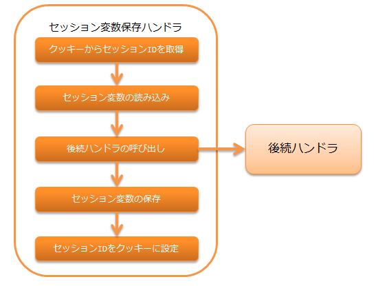

.. _session_store_handler:

セッション変数保存ハンドラ
============================

.. contents:: 目次
  :depth: 3
  :local:

後続のハンドラやライブラリで追加・更新・削除されたセッション変数を、セッションストアに保存するハンドラ。

セッションストア機能の詳細は、 :ref:`session_store` を参照。

本ハンドラの処理の流れは以下の通りとなる。

.. important:: 

  同一セッションの処理が複数のスレッドで実行された場合(例えば、タブブラウザで複数タブから同時にリクエストが有った場合)、
  使用しているストアによっては後勝ちとなる。
  詳細は、以下のイメージを参照。

  .. image:: ../images/SessionStoreHandler/multi-thread.png
    :scale: 80

  このため、使用するストアの特性をよく理解し、要件にあったストアを選択する必要がある。
  ストアの詳細は、 :ref:`session_store-future_of_store` を参照。

ハンドラクラス名
--------------------------------------------------
* :java:extdoc:`nablarch.common.web.session.SessionStoreHandler`

モジュール一覧
--------------------------------------------------
.. code-block:: xml

  <dependency>
    <groupId>com.nablarch.framework</groupId>
    <artifactId>nablarch-fw-web</artifactId>
  </dependency>

  <!-- DBストアを使用する場合のみ -->
  <dependency>
    <groupId>com.nablarch.framework</groupId>
    <artifactId>nablarch-fw-web-dbstore</artifactId>
  </dependency>

.. _session_store_handler-constraint:

制約
------------------------------
:ref:`http_response_handler` より後ろに配置すること
  サーブレットフォワード時、フォワード先でセッションストアの値にアクセスできるようにするため、
  本ハンドラは :ref:`http_response_handler` より後ろに配置する必要がある。

:ref:`multipart_handler` より後ろに配置すること
  HIDDENストア使用時にリクエストパラメータにアクセスできるようにするため、
  本ハンドラは :ref:`multipart_handler` より後ろに配置する必要がある。

:ref:`forwarding_handler` より前に配置すること
  :ref:`forwarding_handler` を本ハンドラよりも前に設定した場合、セッションストアの読み込み、保存が複数回実行されるが、
  HIDDENストアはリクエストパラメータからセッション変数を読み込み、リクエストスコープにセッション変数を保存するため、
  内部フォーワード時にHIDDENストアを使用した場合、最新のセッション変数を取得することができない問題がある。
  このため、本ハンドラは :ref:`forwarding_handler` より前に配置すること。

セッションストアを使用するための設定を行う
--------------------------------------------------------------
セッションストアを使用するには、以下の設定を行った :java:extdoc:`SessionManager <nablarch.common.web.session.SessionManager>`
を本ハンドラの :java:extdoc:`sessionManager <nablarch.common.web.session.SessionStoreHandler.setSessionManager(nablarch.common.web.session.SessionManager)>` プロパティに設定する必要がある。

* アプリケーションで使用するセッションストアのコンポーネント設定
* デフォルトでどのセッションストアを使用するか

以下の設定例を参考に、本ハンドラの設定を行うこと。

.. code-block:: xml

  <component class="nablarch.common.web.session.SessionStoreHandler">
    <property name="sessionManager" ref="sessionManager"/>
  </component>

  <!-- "sessionManager"というコンポーネント名で設定する -->
  <component name="sessionManager" class="nablarch.common.web.session.SessionManager">
    <!-- プロパティの設定は省略 -->
  </component>

:java:extdoc:`SessionManager <nablarch.common.web.session.SessionManager>` に設定するプロパティの詳細は :ref:`session_store-use_config` を参照。

セッション変数を直列化してセッションストアに保存する
--------------------------------------------------------------
本ハンドラでセッション変数をセッションストアに保存する際、直列化の仕組みを選択することができる。

選択可能な直列化の仕組みの詳細は :ref:`session_store-serialize` を参照。

セッションストアの改竄をチェックする
--------------------------------------------------------------
セッションストアからセッション変数を読み込む際、セッションストアが改竄されていないかをチェックする。

HIDDENストアの改竄を検知した場合
  ステータスコード400の :java:extdoc:`HttpErrorResponse <nablarch.fw.web.HttpErrorResponse>` を送出する。

それ以外のストアの改竄を検知した場合
  セッションストアの復号処理時に発生した例外をそのまま送出する。

.. _session_store_handler-error_forward_path:

改竄エラー時の遷移先を設定する
--------------------------------------------------------------
セッションストアの改竄を検知した場合に表示するエラーページは `web.xml` に記載する必要がある。
なぜなら、本ハンドラは :ref:`session_store_handler-constraint` に記載の通り、 :ref:`forwarding_handler` よりも前に設定する必要がある。
この場合、以下の理由により本ハンドラで発生した例外に対して、 :ref:`HttpErrorHandler_DefaultPage` を適用することができないため、
`web.xml` に対する設定が必要となる。

理由
  :ref:`forwarding_handler` は、 :ref:`http_error_handler` よりも手前に設定する必要がある。
  これは、 :ref:`http_error_handler`  の :ref:`HttpErrorHandler_DefaultPage` に対して指定した
  内部フォワードのパスを正しく扱うために必要な設定順となる。

  この結果、 :ref:`forwarding_handler` より前に設定される本ハンドラで発生した例外に対しては、
  :ref:`HttpErrorHandler_DefaultPage` への設定値が適用できないため `web.xml` への設定が必要となる。

セッションIDを保持するクッキーの名前や属性を変更する
--------------------------------------------------------------
セッションIDを保持するクッキーの名前や属性を任意の値に変更することができる。

デフォルトの設定は以下のとおり。

:クッキー名:    | NABLARCH_SID
:Path属性:      | ホスト配下のすべてのパス
                 | 送信可能なパスを明示的に指定したい場合に別途設定すること
:Domain属性:    | 指定しない
                  | 送信可能なドメインを明示的に指定したい場合に別途設定すること
:Secure属性:    | 使用しない
                  | HTTPS環境で使用する場合は、``使用する`` に設定すること
:MaxAge属性:    | 指定しない
:HttpOnly属性:  | ServletAPIのバージョンが3.0以上であれば使用する

クッキー名や属性を変更したい場合は、以下の例を参考に設定を行うこと。

.. code-block:: xml

    <component class="nablarch.common.web.session.SessionStoreHandler">
      <!-- クッキー名 -->
      <property name="cookieName" value="NABLARCH_SID" />
      <!-- Path属性 -->
      <property name="cookiePath" value="/" />
      <!-- Domain属性 -->
      <property name="cookieDomain" value="" />
      <!-- Secure属性 -->
      <property name="cookieSecure" value="false" />
      <!-- セッションマネージャ -->
      <property name="sessionManager" ref="sessionManager"/>
    </component>

    <component name="sessionManager" class="nablarch.common.web.session.SessionManager">
      <property name="availableStores">
        <list>
          <component class="nablarch.common.web.session.store.DbStore">
            <!-- 有効期間 -->
            <property name="expires" value="1800" />
            <!-- その他のプロパティは省略 -->
          </component>
        </list>
      </property>
      <!-- その他のプロパティは省略 -->
    </component>

.. important::
  セッションIDを保持するクッキーをセッションクッキー(ブラウザを閉じれば破棄されるクッキー)とするため、MaxAge属性は使用しない。

  セッションストアの有効期間は、HTTPセッションに保存する。
  複数のストア間で異なる有効期間を設定した場合は、最も期間の長い値をHTTPセッションに保存する。

.. tip::
  HttpOnly属性の値はアプリケーションで使用しているServletAPIのバージョンによって決定されるため、
  設定ファイル等から任意の値を指定することはできない。
