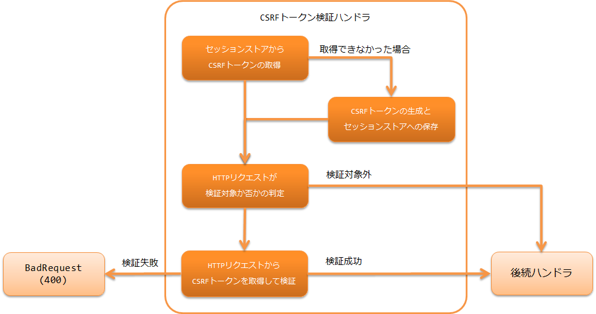

.. _csrf_token_verification_handler:

CSRFトークン検証ハンドラ
==================================================
.. contents:: 目次
  :depth: 3
  :local:

本ハンドラは、トークンを使った一般的なCSRF(クロスサイトリクエストフォージェリ)対策を行うための機能を提供する。
本ハンドラにより、 :ref:`web_application` と :ref:`restful_web_service` のCSRF対策を実現できる。

本ハンドラをハンドラ構成に含めると、リクエスト処理でCSRFトークンの生成と検証が行われ、
:ref:`tag` を使用している場合はCSRFトークンが画面に自動で出力される。
そのため、アプリケーションプログラマが実装することなく、 :ref:`web_application`  のCSRF対策を漏れなく行うことができる。

:ref:`restful_web_service` にてCSRF対策を実現できるように、CSRFトークンはリクエストヘッダとリクエストパラメータから取得する。
さらにCSRFトークンを取得できるユーティリティクラスを提供しており、そのユーティリティクラスを使用してクライアントにCSRFトークンを送る仕組みを実装することで、
:ref:`restful_web_service` のCSRF対策を行うことができる。

CSRFトークンはセッションストアに格納するため、本ハンドラを使用する場合は :ref:`session_store` の使用が必要となる。

本ハンドラでは、以下の処理を行う。

* セッションストアからCSRFトークンを取得する。
* 取得できなかった場合はCSRFトークンを生成してセッションストアへ保存する。
* HTTPリクエストが検証対象か否かを判定する。
* 検証対象の場合はHTTPリクエストヘッダ、またはHTTPリクエストパラメータからCSRFトークンを取得して検証を行う。
* 検証に失敗した場合はBadRequest(400)のレスポンスを返す。
* 検証に成功した場合は次のハンドラへ処理を移す。

処理の流れは以下のとおり。

