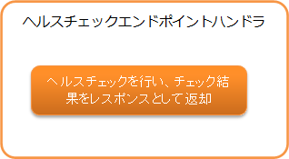

.. _health_check_endpoint_handler:

ヘルスチェックエンドポイントハンドラ
==================================================
.. contents:: 目次
  :depth: 3
  :local:

本ハンドラは、アプリケーションのヘルスチェックを行うための機能を提供する。
本ハンドラを使用して、 :ref:`Webアプリケーション<web_application>` と :ref:`RESTfulウェブサービス<restful_web_service>`
のヘルスチェックを行うエンドポイントを実現できる。

ヘルスチェックのデフォルト実装として :java:extdoc:`DB <nablarch.fw.web.handler.health.DbHealthChecker>` と
:ref:`Redis<lettuce_adaptor>` のヘルスチェックを提供している。

本ハンドラでは、以下の処理を行う。

* ヘルスチェックを行い、チェック結果をレスポンスとして返す。

処理の流れは以下のとおり。

本ハンドラはヘルスチェックを行うエンドポイントとなるため、後続ハンドラの呼び出しは行わない。

ハンドラクラス名
--------------------------------------------------
* :java:extdoc:`nablarch.fw.web.handler.HealthCheckEndpointHandler`

モジュール一覧
--------------------------------------------------
.. code-block:: xml

  <dependency>
    <groupId>com.nablarch.framework</groupId>
    <artifactId>nablarch-fw-web</artifactId>
  </dependency>

  <!-- DBのヘルスチェックを行う場合 -->
  <dependency>
    <groupId>com.nablarch.framework</groupId>
    <artifactId>nablarch-core-jdbc</artifactId>
  </dependency>

制約
------------------------------
:ref:`http_response_handler` または :ref:`jaxrs_response_handler` より後ろに配置すること
  本ハンドラで生成した :java:extdoc:`HttpResponse <nablarch.fw.web.HttpResponse>` を
  :ref:`http_response_handler` または :ref:`jaxrs_response_handler` が処理するため、
  本ハンドラは :ref:`http_response_handler` または :ref:`jaxrs_response_handler` より後ろに配置する必要がある。

.. _health_check_endpoint_handler-health_check_endpoint:

ヘルスチェックのエンドポイントを作る
--------------------------------------------------
本ハンドラをハンドラ構成に追加するとヘルスチェックを行うエンドポイントとなる。
本ハンドラの設定例を以下に示す。

.. code-block:: xml

  <!-- ハンドラ構成 -->
  <component name="webFrontController" class="nablarch.fw.web.servlet.WebFrontController">
    <property name="handlerQueue">
      <list>
        <!-- 他のハンドラは省略 -->

        <!-- HTTPレスポンスハンドラ -->
        <component class="nablarch.fw.web.handler.HttpResponseHandler"/>

        <!--
             ヘルスチェックエンドポイントハンドラ
             RequestHandlerEntryを使用して特定のパスの場合のみ実行するように設定する。
        -->
        <component class="nablarch.fw.RequestHandlerEntry">
          <property name="requestPattern" value="/action/healthcheck" />
          <property name="handler">
            <component class="nablarch.fw.web.handler.HealthCheckEndpointHandler"/>
          </property>
        </component>

      </list>
    </property>
  </component>

デフォルトではDB等のヘルスチェックを行わず、ステータスコード200で以下のJSONレスポンスを返す。

.. code-block:: json

  {"status":"UP"}

DB等のリソースのヘルスチェックは、 :java:extdoc:`HealthChecker <nablarch.fw.web.handler.health.HealthChecker>`
という抽象クラスが行う。 :java:extdoc:`HealthChecker <nablarch.fw.web.handler.health.HealthChecker>` を継承したクラスを
本ハンドラのhealthCheckersプロパティに指定すると、本ハンドラの実行時に対象ごとのヘルスチェックとして使用される。

デフォルトで提供しているDBのヘルスチェックの設定例を以下に示す。

.. code-block:: xml

    <!-- ヘルスチェックエンドポイントハンドラ -->
    <component class="nablarch.fw.web.handler.HealthCheckEndpointHandler">
      <!-- healthCheckersプロパティはリストで指定 -->
      <property name="healthCheckers">
        <list>
          <!-- DBのヘルスチェック -->
          <component class="nablarch.fw.web.handler.health.DbHealthChecker">
            <!-- データソースを指定 -->
            <property name="dataSource" ref="dataSource" />
            <!-- ダイアレクトを指定 -->
            <property name="dialect" ref="dialect" />
          </component>
        </list>
      </property>
    </component>

上記設定で本ハンドラが実行されると、指定したDBのヘルスチェックが行われJSONのレスポンスを返す。
以下にヘルスチェックの成功時と失敗時のレスポンスを示す。

.. code-block:: bash

  // 成功時
  // ステータスコードは200
  {
    "status":"UP",
    "targets":[
      {"name":"DB","status":"UP"}
    ]
  }

  // 失敗時
  // ステータスコードは503
  {
    "status":"DOWN",
    "targets":[
      {"name":"DB","status":"DOWN"}
    ]
  }

デフォルトではルート直下のstatusにヘルスチェック全体の結果、targetsに対象ごとのヘルスチェック結果を出力する。

.. _health_check_endpoint_handler-add_health_checker:

ヘルスチェックを追加する
--------------------------------------------------
:ref:`health_check_endpoint_handler-health_check_endpoint` で説明したように、
DB等のリソースのヘルスチェックは :java:extdoc:`HealthChecker <nablarch.fw.web.handler.health.HealthChecker>`
という抽象クラスが行うので、:java:extdoc:`HealthChecker <nablarch.fw.web.handler.health.HealthChecker>` を継承したクラスを作成し、
本ハンドラのhealthCheckersプロパティに指定するとヘルスチェックを追加できる。

実装例と設定例を以下に示す。

.. code-block:: java

    public class CustomHealthChecker extends HealthChecker {

        public CustomHealthChecker() {
            // 対象を表す名前を指定
            setName("Custom");
        }

        @Override
        protected boolean tryOut(HttpRequest request, ExecutionContext context) throws Exception {
            // ヘルスチェックとして試す処理を実装
            // ヘルスチェックが失敗した場合は、falseを返すか例外を送出
            // 以下は例外が発生しなければヘルスチェックが成功とする場合の実装イメージ
            CustomClient client = ...;
            client.execute();
            return true;
        }
    }

.. code-block:: xml

    <!-- ヘルスチェックエンドポイントハンドラ -->
    <component class="nablarch.fw.web.handler.HealthCheckEndpointHandler">
      <!-- healthCheckersプロパティはリストで指定 -->
      <property name="healthCheckers">
        <list>
          <!-- DBのヘルスチェック -->
          <component class="nablarch.fw.web.handler.health.DbHealthChecker">
            <!-- 省略 -->
          </component>
          <!-- HealthCheckerを継承して作成したクラスを指定 -->
          <component class="com.example.CustomHealthChecker">
        </list>
      </property>
    </component>

.. _health_check_endpoint_handler-change_response:

ヘルスチェック結果のレスポンスを変更する
--------------------------------------------------
ヘルスチェック結果のレスポンスは :java:extdoc:`HealthCheckResponseBuilder <nablarch.fw.web.handler.health.HealthCheckResponseBuilder>` が作成する。
デフォルトのレスポンスは以下となる。

ステータスコード
  - ヘルスチェックの成功：200
  - ヘルスチェックの失敗：503

レスポンスボディ
  - Content-Type：application/json
  - フォーマット

    .. code-block:: bash

      {
        "status":"ヘルスチェック全体の結果",
        "targets":[
          {
            "name":"対象1",
            "status":"対象1のヘルスチェック結果"
          },
          {
            "name":"対象2",
            "status":"対象2のヘルスチェック結果"
          },
          :
        ]
      }

    - 実際は改行がなく1行となるが上記は見やすさのために整形している。
    - ヘルスチェック全体の結果はtargetsのヘルスチェック結果が1つでも失敗の場合に失敗となる。
    - targetsは指定された :java:extdoc:`HealthChecker <nablarch.fw.web.handler.health.HealthChecker>` の数だけ含まれる。

ヘルスチェック結果のラベル
  - ヘルスチェックの成功：UP
  - ヘルスチェックの失敗：DOWN

ステータスコード、ヘルスチェック結果のラベル、レスポンスボディの出力有無は設定で変更できる。
以下に設定例を示す。

.. code-block:: xml

    <component class="nablarch.fw.web.handler.HealthCheckEndpointHandler">
      <property name="healthCheckers">
        <!-- 省略 -->
      </property>
      <property name="healthCheckResponseBuilder">
        <component class="nablarch.fw.web.handler.health.HealthCheckResponseBuilder">
          <!-- ヘルスチェック成功時のステータスコード -->
          <property name="healthyStatusCode" value="201" />
          <!-- ヘルスチェック成功時のラベル -->
          <property name="healthyStatus" value="OK" />
          <!-- ヘルスチェック失敗時のステータスコード -->
          <property name="unhealthyStatusCode" value="500" />
          <!-- ヘルスチェック失敗時のラベル -->
          <property name="unhealthyStatus" value="NG" />
          <!-- リクエストボディを出力するか否か。出力しない場合にfalseを指定 -->
          <property name="writeBody" value="false" />
        </component>
      </property>
    </component>

レスポンスボディの内容を変更したい場合は、
:java:extdoc:`HealthCheckResponseBuilder <nablarch.fw.web.handler.health.HealthCheckResponseBuilder>` を継承したクラスを作成する。

実装例と設定例を以下に示す。

.. code-block:: java

    public class CustomHealthCheckResponseBuilder extends HealthCheckResponseBuilder {
        @Override
        protected String getContentType() {
            // Content-Typeを返す。
            return "text/plain";
        }
        @Override
        protected String buildResponseBody(
                HttpRequest request, ExecutionContext context, HealthCheckResult result) {
            // リクエストボディを返す。
            // ヘルスチェック結果が入っているHealthCheckResultを使ってレスポンスボディを作成する。
            StringBuilder builder = new StringBuilder();
            builder.append("All=" + getStatus(result.isHealthy()));
            for (HealthCheckResult.Target target : result.getTargets()) {
                builder.append(", " + target.getName() + "=" + getStatus(target.isHealthy()));
            }
            return builder.toString();
        }
    }

.. code-block:: xml

    <component class="nablarch.fw.RequestHandlerEntry">
      <property name="requestPattern" value="/action/healthcheck" />
      <property name="handler">
        <component class="nablarch.fw.web.handler.HealthCheckEndpointHandler">
          <property name="healthCheckers">
            <!-- 省略 -->
          </property>
          <!-- HealthCheckResponseBuilderを継承して作成したクラスを指定 -->
          <property name="healthCheckResponseBuilder">
            <component class="com.nablarch.example.app.web.handler.health.CustomHealthCheckResponseBuilder" />
          </property>
        </component>
      </property>
    </component>

