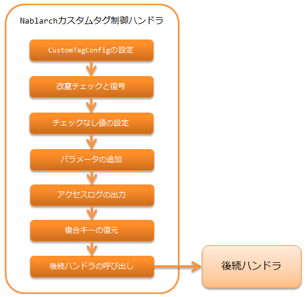

.. _nablarch_tag_handler:

Nablarchカスタムタグ制御ハンドラ
==================================================

.. contents:: 目次
  :depth: 3
  :local:

Nablarchの :ref:`tag` に必要なリクエスト処理を行うハンドラ。

本ハンドラでは、以下の処理を行う。

* カスタムタグのデフォルト値をJSPで参照できるように、
  :java:extdoc:`CustomTagConfig<nablarch.common.web.tag.CustomTagConfig>` をリクエストスコープに設定する。
* :ref:`hidden暗号化<tag-hidden_encryption>` に対応する改竄チェックと復号を行う。
* :ref:`チェックボックスのチェックなしに対する値を指定する<tag-checkbox_off_value>` ために、リクエストにチェックなしに対応する値を設定する。
* :ref:`ボタン又はリンク毎のパラメータ追加<tag-submit_change_parameter>` のために、リクエストにパラメータを追加する。
* :ref:`http_access_log` のリクエストパラメータを出力する。
* :ref:`複合キーを扱える<tag-composite_key>` ようにするため、複合キーを復元する。

.. tip::
 GETリクエストの場合、カスタムタグではhiddenパラメータを出力しない。
 hiddenパラメータを出力しない理由は、 :ref:`tag-using_get` を参照。

 カスタムタグに合わせて、本ハンドラでも、GETリクエストの場合はhiddenパラメータに関連する処理を行わず、
 複合キーの復元処理のみを行う。

処理の流れは以下のとおり。

ハンドラクラス名
--------------------------------------------------
* :java:extdoc:`nablarch.common.web.handler.NablarchTagHandler`

モジュール一覧
---------------------------------------------------------------------
.. code-block:: xml

  <dependency>
    <groupId>com.nablarch.framework</groupId>
    <artifactId>nablarch-fw-web-tag</artifactId>
  </dependency>

制約
------------------------------
:ref:`multipart_handler` より後ろに設定すること
  本ハンドラは、 :ref:`tag` に必要なリクエスト処理でリクエストパラメータにアクセスするため。

復号に失敗(改竄エラー、セッション無効化エラー)した場合のエラーページを設定する
------------------------------------------------------------------------------------
:ref:`hidden暗号化<tag-hidden_encryption>` の復号処理は、次の2つのケースにおいて失敗する可能性がある。
改竄の判定基準は、 :ref:`復号処理<tag-hidden_encryption_decryption>` を参照。

* 暗号化したデータが改竄された場合(改竄エラー)
* セッションから復号に使う鍵を取得できない場合(セッション無効化エラー)

それぞれ、
:java:extdoc:`NablarchTagHandler<nablarch.common.web.handler.NablarchTagHandler>` の設定で、
エラー発生時のエラーページとステータスコードを指定することができる。

.. code-block:: xml

  <component name="nablarchTagHandler"
             class="nablarch.common.web.handler.NablarchTagHandler">
    <!--
      改竄エラー発生時の設定
    -->
    <property name="path" value="/TAMPERING-DETECTED.jsp" />
    <property name="statusCode" value="400" />
    <!--
      セッション無効化エラー発生時の設定
      省略した場合は改竄エラー発生時の設定が使用される。
    -->
    <property name="sessionExpirePath" value="/SESSION-EXPIRED.jsp" />
    <property name="sessionExpireStatusCode" value="400" />

  </component>