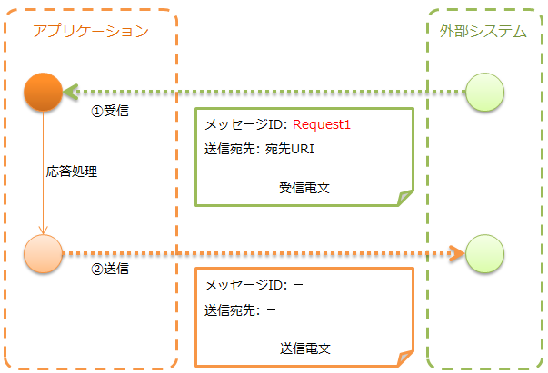

.. _http_system_messaging:

HTTPメッセージング
==================================================

.. contents:: 目次
  :depth: 3
  :local:

HTTPを使ったメッセージの送受信を行う機能を提供する。

HTTPメッセージングでは、 :ref:`http_system_messaging-data_model` に示したデータモデルを前提としている。
また、メッセージのフォーマットには、 :ref:`data_format` を使用する。

.. important::
 :ref:`http_system_messaging-data_model` の中で、
 :ref:`フレームワーク制御ヘッダ<mom_system_messaging-fw_header>` については、
 Nablarchで独自に規定している項目となり、 :ref:`メッセージボディ<http_system_messaging-message_body>` に含めることを想定している。

 プロジェクト側で電文フォーマットを設計できる場合は問題ないが、
 外部システムにより既に電文フォーマットが規定されている場合は、
 この想定が適合しない場合がある。

 この場合は、 :ref:`http_system_messaging-change_fw_header` を参照し、
 プロジェクトで実装を追加して対応することになる。

HTTPメッセージングは送受信の種類により、想定している実行制御基盤が異なる。

.. list-table::
   :header-rows: 1
   :class: white-space-normal
   :widths: 50, 50

   * - 送受信の種類
     - 実行制御基盤
   * - :ref:`HTTPメッセージ受信<http_system_messaging-message_receive>`
     - :ref:`HTTPメッセージング<http_messaging>`
   * - :ref:`HTTPメッセージ送信<http_system_messaging-message_send>`
     - 実行制御基盤に依存しない

機能概要
--------------------------

:ref:`mom_system_messaging` と同じ作り方ができる
~~~~~~~~~~~~~~~~~~~~~~~~~~~~~~~~~~~~~~~~~~~~~~~~~~~~~~~~~~~~
HTTPメッセージングでは、メッセージの送受信の実装を :ref:`mom_system_messaging` と同じ以下のAPIで行う。
そのため、 :ref:`mom_system_messaging` の経験があれば、少ない学習時間で実装することができる。

* :java:extdoc:`MessagingAction<nablarch.fw.messaging.action.MessagingAction>`
* :java:extdoc:`MessageSender<nablarch.fw.messaging.MessageSender>`

モジュール一覧
--------------------------------------------------
.. code-block:: xml

  <dependency>
    <groupId>com.nablarch.framework</groupId>
    <artifactId>nablarch-fw-messaging</artifactId>
  </dependency>
  <dependency>
    <groupId>com.nablarch.framework</groupId>
    <artifactId>nablarch-fw-messaging-http</artifactId>
  </dependency>

使用方法
---------------------------

.. _http_system_messaging-settings:

HTTPメッセージングを使うための設定を行う
~~~~~~~~~~~~~~~~~~~~~~~~~~~~~~~~~~~~~~~~~~~~~~~~~~
メッセージ受信の場合は、実行制御基盤のハンドラ構成以外に特に設定は不要である。

メッセージ送信の場合は、以下のクラスをコンポーネント定義に追加する。

* :java:extdoc:`MessageSenderClient<nablarch.fw.messaging.MessageSenderClient>` の実装クラス (HTTPの送受信)

以下に設定例を示す。

ポイント
  * :java:extdoc:`MessageSenderClient<nablarch.fw.messaging.MessageSenderClient>` のデフォルト実装として
    :java:extdoc:`HttpMessagingClient<nablarch.fw.messaging.realtime.http.client.HttpMessagingClient>` を提供している。
  * ルックアップして使用されるため、コンポーネント名は ``messageSenderClient`` と指定する。

.. code-block:: xml

 <component name="messageSenderClient"
            class="nablarch.fw.messaging.realtime.http.client.HttpMessagingClient" />

.. _http_system_messaging-message_receive:

メッセージを受信する(HTTPメッセージ受信)
~~~~~~~~~~~~~~~~~~~~~~~~~~~~~~~~~~~~~~~~~~~~~~~~~~~~~~~~~~~~~~
外部システムからメッセージを受信し、その応答を送信する。

実装例
 ポイント
   * HTTPメッセージ受信は、 :java:extdoc:`MessagingAction<nablarch.fw.messaging.action.MessagingAction>` で作成する。
   * 応答電文は、 :java:extdoc:`RequestMessage.reply<nablarch.fw.messaging.RequestMessage.reply()>` で作成する。

 .. code-block:: java

  public class SampleAction extends MessagingAction {
      protected ResponseMessage onReceive(RequestMessage request,
                                          ExecutionContext context) {
          // 受信データ処理
          Map<String, Object> reqData = request.getParamMap();

          // (省略)

          // 応答データ返却
          return request.reply()
                  .setStatusCodeHeader("200")
                  .addRecord(new HashMap() {{     // メッセージボディの内容
                       put("FIcode",     "9999");
                       put("FIname",     "ﾅﾌﾞﾗｰｸｷﾞﾝｺｳ");
                       put("officeCode", "111");
                       /*
                        * (後略)
                        */
                    }});
      }
  }

.. _http_system_messaging-message_send:

メッセージを送信する(HTTPメッセージ送信)
~~~~~~~~~~~~~~~~~~~~~~~~~~~~~~~~~~~~~~~~~~~~~~~~~~~~~~~~~~~~~~
外部システムに対してメッセージを送信し、その応答を受信する。
応答メッセージを受信するか、待機タイムアウト時間が経過するまで待機する。

規定時間内に応答を受信できずにタイムアウトした場合は、何らかの補償処理を行う必要がある。

.. image:: ../images/system_messaging/http_system_messaging-message_send.png
  :scale: 80

実装例
 ポイント
   * 要求電文は、 :java:extdoc:`SyncMessage<nablarch.fw.messaging.SyncMessage>` で作成する。
   * メッセージ送信には、 :java:extdoc:`MessageSender#sendSync<nablarch.fw.messaging.MessageSender.sendSync(nablarch.fw.messaging.SyncMessage)>` を使用する。
     使い方の詳細は、リンク先のJavadocを参照。

 .. code-block:: java

  // 要求電文の作成
  SyncMessage requestMessage = new SyncMessage("RM11AC0202")        // メッセージIDを設定
                                 .addDataRecord(new HashMap() {{    // メッセージボディの内容
                                      put("FIcode",     "9999");
                                      put("FIname",     "ﾅﾌﾞﾗｰｸｷﾞﾝｺｳ");
                                      put("officeCode", "111");
                                      /*
                                       * (後略)
                                       */
                                  }})
  // 要求電文の送信
  SyncMessage responseMessage = MessageSender.sendSync(requestMessage);

 また、HTTPヘッダーとして独自の項目を送信したい場合は、下記のように作成したメッセージのヘッダレコードに設定する。

 .. code-block:: java

  // メッセージヘッダの内容
  requestMessage.getHeaderRecord().put("Accept-Charset", "UTF-8");

拡張例
--------------------------------------------------

.. _http_system_messaging-change_fw_header:

フレームワーク制御ヘッダの読み書きを変更する
~~~~~~~~~~~~~~~~~~~~~~~~~~~~~~~~~~~~~~~~~~~~~~~~~~
外部システムで既に電文フォーマットが規定されている場合など、
フレームワーク制御ヘッダの読み書きを変更したい場合がある。
この場合は、プロジェクトで実装を追加することで対応する。
以下に、送受信の種類ごとに対応方法を示す。

HTTPメッセージ送信の場合
 フレームワーク制御ヘッダの読み書きは、メッセージボディのフォーマット定義により行う。
 そのため、変更内容に合わせてメッセージボディのフォーマット定義を変更すればよい。

HTTPメッセージ受信の場合
 フレームワーク制御ヘッダの読み書きは、
 :java:extdoc:`FwHeaderDefinition<nablarch.fw.messaging.FwHeaderDefinition>` インタフェースを実装したクラスが行う。
 デフォルトでは、 :java:extdoc:`StandardFwHeaderDefinition<nablarch.fw.messaging.StandardFwHeaderDefinition>` が使用される。

 そのため、 :java:extdoc:`StandardFwHeaderDefinition<nablarch.fw.messaging.StandardFwHeaderDefinition>` を参考に、
 プロジェクトで :java:extdoc:`FwHeaderDefinition<nablarch.fw.messaging.FwHeaderDefinition>` インタフェースを実装したクラスを作成し、
 :ref:`http_messaging_request_parsing_handler` と :ref:`http_messaging_response_building_handler` に設定すればよい。

.. tip::

  フレームワーク制御ヘッダを使用するか否かは任意に選択できる。
  このため、特別要件がない限りフレームワーク制御ヘッダを使用する必要はない。

.. _http_system_messaging-change_http_client_process:

HTTPメッセージ送信のHTTPクライアント処理を変更する
~~~~~~~~~~~~~~~~~~~~~~~~~~~~~~~~~~~~~~~~~~~~~~~~~~
HTTPメッセージ送信では、 :ref:`http_system_messaging-settings` で説明した通り、
:java:extdoc:`HttpMessagingClient<nablarch.fw.messaging.realtime.http.client.HttpMessagingClient>` を使用している。

:java:extdoc:`HttpMessagingClient<nablarch.fw.messaging.realtime.http.client.HttpMessagingClient>`
では、HTTPクライアントとして様々な処理を行っている。
例えば、送信するメッセージのHTTPヘッダに、 ``Accept: text/json,text/xml`` が固定で設定される。

もし、:java:extdoc:`HttpMessagingClient<nablarch.fw.messaging.realtime.http.client.HttpMessagingClient>`
のデフォルト動作がプロジェクトの要件に合わない場合は、
:java:extdoc:`HttpMessagingClient<nablarch.fw.messaging.realtime.http.client.HttpMessagingClient>`
を継承したクラスを作成し、 :ref:`http_system_messaging-settings` に示した方法でコンポーネント定義に追加することでカスタマイズを行うこと。

.. _http_system_messaging-data_model:

送受信電文のデータモデル
--------------------------------------------------
HTTPメッセージングでは、送受信電文の内容を以下のデータモデルで表現する。

.. image:: ../images/system_messaging/http_system_messaging-data_model.png
  :scale: 80

.. _http_system_messaging-protocol_header:

プロトコルヘッダ
 主にウェブコンテナによるメッセージ送受信処理において使用される情報を格納したヘッダ領域である。
 プロトコルヘッダはMapインターフェースでアクセスすることが可能となっている。

.. _http_system_messaging-common_protocol_header:

共通プロトコルヘッダ
 プロトコルヘッダのうち、フレームワークが使用する以下のヘッダについては、特定のキー名でアクセスすることができる。
 キー名をカッコで示す。

 メッセージID(X-Message-Id)
  電文ごとに一意採番される文字列

  :送信時: 送信処理の際に採番した値
  :受信時: 送信側が発番した値

 関連メッセージID(X-Correlation-Id)
  電文が関連する電文のメッセージID

  :応答電文: 要求電文のメッセージID
  :再送要求: 応答再送を要求する要求電文のメッセージID

.. _http_system_messaging-message_body:

メッセージボディ
 HTTPリクエストのデータ領域をメッセージボディと呼ぶ。
 フレームワーク機能は、原則としてプロトコルヘッダ領域のみを使用する。
 それ以外のデータ領域については、未解析の単なるバイナリデータとして扱うものとする。

 メッセージボディの解析は、 :ref:`data_format` によって行う。
 これにより、電文の内容をフィールド名をキーとするMap形式で読み書きすることが可能である。

.. _http_system_messaging-fw_header:

フレームワーク制御ヘッダ
 本フレームワークが提供する機能の中には、電文中に特定の制御項目が定義されていることを前提として設計されているものが多く存在する。
 そのような制御項目のことを ``フレームワーク制御ヘッダ`` とよぶ。

 フレームワーク制御ヘッダとそれを使用するハンドラの対応は以下のとおり。

 リクエストID
  この電文を受信したアプリケーションが実行すべき業務処理を識別するためのID。

  このヘッダを使用する主要なハンドラ：

  | :ref:`request_path_java_package_mapping`
  | :ref:`message_resend_handler`
  | :ref:`permission_check_handler`
  | :ref:`ServiceAvailabilityCheckHandler`

 ユーザID
  この電文の実行権限を表す文字列

  このヘッダを使用する主要なハンドラ：

  | :ref:`permission_check_handler`

 再送要求フラグ
  再送要求電文送信時に設定されるフラグ

  このヘッダを使用する主要なハンドラ：

  | :ref:`message_resend_handler`

 ステータスコード
  要求電文に対する処理結果を表すコード値

  このヘッダを使用する主要なハンドラ：

  | :ref:`message_reply_handler`

 フレームワーク制御ヘッダは、デフォルトの設定では、
 メッセージボディの最初のデータレコード中に、それぞれ以下のフィールド名で定義されている必要がある。

  :リクエストID: requestId
  :ユーザID: userId
  :再送要求フラグ: resendFlag
  :ステータスコード: statusCode

 以下は、標準的なフレームワーク制御ヘッダの定義例である。

 .. code-block:: bash

  #===================================================================
  # フレームワーク制御ヘッダ部 (50byte)
  #===================================================================
  [NablarchHeader]
  1   requestId   X(10)       # リクエストID
  11  userId      X(10)       # ユーザID
  21  resendFlag  X(1)  "0"   # 再送要求フラグ (0: 初回送信 1: 再送要求)
  22  statusCode  X(4)  "200" # ステータスコード
  26 ?filler      X(25)       # 予備領域
  #====================================================================

 フォーマット定義にフレームワーク制御ヘッダ以外の項目を含めた場合、
 フレームワーク制御ヘッダの任意ヘッダ項目としてアクセスすることができ、
 プロジェクト毎にフレームワーク制御ヘッダを簡易的に拡張する目的で使用することができる。

 また、将来的な任意項目の追加およびフレームワークの機能追加に伴うヘッダ追加に対応するため、
 予備領域を設けておくことを強く推奨する。

