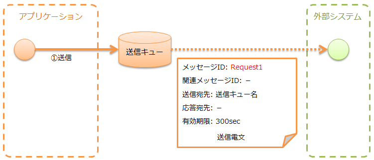
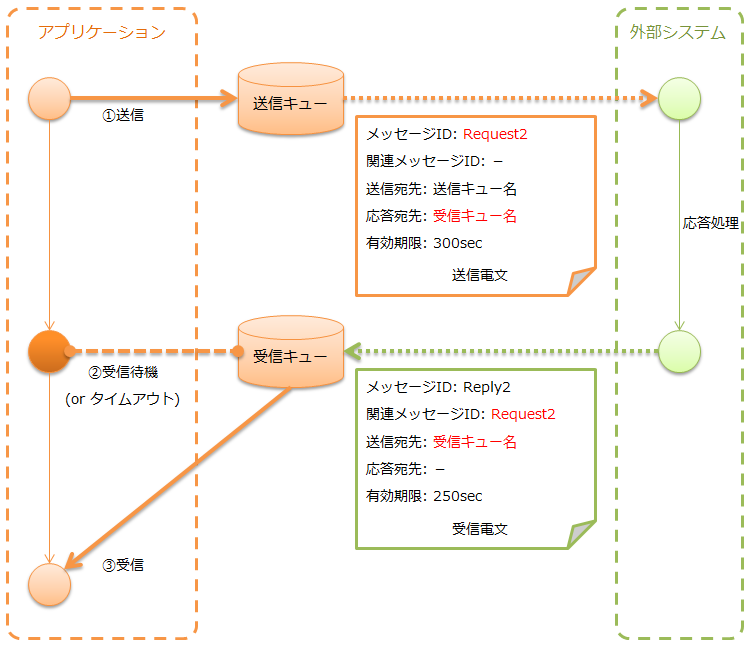

.. _mom_system_messaging:

MOMメッセージング
==================================================

.. contents:: 目次
  :depth: 3
  :local:

MOMを使ったメッセージの送受信を行う機能を提供する。
なお、ここでは、MOMメッセージングに使うメッセージキューのことをMQと称す。

MOMメッセージングでは、 :ref:`mom_system_messaging-data_model` に示したデータモデルを前提としている。
また、メッセージのフォーマットには、 :ref:`data_format` を使用する。

.. important::
 :ref:`mom_system_messaging-data_model` の中で、
 :ref:`フレームワーク制御ヘッダ<mom_system_messaging-fw_header>` については、
 Nablarchで独自に規定している項目となり、 :ref:`メッセージボディ<mom_system_messaging-message_body>` に含めることを想定している。

 プロジェクト側で電文フォーマットを設計できる場合は問題ないが、
 外部システムにより既に電文フォーマットが規定されている場合は、
 この想定が適合しない場合がある。

 この場合は、 :ref:`mom_system_messaging-change_fw_header` を参照し、
 プロジェクトで実装を追加して対応することになる。

MOMメッセージングは送受信の種類により、想定している実行制御基盤が異なる。

.. list-table::
   :header-rows: 1
   :class: white-space-normal
   :widths: 50, 50

   * - 送受信の種類
     - 実行制御基盤
   * - :ref:`応答不要メッセージ送信<mom_system_messaging-async_message_send>`
     - :ref:`nablarch_batch`
   * - :ref:`同期応答メッセージ送信<mom_system_messaging-sync_message_send>`
     - 実行制御基盤に依存しない
   * - :ref:`応答不要メッセージ受信<mom_system_messaging-async_message_receive>`
     - :ref:`mom_messaging`
   * - :ref:`同期応答メッセージ受信<mom_system_messaging-sync_message_receive>`
     - :ref:`mom_messaging`

機能概要
--------------------------

多様なMOMに対応できる
~~~~~~~~~~~~~~~~~~~~~~~~~~~~~~~~~~~~~~~~~~~~~~~~~~~~~~~~~~~~~~~~~~~~
MOMメッセージングでは、多様なMOMに対応するため、
:java:extdoc:`MessagingProvider<nablarch.fw.messaging.MessagingProvider>` インタフェースを設けている。
MOMに依存するMQ接続やメッセージ送受信は、このインタフェースを実装したクラスが行う。
そのため、 :java:extdoc:`MessagingProvider<nablarch.fw.messaging.MessagingProvider>` インタフェースを実装したクラスを作成することで、
本機能を様々なMOMで使用することができる。

MOMメッセージングはJMSに対応しており、
:java:extdoc:`JmsMessagingProvider<nablarch.fw.messaging.provider.JmsMessagingProvider>` を提供している。
詳細は、リンク先のJavadocを参照。

さらに、MOMとして利用実績が多い WebSphere MQ にも対応している。
詳細は、 :ref:`webspheremq_adaptor` を参照。

モジュール一覧
--------------------------------------------------
.. code-block:: xml

  <dependency>
    <groupId>com.nablarch.framework</groupId>
    <artifactId>nablarch-fw-messaging</artifactId>
  </dependency>
  <dependency>
    <groupId>com.nablarch.framework</groupId>
    <artifactId>nablarch-fw-messaging-mom</artifactId>
  </dependency>

使用方法
---------------------------

.. _mom_system_messaging-settings:

MOMメッセージングを使うための設定を行う
~~~~~~~~~~~~~~~~~~~~~~~~~~~~~~~~~~~~~~~~~~~~~~~~~~
MOMメッセージングでは、以下のクラスをコンポーネント定義に追加する。

* :java:extdoc:`MessagingProvider<nablarch.fw.messaging.MessagingProvider>` の実装クラス (MQ接続、MQに対する送受信)
* :ref:`messaging_context_handler` (MQ接続の管理)

以下に設定例を示す。

.. code-block:: xml

 <!-- MessagingProviderの実装クラス -->
 <component name="messagingProvider"
            class="nablarch.fw.messaging.provider.JmsMessagingProvider">
   <!-- 設定項目はJavadocを参照 -->
 </component>

 <!-- メッセージングコンテキスト管理ハンドラ -->
 <component name="messagingContextHandler"
            class="nablarch.fw.messaging.handler.MessagingContextHandler">
   <property name="messagingProvider" ref="messagingProvider" />
 </component>

さらに、メッセージ受信の場合は、データリーダの設定が必要となる。
以下のクラスをコンポーネント定義に追加する。

* :java:extdoc:`MessageReader<nablarch.fw.messaging.reader.MessageReader>` (MQから電文の読み込み)
* :java:extdoc:`FwHeaderReader<nablarch.fw.messaging.reader.FwHeaderReader>` (電文からフレームワーク制御ヘッダの読み込み)

以下に設定例を示す。

ポイント
  * データリーダのコンポーネント名には ``dataReader`` を指定する。
  * :java:extdoc:`MessageReader<nablarch.fw.messaging.reader.MessageReader>` は
    :java:extdoc:`FwHeaderReader<nablarch.fw.messaging.reader.FwHeaderReader>` の
    :java:extdoc:`messageReader<nablarch.fw.messaging.reader.FwHeaderReader.setMessageReader(nablarch.fw.DataReader)>`
    プロパティに指定する。

.. code-block:: xml

 <!-- FwHeaderReader -->
 <component name="dataReader"
            class="nablarch.fw.messaging.reader.FwHeaderReader">
   <!-- MessageReader -->
   <property name="messageReader">
     <component class = "nablarch.fw.messaging.reader.MessageReader">
       <!-- 設定項目はJavadocを参照 -->
     </component>
   </property>
 </component>

.. _mom_system_messaging-async_message_send:

応答不要でメッセージを送信する(応答不要メッセージ送信)
~~~~~~~~~~~~~~~~~~~~~~~~~~~~~~~~~~~~~~~~~~~~~~~~~~~~~~~~~~~~~~
外部システムに対してメッセージを送信する。

送信電文に設定する :ref:`共通プロトコルヘッダ<mom_system_messaging-common_protocol_header>` の内容
 設定する必要があるのは、基本的に送信宛先ヘッダのみである。

  :メッセージID: 設定不要(送信後に採番される)
  :関連メッセージID: 設定不要
  :送信宛先: 送信宛先の論理名
  :応答宛先: 設定不要
  :有効期間: 任意

応答不要メッセージ送信では、送信電文のデータを保持するテーブル(一時テーブルと呼ぶ)から送信対象のデータを取得し、
電文の作成及び送信を行う共通的なアクションとして、
:java:extdoc:`AsyncMessageSendAction<nablarch.fw.messaging.action.AsyncMessageSendAction>`
を提供している。
:java:extdoc:`AsyncMessageSendAction<nablarch.fw.messaging.action.AsyncMessageSendAction>` は、
:ref:`nablarch_batch` で動作するアクションクラスである。

.. tip::
 一時テーブルへの送信電文の登録は、 :ref:`web_application` や :ref:`batch_application` で、
 :ref:`database_management` を使用して行うことを想定している。

:java:extdoc:`AsyncMessageSendAction<nablarch.fw.messaging.action.AsyncMessageSendAction>`
を使用することにより、以下の成果物のみを作成すればよく、
非常に簡単に電文の送信処理を実装できるようになっている。

* 送信電文のデータを保持する一時テーブル
* 電文のレイアウトを表すフォーマット定義ファイル
* SQLファイル(3種類のSQL文を定義する)

 * ステータスが未送信のデータを取得するためのSELECT文
 * 電文送信に成功した場合に、該当データのステータスを処理済みに更新するためのUPDATE文
 * 電文送信に失敗した場合に、該当データのステータスを送信失敗に更新するためのUPDATE文

* ステータス更新用のフォームクラス

.. tip::
 フォームクラスに必要なプロパティは、ステータス更新に必要なテーブル項目に対応するもののみで良い。
 これにより、一時テーブルのテーブルレイアウトをプロジェクト共通で定義することにより、
 単一のフォームクラスを全ての応答不要メッセージ送信処理で使用することが出来るようになる。

:ref:`Exampleアプリケーション<example_application-mom_system_messaging-async_message_send>` をベースに、
プロジェクト情報を送信する場合の実装例を以下に示す。

実装例
 \

 送信電文のデータを保持する一時テーブル
  ポイント
   * 主キーは、電文を一意に識別するためのIDを格納するカラムとする。
   * テーブルの属性情報には、送信する電文の各項目に対応するカラムを定義する。
   * 各プロジェクトの方式に合わせて共通項目(更新ユーザIDや更新日時など)を定義する。

  INS_PROJECT_SEND_MESSAGE
   ====================== ======================
   送信電文連番(PK)       SEND_MESSAGE_SEQUENCE
   プロジェクト名         PROJECT_NAME
   プロジェクト種別       PROJECT_TYPE
   プロジェクト分類       PROJECT_CLASS
       ：(省略)
   ステータス             STATUS
   更新ユーザID           UPDATED_USER_ID
   更新日時               UPDATED_DATE
   ====================== ======================

 フォーマット定義ファイル
  ポイント
   * ファイル名は ``<送信電文のリクエストID>_SEND.fmt`` とする。

  ProjectInsertMessage_SEND.fmt
   .. code-block:: bash

    file-type:        "Fixed" # 固定長
    text-encoding:    "MS932" # 文字列型フィールドの文字エンコーディング
    record-length:    2120    # 各レコードの長さ

    [userData]
    項目定義は省略

 SQLファイル
  ポイント
   * ファイル名は ``<送信電文のリクエストID>.sql`` とする。
   * SQL_IDは次の通りとする。

    * ``SELECT_SEND_DATA``: ステータスが未送信のデータを取得するためのSELECT文
    * ``UPDATE_NORMAL_END``: ステータスを処理済みに更新するためのUPDATE文
    * ``UPDATE_ABNORMAL_END``: ステータスを送信失敗に更新するためのUPDATE文

  ProjectInsertMessage.sql
   .. code-block:: bash

    SELECT_SEND_DATA =
    SELECT
        省略
    FROM
        INS_PROJECT_SEND_MESSAGE
    WHERE
        STATUS = '0'
    ORDER BY
        SEND_MESSAGE_SEQUENCE

    UPDATE_NORMAL_END =
    UPDATE
        INS_PROJECT_SEND_MESSAGE
    SET
        STATUS = '1',
        UPDATED_USER_ID = :updatedUserId,
        UPDATED_DATE = :updatedDate
    WHERE
        SEND_MESSAGE_SEQUENCE = :sendMessageSequence

    UPDATE_ABNORMAL_END =
    UPDATE
        INS_PROJECT_SEND_MESSAGE
    SET
        STATUS = '9',
        UPDATED_USER_ID = :updatedUserId,
        UPDATED_DATE = :updatedDate
    WHERE
        SEND_MESSAGE_SEQUENCE = :sendMessageSequence

 ステータス更新用のフォームクラス
  ポイント
   * このフォームクラスは、ステータス更新専用のクラスとなるため、
     プロパティとして一時テーブルの属性を全て保持する必要はない。

  SendMessagingForm.java
   .. code-block:: java

    public class SendMessagingForm {

        /** 送信電文連番 */
        private String sendMessageSequence;

        /** 更新ユーザID */
        @UserId
        private String updatedUserId;

        /** 更新日時 */
        @CurrentDateTime
        private java.sql.Timestamp updatedDate;

        // コンストラクタとアクセッサは省略
    }

 AsyncMessageSendActionの設定
  ポイント
   * :java:extdoc:`AsyncMessageSendAction<nablarch.fw.messaging.action.AsyncMessageSendAction>`
     を使用する場合は、送信先のキュー名やフォーマット定義ファイルの格納ディレクトリなどの設定が必要となる。
     設定は、
     :java:extdoc:`AsyncMessageSendActionSettings<nablarch.fw.messaging.action.AsyncMessageSendActionSettings>`
     をコンポーネント定義に追加することで行う。
     設定項目については、リンク先のJavadocを参照。

  messaging-async-send-component-configuration.xml
   .. code-block:: xml

    <component name="asyncMessageSendActionSettings"
               class="nablarch.fw.messaging.action.AsyncMessageSendActionSettings">
      <property name="formatDir" value="format" />
      <property name="headerFormatName" value="header" />
      <property name="queueName" value="TEST.REQUEST" />
      <property name="sqlFilePackage" value="com.nablarch.example.sql" />
      <property name="formClassName"
                value="com.nablarch.example.form.SendMessagingForm" />
      <property name="headerItemList">
        <list>
          <value>sendMessageSequence</value>
        </list>
      </property>
    </component>

 AsyncMessageSendActionの適用
  ポイント
   * :java:extdoc:`AsyncMessageSendAction<nablarch.fw.messaging.action.AsyncMessageSendAction>` を
     :ref:`nablarch_batch` で動作させるためには、
     :ref:`request_path_java_package_mapping` のコンポーネント定義で
     :java:extdoc:`AsyncMessageSendAction<nablarch.fw.messaging.action.AsyncMessageSendAction>` を指定する。

  messaging-async-send-component-configuration.xml
   .. code-block:: xml

    <component class="nablarch.fw.handler.RequestPathJavaPackageMapping">
      <property name="basePackage"
                value="com.nablarch.example.action.ExampleAsyncMessageSendAction" />
      <property name="immediate" value="false" />
    </component>

.. _mom_system_messaging-sync_message_send:

同期応答でメッセージを送信する(同期応答メッセージ送信)
~~~~~~~~~~~~~~~~~~~~~~~~~~~~~~~~~~~~~~~~~~~~~~~~~~~~~~~~~~~~~~
外部システムに対してメッセージを送信し、その応答を待機する。応答メッセージを受信するか、待機タイムアウト時間が経過するまでブロックする。

:ref:`mom_system_messaging-async_message_send` とは異なり、応答電文を受信するので、
通信先で処理が正しく行われることをある程度保証することができる。
ただし、何らかの問題により、規定時間内に応答を受信できずにタイムアウトした場合は、何らかのエラー処理(例えば、電文の再試行や障害通知など)を行う必要がある。

送信電文に設定する :ref:`共通プロトコルヘッダ<mom_system_messaging-common_protocol_header>` の内容
 送信宛先ヘッダに加え、応答時の送信宛先となる応答宛先ヘッダを設定しておく必要がある。

  :メッセージID: 設定不要(送信後に採番される)
  :関連メッセージID: 設定不要
  :送信宛先: 送信宛先の論理名
  :応答宛先: 応答宛先の論理名
  :有効期間: 任意

外部システムが作成する応答電文の :ref:`共通プロトコルヘッダ<mom_system_messaging-common_protocol_header>` の内容
 送信処理完了後、アプリケーションは、送信した電文のメッセージIDと同じ関連メッセージIDをもつ電文が応答宛先上で受信されるまで待機する。
 そのため、外部システムは応答電文に関連メッセージIDを設定しておく必要がある。

  :メッセージID: 設定不要(送信後に採番される)
  :関連メッセージID: 送信電文のメッセージIDヘッダの値
  :送信宛先: 送信電文の応答宛先ヘッダの値
  :応答宛先: 設定不要
  :有効期間: 任意

同期応答メッセージ送信では、定型的な処理をラップしたユーティリティクラスとして、
:java:extdoc:`MessageSender<nablarch.fw.messaging.MessageSender>` を提供している。
:java:extdoc:`MessageSender<nablarch.fw.messaging.MessageSender>`
を使用することにより、以下の成果物のみを作成すればよく、
簡便に同期応答メッセージの送信処理を作成できるようになっている。

* 送受信に使用するフォーマット定義ファイル
* :java:extdoc:`MessageSender<nablarch.fw.messaging.MessageSender>` を使った送受信処理

:ref:`Exampleアプリケーション<example_application-mom_system_messaging-sync_message_send>` をベースに、
テーブルに格納された送信データから、
バッチアクションでプロジェクト情報を送信する場合の実装例を以下に示す。
テーブルからのデータ読み込み部分は、メッセージ送信に関係しないので実装例を省略する。

実装例
 \

 送受信に使用するフォーマット定義ファイル
  ポイント
   * ファイル名は以下とする。

    * 送信用： ``<電文のリクエストID>_SEND.fmt``
    * 受信用： ``<電文のリクエストID>_RECEIVE.fmt``

   * レコードタイプ名は ``data`` 固定である。

  ProjectInsertMessage_SEND.fmt
   .. code-block:: bash

    file-type:        "Fixed" # 固定長
    text-encoding:    "MS932" # 文字列型フィールドの文字エンコーディング
    record-length:    2120    # 各レコードの長さ
    record-separator: "\r\n"  # 改行コード

    [data]
    項目定義は省略

  ProjectInsertMessage_RECEIVE.fmt
   .. code-block:: bash

    file-type:        "Fixed" # 固定長
    text-encoding:    "MS932" # 文字列型フィールドの文字エンコーディング
    record-length:    130     # 各レコードの長さ
    record-separator: "\r\n"  # 改行コード

    [data]
    項目定義は省略

 MessageSenderを使った送受信処理
  ポイント
   * 要求電文は、 :java:extdoc:`SyncMessage<nablarch.fw.messaging.SyncMessage>` で作成する。
   * メッセージ送信には、
     :java:extdoc:`MessageSender#sendSync<nablarch.fw.messaging.MessageSender.sendSync(nablarch.fw.messaging.SyncMessage)>`
     を使用する。
     使い方については、リンク先のJavadocを参照。

  SendProjectInsertMessageAction.java
   .. code-block:: java

        public Result handle(SqlRow inputData, ExecutionContext ctx) {

            // インプットデータを使った業務処理は省略

            SyncMessage responseMessage = null;
            try {
                responseMessage = MessageSender.sendSync(
                    new SyncMessage("ProjectInsertMessage").addDataRecord(inputData));
            } catch (MessagingException e) {
                // 送信エラー
                throw new TransactionAbnormalEnd(100, e, "error.sendServer.fail");
            }

            Map<String, Object> responseDataRecord = responseMessage.getDataRecord();

            // レスポンスデータを使った業務処理は省略

            return new Success();
        }

 MessageSenderの設定
  ポイント
     * :java:extdoc:`MessageSender<nablarch.fw.messaging.MessageSender>` を使用する場合は、
       送受信先のキュー名やフォーマット定義ファイルの格納ディレクトリなどの設定が必要となる。
       設定は、 :ref:`repository-environment_configuration` により行う。
       設定項目については、
       :java:extdoc:`MessageSenderSettings<nablarch.fw.messaging.MessageSenderSettings.MessageSenderSettings(java.lang.String)>`
       を参照。

  messaging.config
   .. code-block:: properties

    messageSender.DEFAULT.messagingProviderName=defaultMessagingProvider
    messageSender.DEFAULT.destination=TEST.REQUEST
    messageSender.DEFAULT.replyTo=TEST.RESPONSE
    messageSender.DEFAULT.retryCount=10
    messageSender.DEFAULT.formatDir=format
    messageSender.DEFAULT.headerFormatName=HEADER
    messageSender.DEFAULT.messageConvertorName=defaultSyncMessageConvertor

.. _mom_system_messaging-async_message_receive:

応答不要でメッセージを受信する(応答不要メッセージ受信)
~~~~~~~~~~~~~~~~~~~~~~~~~~~~~~~~~~~~~~~~~~~~~~~~~~~~~~~~~~~~~~
特定の宛先に送信されるメッセージを受信する。メッセージを受信するか待機タイムアウト時間が経過するまでブロックする。

.. image:: ../images/system_messaging/mom_system_messaging-async_message_receive.png
  :scale: 80

外部システムが作成する受信電文の :ref:`共通プロトコルヘッダ<mom_system_messaging-common_protocol_header>` の内容
  :メッセージID: 設定不要(送信後に採番される)
  :関連メッセージID: 設定不要
  :送信宛先: 宛先の論理名
  :応答宛先: 設定不要
  :有効期間: 任意

応答不要メッセージ受信では、受信した電文を一時テーブル(電文受信テーブル)に保存するための共通的なアクションとして、
:java:extdoc:`AsyncMessageReceiveAction<nablarch.fw.messaging.action.AsyncMessageReceiveAction>`
を提供している。
:java:extdoc:`AsyncMessageReceiveAction<nablarch.fw.messaging.action.AsyncMessageReceiveAction>`
は、:ref:`mom_messaging` で動作するアクションクラスである。

.. tip::
 一時テーブルに保存したデータは、 :ref:`batch_application` を用いて、
 システムの本テーブルに取り込みを行うことを想定している。

:java:extdoc:`AsyncMessageReceiveAction<nablarch.fw.messaging.action.AsyncMessageReceiveAction>`
を使用することにより、以下の成果物のみを作成すればよく、 非常に簡易的に電文をテーブルに保存することが可能となっている。

* 電文を登録するための一時テーブル
* 電文のレイアウトを表すフォーマット定義ファイル
* 電文を登録するためのINSERT文(SQLファイル)
* 電文を登録する際に使用するフォームクラス

:ref:`Exampleアプリケーション<example_application-mom_system_messaging-async_message_receive>` をベースに、
プロジェクト情報を受信する場合の実装例を以下に示す。

実装例
 \

 電文を登録するための一時テーブル
  ポイント
   * 受信した電文は、電文の種類毎に専用の一時テーブルに保存する。
   * 主キーは、電文を一意に識別するためのIDを格納するカラムとする。
     このカラムに格納する値は、 :ref:`generator` を用いてフレームワークで採番を行う。
   * テーブルの属性情報には、受信した電文の各項目に対応するカラムを定義する。
   * 各プロジェクトの方式に合わせて共通項目(登録ユーザIDや登録日時など)を定義する。

  INS_PROJECT_RECEIVE_MESSAGE
   ====================== ======================
   受信メッセージ連番(PK) RECEIVED_MESSAGE_SEQUENCE
   プロジェクト名         PROJECT_NAME
   プロジェクト種別       PROJECT_TYPE
   プロジェクト分類       PROJECT_CLASS
       ：(省略)
   ステータス             STATUS
   登録ユーザID           INSERT_USER_ID
   登録日時               INSERT_DATE
   ====================== ======================

 フォーマット定義ファイル
  ポイント
   * ファイル名は ``<受信電文のリクエストID>_RECEIVE.fmt`` とする。

  ProjectInsertMessage_RECEIVE.fmt
   .. code-block:: bash

    file-type:        "Fixed" # 固定長
    text-encoding:    "MS932" # 文字列型フィールドの文字エンコーディング
    record-length:    2120    # 各レコードの長さ

    [userData]
    項目定義は省略

 SQLファイル
  ポイント
   * ファイル名は ``<受信電文のリクエストID>.sql`` とする。
   * SQL_IDは ``INSERT_MESSAGE`` とする。

  ProjectInsertMessage.sql
   .. code-block:: bash

    INSERT_MESSAGE =
    INSERT INTO INS_PROJECT_RECEIVE_MESSAGE (
        RECEIVED_MESSAGE_SEQUENCE,
        PROJECT_NAME,
        PROJECT_TYPE,
        PROJECT_CLASS,
        以下省略

 電文を登録する際に使用するフォームクラス
  ポイント
   * クラス名は ``<受信電文のリクエストID>Form`` とする。
   * :java:extdoc:`String<java.lang.String>`、:java:extdoc:`RequestMessage<nablarch.fw.messaging.RequestMessage>`
     の2つの引数を持つコンストラクタを定義する。それぞれのパラメータの意味は以下の通り。

     * :java:extdoc:`String<java.lang.String>` -> 受信電文連番
     * :java:extdoc:`RequestMessage<nablarch.fw.messaging.RequestMessage>` -> 受信電文

  ProjectInsertMessageForm.java
   .. code-block:: java

    public class ProjectInsertMessageForm {

        /** 受信電文連番 */
        private String receivedMessageSequence;

        /** プロジェクト名 */
        private String projectName;

        // 他のフィールドは省略

        public ProjectInsertMessageForm(
                String receivedMessageSequence, RequestMessage message) {
            this.receivedMessageSequence = receivedMessageSequence;

            DataRecord data = message.getRecordOf("userData");

            projectName = data.getString("projectName");

            // 以降の処理は省略
        }

        // アクセッサは省略
    }

 AsyncMessageReceiveActionの設定
  ポイント
   * :java:extdoc:`AsyncMessageReceiveAction<nablarch.fw.messaging.action.AsyncMessageReceiveAction>`
     を使用する場合は、フォーマット定義ファイルやSQLファイルの配置場所などの設定が必要となる。
     設定は、
     :java:extdoc:`AsyncMessageReceiveActionSettings<nablarch.fw.messaging.action.AsyncMessageReceiveActionSettings>`
     をコンポーネント定義に追加することで行う。
     設定項目については、リンク先のJavadocを参照。

  messaging-async-receive-component-configuration.xml
   .. code-block:: xml

    <component name="asyncMessageReceiveActionSettings"
               class="nablarch.fw.messaging.action.AsyncMessageReceiveActionSettings">
      <property name="formClassPackage" value="com.nablarch.example.form" />
      <property name="receivedSequenceFormatter">
        <component class="nablarch.common.idgenerator.formatter.LpadFormatter">
          <property name="length" value="10" />
          <property name="paddingChar" value="0" />
        </component>
      </property>
      <property name="receivedSequenceGenerator" ref="idGenerator" />
      <property name="targetGenerateId" value="9991" />
      <property name="sqlFilePackage" value="com.nablarch.example.sql" />
    </component>

 AsyncMessageReceiveActionの適用
  ポイント
   * :java:extdoc:`AsyncMessageReceiveAction<nablarch.fw.messaging.action.AsyncMessageReceiveAction>` を
     :ref:`mom_messaging` で動作させるためには、
     :ref:`request_path_java_package_mapping` のコンポーネント定義で
     :java:extdoc:`AsyncMessageReceiveAction<nablarch.fw.messaging.action.AsyncMessageReceiveAction>` を指定する。

  messaging-async-receive-component-configuration.xml
   .. code-block:: xml

    <component class="nablarch.fw.handler.RequestPathJavaPackageMapping">
      <property name="basePackage"
                value="nablarch.fw.messaging.action.AsyncMessageReceiveAction" />
      <property name="immediate" value="false" />
    </component>

.. _mom_system_messaging-sync_message_receive:

同期応答でメッセージを受信する(同期応答メッセージ受信)
~~~~~~~~~~~~~~~~~~~~~~~~~~~~~~~~~~~~~~~~~~~~~~~~~~~~~~~~~~~~~~
通信先から特定の宛先に送信されるメッセージを受信し、そこに設定されていた応答宛先に対して応答電文を送信する。
このとき、受信した電文のメッセージIDヘッダの値を、応答電文の関連メッセージIDヘッダに設定する。

.. image:: ../images/system_messaging/mom_system_messaging-sync_message_receive.png
  :scale: 80

送信電文に設定する :ref:`共通プロトコルヘッダ<mom_system_messaging-common_protocol_header>` の内容

  :メッセージID: 設定不要(送信後に採番される)
  :関連メッセージID: 受信電文のメッセージIDヘッダの値
  :送信宛先: 受信電文の応答宛先ヘッダの値
  :応答宛先: 設定不要
  :有効期間: 任意

同期応答メッセージ受信では、定型的な処理を行うテンプレートクラスとして、
:java:extdoc:`MessagingAction<nablarch.fw.messaging.action.MessagingAction>` を提供している。
:java:extdoc:`MessagingAction<nablarch.fw.messaging.action.MessagingAction>` は、
:ref:`mom_messaging` で動作するアクションクラスである。

:java:extdoc:`MessagingAction<nablarch.fw.messaging.action.MessagingAction>`
を使用することにより、以下の成果物のみを作成すればよい。

* 電文のレイアウトを表すフォーマット定義ファイル
* 電文受信時とエラー発生時の処理(アクションクラス)

:ref:`Exampleアプリケーション<example_application-mom_system_messaging-sync_message_receive>` をベースに、
プロジェクト情報を受信する場合の実装例を以下に示す。

実装例
 \

 フォーマット定義ファイル
  ポイント
   * ファイル名は以下とする。

    * 受信用： ``<電文のリクエストID>_RECEIVE.fmt``
    * 送信用： ``<電文のリクエストID>_SEND.fmt``

  ProjectInsertMessage_RECEIVE.fmt
   .. code-block:: bash

    file-type:        "Fixed" # 固定長
    text-encoding:    "MS932" # 文字列型フィールドの文字エンコーディング
    record-length:    2120    # 各レコードの長さ
    record-separator: "\r\n"  # 改行コード

    [data]
    項目定義は省略

  ProjectInsertMessage_SEND.fmt
   .. code-block:: bash

    file-type:        "Fixed" # 固定長
    text-encoding:    "MS932" # 文字列型フィールドの文字エンコーディング
    record-length:    130     # 各レコードの長さ
    record-separator: "\r\n"  # 改行コード

    [data]
    項目定義は省略

 電文受信時とエラー発生時の処理(アクションクラス)
  ポイント
   * :java:extdoc:`MessagingAction<nablarch.fw.messaging.action.MessagingAction>` を継承し、
     以下のメソッドをオーバーライドする。

      * :java:extdoc:`MessagingAction#onReceive<nablarch.fw.messaging.action.MessagingAction.onReceive(nablarch.fw.messaging.RequestMessage, nablarch.fw.ExecutionContext)>`
      * :java:extdoc:`MessagingAction#onError<nablarch.fw.messaging.action.MessagingAction.onError(java.lang.Throwable, nablarch.fw.messaging.RequestMessage, nablarch.fw.ExecutionContext)>`

   * 応答電文は、 :java:extdoc:`RequestMessage#reply<nablarch.fw.messaging.RequestMessage.reply()>` で作成する。
   * 要求電文と応答電文の内容を保持するため、それぞれに対応したフォームクラスを作成する。

  ProjectInsertMessageAction.java
   .. code-block:: java

    public class ProjectInsertMessageAction extends MessagingAction {

        @Override
        protected ResponseMessage onReceive(
                RequestMessage request, ExecutionContext context) {
             ProjectInsertMessageForm projectInsertMessageForm
                = BeanUtil.createAndCopy(
                    ProjectInsertMessageForm.class, request.getParamMap());

            // バリデーション処理を行う。エラー検知時は、ApplicationExceptionが送出される。
            ValidatorUtil.validate(projectInsertMessageForm);

            ProjectTemp projectTemp
                = BeanUtil.createAndCopy(
                    ProjectTemp.class, projectInsertMessageForm);

            // データ設定は省略

            UniversalDao.insert(projectTemp);

            // 応答データ返却
            ProjectInsertMessageResponseForm resForm = new ProjectInsertMessageResponseForm("success", "");
            return request.reply().addRecord(resForm);
        }

        @Override
        protected ResponseMessage onError(
                Throwable e, RequestMessage request, ExecutionContext context) {
                
            if (e instanceof InvalidDataFormatException) {
                //要求電文データレコード部レイアウト不正
                resForm = new ProjectInsertMessageResponseForm("fatal", "invalid layout.");
            } else if (e instanceof ApplicationException) {
                //要求電文データレコード部項目バリデーションエラー
                resForm = new ProjectInsertMessageResponseForm("error.validation", "");
            } else {
                resForm = new ProjectInsertMessageResponseForm("fatal", "unexpected exception.");
            }
            return request.reply().addRecord(resForm);
        }
    }

拡張例
--------------------------------------------------

.. _mom_system_messaging-change_fw_header:

フレームワーク制御ヘッダの読み書きを変更する
~~~~~~~~~~~~~~~~~~~~~~~~~~~~~~~~~~~~~~~~~~~~~~~~~~
外部システムで既に電文フォーマットが規定されている場合など、
フレームワーク制御ヘッダの読み書きを変更したい場合がある。
この場合は、プロジェクトで実装を追加することで対応する。
以下に、送受信の種類ごとに対応方法を示す。

応答不要メッセージ送信の場合
 フレームワーク制御ヘッダの書き込みは、以下のメソッドにより行っているので、
 以下のメソッドをオーバーライドして対応すればよい。

 * :java:extdoc:`AsyncMessageSendAction#createHeaderRecordFormatter<nablarch.fw.messaging.action.AsyncMessageSendAction.createHeaderRecordFormatter()>`
 * :java:extdoc:`AsyncMessageSendAction#createHeaderRecord<nablarch.fw.messaging.action.AsyncMessageSendAction.createHeaderRecord(nablarch.core.db.statement.SqlRow)>`

同期応答メッセージ送信の場合
 :java:extdoc:`MessageSender<nablarch.fw.messaging.MessageSender>` では、送受信する電文の変換処理を変更できるように、
 変換処理を :java:extdoc:`SyncMessageConvertor<nablarch.fw.messaging.SyncMessageConvertor>` に委譲しており、
 このクラスがフレームワーク制御ヘッダの読み書きを行っている。

 そのため、:java:extdoc:`SyncMessageConvertor<nablarch.fw.messaging.SyncMessageConvertor>` を継承したクラスを作成し、
 :java:extdoc:`MessageSender<nablarch.fw.messaging.MessageSender>` の設定に指定すればよい。
 :java:extdoc:`MessageSender<nablarch.fw.messaging.MessageSender>` の設定については、
 :java:extdoc:`MessageSenderSettings<nablarch.fw.messaging.MessageSenderSettings>` を参照。

.. _mom_system_messaging-change_fw_header_async_receive:

応答不要メッセージ受信の場合
 フレームワーク制御ヘッダの読み込みは、
 :java:extdoc:`FwHeaderReader<nablarch.fw.messaging.reader.FwHeaderReader>` に設定された
 :java:extdoc:`FwHeaderDefinition<nablarch.fw.messaging.FwHeaderDefinition>` インタフェースを実装したクラスが行う。
 デフォルトでは、 :java:extdoc:`StandardFwHeaderDefinition<nablarch.fw.messaging.StandardFwHeaderDefinition>` が使用される。

 そのため、 :java:extdoc:`StandardFwHeaderDefinition<nablarch.fw.messaging.StandardFwHeaderDefinition>` を参考に、
 プロジェクトで :java:extdoc:`FwHeaderDefinition<nablarch.fw.messaging.FwHeaderDefinition>` インタフェースを実装したクラスを作成し、
 コンポーネント定義で
 :java:extdoc:`FwHeaderReader#fwHeaderDefinition<nablarch.fw.messaging.reader.FwHeaderReader.setFwHeaderDefinition(nablarch.fw.messaging.FwHeaderDefinition)>`
 プロパティに指定すればよい。

同期応答メッセージ受信の場合
 フレームワーク制御ヘッダの読み込みは、
 :ref:`応答不要メッセージ受信の場合<mom_system_messaging-change_fw_header_async_receive>` と同じである。

 フレームワーク制御ヘッダの書き込みについても、
 :java:extdoc:`FwHeaderDefinition<nablarch.fw.messaging.FwHeaderDefinition>` インタフェースを実装したクラスを作成することは同じであるが、
 コンポーネント定義で作成したクラスを :ref:`message_reply_handler` の
 :java:extdoc:`fwHeaderDefinition<nablarch.fw.messaging.handler.MessageReplyHandler.setFwHeaderDefinition(nablarch.fw.messaging.FwHeaderDefinition)>`
 プロパティに指定すればよい。

.. _mom_system_messaging-data_model:

送受信電文のデータモデル
--------------------------------------------------
MOMメッセージングでは、送受信電文の内容を以下のデータモデルで表現する。

.. _mom_system_messaging-protocol_header:

プロトコルヘッダ
 主にMOMによるメッセージ送受信処理において使用される情報を格納したヘッダ領域である。
 プロトコルヘッダはMapインターフェースでアクセスすることが可能となっている。

.. _mom_system_messaging-common_protocol_header:

共通プロトコルヘッダ
 プロトコルヘッダのうち、フレームワークが使用する以下のヘッダについては、特定のキー名でアクセスすることができる。
 キー名をカッコで示す。

 メッセージID(MessageId)
  電文ごとにMOMが採番する文字列

  :送信時: MOMが採番した値
  :受信時: 送信側のMOMが発番した値

 関連メッセージID(CorrelationId)
  電文が関連する電文のメッセージID

  :応答電文: 要求電文のメッセージID
  :再送要求: 応答再送を要求する要求電文のメッセージID

 送信宛先(Destination)
  電文の送信宛先を表す論理名

  :送信時: 送信キューの論理名
  :受信時: 受信キューの論理名

 応答宛先(ReplyTo)
  この電文に応答を送信する際に使用する宛先を表す論理名

  :送信時: 同期応答の場合は応答受信キューの論理名。
           応答不要の場合は設定不要
  :受信時: 同期応答の場合は応答宛先キューの論理名。
           応答不要の場合は通常設定なし

 有効期間(TimeToLive)
  送信処理開始時点を起点とする電文の有効期間(msec)

  :送信時: 送信電文の有効期間
  :受信時: 設定なし

 .. tip::
  共通プロトコルヘッダ以外のヘッダについては、各メッセージングプロバイダ側で任意に定義することが可能である。
  このようなヘッダは **個別プロトコルヘッダ** と呼ばれる。
  例えば、JMSメッセージングプロバイダの場合、全てのJMSヘッダ、JMS拡張ヘッダおよび任意属性は、個別プロトコルヘッダとして扱われる。

.. _mom_system_messaging-message_body:

メッセージボディ
 プロトコルヘッダを除いた電文のデータ領域をメッセージボディと呼ぶ。
 MOMに依存する :java:extdoc:`MessagingProvider<nablarch.fw.messaging.MessagingProvider>` は、
 原則としてプロトコルヘッダ領域のみを使用する。
 それ以外のデータ領域については、未解析の単なるバイナリデータとして扱うものとする。

 メッセージボディの解析は、 :ref:`data_format` によって行う。
 これにより、電文の内容をフィールド名をキーとするMap形式で読み書きすることが可能である。

.. _mom_system_messaging-fw_header:

フレームワーク制御ヘッダ
 本フレームワークが提供する機能の中には、電文中に特定の制御項目が定義されていることを前提として設計されているものが多く存在する。
 そのような制御項目のことを ``フレームワーク制御ヘッダ`` とよぶ。

 フレームワーク制御ヘッダとそれを使用するハンドラの対応は以下のとおり。

 リクエストID
  この電文を受信したアプリケーションが実行すべき業務処理を識別するためのID。

  このヘッダを使用する主要なハンドラ：

  | :ref:`request_path_java_package_mapping`
  | :ref:`message_resend_handler`
  | :ref:`permission_check_handler`
  | :ref:`ServiceAvailabilityCheckHandler`

 ユーザID
  この電文の実行権限を表す文字列

  このヘッダを使用する主要なハンドラ：

  | :ref:`permission_check_handler`

 再送要求フラグ
  再送要求電文送信時に設定されるフラグ

  このヘッダを使用する主要なハンドラ：

  | :ref:`message_resend_handler`

 ステータスコード
  要求電文に対する処理結果を表すコード値

  このヘッダを使用する主要なハンドラ：

  | :ref:`message_reply_handler`

 フレームワーク制御ヘッダは、デフォルトの設定では、
 メッセージボディの最初のデータレコード中に、それぞれ以下のフィールド名で定義されている必要がある。

  :リクエストID: requestId
  :ユーザID: userId
  :再送要求フラグ: resendFlag
  :ステータスコード: statusCode

 以下は、標準的なフレームワーク制御ヘッダの定義例である。

 .. code-block:: bash

  #===================================================================
  # フレームワーク制御ヘッダ部 (50byte)
  #===================================================================
  [NablarchHeader]
  1   requestId   X(10)       # リクエストID
  11  userId      X(10)       # ユーザID
  21  resendFlag  X(1)  "0"   # 再送要求フラグ (0: 初回送信 1: 再送要求)
  22  statusCode  X(4)  "200" # ステータスコード
  26 ?filler      X(25)       # 予備領域
  #====================================================================

 フォーマット定義にフレームワーク制御ヘッダ以外の項目を含めた場合、
 フレームワーク制御ヘッダの任意ヘッダ項目としてアクセスすることができ、
 プロジェクト毎にフレームワーク制御ヘッダを簡易的に拡張する目的で使用することができる。

 また、将来的な任意項目の追加およびフレームワークの機能追加に伴うヘッダ追加に対応するため、
 予備領域を設けておくことを強く推奨する。

