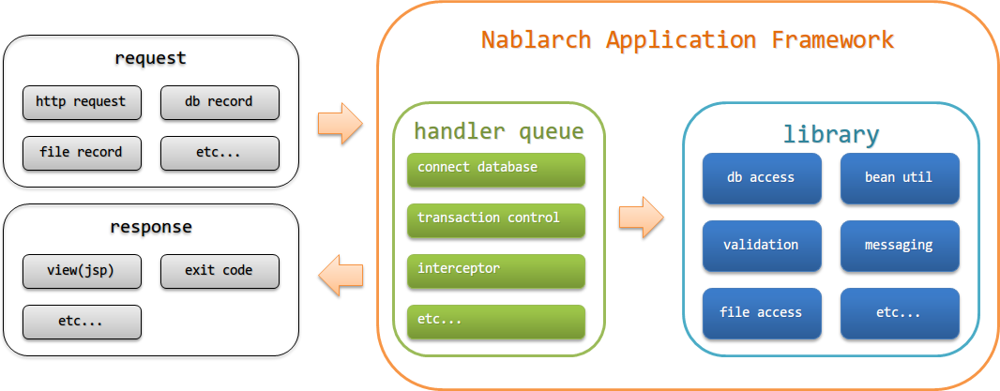

.. _nablarch_architecture:

アーキテクチャ
============================

.. contents:: 目次
  :depth: 3
  :local:

Nablarchアプリケーションフレームワークのアーキテクチャについて解説する。

Nablarchアプリケーションフレームワークの主な構成要素
------------------------------------------------------------
Nablarchアプリケーションフレームワークの主な構成要素を以下に示す。

.. _nablarch_architecture-handler_queue:

ハンドラキュー(handler queue)
------------------------------------------------------------
ハンドラキューとは、リクエストやレスポンスに対する横断的な処理を行うハンドラ群を予め定められた順序に沿って定義したキューを指す。

ハンドラキューは、以下図のようにサーブレットフィルタのチェーン実行と同じように処理を実行する。

.. image:: images/handlers.png
  :scale: 90

.. _nablarch_architecture-handler_responsibility:

ハンドラでは主に以下の様な処理を行う。

 * リクエストのフィルタリング(アクセス権限のあるリクエストのみ受け付ける処理など)
 * リクエスト、レスポンスの変換
 * リソースの取得・解放(データベース接続の取得・開放など)

.. tip::

  リクエストやレスポンスに対する処理や、共通で行うような処理はプロジェクト側でハンドラを実装して対応すること。

  業務ロジックを実装するクラスの親クラスで共通処理を実装するようなケースを多く見かけるが、
  個別のハンドラとして実装することを推奨する。
  (個別のハンドラの前後に処理を追加したい場合には :ref:`nablarch_architecture-interceptor` を使用することを推奨する。)

  個別のハンドラで実装した場合
    個々のハンドラの責務が明確になるため、テストが容易であり保守性が高くなる。
    また、ハンドラ毎処理が独立しているため、共通処理の抜き差しが容易に出来る。

  親クラスに共通処理を実装した場合
    共通処理が増えた場合に親クラスが肥大化し複数の責務を持つことになる。
    これは、メンテナンス時のコストが増大するだけではなく、テストも複雑になり不具合の温床ともなる。
    本来継承すべきクラスを正しく継承をしなかった場合でも、共通処理の内容によっては異常終了とならずに処理が実行出来るため、
    不具合を検知しづらい問題もある。

Nablarchは受け取ったリクエストに対し、ハンドラキュー上に定義されたハンドラを先頭から順に処理を実行する。
リクエストに対するハンドラの処理内でレスポンスが返却された場合、レスポンスに対しこれまでに実行されたハンドラを逆順に実行する。

ハンドラは、前後関係を意識してハンドラキューに設定しないと正常に動作しないものがある。
ハンドラの制約等(前後関係など)は、各ハンドラの章で説明を行うので、ハンドラキューを構築する際には各ハンドラのドキュメントを参照すること。

.. _nablarch_architecture-interceptor:

インターセプター(interceptor)
~~~~~~~~~~~~~~~~~~~~~~~~~~~~~~~~~~~~~~~~~~~~~~~~~~~~~~~~~~~~
インターセプターとは、実行時に動的にハンドラキューに追加されるハンドラのことを指す。

例えば、特定のリクエストの場合のみ処理（ハンドラ）を追加する場合や、
リクエストごとに設定値を切り替えて処理(ハンドラ)を実行したい場合にはハンドラよりもインターセプターが適している。

.. tip::
  インターセプターは、Java EEのCDI(JSR-346)で定義されているインターセプターと同じように処理を実行する。

.. important::
  インターセプターの実行順序は、設定ファイルに設定する必要がある。
  設定がない場合、インターセプターの実行順はJVM依存となるため注意すること。

  Nablarchがデフォルトで提供するインターセプターの実行順は、以下のとおり設定する必要がある。

  #. :java:extdoc:`nablarch.common.web.token.OnDoubleSubmission`
  #. :java:extdoc:`nablarch.fw.web.interceptor.OnErrors`
  #. :java:extdoc:`nablarch.fw.web.interceptor.OnError`
  #. :java:extdoc:`nablarch.common.web.interceptor.InjectForm`

  インターセプターの実行順設定に関する詳細は、\ :java:extdoc:`nablarch.fw.Interceptor.Factory`\ を参照。

ライブラリ(library)
--------------------------------------------------
ライブラリとは、データベースアクセスやファイルアクセス、ログ出力などのようにハンドラから呼び出されるコンポーネント群のことを指す。

Nablarchアプリケーションフレームワークが提供するライブラリは、 :ref:`library` を参照。

