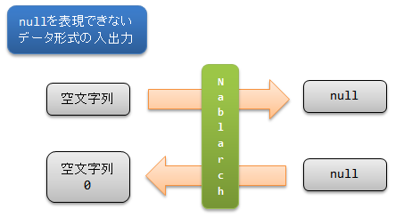

.. _nablarch_policy:

基本方針
============================

Nablarchアプリケーションフレームワークの基本方針について解説する。

.. _nablarch_architecture-no_input:

外部から受け付ける未入力値の扱い
--------------------------------------------------
アプリケーションは外部から様々なデータを受け付けるが、そのデータには未入力値も含まれる。
未入力値は一般的に ``null`` と空文字列の２つの表現方法がある。
この２つの表現方法をアプリケーションが意識して実装しなければならないといろいろな問題が起こる可能性がある。
例えば、未入力値として ``null`` と空文字列の両方がデータベースに保存されていると、
未入力値のデータを取得するときにうまく取得できない、などである。
このような問題を回避するために、アプリケーションで未入力値の扱いを統一する必要がある。

Javaには未入力の状態を表す ``null`` という値が存在するので、Nablarchでも未入力値は ``null`` で統一する。
``null`` を表現できないデータ形式の入出力時の変換を以下の図に示す。
変換はNablarchのハンドラ・ライブラリが行うため、アプリケーションでは未入力値は ``null`` として扱うことだけ意識すればよい。

アプリケーションはこの方針に従い、未入力値を ``null`` に統一して開発すること。
