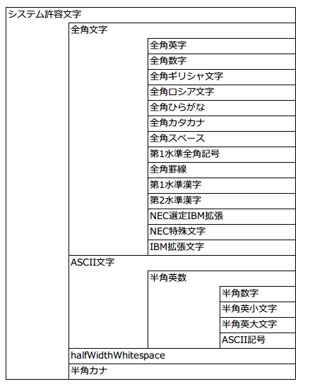

============================================
利用可能文字の追加手順
============================================

概要
====

アーキタイプから生成したプロジェクトで、利用可能文字の精査エラーメッセージの設定方法は以下の3パターンがある。

* メッセージIDを設定するだけで使用できるもの
* メッセージIDを設定しただけでは利用可能にならないコンポーネント定義が必要なもの
* 単独では使用できないもの

利用可能な文字集合定義
======================

文字集合の包含関係
------------------

利用可能な文字集合は、複数の文字集合から構成される(即ち包含関係が存在する)。

以下に文字集合を表す図を示す。

文字集合定義の所在
------------------

以下の文字集合については、それぞれの文字集合が包含する文字が、
デフォルトコンフィギュレーション(jar)内の環境設定ファイルにリテラルで定義されている。

* 全角英字
* 全角数字
* 全角ギリシャ文字
* 全角ロシア文字
* 全角ひらがな
* 全角カタカナ
* 全角スペース 
* 第1水準全角記号
* 全角罫線
* 第1水準漢字
* 第2水準漢字
* NEC選定IBM拡張
* NEC特殊文字
* IBM拡張文字
* 半角数字
* 半角英小文字
* 半角英大文字
* ASCII記号
* 半角カナ
  
.. tip::
   
   デフォルトコンフィギュレーション(jar)内の以下のリソースに定義されている。
   
   .. code-block:: text
       
     nablarch/core/validation/charset-definition.config

ただし、以下の文字集合については、
Unicode上のコードポイントがコンポーネント定義ファイルに定義されている。

* halfWidthWhitespace

.. tip::
   
   デフォルトコンフィギュレーション(jar)内の以下のリソースに定義されている。
   
   .. code-block:: text
       
    nablarch/core/validation/charset-definition.xml

設定方法
======================

以下が利用可能文字ごとの設定方法である。

メッセージIDを設定するだけで使用できる利用可能文字
--------------------------------------------------

* システム許容文字
* 全角文字
* 半角英数
* ASCII文字
* 半角数字
* 全角カタカナ

これらの利用可能文字の精査エラーメッセージはメッセージIDを設定することで使用できる。

指定するメッセージIDに対応するプレースホルダは :download:`デフォルト設定一覧 <デフォルト設定一覧.xlsx>` を参照

メッセージID及びメッセージ内容の変更手順自体については、:doc:`./CustomizeMessageIDAndMessage` を参照

メッセージIDを指定するだけでは使用できない利用可能文字
------------------------------------------------------

* 全角英字
* 全角数字
* 全角ギリシャ文字
* 全角ロシア文字
* 全角ひらがな
* 第1水準全角記号
* 全角罫線
* 第1水準漢字
* 第2水準漢字
* 全角スペース
* 半角英小文字
* 半角英大文字
* ASCII記号
* 半角カナ
* NEC選定IBM拡張
* NEC特殊文字
* IBM拡張文字

これらの利用可能文字の精査エラーメッセージの設定はコンポーネント定義を行うことで使用できる。

.. tip::

  上記の利用可能文字のメッセージIDをデフォルトの設定に組み込んでいない理由は、
  メッセージIDを定義していない場合、Nablarchアプリケーション起動時に警告が出力されてしまうためである。

単独で使用できない利用可能文字
------------------------------

* halfWidthSpace

メッセージIDを指定するだけでは使用できない利用可能文字の設定方法
================================================================

メッセージIDを指定するだけでは使用できない利用可能文字はNablarchの設定ファイル（ウェブプロジェクトであれば `web-component-configuration.xml` など）に
コンポーネント定義を追加する必要がある。

以下が定義例である。この中から使用するものだけを設定すれば良い。

.. code-block:: xml

  <!-- Nablarchコア機能 -->
  <import file="nablarch/core.xml"/>

  <!-- Nablarchのデフォルト設定を上書きするため、nablarch/core.xmlの後に定義すること -->

  <!-- 全角英字 -->
  <component name="全角英字" class="nablarch.core.validation.validator.unicode.LiteralCharsetDef">
    <property name="allowedCharacters" value="${nablarch.zenkakuAlphaCharset.allowedCharacters}"/>
    <property name="messageId" value="${nablarch.zenkakuAlphaCharset.messageId}"/>
  </component>

  <!-- 全角数字 -->
  <component name="全角数字" class="nablarch.core.validation.validator.unicode.LiteralCharsetDef">
    <property name="allowedCharacters" value="${nablarch.zenkakuNumCharset.allowedCharacters}"/>
    <property name="messageId" value="${nablarch.zenkakuNumCharset.messageId}"/>
  </component>

  <!-- 全角ギリシャ文字 -->
  <component name="全角ギリシャ文字" class="nablarch.core.validation.validator.unicode.LiteralCharsetDef">
    <property name="allowedCharacters" value="${nablarch.zenkakuGreekCharset.allowedCharacters}"/>
    <property name="messageId" value="${nablarch.zenkakuGreekCharset.messageId}"/>
  </component>

  <!-- 全角ロシア文字 -->
  <component name="全角ロシア文字" class="nablarch.core.validation.validator.unicode.LiteralCharsetDef">
    <property name="allowedCharacters" value="${nablarch.zenkakuRussianCharset.allowedCharacters}"/>
    <property name="messageId" value="${nablarch.zenkakuRussianCharset.messageId}"/>
  </component>

  <!-- 全角ひらがな -->
  <component name="全角ひらがな" class="nablarch.core.validation.validator.unicode.LiteralCharsetDef">
    <property name="allowedCharacters" value="${nablarch.zenkakuHiraganaCharset.allowedCharacters}"/>
    <property name="messageId" value="${nablarch.zenkakuHiraganaCharset.messageId}"/>
  </component>

  <!-- 全角記号 -->
  <component name="第1水準全角記号" class="nablarch.core.validation.validator.unicode.LiteralCharsetDef">
    <property name="allowedCharacters" value="${nablarch.jisSymbolCharset.allowedCharacters}"/>
    <property name="messageId" value="${nablarch.jisSymbolCharset.messageId}"/>
  </component>

  <!-- 全角罫線 -->
  <component name="全角罫線" class="nablarch.core.validation.validator.unicode.LiteralCharsetDef">
    <property name="allowedCharacters" value="${nablarch.zenkakuKeisenCharset.allowedCharacters}"/>
    <property name="messageId" value="${nablarch.zenkakuKeisenCharset.messageId}"/>
  </component>

  <!-- 第1水準漢字 -->
  <component name="第1水準漢字" class="nablarch.core.validation.validator.unicode.LiteralCharsetDef">
    <property name="allowedCharacters" value="${nablarch.level1KanjiCharset.allowedCharacters}"/>
    <property name="messageId" value="${nablarch.level1KanjiCharset.messageId}"/>
  </component>

  <!-- 第2水準漢字 -->
  <component name="第2水準漢字" class="nablarch.core.validation.validator.unicode.LiteralCharsetDef">
    <property name="allowedCharacters" value="${nablarch.level2KanjiCharset.allowedCharacters}"/>
    <property name="messageId" value="${nablarch.level2KanjiCharset.messageId}"/>
  </component>

  <!-- 全角スペース -->
  <component name="全角スペース" class="nablarch.core.validation.validator.unicode.LiteralCharsetDef">
    <property name="allowedCharacters" value="${nablarch.zenkakuSpaceCharset.allowedCharacters}"/>
    <property name="messageId" value="${nablarch.zenkakuSpaceCharset.messageId}"/>
  </component>

  <!-- 半角英小文字 -->
  <component name="半角英小文字" class="nablarch.core.validation.validator.unicode.LiteralCharsetDef">
    <property name="allowedCharacters" value="${nablarch.lowerAlphabetCharset.allowedCharacters}"/>
    <property name="messageId" value="${nablarch.lowerAlphabetCharset.messageId}"/>
  </component>

  <!-- 半角英大文字 -->
  <component name="半角英大文字" class="nablarch.core.validation.validator.unicode.LiteralCharsetDef">
    <property name="allowedCharacters" value="${nablarch.upperAlphabetCharset.allowedCharacters}"/>
    <property name="messageId" value="${nablarch.upperAlphabetCharset.messageId}"/>
  </component>

  <!-- ASCII記号 -->
  <component name="ASCII記号" class="nablarch.core.validation.validator.unicode.LiteralCharsetDef">
    <property name="allowedCharacters" value="${nablarch.asciiSymbolCharset.allowedCharacters}"/>
    <property name="messageId" value="${nablarch.asciiSymbolCharset.messageId}"/>
  </component>

  <!-- 半角カナ -->
  <component name="半角カナ" class="nablarch.core.validation.validator.unicode.LiteralCharsetDef">
    <property name="allowedCharacters" value="${nablarch.hankakuKanaCharset.allowedCharacters}"/>
    <property name="messageId" value="${nablarch.hankakuKanaCharset.messageId}"/>
  </component>

  <!-- NEC選定IBM拡張 -->
  <component name="NEC選定IBM拡張" class="nablarch.core.validation.validator.unicode.LiteralCharsetDef">
    <property name="allowedCharacters" value="${nablarch.necExtendedCharset.allowedCharacters}"/>
    <property name="messageId" value="${nablarch.necExtendedCharset.messageId}"/>
  </component>

  <!-- NEC特殊文字 -->
  <component name="NEC特殊文字" class="nablarch.core.validation.validator.unicode.LiteralCharsetDef">
    <property name="allowedCharacters" value="${nablarch.necSymbolCharset.allowedCharacters}"/>
    <property name="messageId" value="${nablarch.necSymbolCharset.messageId}"/>
  </component>

  <!-- IBM拡張文字 -->
  <component name="IBM拡張文字" class="nablarch.core.validation.validator.unicode.LiteralCharsetDef">
    <property name="allowedCharacters" value="${nablarch.ibmExtendedCharset.allowedCharacters}"/>
    <property name="messageId" value="${nablarch.ibmExtendedCharset.messageId}"/>
  </component>

メッセージID及びメッセージ内容の変更手順自体については、:doc:`./CustomizeMessageIDAndMessage` を参照
