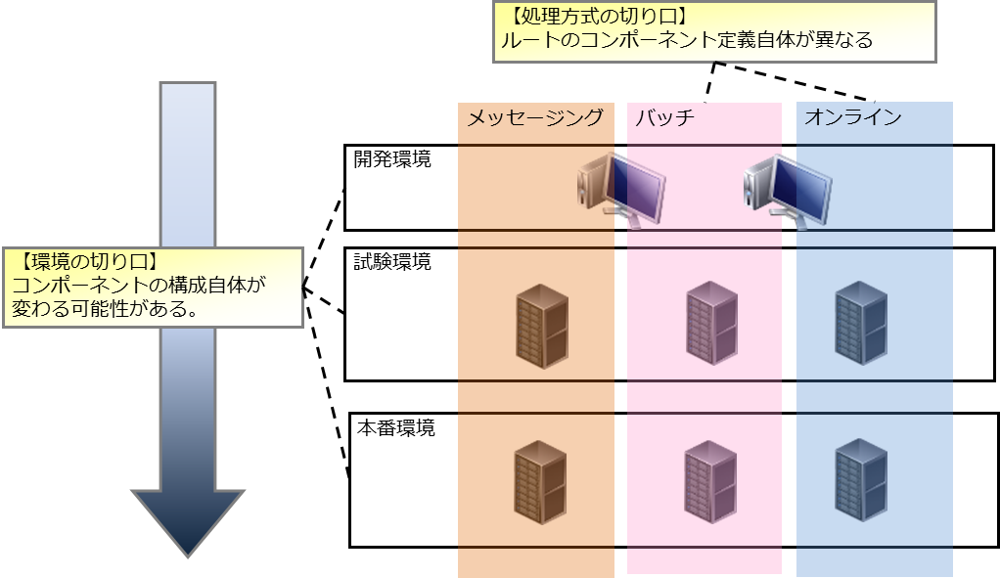

======================================
処理方式、環境に依存する設定の管理方法
======================================

.. contents:: 目次
  :depth: 2
  :local:

概要
====

多くの場合、システムは複数の処理方式によって構成され、
また、システムを開発、運用するにあたり複数の環境（開発環境、本番環境等）を使用する。
そのため、アプリケーション設定もそれぞれの処理方式、環境に合わせて複数管理する必要がある。

本章では、Nablarchにおける処理方式、環境に依存する設定の管理方法を示す。

アプリケーション設定の整理
==========================

アプリケーション設定の整理
----------------------------------------------------

Nablarchでは、アプリケーション設定を２つの観点で整理することを推奨している。

.. list-table::
  :header-rows: 1
  :class: white-space-normal
  :widths: 4,6,16

  * - 観点
    - 具体例
    - 説明

  * - 処理方式
    - オンライン、バッチ
    - 処理方式が異なると、コンポーネント定義およびその環境設定値が異なる。

  * - 環境
    - 開発環境、本番環境
    - コンポーネント定義の一部を変更する必要がある(モック化など)。

以下に、切り口毎に設定の差異を図式化したものを示す。

アプリケーション設定ファイル切り替えの前提と仕組み
====================================================

アプリケーション設定ファイル切り替えの前提
--------------------------------------------

アプリケーション設定ファイルは、処理方式と環境の組み合わせで最小限必要になるものを用意する。

以下に、アーキタイプから生成した直後のプロジェクトのアプリケーション設定ファイルに関連するディレクトリ構造を示す。

.. code-block:: text

    web/batch
    |
    \---src
        +---env
        |   +---dev                … 開発環境
        |   |   |
        |   |   \---env.config     … 開発環境用の環境設定ファイル(config)
        |   |
        |   \---prod               … 本番環境
        |       |
        |       \---env.config     … 本番環境用の環境設定ファイル(config)
        |
        +---main
        |   +---java
        |   |
        |   +---resources          … 環境毎に差異が存在しないリソース
        |       |
        |       \---common.config  … 環境非依存の環境設定ファイル(config)
        |
        \---test
            +---java
            |
            \---resources          … ユニットテスト環境

.. tip::

 * 環境非依存の環境設定ファイル(config)は、全ての環境で使用する。
 * 環境が不足している場合は、後述の :ref:`how_to_add_profile` を参照して環境を追加する。
 * 実行基盤のプロジェクト(ウェブアプリケーション、バッチアプリケーション等)から参照される共通プロジェクトを使用している場合、共通プロジェクト単体の環境毎のアプリケーション設定ファイルは不要である。

アプリケーション設定切り替えの仕組み
------------------------------------

ローカルでのAPサーバ起動時及び、成果物生成時(war,jar生成時)
^^^^^^^^^^^^^^^^^^^^^^^^^^^^^^^^^^^^^^^^^^^^^^^^^^^^^^^^^^^

アプリケーション設定ファイルの切り替えは、
Apache Maven(以下Maven)のプロファイル\ [#profile]_\ 機能により
切り替えを行う。

.. [#profile] プロファイルは、アーキタイプから生成したプロジェクトに初期状態で定義されている。定義されているプロファイルについては、 :ref:`mavenModuleStructuresProfilesList` を参照。

以下に、プロファイルに本番環境を指定してMavenでビルドした際の動作を示す。

**【ビルドのコマンド例】**

.. code-block:: bat
  
  mvn -P prod package -DskipTests=true

.. tip::
 上記コマンドで使用しているオプションは以下の通り。
 
 - -P … プロファイル指定
 - -DskipTests=true  … ユニットテストのスキップを指定

**【Mavenの動作(アプリケーション設定切り替えの部分のみ)】**

.. image:: switch_application_settings.png

.. important::

 src/main/resourcesと、各環境毎のディレクトリでファイル名が重複した場合は、各環境毎のディレクトリのファイルが優先される。

.. tip::

 上図には、「コンポーネント定義ファイル(xml)」と「環境設定値の定義ファイル(configファイル)」しか記載していないが、resources以下のファイルは全てコピーされる。

.. tip::
 どの環境向けに作成したアーティファクトであるかを確認できるよう、
 `META-INF/MANIFEST.MF`\ に対象環境のエントリ（\ ``Target-Environment``\ ）を追記する設定をしている。

 **【本番環境を指定してビルドした場合のMANIFEST.MFの例】**

 .. code-block:: none
  
  Manifest-Version: 1.0
  Built-By: tie301686
  Build-Jdk: 1.7.0_60
  Created-By: Apache Maven 3.2.3
  Target-Environment:本番環境
  Archiver-Version: Plexus Archiver

ユニットテスト実行時
^^^^^^^^^^^^^^^^^^^^^^^^^^^^^^^^^^^^^^^^^^^^^^^^^^^^^^^^^^^

ユニットテスト実行時は、指定したプロファイル及び ``src/test/resources`` のリソースが使用される。

明示的にプロファイルを指定しない場合は、デフォルトでdevプロファイルが使用される。

以下に、devプロファイルを使用してユニットテストを実行するコマンド例を示す。

.. code-block:: bat
  
  mvn test

.. _how_to_change_componet_define:

環境ごとにコンポーネントを切り替える方法(モックに切り替える方法)
================================================================

コンポーネント定義ファイル(xmlファイル)を切り替えることによって実現する。

コンポーネント定義ファイル(xmlファイル)の作成方法
-------------------------------------------------

まず、Nablarchが提供するデフォルト設定値をベースにして、各処理方式毎に本番用コンポーネント定義を作成する。

次に、それらのコンポーネント定義に対して、環境毎にコンポーネント定義を本番からの差分として作成する。

作成したコンポーネント定義ファイルを、環境毎のディレクトリに配置し、ビルド時に差し替える。

環境ごとに環境設定値を切り替える方法
======================================================

環境毎に配置した環境設定ファイル(env.config)を切り替えることによって実現する。

.. tip::

 * アーキタイプから生成した直後は、環境毎に変更する可能性が低い設定項目については、common.configに記載されている。|br|
   common.configに記載されている値を環境毎に変えたい場合は、項目をenv.configに移動(カット＆ペースト)する。

.. _how_to_add_profile:

定義されている環境を増やす方法
====================================================

デフォルトで定義されている環境では足りない場合は、環境の定義を追加する。

追加は以下の方法で行う。

.. _addProfile:

プロファイルの定義
--------------------------------------------------

処理方式毎のプロジェクト(Web、バッチ等)のpom.xmlのprofiles内にプロファイル定義を追加する。

以下では、例として結合試験環境Aを追加している。

.. code-block:: xml

  <profiles>
    <!-- 中略 -->

    <!-- 結合試験環境A -->
    <profile>
      <id>integration-test-a</id>
      <properties>
        <env.name>結合試験環境A</env.name>
        <env.dir>ita</env.dir>
        <env.classifier>ita</env.classifier>
        <webxml.path>src/main/webapp/WEB-INF/web.xml</webxml.path>
      </properties>
    </profile>

    <!-- 中略 -->
  </profiles>

以下に項目について説明する。

.. list-table::
  :header-rows: 1
  :class: white-space-normal
  :widths: 4,18

  * - 項目
    - 説明

  * - id
    - mavenコマンドを実行する際に指定するプロファイルのID。他のプロファイルと重複しないものを指定する。
    
  * - env.name
    - war及びjarファイルのマニフェストに含める環境名。任意の名前をつける。    

  * - env.dir
    - リソースを格納するディレクトリ。

  * - env.classifier
    - war及びjarファイル名部分の末尾につける識別子。半角英数で任意の名前をつける。|br|
      ファイル名の末尾に識別子をつける処理は、pom.xml中で、maven-war-plugin及びmaven-jar-pluginのclassifierプロパティに値を設定することで実現している。

  * - webxml.path
    - 使用するweb.xmlを指定する。|br|
      JNDIの設定はweb.xmlにも記載する必要がある。そのため、環境差異が発生する可能性があり、使用するweb.xmlを設定可能にしている。|br|
      本番と同一で問題なければ、例にあるように「src/main/webapp/WEB-INF/web.xml」を設定する。

ディレクトリの追加
--------------------------------------------------

プロファイルの定義で指定したディレクトリを追加する。

:ref:`addProfile` の例の場合は、「src/env/ita/resources/」を作成する。

アプリケーション設定ファイルの作成及び修正
--------------------------------------------------

類似しているプロファイルのアプリケーション設定ファイルをコピーし、修正する。

.. |br| raw:: html

   