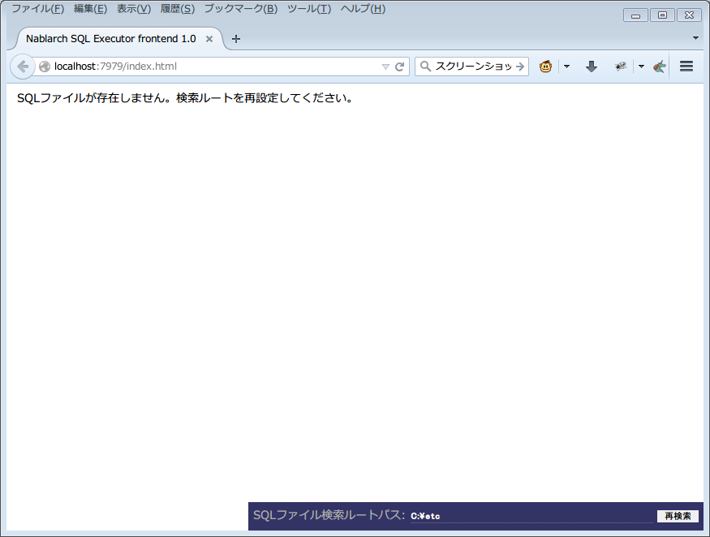
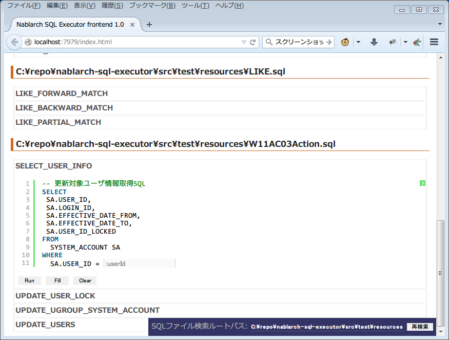
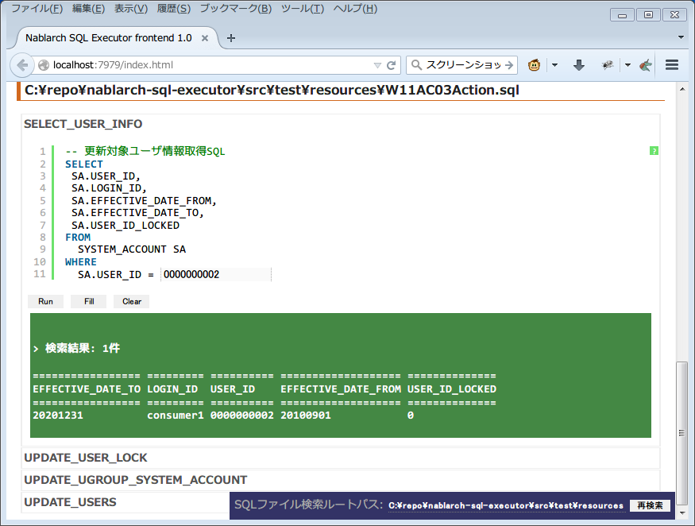
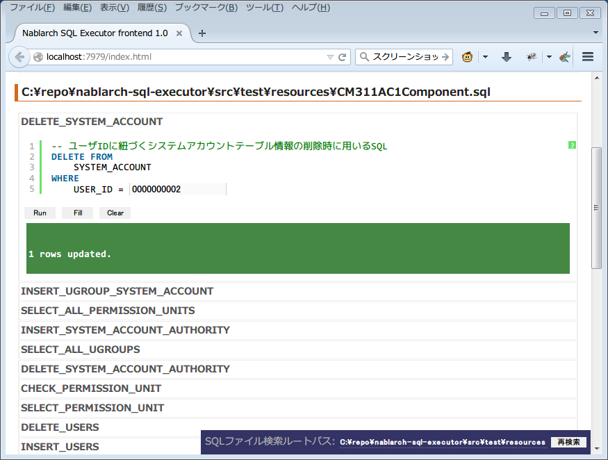

Nablarch SQL Executor
=====================

.. contents:: 目次
  :depth: 2
  :local:

Nablarch SQL ExecutorはNablarch特殊構文を含むSQLファイルを
対話的に実行するツールである。

前提条件
--------

前提条件を以下に示す。

* FirefoxまたはChromeがインストール済みであること。
* Nablarchの開発環境が設定済みであること。
* Maven Central RepositoryにJDBCドライバが存在しないRDBMSを使用する場合は、Project Local RepositoryまたはLocal RepositoryにJDBCドライバを登録済みであること。
  登録方法は、:ref:`customizeDBAddFileMavenRepo` を参照。

インストール方法
----------------

以下のサイトで公開されているリポジトリをcloneする。

https://github.com/nablarch/sql-executor (外部サイト)

DB設定変更
----------

使用するRDBMSに応じて設定変更を行う。

~~~~~~~~~~~~~~
基本設定の変更
~~~~~~~~~~~~~~

src/main/resources/db.configの修正
~~~~~~~~~~~~~~~~~~~~~~~~~~~~~~~~~~

接続URLやユーザ、パスワードを変更する場合、src/main/resources/db.configを修正する。

以下に設定例を示す。

**H2の設定例(デフォルト)**

.. code-block:: text

  db.url=jdbc:h2:./h2/db/SAMPLE
  db.user=SAMPLE
  db.password=SAMPLE

**Oracleの設定例**

.. code-block:: text

  # jdbc:oracle:thin:@ホスト名:ポート番号:データベースのSID
  db.url=jdbc:oracle:thin:@localhost:1521/xe
  db.user=sample
  db.password=sample

**PostgreSQLの設定例**

.. code-block:: text

  # jdbc:postgresql://ホスト名:ポート番号/データベース名
  db.url=jdbc:postgresql://localhost:5432/postgres
  db.user=sample
  db.password=sample

**DB2の設定例**

.. code-block:: text

  # jdbc:db2://ホスト名:ポート番号/データベース名
  db.url=jdbc:db2://localhost:50000/SAMPLE
  db.user=sample
  db.password=sample

**SQL Serverの設定例**

.. code-block:: text

  # jdbc:sqlserver://ホスト名:ポート番号;instanceName=インスタンス名
  db.url=jdbc:sqlserver://localhost:1433;instanceName=SQLEXPRESS
  db.user=SAMPLE
  db.password=SAMPLE

~~~~~~~~~~~~~~~~~~
JDBCドライバの変更
~~~~~~~~~~~~~~~~~~

JDBCドライバを変更する場合、以下のファイルを修正する。

pom.xml
~~~~~~~~~~~~~~~~~~~~~~~~~

pom.xml中の「使用するRDBMSにあわせて、下記JDBCドライバの dependency を更新してください。」とのコメントがある箇所を修正する。

以下、データベース毎の設定例を記述する。

**H2の設定例(デフォルト)**

.. code-block:: xml

    <dependencies>
      <!-- 中略 -->

      <!-- 使用するRDBMSにあわせて、下記JDBCドライバの dependency を更新してください。 -->
      <dependency>
        <groupId>com.h2database</groupId>
        <artifactId>h2</artifactId>
        <version>1.3.176</version>
        <scope>runtime</scope>
      </dependency>
    </dependencies>

**Oracleの設定例**

.. code-block:: xml

    <dependencies>
      <!-- 中略 -->

      <!-- 使用するRDBMSにあわせて、下記JDBCドライバの dependency を更新してください。 -->
      <dependency>
        <groupId>com.oracle</groupId>
        <artifactId>ojdbc6</artifactId>
        <version>11.2.0.2.0</version>
        <scope>runtime</scope>
      </dependency>
    </dependencies>

**PostgreSQLの設定例**

.. code-block:: xml

    <dependencies>
      <!-- 中略 -->

      <!-- 使用するRDBMSにあわせて、下記JDBCドライバの dependency を更新してください。 -->
      <dependency>
        <groupId>org.postgresql</groupId>
        <artifactId>postgresql</artifactId>
        <version>9.4.1207</version>
        <scope>runtime</scope>
      </dependency>
    </dependencies>

**DB2の設定例**

.. code-block:: xml

    <dependencies>
      <!-- 中略 -->

      <!-- 使用するRDBMSにあわせて、下記JDBCドライバの dependency を更新してください。 -->
      <dependency>
        <groupId>com.ibm</groupId>
        <artifactId>db2jcc4</artifactId>
        <version>10.5.0.7</version>
        <scope>runtime</scope>
      </dependency>
    </dependencies>

src/main/resources/db.xml
~~~~~~~~~~~~~~~~~~~~~~~~~
JDBCドライバのクラス名とダイアレクトのクラス名を修正する。
dataSourceコンポーネントのdriverClassNameプロパティに、ドライバのクラス名を設定する。

該当箇所を以下に示す。

.. code-block:: xml

  <!-- データソース設定 -->
  <component name="dataSource" class="org.apache.commons.dbcp.BasicDataSource">
    <!-- JDBCドライバのクラス名設定 -->
    <!-- TODO: データベース接続情報を変更する場合、ここを修正します -->
    <property name="driverClassName"
              value="org.h2.Driver" />
    <!-- 中略 -->
  </component>

  <!-- データベース接続用設定 -->
  <component name="connectionFactory"
      class="nablarch.core.db.connection.BasicDbConnectionFactoryForDataSource">
    <!-- 中略 -->
    <property name="dialect">
      <!-- ダイアレクトのクラス名設定 -->
      <!-- TODO: データベースを変更する場合、ここを修正します。-->
      <component class="nablarch.core.db.dialect.H2Dialect"/>
    </property>
  </component>

設定値の例を以下に示す。

.. list-table::
   :widths: 5 8 10
   :header-rows: 1

   * - データベース
     - JDBCドライバのクラス名
     - ダイアレクトのクラス名
   * - H2
     - org.h2.Driver
     - nablarch.core.db.dialect.H2Dialect
   * - Oracle
     - oracle.jdbc.driver.OracleDriver
     - nablarch.core.db.dialect.OracleDialect
   * - PostgreSQL
     - org.postgresql.Driver
     - nablarch.core.db.dialect.PostgreSQLDialect
   * - DB2
     - com.ibm.db2.jcc.DB2Driver
     - nablarch.core.db.dialect.DB2Dialect
   * - SQL Server
     - com.microsoft.sqlserver.jdbc. |br| SQLServerDriver
     - nablarch.core.db.dialect.SqlServerDialect

起動方法
--------

**Unix系の場合**

以下のコマンドを実行する。

.. code-block:: text

  mvn compile exec:java

その後、ブラウザを起動して、 http://localhost:7979/index.html を表示する。

**Windowsの場合**

ディレクトリ直下にあるバッチファイルを実行する。
ファイルをダブルクリックするか、コマンドプロンプトから起動する。

.. code-block:: bat

  nse-web.bat

コマンドを実行すると、自動的にブラウザが起動する。

.. tip::

  * 初回起動時等、起動に時間がかかる場合、ブラウザがタイムアウトすることがある。
    この場合は、起動完了後にブラウザをリロードする。
  * 本ツールは、Internet Explorerでは、正常に動作しない。Internet Explorerが起動した場合は、URLをコピーし、FirefoxまたはChromeのアドレス欄に貼り付けること。

操作方法
--------

初回起動時では、カレントディレクトリ配下のSQLファイルの一覧を表示するが、
存在しない場合は、以下のような画面が表示される。

   初期画面

右下の入力欄にローカルフォルダのパスを指定し、下図のように **[再検索]**
をクリックすると
その配下の検索してSQLファイルと各ファイルに記述されているステートメントの
一覧を表示する。

.. figure:: ./_images/setting_search_root_path.png
   :alt: 検索パス設定

   検索パス設定

各ステートメント名をクリックすると、その内容と操作用のボタンが表示される。

   SQLステートメント一覧

ステートメント内の埋込み変数は入力フィールドになっており、内容を編集して
**[Run]**
をクリックすることで、当該ステートメントを実行できる。

また **[Fill]**
をクリックすると、前回の実行時の入力フィールドの内容を復元する。

   SQL実行結果(クエリ)

   SQL実行結果(DML)

関連ファイル
------------

実行時に、以下のログファイルが出力される。

* sql.log → SQL文の実行時ログ
* app.log → 全実行ログ

FAQ
---

**Q1** :日付型(DATE/DATETIME/TIMESTAMP)フィールドへの値の設定はどのようにすればよいか？

**A1** :SQL92のDATE/DATETIMEリテラルと同じ書式で記述する。
以下に例を示す。

::

  1970-12-11

::

  1970-12-11 12:01:20

また、キーワード ``SYSDATE`` を指定することで、現在時刻が設定される。

--------------

**Q2** :実行しても何も出力されずに異常終了してしまう場合、どう対処すればよいか？

**A2** :起動時のDBコネクションエラーなどの一部のエラーは
標準エラー出力ではなく、実行ログファイルに出力される。
実行ログは、カレントディレクトリ直下に ``app.log`` という名前で
出力されるので、その内容を確認して対処する。

.. |br| raw:: html

   
