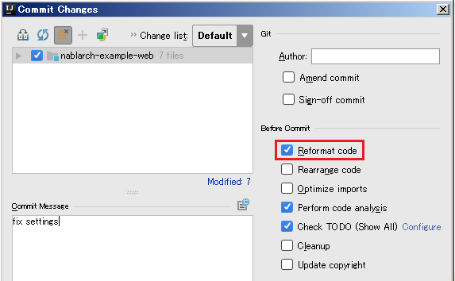

効率的なJava静的チェック
=========================

.. contents:: 目次
  :depth: 2
  :local:

コードの品質と保守性を高めるための観点として次の３つが挙げられる。

* Javaコーディングの慣例に沿っていること
* コードフォーマットが統一されていること
* 許可していないAPIが使用されていないこと

上記に対応するために、NablarchではJetBrains社製のIDEである `IntelliJ IDEA(外部サイト) <https://www.jetbrains.com/idea/>`_ の使用を推奨している。
本ページでは、IntelliJ IDEAを用いた効率的なJava静的チェックの方法を説明する。

構文チェックを行う
------------------

「Javaコーディングの慣例に沿っていること」をチェックするために、IntelliJ IDEAの静的検査機能を使用する。

.. list-table::
  :header-rows: 1
  :class: white-space-normal
  :widths: 1,2

  * - 機能
    - 概要
  * - 静的検査機能
    - Javaコーディングの慣例に沿っているか、潜在的なバグが含まれていないかなどをチェックし、リアルタイムに警告する機能。IntelliJ IDEAではインスペクションと呼ぶ。
    
~~~~~~~~~~~~~~~~~
IDEでチェックする
~~~~~~~~~~~~~~~~~

  IntelliJ IDEAの静的検査機能はデフォルトで設定が有効になっており、コードを書いた際にリアルタイムに実行される。
  手動で実行したい場合は、検査したい対象を右クリックし ``[Analyze]→[Inspect Code]`` を実行する。
  
  .. image:: images/run-inspection.png

  なお、検査項目の設定は ``[File]→[Settings..]→[Editor]→[Inspections]`` から行うことができる。
  警告が出た場合は、 ``Alt + Enter`` キーを押すことで対処候補が表示される。

~~~~~~~~~~~~~~~~
CIでチェックする
~~~~~~~~~~~~~~~~

  IntelliJ IDEAの静的検査機能は、CI(Jenkins)サーバでも実行することができる。
  設定方法は `こちら(外部サイト) <http://siosio.hatenablog.com/entry/2016/12/23/212140>`_ を参照。
  
.. tip::

   静的検査機能はPJで必要に応じてカスタマイズすることができ、カスタマイズした設定は ``PROJECT_ROOT/.idea/inspectionProfiles`` 配下に設定ファイルとして追加される。
   Nablarchでは、Nablarch開発に使用した静的検査機能の設定ファイルを提供しており、
   Nablarchアーキタイプから生成した :ref:`blank_project` に設定ファイルが含まれている。

フォーマットを統一する
----------------------

「コードフォーマットが統一されていること」に対応するために、IntelliJ IDEAのフォーマット機能を使用する。
フォーマット機能はIntelliJ IDEAのデフォルト設定を使用する。

.. list-table::
  :header-rows: 1
  :class: white-space-normal
  :widths: 1,2

  * - 機能
    - 概要
  * - フォーマット機能
    - ソースコードに適切なインデントを施す機能。コミット時に自動でフォーマットをかけるなどの設定も行える。
    
~~~~~~~~~~~~~~~~~~~~~~~~~~~~
手動でフォーマットを統一する
~~~~~~~~~~~~~~~~~~~~~~~~~~~~

``Ctrl + Alt + L`` キーを押すことでフォーマットがかかる。

~~~~~~~~~~~~~~~~~~~~~~~~~~~~~~~~~~~~~~~~
コミット前に自動でフォーマットを統一する
~~~~~~~~~~~~~~~~~~~~~~~~~~~~~~~~~~~~~~~~

``[VCS]→[Commit Changes]`` と進み、 ``Reformat code`` をチェックする。

許可していないAPIが使用されていないかチェックする
-------------------------------------------------

このチェックを行うためには、nablarch-intellij-pluginを使用する。
nablarch-intellij-pluginはNablarch開発を支援するためのIntelliJ IDEA用のプラグインであり、下記の機能を有している。

* Nablarch非公開APIが使用されている場合に警告を出す
* ブラックリストに登録したJava APIが使用されている場合に警告を出す

本プラグインを使用することで、冒頭で述べた「許可していないAPIが使用されていないこと」が保証できる。
プラグインのインストール方法は、 `nablarch-intellij-plugin <https://github.com/nablarch/nablarch-intellij-plugin>`_ を参照。

