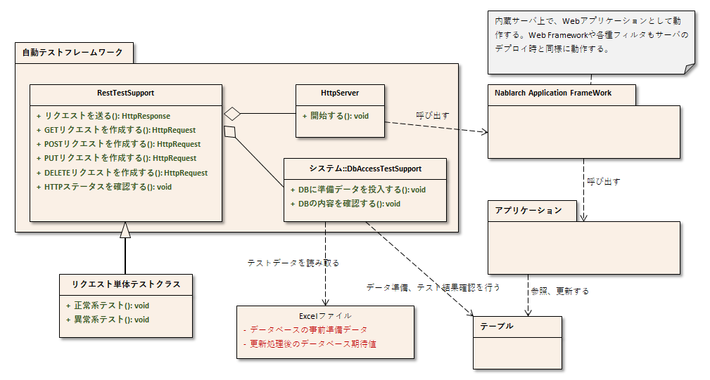

----
概要
----

リクエスト単体テスト(REST)では、 :ref:`リクエスト単体テスト(ウェブアプリケーション) <request-util-test-online>` 同様、内蔵サーバを使用してテストを行う。

全体像
======

 
主なクラス, リソース
====================

+----------------------------------+------------------------------------------------------+--------------------------------------+
|名称                              |役割                                                  | 作成単位                             |
+==================================+======================================================+======================================+
|リクエスト単体テストクラス        |テストロジックを実装する。                            |テスト対象クラス(Action)につき１つ作成|
+----------------------------------+------------------------------------------------------+--------------------------------------+
|テストデータ（Excelファイル）     |テーブルに格納する準備データや期待する結果、\         |必要に応じてテストクラスにつき１つ作成|
|                                  |HTTPパラメータなど、テストデータを記載する。          |                                      |
|                                  |                                                      |                                      |
+----------------------------------+------------------------------------------------------+--------------------------------------+
|テスト対象クラス(Action)          |テスト対象のクラス                                    | 取引につき1クラス作成                |
|                                  |(Action以降の業務ロジックを実装する各クラスを含む)    |                                      |
+----------------------------------+------------------------------------------------------+--------------------------------------+
|DbAccessTestSupport               |準備データ投入などデータベースを使用するテストに\     | \－                                  |
|                                  |必要な機能を提供する。                                |                                      |
|                                  |                                                      |                                      |
+----------------------------------+------------------------------------------------------+--------------------------------------+
|HttpServer                        |内蔵サーバ。サーブレットコンテナとして動作する。      | \－                                  |
+----------------------------------+------------------------------------------------------+--------------------------------------+
|RestTestSupport                   |内蔵サーバの起動やリクエスト単体テストで必要とな\     | \－                                  |
|                                  |るステータスコードのアサートを提供する。              |                                      |
+----------------------------------+------------------------------------------------------+--------------------------------------+

