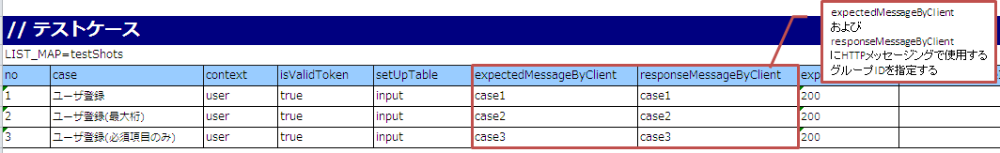
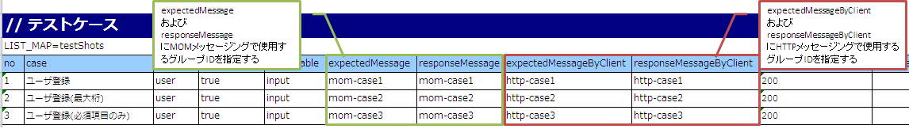

.. _`message_httpSendSyncMessage_test`:

=============================================================================
リクエスト単体テストの実施方法(HTTP同期応答メッセージ送信処理)
=============================================================================

リクエスト単体テスト実施方法は、\ :ref:`message_sendSyncMessage_test`\ を参照すること。

ただし、「送信キュー」「受信キュー」を「通信先」と読み替えること。

本項では、\ :ref:`message_sendSyncMessage_test`\ と異なる箇所の解説を行う。

.. _`http_send_sync_request_write_test_data`:

--------------------
テストデータの書き方
--------------------

以下に、実際にExcelで書かれたテストデータを示す。

.. image:: ./_image/http_send_sync.png
    :scale: 80

-----------

モックアップを使用する場合、testShotsに"expectedMessageByClient"および"responseMessageByClient"にグループIDを設定する。
グループIDの関連については\ :ref:`message_sendSyncMessage_test`\ における"expectedMessage"および"responseMessage"の場合と同様であるため割愛する。

-----------

| 同一アクション内でMOMによる同期応答メッセージ送信処理とHTTP同期応答メッセージ送信処理が同時に行われる場合、
| "expectedMessage"、"responseMessage"にMOMによる同期応答メッセージ送信処理で使用するグループIDを、
| "expectedMessageByClient"、"responseMessageByClient"にHTTP同期応答メッセージ送信処理で使用するグループIDを
| それぞれ個別に指定する。

.. tip::

  グループIDはMOMによる同期応答メッセージ送信処理とHTTP同期応答メッセージ送信処理でそれぞれ別の値を設定する必要がある。
  同一のグループIDを指定した場合、正しく結果検証が行われないため、注意すること。

-----------

テストデータのディレクティブ行に設定されたfile-typeの値により、要求電文のアサート方法が変化する。

設定方法やアサート内容についての詳細は :ref:`real_request_test` のレスポンスメッセージの項を参照すること。

------------------------------------
フレームワークで使用するクラスの設定
------------------------------------

通常、これらの設定はアーキテクトが行うものでありアプリケーションプログラマが設定する必要はない。

モックアップクラスの設定
~~~~~~~~~~~~~~~~~~~~~~~~~~~~~~~~~~~~~~~~

コンポーネント設定ファイルに、リクエスト単体テストで使用するモックアップクラスを設定する。

 .. code-block:: xml
  
      <!-- HTTP通信用クライアント -->
      <component name="defaultMessageSenderClient" 
                 class="nablarch.test.core.messaging.RequestTestingMessagingClient">
      </component>

