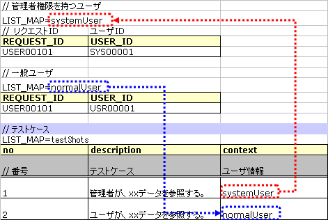

.. _requestUnitTest:

==============================
リクエスト単体テストの実施方法
==============================

--------------------
テストクラスの書き方
--------------------

テストクラスは以下の条件を満たすように作成する。

* テストクラスのパッケージは、テスト対象のActionクラスと同じとする。
* <Actionクラス名>RequestTestというクラス名でテストクラスを作成する。
* nablarch.test.core.http.BasicHttpRequestTestTemplateを継承する。
  (プロジェクト側で拡張したTemplate実装がある場合は、この限りではない)

例えば、テスト対象のActionクラスが、nablarch.sample.management.user.UserSearchActionだとすると、
テストクラスは以下のようになる。

.. code-block:: java

  package nablarch.sample.management.user;
  
  // ～中略～

  public class UserSearchActionRequestTest extends BasicHttpRequestTestTemplate {

.. tip::
 スーパクラスBasicHttpRequestTestTemplateは、リクエスト単体テストに必要な各種メソッドを用意している。\
 DbAccessTestSupportの機能も兼ね備えているので、データベースの設定などもクラス単体テストと\
 同じように実行できる。\

------------------
テストメソッド分割
------------------

以下の手順により、作成するテストメソッドを決定する。

* リクエストID毎（Actionのメソッド毎）に、テストケースを正常系と異常系に分類し、それぞれテストメソッドを作成する。

  * メニューからの単純な画面遷移のように異常系のケースが無い場合は、正常系のテストメソッドのみ作成する。

* 画面表示検証項目については、正常系、異常系のいずれかのメソッドに含められるか検討する。

  * 同一シートにでの条件分岐が煩雑になる場合は画面表示検証用のテストメソッドを別途作成する。
  * そうでない場合は、画面検証用のメソッドは作成せず、正常系または異常系のテストメソッドに含める。

**メソッド分割例 （正常系、異常系、画面表示検証用で分割した場合）**

+------------+---------------------+-----------------------------------------------------------------+
|リクエストID|Actionメソッド名     |テストデータシート名                                             |
|            |                     +---------------------+-----------------------+-------------------+
|            |                     |正常系               |異常系                 |画面表示検証用     |
+============+=====================+=====================+=======================+===================+
|USERS00101  |doUsers00101         |testUsers00101Normal |testUsers00101Abnormal |testUsers00101View |
+------------+---------------------+---------------------+-----------------------+-------------------+

.. tip::
 上記のようにメソッドを分割するのは、テストデータシートが煩雑になり可読性が下がることを避ける為である。\
 上記以外でも、１つのテストデータシートにさまざまなテストケースを詰め込むと可読性が下がる場合は、テストデータシートを分割する。

--------------------
テストデータの書き方
--------------------

テストデータを記載したExcelファイルは、クラス単体テストと同様に\
テストソースコードと同じディレクトリに同じ名前で格納する（拡張子のみ異なる）。

テストデータの記述方法詳細については、\ :ref:`how_to_write_excel`\ を参照。

.. _`request_test_setup_db`:

テストクラスで共通のデータベース初期値
======================================

テストデータを記載したExcelファイルに、\ **setUpDb**\ という名前でシートを用意し、
そこに共通のデータベース初期値を投入する。ここに記載されたデータは、
自動テストフレームワークによりテストメソッド実行時に投入される。

.. image:: ./_image/setupdb.png

.. _`request_test_testcases`:

テストケース一覧
================

LIST_MAPのデータタイプで１テストメソッド分のケース表を記載する。IDは、\ **testShots**\ とする。

.. image:: ./_image/testShots.png
   :scale: 45

１ケース毎に以下の要素を持たせる。

+------------------------+----------------------------------------------------------------------------------------+-----+
|カラム名                | 説明                                                                                   |必須 |
+========================+========================================================================================+=====+
|no                      |テストケース番号を1からの連番で記載する。                                               |     |
|                        |                                                                                        |必須 |
+------------------------+----------------------------------------------------------------------------------------+-----+
|description             |そのテストケースの説明を記載する。                                                      |     |
|                        |ウェブアプリケーションのリクエスト単体テストで出力されるHTMLダンプファイルのファイル名  |     |
|                        |に利用される。 \ [#]_\                                                                  |必須 |
+------------------------+----------------------------------------------------------------------------------------+-----+
|context                 |そのテストケースで、どのリクエストIDにどのようなユーザでリクエストを送るかを記載する。  |必須 |
|                        |詳細は、\ :ref:`request_test_user_info`\ を参照。                                       |     |
+------------------------+----------------------------------------------------------------------------------------+-----+
|cookie                  |そのテストケースで必要となるCookie情報を記載する。                                      |     |
|                        |詳細は、\ :ref:`request_test_cookie_info`\ を参照。                                     |     |
+------------------------+----------------------------------------------------------------------------------------+-----+
|isValidToken            |トークンを設定する場合にはtrueを設定する。トークンの詳細については、                    |     |
|                        |\ :ref:`サーバ側の二重サブミット防止 <tag-double_submission_server_side>`\ を参照。     |     |
|                        |                                                                                        |     |
+------------------------+----------------------------------------------------------------------------------------+-----+
|setUpTable              |各テストケース実行前にデータベースに登録する場合は、同じシート内に記載したデータの\     |     |
|                        |:ref:`グループID<tips_groupId>`\ を記載する。データの投入は自動テストフレームワークに   |     |
|                        |より行われる。                                                                          |     |
+------------------------+----------------------------------------------------------------------------------------+-----+
|expectedStatusCode      |期待するHTTPステータスコードを記載する。 \ [#]_\                                        |必須 |
|                        |                                                                                        |     |
+------------------------+----------------------------------------------------------------------------------------+-----+
|expectedMessageId       |メッセージが出力されること期待する場合は、その\ **メッセージID**\ を記載する。          |     |
|                        |複数のメッセージが出力される場合はカンマ区切りで列挙する。メッセージを                  |     |
|                        |期待しない場合は空欄とする。空欄にしたが、実際にはメッセージが出力され                  |     |
|                        |た場合は、テスト失敗となる。                                                            |     |
+------------------------+----------------------------------------------------------------------------------------+-----+
|expectedSearch          |データベース検索結果がリクエストスコープに設定されることを期待する場合                  |     |
|                        |、\ **期待する検索結果**\ を記載する。検索結果は、同じシート内のLIST_MAPデータ          |     |
|                        |タイプのIDで指定する。リクエストスコープから取得する際のキーは\                         |     |
|                        |**searchResult**\ である。                                                              |     |
+------------------------+----------------------------------------------------------------------------------------+-----+
|expectedTable           |データベースの内容を比較する場合、期待するテーブルの\ :ref:`グループID<tips_groupId>`\  |     |
|                        |を記載する。                                                                            |     |
+------------------------+----------------------------------------------------------------------------------------+-----+
|forwardUri              |期待するフォワード先URIを記載する。Actionクラスで指定したフォワード先JSPへの\           |     |
|                        |URIを記載する。空欄の場合はJSPへのフォワードが行われないものとしてアサートされる。\     |     |
|                        |システムエラー画面や認証エラー画面へ遷移することを想定するテストケースでは、\           |     |
|                        |その画面を描画するJSPへのURIを記載する。例えば、システムエラー画面に遷移する場合は、\   |     |
|                        |\ `/jsp/systemError.jsp`\ が期待するフォワード先URIとなる（デフォルト値の場合）。       |     |
+------------------------+----------------------------------------------------------------------------------------+-----+
|expectedContentLength   |コンテンツレングス・ヘッダの期待値を記載する。                                          |     |
|                        |ファイルダウンロードをテストする場合にこのカラムに指定する。                            |     |
+------------------------+----------------------------------------------------------------------------------------+-----+
|expectedContentType     |コンテンツタイプ・ヘッダの期待値を記載する。                                            |     |
|                        |ファイルダウンロードをテストする場合にこのカラムに指定する。                            |     |
+------------------------+----------------------------------------------------------------------------------------+-----+
|expectedContentFileName |コンテンツディスポジション・ヘッダに指定したファイル名の期待値を記載する。              |     |
|                        |ファイルダウンロードをテストする場合にこのカラムを指定する。                            |     |
+------------------------+----------------------------------------------------------------------------------------+-----+
|expectedMessage         |メッセージ同期送信を行う場合、期待する要求電文の :ref:`グループID<tips_groupId>`\       |     |
|                        |を記載する。メッセージの作成は自動テストフレームワークにより行われる。                  |     |
+------------------------+----------------------------------------------------------------------------------------+-----+
|responseMessage         |メッセージ同期送信を行う場合、返却する応答電文の :ref:`グループID<tips_groupId>`\       |     |
|                        |を記載する。メッセージの作成は自動テストフレームワークにより行われる。                  |     |
+------------------------+----------------------------------------------------------------------------------------+-----+
|expectedMessageByClient |HTTPメッセージ同期送信を行う場合、期待する要求電文の :ref:`グループID<tips_groupId>`\   |     |
|                        |を記載する。メッセージの作成は自動テストフレームワークにより行われる。                  |     |
+------------------------+----------------------------------------------------------------------------------------+-----+
|responseMessageByClient |HTTPメッセージ同期送信を行う場合、返却する応答電文の :ref:`グループID<tips_groupId>`\   |     |
|                        |を記載する。メッセージの作成は自動テストフレームワークにより行われる。                  |     |
+------------------------+----------------------------------------------------------------------------------------+-----+

そのテストケースにて送信するHTTP\ `リクエストパラメータ`_\ ついては、この表ではなく別の表に記載する（\ :ref:`後述<request_test_req_params>`\ ）。

.. [#] 
  descriptionの内容はファイル名に利用するため、OSで規定されたファイル名に利用可能な文字以外の文字の利用や、ファイル名の長さ上限を超過した場合に、
  IOExceptionが発生するため、ファイル名として許可された内容を入力すること。
  例えば、descriptionに改行コードが含まれていた場合、ファイル名として不正であるためテスト実行時にエラーが発生する。

.. [#] 
  ウェブアプリケーションのリクエスト単体テストでは、HTTPステータスコードのアサート時に、通常のブラウザで同じリダイレクトの動きとなるス
  テータスコード 302 および 303 を同一視してアサートする。 つまり予想結果と実行結果が全く同一のHTTPステータスコードであった場合だけで
  なく、予想結果が 303 で実行結果が 302 であった場合と、予想結果が 302 で実行結果が 303 の場合いずれも アサート結果は正常終了となる。
  
  ＜理由＞ RFC の規定では、 HTTP 1.1 を理解するブラウザに対してはリダイレクトに 303 を返すほうがよい作法といえるが、現在主要なWebコ
  ンテナはレガシーなブラウザを考慮して302のレスポンスコードを使用しているため。

.. _`request_test_user_info`:

ユーザ情報
==========

そのテストケースで、どのリクエストIDにどのようなユーザでリクエストを送るかを、\
LIST_MAPのデータタイプで記載する。
複数のユーザ情報を使い分けることで、ユーザの権限によって処理が異なる機能をテストすることができる。

例えば、権限によって参照可能なデータが異なる場合は、以下のようにユーザ情報を使い分ける。

.. _`request_test_cookie_info`:

Cookie情報
==============================

そのテストケースで必要となるCookie情報をLIST_MAPのデータタイプで記載する。
これにより、ケースごとに異なるCookie情報を送信してテストを行うことが可能となる。

Cookie情報は、任意項目のためCookieを必要としないケースの場合には、記載不要である。

例えば、ケースよってCookieの値を変更する必要がある場合には、以下のようにCookie情報を設定する。
Cookieを必要としないケースの場合には、以下例の8ケース目のように値を記載せずに空白としておくこと。

.. image:: ./_image/requestCookie.png

.. _`request_test_req_params`:

リクエストパラメータ
====================

各テストケースで送信するHTTPパラメータを、LIST_MAPのデータタイプで記載する。\

:ref:`http_dump_tool` を使用して、リクエストパラメータのデータ作成を行う。\
初期画面表示のリクエスト（例えばメニュー画面からの遷移）以外は、このツールを用いてリクエストパラメータのデータを作成する。

LIST_MAPのデータタイプでHTTPリクエストパラメータを記載する。IDは、\ **requestParams**\ とする。
このデータと、\ :ref:`request_test_testcases` とは、行単位で関連付けられる。\
例えば、テストケース一覧の先頭のテストケースでは、リクエストパラメータ表の先頭のデータが使用される（以下同様）。

テストケースとのひもづけを分かりやすくするため :ref:`marker_column` としてテストケース番号を記載すること。

.. image:: ./_image/testcase_and_request.png
    :scale: 80

.. tip::

  リクエストパラメータは必ず記載する必要がある。

  例えば初期画面表示のリクエストなど、リクエストパラメータが存在しない場合でも LIST_MAP=requestParams には必ず列を定義する必要がある。

  リクエストパラメータが不要な場合は、下記のようにテストケース番号の列のみを記載する。
  データはテストケース数分定義する。（3ケースであれば3行、10ケースであれば10行用意する）

  ※[no]列は、テストケース番号を視覚的に表すもの( :ref:`marker_column` )なので、リクエストパラメータには含まれない。

    .. image:: ./_image/dummy_request_param.png
        :scale: 100

ひとつのキーに対して複数の値を設定する場合
------------------------------------------

HTTPリクエストパラメータは、ひとつのキーに対して複数の値を設定することができる。
リクエスト単体テストでは、\ **値をカンマ区切りで記述することにより、複数の値を表現**\ できる。

以下の例では、fooというキーに対して、oneとtwoという複数の値を設定している。

  ======== ===========  
  foo      bar  
  ======== ===========
  one,two  three      
  ======== ===========  

値にカンマそのものを含める場合には、\ `\\`\ マークでエスケープを行う。\
値に\\マークそのものを含める場合には、\\マーク自身をエスケープし、\ `\\\\`\ と記述する。

例えば、\ `\\1,000`\ という値を表すには以下のように記述する。

  =========== ===========  
  foo         bar   
  =========== ===========   
  \\\\1\\,000 three     
  =========== ===========  

各種期待値
==========

検索結果、データベースを期待値と比較する場合は、
それぞれのデータとテストケース一覧とをIDで紐付けする。

期待する検索結果
----------------

期待する検索結果を、テストケース一覧とリンクさせる。

.. image:: ./_image/expected_search_result.png

.. _`request_test_expected_tables`:

期待するデータベースの状態
--------------------------

更新系のテストケースでは、期待するデータベースの状態を確認する為、
期待するデータベースの状態をテストケース一覧とリンクさせる。

.. image:: ./_image/expected_table.png
   :scale: 80

.. _`05_02_howToCodingTestMethod`:

----------------------
テストメソッドの書き方
----------------------

スーパクラスについて
====================

BasicHttpRequestTestTemplateクラスを継承する。
このクラスでは、準備したテストデータを元に以下の手順でリクエスト単体テストを実行する。

* データシートからテストケースリスト(testShots LIST_MAP）を取得
* 取得したテストケース分、以下を繰り返し実行

  *  データベース初期化
  *  ExecutionContext、HTTPリクエストを生成
  *  業務テストコード用拡張ポイント呼出(beforeExecuteRequestメソッド）
  *  トークンが必要な場合、トークンを設定
  *  テスト対象のリクエスト実行
  *  実行結果の検証

    * HTTPステータスコード および メッセージID
    * HTTPレスポンス値(リクエストスコープ値)
    * 検索結果
    * テーブル更新結果

  *  業務テストコード用拡張ポイント呼出(afterExecuteRequestメソッド）

以下のメソッドが、スーパクラスで抽象メソッドとして定義されているのでオーバーライドする。

.. code-block:: java

 public class UserSearchActionRequestTest extends BasicHttpRequestTestTemplate {
    
    /**
     * {@inheritDoc}
     * 【説明】 URIの共通部分を返却する。
     */
    @Override
    protected String getBaseUri() {
        return "/action/management/user/UserSearchAction/";
    }

テストメソッド作成
==================

準備したテストシートに対応するメソッドを作成する。

.. code-block:: java
    
    @Test
    public void testMenus00101() {
    }

スーパクラスのメソッド呼び出し
==============================

テストメソッド内で、スーパクラスの以下のいずれかのメソッドを呼び出す。

* void execute(String sheetName)
* void execute(String sheetName, Advice advice)

通常の場合、execute(String sheetName)を使用する。

.. code-block:: java
    
    @Test
    public void testUsers00101Normal() {
        execute("testUsers00101Normal");
    }

固有の処理を追加する場合
------------------------

スーパクラスでは、どんなテストケースでも必要となる処理を定型化しているが、
テストケースによっては固有の処理が必要な場合がある。
(例えば、リクエストスコープにエンティティが格納されており、その内容を確認したい場合等)。

シート固有の準備処理、結果確認処理が必要な場合は、\
execute(String sheetName, Advice advice)を使用して、リクエスト送信前後に処理を挿し込むことができる。
BasicAdviceクラスには以下のメソッドが用意されており、それぞれリクエスト送信前、送信後にコールバックされる。

* void beforeExecute(TestCaseInfo testCaseInfo, ExecutionContext context)
* void afterExecute(TestCaseInfo testCaseInfo, ExecutionContext context)

.. tip::
  これらのメソッド両方をオーバーライドする必要はない。必要なものだけをオーバーライドする。
  また、これらのメソッド内に全ての処理を記述する必要はない。記述が長くなったり、
  テストメソッド間で共通する処理がある場合は、プライベートメソッドに切り出すこと。

.. code-block:: java
    
    @Test
    public void testMenus00102Normal() {
        execute("testMenus00102Normal", new BasicAdvice() {
            // 【説明】本メソッドはリクエスト送信前に呼び出される。
            @Override
            public void beforeExecute(TestCaseInfo testCaseInfo,
                    ExecutionContext context) {
                // 【説明】ここに準備処理を記述する。
            }

            // 【説明】本メソッドはリクエスト送信後に呼び出される。
            @Override
            public void afterExecute(TestCaseInfo testCaseInfo,
                    ExecutionContext context) {
                // 【説明】ここに結果確認処理を記述する。
            }
        });
    }

リクエストスコープに複数種類の検索結果が格納されている場合の例
~~~~~~~~~~~~~~~~~~~~~~~~~~~~~~~~~~~~~~~~~~~~~~~~~~~~~~~~~~~~~~

以下の例では、リクエストスコープに「ユーザグループ」と「ユースケース」の2種類の検索結果が含まれており、
それぞれの検索結果が期待通りであることを検証している。

.. code-block:: java
    
    @Test
    public void testMenus00103() {
        execute("testMenus00103", new BasicAdvice() {
            @Override
            public void afterExecute(TestCaseInfo testCaseInfo,
                    ExecutionContext context) {
                
                String messgae = testCaseInfo.getTestCaseName();   // 【説明】比較失敗時のメッセージ
                String sheetName = testCaseInfo.getSheetName();    // 【説明】シート名
                String no = testCaseInfo.getTestCaseNo();          // 【説明】テストケース番号
                
                // グループ検索結果の検証
                SqlResultSet actualGroup =(SqlResultSet) context.getRequestScopedVar("allGroup");
                assertSqlResultSetEquals(message, sheetName, "expectedUgroup" + no, actualGroup);
                        
                // ユースケース検索結果の検証
                SqlResultSet actualUseCase =(SqlResultSet) context.getRequestScopedVar("allUseCase");
                assertSqlResultSetEquals(message, sheetName, "expectedUseCase" + no, actualUseCase);
            }
        });
    }

リクエストスコープに検索結果(SqlResultSet)ではなくFormやエンティティが格納されている場合の例
~~~~~~~~~~~~~~~~~~~~~~~~~~~~~~~~~~~~~~~~~~~~~~~~~~~~~~~~~~~~~~~~~~~~~~~~~~~~~~~~~~~~~~~~~~~~~~~~

以下の例では、リクエストスコープにエンティティが格納されており、
それぞれの検索結果が期待通りであることを検証している。

.. code-block:: java
        
    @Test
    public void testUsers00302Normal() {
        execute("testUsers00302Normal", new BasicAdvice() {
            @Override
            public void afterExecute(TestCaseInfo testCaseInfo,
                    ExecutionContext context) {
                String sheetName = testCaseInfo.getSheetName();
                // システムアカウントを比較
                // 【説明】期待値のID（接頭辞"systemAccount" + ケース番号）
                String expectedSystemAccountId = "systemAccount" + testCaseInfo.getTestCaseNo();
                // 【説明】実際の値をリクエストスコープから取り出す
                Object actualSystemAccount = context.getRequestScopedVar("systemAccount");
                // 【説明】エンティティを比較するメソッドを呼び出す。
                assertEntity(sheetName, expectedSystemAccountId, actualSystemAccount);

                // ユーザを比較
                String expectedUsersId = "users" + testCaseInfo.getTestCaseNo();
                Object actualUsers = context.getRequestScopedVar("users");
                assertEntity(sheetName, expectedUsersId, actualUsers);
            }
        });
    }

期待値は、エンティティのクラス単体テスト（\ :ref:`entityUnitTest_SetterGetterCase`\ ）と同様の書式で記述する。
ただし、この場合はsetterの欄は不要である。

.. image:: ./_image/assert_entity.png

.. tip::
   リクエストスコープにFormが格納されている場合、別のFormを設定したプロパティでなければEntityの場合と同様にテストが出来る。
   
   別のFormを設定したプロパティの場合、そのFormを取得してEntityと同様にテストをすればよい。以下に例を示す。
   
   
   .. code-block:: java
   
       @Test
       public void testSampleNormal() {
           execute("testSampleNormal", new BasicAdvice() {
               @Override
               public void afterExecute(TestCaseInfo testCaseInfo,
                       ExecutionContext context) {
                   String sheetName = testCaseInfo.getSheetName();
                   // システムアカウントを比較
                   // 【説明】期待値のID（接頭辞"systemAccount" + ケース番号）
                   String expectedSystemAccountId = "systemAccount" + testCaseInfo.getTestCaseNo();
                   // 【説明】Formをリクエストスコープから取り出す
                   Object actualForm = context.getRequestScopedVar("form");
                   // 【説明】Formのプロパティである別のFormを取得
                   Object actualSystemAccount = actualForm.getSystemAccount();
                   // 【説明】エンティティを比較するメソッドを呼び出す。
                   assertEntity(sheetName, expectedSystemAccountId, actualSystemAccount);
               }
           });
       }

リクエストスコープにSqlResultSetではなくSqlRowが格納されている場合の例
~~~~~~~~~~~~~~~~~~~~~~~~~~~~~~~~~~~~~~~~~~~~~~~~~~~~~~~~~~~~~~~~~~~~~~

以下の例では、リクエストスコープに、検索結果一覧(SqlResultSet)ではなく、
検索結果1件分(SqlRow)がリクエストスコープに格納されており、
その検索結果が期待通りであることを検証している。

.. code-block:: java
        
    @Test
    public void testUsers00302Normal() {
        execute("testUsers00302Normal", new BasicAdvice() {
            @Override
            public void afterExecute(TestCaseInfo testCaseInfo, ExecutionContext context) {
                String message = testCaseInfo.getTestCaseName();   // 【説明】比較失敗時のメッセージ
                String sheetName = testCaseInfo.getSheetName();    // 【説明】シート名
                String no = testCaseInfo.getTestCaseNo();          // 【説明】テストケース番号
                
                // グループ検索結果の検証
                SqlRow actual =(SqlRow) context.getRequestScopedVar("user");
                // 【説明】SqlRowを比較するメソッドを呼び出す。
                assertSqlRowEquals(message, sheetName, "expectedUser" + no, actual);
            }
        });
    }

リクエストパラメータの値を検証したい場合
~~~~~~~~~~~~~~~~~~~~~~~~~~~~~~~~~~~~~~~~

:ref:`ウィンドウスコープ<tag-window_scope>` の値をリセットするために、
テスト対象機能にてリクエストパラメータを書き換える場合がある。

以下の例では、テスト対象実行後のリクエストパラメータが期待通りであることを検証している。

.. code-block:: java
        
    @Test
    public void testUsers00302Normal() {
        execute("testUsers00302Normal", new BasicAdvice() {
            @Override
            public void afterExecute(TestCaseInfo testCaseInfo, ExecutionContext context) {

                HttpRequest request = testCaseInfo.getHttpRequest();   // 【説明】テスト実行後のHttpRequest
                // リクエストパラメータがリセットされていること
                assertEquals("", request.getParam("resetparameter"));
            }
        });
    }

その他の場合
~~~~~~~~~~~~

前述のように、SqlResultSetやSqlRow等のよく使用されるオブジェクトについては、
Excelに記載した期待値と直接比較するメソッドが用意されているが、
そうでない場合については、期待値を読み込む処理を記述する必要がある。

具体的には、以下の手順で検証を行う。

* テストデータをExcelファイルから取得
* リクエストスコープ等から実際の値を取得
* 自動テストフレームワークまたはJUnitのAPIを用いて結果検証を行う。

.. code-block:: java
        
    @Test
    public void testUsers00303Normal() {
        execute("testUsers00303Normal", new BasicAdvice() {
            @Override
            public void afterExecute(TestCaseInfo testCaseInfo, ExecutionContext context) {
                // 【説明】期待値をExcelファイルから取得
                List<Map<String, String>> expected = getListMap("doRW25AA0303NormalEnd", "result_1");
                // 【説明】テスト実行後のリクエストスコープから実際の値を取得
                List<Map<String, String>> actual = context.getRequestScopedVar("pageData");
                // 【説明】結果検証
                assertListMapEquals(expected, actual);
            }
        });
    }

\    

.. tip::
 テストデータの取得方法については、以下のリンク先を参照。
  * 「\ :ref:`how_to_get_data_from_excel`\ 」

ダウンロードファイルのテスト
============================

ダウンロードファイルをテストする場合は、\
:ref:`batch_request_test` と同じ方法でファイルの期待値をExcelファイルに記載してテストする。\
以下にCSVファイルをダウンロードする場合のテスト例を示す。

**期待するファイルの定義例**

 ファイルパスにはダンプファイルを指定する。\
 ダウンロード処理の場合は、ダウンロードされたファイルがダンプされ、\
 下記の命名規則でダンプファイルが出力される。\
 ダンプ出力結果が格納されるディレクトリの詳細は、 :ref:`html_dump_dir` を参照すること。

  .. code-block:: bash

   ダンプファイルの命名規則：
     Excelファイルのシート名＋"_"＋テストケース名＋"_"＋ダウンロードされたファイル名

 .. image:: ./_image/expected_download_csv.png
    :scale: 60
   
**テストメソッドの実装例**

 FileSupportクラスのassertFileメソッドを使用してダウンロードファイルのアサートを行う。

 .. code-block:: java

    private FileSupport fileSupport = new FileSupport(getClass());
    
    @Test
    public void testRW11AC0104Download() {
        execute("testRW11AC0104Download", new BasicAdvice() {
            @Override
            public void afterExecute(TestCaseInfo testCaseInfo, ExecutionContext context) {
                String msgOnFail = "ダウンロードしたユーザ一覧照会結果のCSVファイルのアサートに失敗しました。";
                fileSupport.assertFile(msgOnFail, "testRW11AC0104Download");
            }
        });
    }

--------------
テスト起動方法
--------------

クラス単体テストと同様。通常のJUnitテストと同じように実行する。

----------------------
テスト結果確認（目視）
----------------------

１リクエスト毎にHTMLダンプファイルが出力される。ファイルをブラウザで開き、目視確認を行う。

.. tip::
 リクエスト単体テストで生成されたHTMLファイルは自動テストフレームワークにて自動的にチェックされる。\
 自動テストフレームワークは、\ :doc:`../../08_TestTools/03_HtmlCheckTool/index`\ を用いて生成されたHTMLファイルをチェックする。
 HTMLファイル内に構文エラー等の違反があった場合は、その違反内容に応じた例外が発生し、そのテストケースは失敗となる。\

.. _html_dump_dir:

HTMLダンプ出力結果
==================

テストを実行すると、テスト用プロジェクトのルートディレクトリにtmp/html_dumpディレクトリが作成され、
その配下にHTMLダンプファイルが出力される。
HTMLダンプ出力結果が格納されるディレクトリの詳細は、 :ref:`dump-dir-label` の項を参照すること。

 .. image:: ./_image/htmlDumpDir.png

.. tip::
 HTMLダンプファイル名には、\ `テストケース一覧`_\ のテストケース説明（testShotsのdescription欄）
 の記述が使用される。

----------------------------------------
リクエスト単体テストクラス作成時の注意点
----------------------------------------

リクエスト単体テストでは、Web Frameworkのハンドラを経由して呼び出される点がクラス単体テストと異なる。
この違いにより注意すべき点があるので、以下に記載する。

ThreadContextへの値設定は不要
=============================

リクエスト単体テストでは、Web Frameworkのハンドラが作用する為、
ThreadContextへの値設定はハンドラで実施される。
よって、\ **テストクラスからThreadContextへの値を設定する必要はない。**

リクエスト単体テストでのユーザID設定方法については、前述の\ :ref:`request_test_user_info`\ を参照。

テストクラスでのトランザクション制御は不要
==========================================

クラス単体テストでは、Web Frameworkのハンドラが作用しない為、\
テストクラス内で明示的にトランザクションコミットを行っていた。\
リクエスト単体テストでは、トランザクション制御はハンドラで行われるので、\
**テストクラス内で明示的にトランザクションコミットを行う必要はない。**

