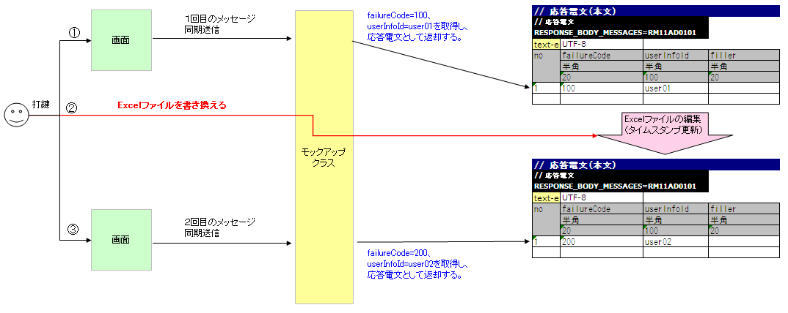

.. _dealUnitTest_send_sync:

=============================================================
同期応答メッセージ送信処理を伴う取引単体テストの実施方法
=============================================================

同期応答メッセージ送信処理を伴うウェブアプリケーションで、取引単体テストを行う場合は、Nablarchが提供するモックアップクラスを使用する。

以下に、ウェブアプリケーションで同期応答メッセージ送信を行う場合の通常の処理フローと、モックアップクラスを使用して取引単体テストを行う場合の処理フローを示す。

* 同期応答メッセージ送信処理を伴うウェブアプリケーションの通常の処理フロー

 .. image:: ./_images/send_sync_online_base.png
    :scale: 70

* モックアップクラスを使用して、同期応答メッセージ送信処理を伴うウェブアプリケーションの取引単体テストを行う場合の処理フロー

 .. image:: ./_images/send_sync_online_mock.png
    :scale: 70

モックアップクラスは以下の機能を提供する。

* 任意の応答電文\ [#f1]_\ を返却する機能

  画面から同期応答メッセージ送信処理が行われる場合に、送信キューおよび受信キューに接続することなく、取引単体テストを実施するために必要な応答電文を返却することができる。
  
* 要求電文\ [#f1]_\ をログに出力する機能

  画面から同期送信された要求電文をログに出力することができる。
  出力されたログを確認することで正常にメッセージ送信が行われたかどうかを確認することができる。
  また、出力されたログをエビデンスとして使用することができる。

* 障害系のテストを行う機能

  同期応答メッセージ送信処理を行う場合に発生するタイムアウトエラーや、メッセージ送受信エラーを発生させることができる。
  この機能を使用することで、障害系の試験を行うことが可能となる。

モックアップクラスを使用すればキューを用意する必要がなくなるので、特別なミドルウェアのインストールや環境設定などの準備を行うことなく、取引単体テストを行うことができる。

-------------------------------------------------------------------------------------
モックアップクラスを使用した取引単体テストの実施方法
-------------------------------------------------------------------------------------

モックアップクラスを使用する場合、応答電文のフォーマットおよびデータをExcelファイルに定義する。
また、要求電文についてはフォーマットのみ定義する。

ExcelファイルはリクエストID\ [#]_\ ごとに用意する。また、ファイルの名前はリクエストIDと一致させる。
たとえば、リクエストIDが「RM21AA0101」ならば、ファイルの名前は「RM21AA0101.xlsx」となる。
ファイルの配置ディレクトリは、設定ファイルに定義する。詳細は\ :ref:`send_sync_test_data_path`\を参照。
 
.. [#] 
 ここで扱うリクエストIDとは、メッセージを送信する相手先システムの機能を一意に識別するために定義するIDのことを指すものであり、
 ウェブアプリケーションやバッチ処理で使用するリクエストIDとは意味が異なる点に注意すること。
 このリクエストIDにもとづき、要求電文および応答電文のフォーマット、送信キュー名、受信キュー名が決定する。

 
~~~~~~~~~~~~~~~~~~~~~~~~~~~~~~~~~~~~~~~~~~~~~~~~~~~~~~~~~~~~~~~~~~~~~~~~~~~~~~~~~~~~~~~~~~~~~~~~~~~~~~~~~~~~~~~~~~~~~~~~
Excelファイルの書き方
~~~~~~~~~~~~~~~~~~~~~~~~~~~~~~~~~~~~~~~~~~~~~~~~~~~~~~~~~~~~~~~~~~~~~~~~~~~~~~~~~~~~~~~~~~~~~~~~~~~~~~~~~~~~~~~~~~~~~~~~

取引単体テストを行う場合は、定められた記述ルールに従いExcelファイルを記載する。

以下にExcelファイルを記述する場合に従うべきルールを示す。

* シート名は「message」固定。
* 返却する応答電文のFW制御ヘッダ・本文のフォーマットを定義する。
* 返却する応答電文のFW制御ヘッダ・本文のデータを定義する。
* 要求電文のFW制御ヘッダ・本文のフォーマットを定義する。

Excelファイルに定義した応答電文のフォーマットおよびデータは、モックアップクラスが返却する応答電文を生成するために使用される。
また要求電文のフォーマットは、モックアップクラスが要求電文のログを出力するために使用される。

書き方の例
~~~~~~~~~~~~~~~~~~~~~~~~

以下に、Excelファイルの記載例を示す。

.. image:: ./_images/send_sync_test_data.png
    :scale: 70

.. _send_sync_test_data_format:

電文のフォーマットおよびデータの記載方法
~~~~~~~~~~~~~~~~~~~~~~~~~~~~~~~~~~~~~~~~~~~~~~~~~~~~~~~~

電文のフォーマットおよびデータは以下の書式で記載する。

+---------------------+--------------------------+------------------+--------------+
|識別子               |                                                            |
+---------------------+--------------------------+------------------+--------------+
|ディレクティブ行     | ディレクティブの設定値   |                                 |
+---------------------+--------------------------+------------------+--------------+
|    ...  [#]_\       |    ...                   |                  |              |
+---------------------+--------------------------+------------------+--------------+
|no                   |フィールド名称(1)         |フィールド名称(2) |...  [#]_\    |
|                     +--------------------------+------------------+--------------+
|                     |データ型(1)               |データ型(2)       |...           |
|                     +--------------------------+------------------+--------------+
|                     |フィールド長(1)           |フィールド長(2)   |...           |
|                     +--------------------------+------------------+--------------+
|                     |データ(1-1)               |データ(2-1)       |...           |
|                     +--------------------------+------------------+--------------+
|                     |データ(1-2)               |データ(2-2)       |...           |
|                     +--------------------------+------------------+--------------+
|                     |... \ [#]_\               |...               |...           |
+---------------------+--------------------------+------------------+--------------+

.. [#] 
 これより下側は、同様にディレクティブの数だけ続いていく。
 
.. [#] 
 これより右側は、同様にフィールドの数だけ続いていく。

.. [#]
 これより下側は、同様にデータの数だけ続いていく。

\

================= =================================================================================================================================================
名称               説明
================= =================================================================================================================================================
識別子            電文の種類を示すIDを指定する。本項目が、テストケース一覧のexpectedMessageおよびresponseMessageに記載されたグループIDと紐付けられる。
                  
                  識別子の書式を以下に示す。
                  
                  * 要求電文のヘッダ … EXPECTED_REQUEST_HEADER_MESSAGES=リクエストID
                  * 要求電文の本文 … EXPECTED_REQUEST_BODY_MESSAGES=リクエストID
                  * 応答電文のヘッダ … RESPONSE_HEADER_MESSAGES=リクエストID
                  * 応答電文の本文 … RESPONSE_BODY_MESSAGES=リクエストID
ディレクティブ行  ディレクティブを記載する。ディレクティブ名のセルの右のセルに設定値を記載する（複数行指定可）。
no                ディレクティブ行の下の行には必ず「no」を記載する。
フィールド名称    フィールド名称を記載する。フィールドの数だけ記載する。
データ型          そのフィールドのデータ型を記載する。フィールドの数だけ記載する。
フィールド長      そのフィールドのフィールド長を記載する。「-」を記載した場合は、「データ」の欄の記載内容を元にサイズを自動計算する。
                  
                  フィールドの数だけ記載する。
データ            データは、応答電文の場合のみ記載する。そのフィールドに格納されるデータを記載する。複数件応答電文を返却する場合は次の行に続けてデータを記載する。
================= =================================================================================================================================================

.. tip::
 フィールド名称、データ型、フィールド長の記述は、外部インタフェース設計書からコピー＆ペーストすることで効率良く作成できる。\
 （ペーストする際、「\ **行列を入れ替える**\ 」オプションにチェックすること）

Excelファイルの再読み込み
~~~~~~~~~~~~~~~~~~~~~~~~~~~~~~~~~~~~~~~~~~~~~~~~~~~~~~~~~~~~~~~~~~~~~~~

モックアップクラスは、Excelファイルを手動で編集してテストをやり直すケースや、同じデータで繰り返しテストを行うケースを想定し、
Excelファイルのタイムスタンプが更新された場合に、ファイルを再読み込みする機能を提供している。

通常、以下の応答電文を返却するたびにnoのインクリメントが行われ、アプリケーションサーバが起動している間は、noの値が初期化されることはない。

以下のような応答電文データを定義した場合、１回目のメッセージ同期送信ではno.1の応答電文が返却され、
noのインクリメントが行われる。そして２回目のメッセージ同期送信ではno.2の応答電文が返却される。

しかし、Excelファイルの編集や上書きを行い、タイムスタンプを更新することで、アプリケーションサーバ起動中にExcelファイルの再読み込みを行うことができる。

以下に、Excelファイルを編集し、テストをやり直す場合の例を示す。

.. _`send_sync_response_count_change.png`:

障害系のテスト
~~~~~~~~~~~~~~~~~~~~~~~~~~~~~~~~~~~~~~~~~~~~~~~~~~~~~~~~~~~~~~

応答電文の本文の表の最初のフィールドに「errorMode:」から始まる特定の値を設定することで、障害系のテストを行うことができる。

以下に、設定値と、障害系のテストの対応を示す。

 +-----------------------------------+-------------------------------------------------------------+------------------------------------------------+
 | 最初のフィールドに設定する値      | 障害内容                                                    |  自動テストフレームワークの動作                |
 +===================================+=============================================================+================================================+
 |  errorMode:timeout                | メッセージ送信中にタイムアウトエラーが発生する場合のテスト  |  sendSyncメソッドの戻り値としてnullを返却する。|
 +-----------------------------------+-------------------------------------------------------------+------------------------------------------------+
 |  errorMode:msgException           | メッセージ送受信エラーが発生する場合のテスト                |  MessagingExceptionをスローする。              |
 +-----------------------------------+-------------------------------------------------------------+------------------------------------------------+
 
 
記載例を以下に示す。

 .. image:: ./_images/send_sync_test_data_error.png

.. _send_sync_test_data_path:

~~~~~~~~~~~~~~~~~~~~~~~~~~~~~~~~~~~~~~~~~~~~~~~~~~~~~~~~~~~~~~
Excelファイルの配置場所の設定
~~~~~~~~~~~~~~~~~~~~~~~~~~~~~~~~~~~~~~~~~~~~~~~~~~~~~~~~~~~~~~

Excelファイルの配置場所のパスは、下記設定例のようにfilepath.configに設定している。

Excelファイルは、このパスで指定されたディレクトリに配置する。もし配置場所を変更する場合はこのパスを修正すること。

 .. code-block:: bash
  
  # Excelファイルのパス
  file.path.send.sync.test.data=file:///C:/nablarch/workspace/Nablarch_sample/test/message

以下に、Excelファイルの配置イメージを示す。

 .. image:: ./_images/send_sync_test_data_structure.png

.. tip::

 配置ディレクトリのパスは、クラスパス（classpath:）ではなく、ファイルシステムのパス（file:）で指定することを推奨する。
 ファイルシステムのパスを指定することで、サーバ起動中に直接Excelファイルの内容を編集し、テストすることが可能となる。

~~~~~~~~~~~~~~~~~~~~~~~~~~~~~~~~~~~~~~~~~~~~~~~~~~~~~~~~~~~~~~
要求電文のログ出力
~~~~~~~~~~~~~~~~~~~~~~~~~~~~~~~~~~~~~~~~~~~~~~~~~~~~~~~~~~~~~~

要求電文のログはMap形式とCSV形式で出力される。

Map形式のログはデバッグ用に、CSV形式のログはエビデンスとして取得する場合に使用することを想定している。

サンプルでは、Map形式のログは標準出力とアプリケーションログファイルに、CSV形式のログは専用のログファイルに出力する仕様となっているが、ログの設定を修正することで出力先の切り替えが可能である。
    
ログの出力例を以下に示す。

* Map形式の場合

 .. code-block:: bash
  
  2011-10-26 13:16:10.958 MESSAGING_SEND_MAP request id=[RM11AD0101]. following message has been sent: 
    message fw header = {requestId=RM11AD0101, testCount=, resendFlag=0, reserved=}
    message body      = {authors=test3, title=test1, publisher=test2}

* CSV形式の場合

 .. code-block:: bash
  
  2011-10-26 13:16:10.958 MESSAGING_SEND_CSV request id=[RM11AD0102]. following message has been sent: 
  header: 
  "requestId","testCount","resendFlag","reserved"
  "RM11AD0102","","0",""
  body: 
  "authors","title","publisher"
  "test3","test1","test2"

ログの出力設定は、log.propertiesにて行う。設定例を以下に示す。

 .. code-block:: bash
  
  # CSV形式のメッセージログのライタ（./messaging-evidence.logに出力する）
  writer.MESSAGING_CSV.className=nablarch.core.log.basic.FileLogWriter
  writer.MESSAGING_CSV.filePath=./messaging-evidence.log
  writer.MESSAGING_CSV.formatter.className=nablarch.core.log.basic.BasicLogFormatter
  writer.MESSAGING_CSV.formatter.format=$message$

  # CSV形式のメッセージログのロガー
  loggers.MESSAGING_CSV.nameRegex=MESSAGING_CSV
  loggers.MESSAGING_CSV.level=DEBUG
  loggers.MESSAGING_CSV.writerNames=MESSAGING_CSV

  # Map形式のメッセージログのロガー
  loggers.MESSAGING_MAP.nameRegex=MESSAGING_MAP
  loggers.MESSAGING_MAP.level=DEBUG
  loggers.MESSAGING_MAP.writerNames=stdout,appFile

~~~~~~~~~~~~~~~~~~~~~~~~~~~~~~~~~~~~~~~~~~~~~~~~~~~~~~~~~~~~~~
フレームワークで使用するクラスの設定
~~~~~~~~~~~~~~~~~~~~~~~~~~~~~~~~~~~~~~~~~~~~~~~~~~~~~~~~~~~~~~

通常、これらの設定はアーキテクトが行うものでありアプリケーションプログラマが設定する必要はない。

モックアップクラスの設定
~~~~~~~~~~~~~~~~~~~~~~~~~~~~~~~~~~~~~~~~

コンポーネント設定ファイルに、取引単体テストで使用するモックアップクラスを設定する。

 .. code-block:: xml
  
      <!-- モックのメッセージングプロバイダ -->
      <component name="messagingProvider"
                 class="nablarch.test.core.messaging.MockMessagingProvider">
      </component>

Excelファイルの配置場所を記載するプロパティファイルのパスの設定
~~~~~~~~~~~~~~~~~~~~~~~~~~~~~~~~~~~~~~~~~~~~~~~~~~~~~~~~~~~~~~~~~~~~~~~~~~~~~~

コンポーネント設定ファイルで、Excelファイルの配置場所のパスが記載されるプロパティファイルのパスや、プロパティのキーを設定する。

 .. code-block:: xml

    <!-- Excelファイルの配置場所のパスを記載するプロパティファイルのパスを指定する -->
    <config-file file="web/filepath.config" />
  
    <component name="filePathSetting"
             class="nablarch.core.util.FilePathSetting" autowireType="None">
       <property name="basePathSettings">
         <map>
           <!- Excelファイルの配置場所のパスを記載するプロパティのキー名を指定する -->
           <entry key="sendSyncTestData" value="${file.path.send.sync.test.data}" />
           <entry key="format" value="classpath:web/format" /> 
         </map>
       </property>
       <property name="fileExtensions">
         <map>
           <!- Excelファイルの拡張子（xlsx）を定義する-->
           <entry key="sendSyncTestData" value="xlsx" />
           <entry key="format" value="fmt" />
         </map>
       </property>
    </property>

取引単体テストで使用するライブラリの設定
~~~~~~~~~~~~~~~~~~~~~~~~~~~~~~~~~~~~~~~~

取引単体テストでは、以下のjarファイルをアプリケーションサーバのクラスパスに通す必要がある。

 * nablarch-tfw.jar
 * Apache POIのjar

Nablarchが標準で提供するサンプルアプリケーションは、デフォルトでこれらのjarのクラスパス設定が行われた状態になっている。
具体的には、サンプルアプリケーションのtest/libディレクトリにこれらのjarを配置し、下図のとおりEclipseの機能を使用し、クラスパス設定を行っている。

.. image:: ./_images/send_sync_jar_path.png

これらのjarは単体テスト以外では使用しないので、上記の例のようにWEB-INF/libではなく、別の場所に配置することを推奨する。

-----------

.. [#f1] 
 キューへ送信するメッセージのことを「要求電文」、キューから受信するメッセージのことを「応答電文」と称す。
 
