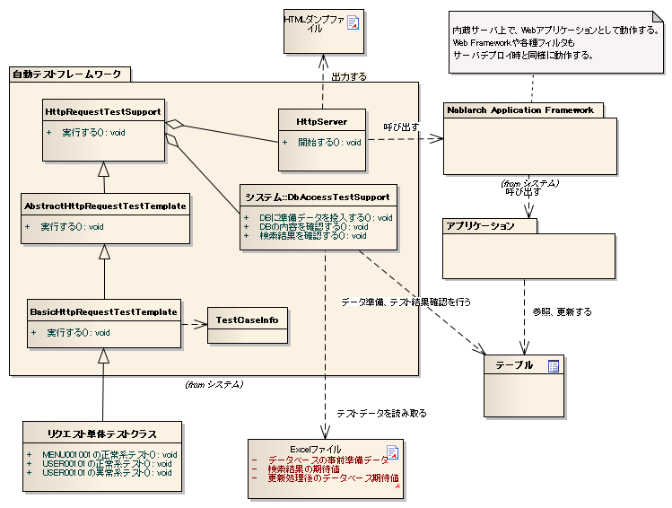
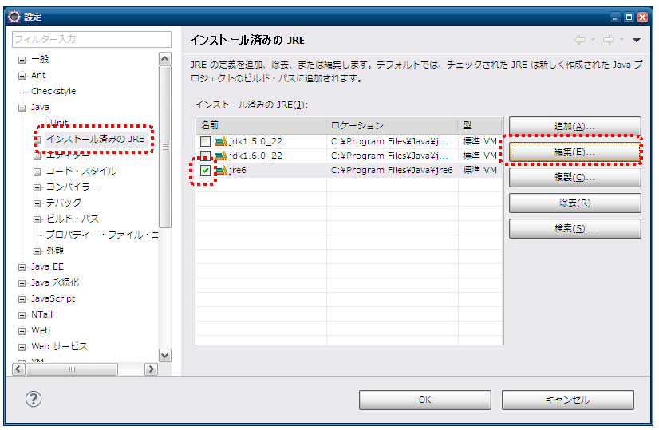

.. _request-util-test-online:

============================================================
リクエスト単体テスト（ウェブアプリケーション）
============================================================

----
概要
----

リクエスト単体テスト(ウェブアプリケーション)では、内蔵サーバを使用してテストを行う。\
ここでは、リクエスト単体テストのテスト補助クラスと内蔵サーバの使用方法を記載する。

全体像
======

 
主なクラス, リソース
====================

+----------------------------------+------------------------------------------------------+--------------------------------------+
|名称                              |役割                                                  | 作成単位                             |
+==================================+======================================================+======================================+
|テストクラス                      |テストロジックを実装する。                            |テスト対象クラス(Action)につき１つ作成|
+----------------------------------+------------------------------------------------------+--------------------------------------+
|テストデータ（Excelファイル）     |テーブルに格納する準備データや期待する結果、\         |テストクラスにつき１つ作成            |
|                                  |HTTPパラメータなど、テストデータを記載する。          |                                      |
|                                  |                                                      |                                      |
+----------------------------------+------------------------------------------------------+--------------------------------------+
|テスト対象クラス(Action)          |テスト対象のクラス                                    | 取引につき1クラス作成                |
|                                  |(Action以降の業務ロジックを実装する各クラスを含む)    |                                      |
+----------------------------------+------------------------------------------------------+--------------------------------------+
|DbAccessTestSupport               |準備データ投入などデータベースを使用するテストに\     | \－                                  |
|                                  |必要な機能を提供する。                                |                                      |
|                                  |                                                      |                                      |
+----------------------------------+------------------------------------------------------+--------------------------------------+
|HttpServer                        |内蔵サーバ。サーブレットコンテナとして動作し、\       | \－                                  |
|                                  |HTTPレスポンスをファイル出力する機能を持つ。          |                                      |
+----------------------------------+------------------------------------------------------+--------------------------------------+
|HttpRequestTestSupport            |内蔵サーバの起動やリクエスト単体テストで必要とな\     | \－                                  |
|                                  |る各種アサートを提供する。                            |                                      |
+----------------------------------+------------------------------------------------------+--------------------------------------+
|AbstractHttpReqestTestSupport |br||リクエスト単体テストをテンプレート化するクラス。リ    | \－                                  |
|BasicHttpReqestTestSupport        |クエスト単体テストのテストソース、テストデータを定    |                                      |
|                                  |型化する                                              |                                      |
+----------------------------------+------------------------------------------------------+--------------------------------------+
|TestCaseInfo                      |データシートに定義されたテストケース情報を格納する    |                                      |
|                                  |クラス。                                              |                                      |
+----------------------------------+------------------------------------------------------+--------------------------------------+

上記のクラス群は、内蔵サーバも含め全て同一のJVM上で動作する。\
このため、リクエストやセッション等のサーバ側のオブジェクトを加工できる。\

前提事項
========

内蔵サーバを利用してHTMLダンプを出力するというリクエスト単体テストは、\
１リクエスト１画面遷移のシンクライアント型ウェブアプリケーションを対象としている。\
Ajaxやリッチクライアントを利用したアプリケーションの場合、\
HTMLダンプによるレイアウト確認は使用できない。

.. tip::

 本書ではViewテクノロジにJSPを用いているが、\
 サーブレットコンテナ上で画面全体をレンダリングする方式であれば、\
 JSP以外のViewテクノロジでもHTMLダンプの出力が可能である。

----
構造
----

BasicHttpRequestTestTemplate
=========================================

各テストクラスのスーパクラス。\
本クラスを使用することで、リクエスト単体テストのテストソース、テストデータを定型化でき、\
テストソース記述量を大きく削減できる。

具体的な使用方法は、\ :doc:`../05_UnitTestGuide/02_RequestUnitTest/index`\ を参照。

AbstractHttpRequestTestTemplate
======================================

アプリケーションプログラマが直接使用することはない。\
テストデータの書き方を変えたい場合など、自動テストフレームワークを拡張する際に用いる。\

TestCaseInfo
============

データシートに定義されたテストケース情報を格納するクラス。\
テストデータの書き方を変えたい場合は、本クラス及び前述のAbstractHttpRequestTestTemplateを継承する。

HttpRequestTestSupport
======================

リクエスト単体テスト用に用意されたスーパクラス。リクエスト単体テスト用のメソッドを用意している。

データベース関連機能
--------------------

データベースに関する機能は、DbAccessTestSupportクラスに委譲することで実現している。
詳細は、\ :doc:`02_DbAccessTest`\ を参照。

ただし、DbAccessTestSupportのうち以下のメソッドは、\
リクエスト単体テストでは不要であり、アプリケーションプログラマに誤解を与えないよう、\
意図的に委譲を行っていない。

* public void beginTransactions()
* public void commitTransactions()
* public void endTransactions()
* public void setThreadContextValues(String sheetName, String id)

事前準備補助機能
----------------

内蔵サーバへのリクエスト送信には、HttpRequestとExecutionContextのインスタンスが必要となる。\
HttpRequestTestSupportクラスでは、これらのオブジェクトを簡単に作成できるようメソッドを用意している。\

HttpRequest
~~~~~~~~~~~

.. code-block:: java

  HttpRequest createHttpRequest(String requestUri, Map<String, String[]> params)

引数には、以下の値を引き渡す。

* テスト対象となるリクエストURI
* 上記で取得したリクエストパラメータ

本メソッドでは、受け取ったたリクエストURIとリクエストパラメータを元に\
HttpRequestインスタンスを生成し、HTTPメソッドをPOSTに設定した上で返却する。\
HttpRequestにリクエストパラメータやURI以外のデータを設定したい場合は、\
本メソッド呼び出しにより取得したインスタンスに対してデータの設定を行うとよい。

ExecutionContext
~~~~~~~~~~~~~~~~

ExecutionContextインスタンスを生成する。

.. code-block:: java

  ExecutionContext createExecutionContext(String userId)

引数にはユーザIDを指定する。指定したユーザIDはセッションに格納される。\
これにより、そのユーザIDでログインしている状態となる。\

.. _how_to_set_token_in_request_unit_test:

トークン発行
~~~~~~~~~~~~

2重サブミット防止を施しているURIに対するテストを行うには、\
テスト実行前にトークンを発行しセッションに設定しておく必要がある。\
HttpRequestTestSupportにある下記のメソッドを呼び出すことで、\
トークンの発行およびセッションへの格納が行われる。

.. code-block:: java

 void setValidToken(HttpRequest request, ExecutionContext context)

リクエスト単体実行時に、テストデータ上でトークンを設定するか否かを制御したい場合は、
以下のメソッドを使用する。

.. code-block:: java

 void setToken(HttpRequest request, ExecutionContext context, boolean valid)

第3引数がbooleanになっており、真の場合は前述のsetValidTokenと同じ動作となる。
偽の場合は、セッションからトークン情報が除去される。以下のように使用することで、
テストクラスにトークンを設定するかどうかの分岐処理を書かなくてすむ。

 
.. code-block:: java

     // 【説明】テストデータから取得したものとする。
     String isTokenValid; 

     // 【説明】"true"の場合はトークンが設定される。
     setToken(req, ctx, Boolean.parseBoolean(isTokenValid)));

実行
====

HttpRequestTestSupportにある下記のメソッドを呼び出すことで、\
内蔵サーバが起動されリクエストが送信される。

.. code-block:: java

 HttpResponse execute(String caseName, HttpRequest req, ExecutionContext ctx) 

引数には以下の値を引き渡す。

* テストケース説明
* HttpRequest
* ExectionContext

テストケース説明は、HTMLダンプ出力時のファイル名に使用される。
詳細は
:ref:`dump-dir-label`
を参照。

システムリポジトリの初期化
--------------------------

executeメソッド内部では、システムリポジトリの再初期化を行っている。\
これにより、クラス単体テストとリクエスト単体テストで設定を分けずに連続実行できる。

* 現在のシステムリポジトリの状態をバックアップ
* テスト対象のウェブアプリケーションのコンポーネント設定ファイルを用いてシステムリポジトリを再初期化
* executeメソッド終了時に、バックアップしたシステムリポジトリを復元する。

テスト対象のウェブアプリケーションに関する設定については、\
:ref:`howToConfigureRequestUnitTestEnv`\
を参照。

結果確認
========

メッセージ
----------

HttpRequestTestSupportにある下記のメソッドを呼び出すことで、\
アプリケーション例外に格納されたメッセージが想定通りであることを確認する。

.. code-block:: java

   
  void assertApplicationMessageId(String expectedCommaSeparated, ExecutionContext actual);

引数には、以下の値を引き渡す。

* 期待するメッセージ（複数ある場合はカンマ区切りで指定する。）
* 先に作成したExectionContext

例外が発生しなかった場合や、アプリケーション例外以外の例外が発生した場合は、\
アサート失敗となる。

.. tip::
 メッセージIDの比較はIDをソートした状態で行うので、テストデータを記載する際に
 順序を気にする必要はない。

HTMLダンプ出力
==============

.. _dump-dir-label:

HTMLダンプ出力ディレクトリ
--------------------------

テストを実行すると、テスト用プロジェクトのルートディレクトリにtmp/html_dumpディレクトリが作成される。
その配下にテストクラス毎に同名のディレクトリが作成され、
そのテストクラスで実行されたテストケース説明と同名のHTMLダンプファイルが出力される。

また、HTMLダンプファイルが参照するHTMLリソース（スタイルシートや画像などのリソース）についても
このディレクトリに出力されるので、このディレクトリを保存することで、どの環境でもHTMLを同じように参照できる。

* html_dumpディレクトリが既に存在する場合は、html_dump_bkという名前でバックアップされる。

.. image:: ./_images/htmlDumpDir.png

.. _howToConfigureRequestUnitTestEnv:

----------
各種設定値
----------

環境設定に依存する設定値については、コンポーネント設定ファイルで変更できる。\
設定可能な項目を以下に示す。

コンポーネント設定ファイル設定項目一覧
===============================================

+----------------------------+-------------------------------------------------------------------------+-------------------------------------------------------+
| 設定項目名                 | 説明                                                                    | デフォルト値                                          |
+============================+=========================================================================+=======================================================+
| htmlDumpDir                | HTMLダンプファイルを出力するディレクトリを指定する。                    | ./tmp/http_dump                                       |
+----------------------------+-------------------------------------------------------------------------+-------------------------------------------------------+
| webBaseDir                 | ウェブアプリケーションのルートディレクトリ\ [#]_\                       | ../main/web                                           |
+----------------------------+-------------------------------------------------------------------------+-------------------------------------------------------+
| xmlComponentFile           | リクエスト単体テスト実行時に使用するコンポーネント設定ファイル\ [#]_\   | （なし）                                              |
+----------------------------+-------------------------------------------------------------------------+-------------------------------------------------------+
| userIdSessionKey           | ログイン中ユーザIDを格納するセッションキー                              | user.id                                               |
+----------------------------+-------------------------------------------------------------------------+-------------------------------------------------------+
| exceptionRequestVarKey     | ApplicationExceptionが格納されるリクエストスコープのキー                | nablarch_application_error                            |
+----------------------------+-------------------------------------------------------------------------+-------------------------------------------------------+
| dumpFileExtension          | ダンプファイルの拡張子                                                  | html                                                  |
+----------------------------+-------------------------------------------------------------------------+-------------------------------------------------------+
| httpHeader                 | HttpRequestにHTTPリクエストヘッダとして格納される値                     |Content-Type : application/x-www-form-urlencoded       |
|                            |                                                                         |                                                       |
|                            |                                                                         |Accept-Language : ja JP                                |
|                            |                                                                         |                                                       |
+----------------------------+-------------------------------------------------------------------------+-------------------------------------------------------+
| sessionInfo                | セッションに格納される値                                                |（なし）                                               |
+----------------------------+-------------------------------------------------------------------------+-------------------------------------------------------+
| htmlResourcesExtensionList | ダンプディレクトリへコピーされるHTMLリソースの拡張子                    | css、jpg、js                                          |
+----------------------------+-------------------------------------------------------------------------+-------------------------------------------------------+
| jsTestResourceDir          | javascriptの自動テスト実行時に使用するリソースのコピー先ディレクトリ名  | ../test/web                                           |
+----------------------------+-------------------------------------------------------------------------+-------------------------------------------------------+
| backup                     | ダンプディレクトリのバックアップOn/Off                                  | true                                                  |
+----------------------------+-------------------------------------------------------------------------+-------------------------------------------------------+
| htmlResourcesCharset       | CSSファイル(スタイルシート)の文字コード                                 | UTF-8                                                 |
+----------------------------+-------------------------------------------------------------------------+-------------------------------------------------------+
| checkHtml                  | HTMLチェックの実施On/Off                                                | true                                                  |
+----------------------------+-------------------------------------------------------------------------+-------------------------------------------------------+
| htmlChecker                | HTMLチェックを行うオブジェクトを指定する。|br|                          | nablarch.test.tool.htmlcheck.Html4HtmlChecker         |
|                            | オブジェクトは nablarch.test.tool.htmlcheck.HtmlChecker                 | クラスのインスタンス。 |br|                           |
|                            | インタフェースを実装している必要がある。|br|                            | クラスには htmlCheckerConfig で設定した設定           |
|                            | 詳細は :ref:`customize_html_check` を参照。                             | ファイルが適用される。                                |
|                            |                                                                         |                                                       |
+----------------------------+-------------------------------------------------------------------------+-------------------------------------------------------+
| htmlCheckerConfig          | HTMLチェックツールの設定ファイルパス。|br|                              | test/resources/httprequesttest/html-check-config.csv  |
|                            | htmlChecker を設定しなかった場合のみ有効。                              |                                                       |
+----------------------------+-------------------------------------------------------------------------+-------------------------------------------------------+
| ignoreHtmlResourceDirectory| HTMLリソースの中でコピー対象外とするディレクトリ名のLIST                | （なし）                                              |
|                            |                                                                         |                                                       |
|                            | .. tip::                                                                |                                                       |
|                            |  バージョン管理用のディレクトリ(.svnや.git)を対象外と設定すると         |                                                       |
|                            |  HTMLリソースコピー時のパフォーマンスが向上する。                       |                                                       |
+----------------------------+-------------------------------------------------------------------------+-------------------------------------------------------+
| tempDirectory              | JSPのコンパイル先ディレクトリ                                           | jettyのデフォルト動作に依存                           |
|                            |                                                                         |                                                       |
|                            |                                                                         | .. tip ::                                             |
|                            |                                                                         |  jettyのデフォルト動作では、.「/work」                |
|                            |                                                                         |  がコンパイル先ディレクトリとなる。                   |
|                            |                                                                         |  「./work」が存在しない場合は、                       |
|                            |                                                                         |  Tempフォルダ(Windownの場合は、ユーザのホーム         |
|                            |                                                                         |  ディレクトリ/Local Settings/Temp)が                  |
|                            |                                                                         |  出力先となる。                                       |
+----------------------------+-------------------------------------------------------------------------+-------------------------------------------------------+
| uploadTmpDirectory         | アップロードファイルを一時的に格納するディレクトリ。                    | ./tmp                                                 |
|                            |                                                                         |                                                       |
|                            | テスト時に準備した、アップロード対象のファイルは本ディレクトリに        |                                                       |
|                            | コピー後に処理される。                                                  |                                                       |
|                            | これにより、アクションでファイルの移動を行った場合でも、                |                                                       |
|                            | 本ディレクトリ配下のファイルが移動されるだけであり、                    |                                                       |
|                            | 実態が移動されることを防ぐことができる。                                |                                                       |
|                            |                                                                         |                                                       |
+----------------------------+-------------------------------------------------------------------------+-------------------------------------------------------+
|dumpVariableItem            | HTMLダンプファイル出力時に可変項目を出力するか否かを設定する。          |false                                                  |
|                            | ここでの可変項目とは以下の2種類を指す。                                 |                                                       |
|                            |                                                                         |                                                       |
|                            | * JSESSIONID                                                            |                                                       |
|                            | * 2重サブミット防止用のトークン                                         |                                                       |
|                            |                                                                         |                                                       |
|                            | これらの項目は、テスト実行毎に異なる値が設定される。                    |                                                       |
|                            |                                                                         |                                                       |
|                            | HTMLダンプ結果を毎回同じ結果にしたい場合は、本項目をOFF                 |                                                       |
|                            | (false)に設定する。（前回実行結果と差異がないことを確認したい場合等）   |                                                       |
|                            |                                                                         |                                                       |
|                            |                                                                         |                                                       |
|                            | 可変項目をそのままHTMLに出力する場合は、本項目をON                      |                                                       |
|                            | (true)に設定する。                                                      |                                                       |
+----------------------------+-------------------------------------------------------------------------+-------------------------------------------------------+
 

.. [#] 
  PJ共通のwebモジュールが存在する場合、このプロパティにカンマ区切りでディレクトリを設定する。
  複数指定された場合、先頭から順にリソースが読み込まれる。
  
  以下に例を示す。

  .. code-block:: xml

    <component name="httpTestConfiguration" class="nablarch.test.core.http.HttpTestConfiguration">
      <property name="webBaseDir" value="/path/to/web-a/,/path/to/web-common"/>

  この場合、web-a、web-commonの順にリソースが探索される。

.. [#]
  この項目を設定した場合は、リクエスト送信直前に指定されたコンポーネント設定ファイルで初期化が行われる。\
  通常は設定する必要はない。\
  クラス単体テストとリクエスト単体テストとで設定を変える必要がある場合のみ、この項目を設定する。\

       

コンポーネント設定ファイルの記述例
===============================================

コンポーネント設定ファイル記述例を記載する。
設定値には、上記のデフォルト値に加え、セッション(sessionInfo)に以下の値を設定している。

+----------------------------+------------------------------+--------------------------------------------------------------------+
| キー                       | 値                           | 説明                                                               |
+============================+==============================+====================================================================+
| commonHeaderLoginUserName  | "リクエスト単体テストユーザ" | 共通ヘッダ領域に表示するログインユーザ名                           |
+----------------------------+------------------------------+--------------------------------------------------------------------+
| commonHeaderLoginDate      | "20100914"                   | 共通ヘッダ領域に表示するログイン日時                               |
+----------------------------+------------------------------+--------------------------------------------------------------------+

.. code-block:: xml

    <component name="httpTestConfiguration" class="nablarch.test.core.http.HttpTestConfiguration">
        <property name="htmlDumpDir" value="./tmp/http_dump"/>
        <property name="webBaseDir" value="../main/web"/>
        <property name="xmlComponentFile" value="http-request-test.xml"/>
        <property name="userIdSessionKey" value="user.id"/>
        <property name="httpHeader">
            <map>
                <entry key="Content-Type" value="application/x-www-form-urlencoded"/>
                <entry key="Accept-Language" value="ja JP"/>
            </map>
        </property>
        <property name="sessionInfo">
            <map>
                <entry key="commonHeaderLoginUserName" value="リクエスト単体テストユーザ"/>
                <entry key="commonHeaderLoginDate" value="20100914" />
            </map>
        </property>
        <property name="htmlResourcesExtensionList">
            <list>
                <value>css</value>
                <value>jpg</value>
                <value>js</value>
            </list>
        </property>
        <property name="backup" value="true" />
        <property name="htmlResourcesCharset" value="UTF-8" />    
        <property name="ignoreHtmlResourceDirectory">
            <list>
                <value>.svn</value>
            </list>
        </property>
        <property name="tempDirectory" value="webTemp" />
        <property name="htmlCheckerConfig"
          value="test/resources/httprequesttest/html-check-config.csv" />
    </component>

.. _`optional_settings`:  

その他の設定
============

性能が高くないPCで開発をしており、リクエスト単体テスト実行速度を向上させたい場合は、\
以下の設定をすることで実行速度の改善が見込まれる。

.. tip::
  Pentium4、Pentinum Dual-Core等の処理性能が低いCPUを搭載したPCに効果がある。\
  逆に、これら以降のCPUを搭載したマシンでは、それほど効果的ではないので無理に設定する必要はない。

JVMオプションの指定
-------------------

最大ヒープサイズと最小ヒープサイズを同一の値にすることで、\
ヒープサイズ拡張のオーバヘッドを回避できる。

 :strong:`-Xms256m -Xmx256m`

また、クラスファイルの検証を省略することで実行速度が向上する。

 :strong:`-Xverfiy:none`

Eclipseでの設定方法は以下のとおり。

* メニューバーより「実行」→「実行構成」を選択する。

* 「実行構成」ウィンドウが表示されるので、「引数」タブをクリックし、「VM引数」欄に前述のオプションを指定する。

.. image:: ./_images/vmoptions.png

また、実行構成を変更しなくても、以下の方法でデフォルトのVM引数を設定できる。

* メニューバーより「ウィンドウ」→「設定」を選択する。 「設定」ウィンドウが表示されるので、「インストール済みのJRE」をする。

* インストール済みのJREの一覧が表示されるので、使用するJREを選択し「編集」ボタンを押下する。

* 「VM引数」欄に前述のオプションを指定する。

.. image:: ./_images/edit_jre.png

代替JREの指定
-------------

JavaSE5のJDKで開発を行っている場合、テスト実行時のみJavaSE6のJREを使用することにより、
実行速度、特に起動速度が向上する。

Eclipseでの設定方法は以下のとおり。

* メニューバーより「実行」→「実行構成」を選択する。

* 「実行構成」ウィンドウが表示されるので、「JRE」タブをクリックし「代替JRE」にJavaSE6のJREを選択する。

.. image:: ./_images/alternate_jre.png

.. tip::
  この設定を行う場合は、事前にJavaSE6のJDKまたはJREをインストールし、Eclipseに「インストール済みのJRE」として登録しておく必要がある。

HTMLリソースコピーの抑止
------------------------

リクエスト単体実行時に、以下のシステムプロパティを指定すると、 :ref:`HTMLダンプ出力<dump-dir-label>` 時に、HTMLリソースコピーを抑止することができる。

 :strong:`-Dnablarch.test.skip-resource-copy=true`

CSSや画像ファイルなど静的なHTMLリソースを頻繁に編集しない場合は、
テスト実行の度にHTMLリソースをコピーする必要はないので、
このシステムプロパティを設定してもよい。

.. important::
   本システムプロパティを指定した場合、HTMLリソースのコピーが行われなくなるので、
   CSSなどのHTMLリソースを編集しても\ :ref:`HTMLダンプ出力<dump-dir-label>`\ に反映されない。

.. tip::
   HTMLリソースディレクトリが存在しない場合は、システムプロパティの設定有無に関わらず、\
   HTMLリソースのコピーが実行される。

Eclipseでの設定方法は以下のとおり。

* メニューバーより「実行」→「実行構成」を選択する。

* 「実行構成」ウィンドウが表示されるので、「引数」タブをクリックし、「VM引数」欄に前述のオプションを指定する。

.. image:: ./_images/skip_resource_copy.png

.. |br| raw:: html

   
