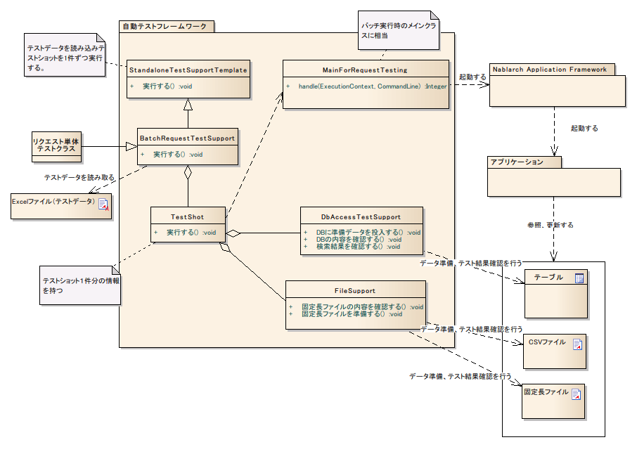

.. _request-util-test-batch:

========================================
 リクエスト単体テスト（バッチ処理）
========================================

概要
====

リクエスト単体テスト（バッチ処理)では、実際にバッチをコマンドラインから起動したときの動作を擬似的に再現し、テストを行う。

全体像
------

主なクラス, リソース
====================

+----------------------+------------------------------------------------------+--------------------------------------+
|名称                  |役割                                                  | 作成単位                             |
+======================+======================================================+======================================+
|リクエスト単体\       |テストロジックを実装する。                            |テスト対象クラス(Action)につき１つ作成|
|テストクラス          |                                                      |                                      |
+----------------------+------------------------------------------------------+--------------------------------------+
|Excelファイル\        |テーブルに格納する準備データや期待する結果、\         |テストクラスにつき１つ作成            |
|（テストデータ）      |入力ファイルなど、テストデータを記載する。            |                                      |
+----------------------+------------------------------------------------------+--------------------------------------+
|StandaloneTest\       |バッチやメッセージング処理などコンテナ外で動作する\   | \－                                  |
|SupportTemplate       |処理のテスト実行環境を提供する。                      |                                      |
+----------------------+------------------------------------------------------+--------------------------------------+
|BatchRequest\         |バッチリクエスト単体テストで必要とな\                 | \－                                  |
|TestSupport           |るテスト準備機能、各種アサートを提供する。            |                                      |
+----------------------+------------------------------------------------------+--------------------------------------+
|TestShot              |データシートに定義されたテストケース1件分の情報を\    | \－　　                              |
|                      |格納するクラス。                                      |                                      |
+----------------------+------------------------------------------------------+--------------------------------------+
|MainForRequestTesting |テスト用メインクラス。テスト実行時の差分を吸収する。  | \－                                  |
+----------------------+------------------------------------------------------+--------------------------------------+
|DbAccessTestSupport   |DB準備データ投入などデータベースを使用するテストに\   | \－                                  |
|                      |必要な機能を提供する。                                |                                      |
+----------------------+------------------------------------------------------+--------------------------------------+
|FileSupport           |入力ファイル作成などファイルを使用するテストに\       | \－                                  |
|                      |必要な機能を提供する。                                |                                      |
+----------------------+------------------------------------------------------+--------------------------------------+

構造
====

StandaloneTestSupportTemplate
-----------------------------
バッチやメッセージング処理などコンテナ外で動作する処理のテスト実行環境を提供する。
テストデータを読み取り、全テストショット(\ `TestShot`_ \ )を実行する。

TestShot
--------

1テストショットの情報保持とテストショット実行を行う。\
テストショットは以下の要素で成り立っている。

* 入力データの準備
* メインクラス起動
* 出力結果の確認

バッチやメッセージング処理などコンテナ外で動作する処理のテストにおいて
共通の準備処理、結果確認機能を提供する。

 +----------------------------+--------------------------+
 | 準備処理                   | 結果確認                 |
 +============================+==========================+
 | データベースのセットアップ | データベース更新内容確認 |
 |                            +--------------------------+
 |                            | ログ出力結果確認         |
 |                            +--------------------------+
 |                            | ステータスコード確認     |
 +----------------------------+--------------------------+

入力データ準備や結果確認ロジックはバッチや各種メッセージング処理ごとに異なるので\
方式に応じたカスタマイズが可能となっている。

BatchRequestTestSupport
-----------------------

バッチ処理テスト用のスーパクラス。\
アプリケーションプログラマは本クラスを継承してテストクラスを作成する。

本クラスは、\ `TestShot`_ \が提供する準備処理、結果確認に以下の機能を追加する。

 +----------------------------+--------------------------+
 | 準備処理                   | 結果確認                 |
 +============================+==========================+
 |入力ファイルの作成          |出力ファイルの内容確認    |
 +----------------------------+--------------------------+

本クラスを使用することで、リクエスト単体テストのテストソース、テストデータを定型化でき、\
テストソース記述量を大きく削減できる。

具体的な使用方法は、\ :doc:`../05_UnitTestGuide/02_RequestUnitTest/batch`\ を参照。

MainForRequestTesting
---------------------

リクエスト単体テスト用のメインクラス。\
本番用メインクラスとの主な差異は以下の通り。

* テスト用のコンポーネント設定ファイルからシステムリポジトリを初期化する。
* 常駐化機能を無効化する。

FileSupport
-----------

ファイルに関する操作を提供するクラス。
主に以下の機能を提供する。

* テストデータから入力ファイルを作成する
* テストデータの期待値と実際に出力されたファイルと内容を比較する。

ファイルに関する操作は、バッチ処理以外でも必要となるため（例えば、ファイルダウンロード等）、\
独立したクラスとして提供している。

テストデータ
============

バッチ処理固有のテストデータについて説明する。

 .. _`about_fixed_length_file`:

固定長ファイル
--------------

基本的な記述方法は、\
:ref:`batch_request_test`\
を参照。

パディング
~~~~~~~~~~

指定したフィールド長に対して、データのバイト長が短い場合、
そのフィールドのデータ型に応じたパディングが行われる。
パディングのアルゴリズムはNablarch Application Framework本体と同様である。

バイナリデータの記述方法
~~~~~~~~~~~~~~~~~~~~~~~~

バイナリデータを表現するには、16進数形式でテストデータを記述する。
例えば、\ ``0x4AD``\ と記述した場合、\ ``0000 0100 1010 1101``\  (\ ``0x04AD``\ )という2バイトのバイト配列に解釈される。

.. tip::
 テストデータに、プレフィックス0xが付与されていない場合、そのデータを文字列とみなし、
 その文字列をディレクティブの文字コードでエンコードしてバイト配列に変換する。
 
 例えば、文字コードがWindows-31Jのファイルのテストデータにて、\
 データ型がバイナリのフィールドに\ ``4AD``\ と記載した場合、\ ``0011 0100 0100 0001 0100 0100``\  (\ ``0x344144``\ )\
 という3バイトのバイト配列に変換される。
  

可変長ファイル
--------------

基本的な記述方法は、\
:ref:`batch_request_test`\
を参照。

各種設定値
==========

常駐バッチのテスト用ハンドラ構成
-----------------------------------------------------
常駐バッチのテストを実施する際には、プロダクション用ハンドラ構成をテスト用に変更する必要がある。
この変更を行わずにテストを実施した場合、テスト対象の常駐バッチアプリケーションの処理が終わらないため、テストが正常に実施できなくなる。

**【変更が必要なハンドラ】**

========================= ========================= ==================================================================
変更対象のハンドラ        変更後のハンドラ          変更理由
========================= ========================= ==================================================================
RequestThreadLoopHandler  OneShotLoopHandler        RequestThreadLoopHandlerでテストを実施すると、
                                                    バッチ実行が終わらずにテストコードに制御が戻らなくなるため。

                                                    OneShotLoopHandlerにハンドラを差し替えることで、
                                                    テスト実行前にセットアップした要求データを全件処理後に
                                                    バッチ実行が終了しテストコードに制御が戻るようになる。
========================= ========================= ==================================================================

以下にコンポーネント定義ファイルの設定例を示す。

* プロダクション用設定

  .. code-block:: xml

    <!-- リクエストスレッドループ -->
    <component name="requestThreadLoopHandler" class="nablarch.fw.handler.RequestThreadLoopHandler">
      <!-- プロパティへの値設定は省略 -->
    </component>

* テスト用設定

  プロダクション用設定と同名でコンポーネントを設定し、テスト用のハンドラを使用するように上書きする。

  .. code-block:: xml

    <!-- リクエストスレッドループハンドラをテスト用のハンドラに置き換える設定 -->
    <component name="requestThreadLoopHandler" class="nablarch.test.OneShotLoopHandler" />

ディレクティブのデフォルト値
----------------------------

ファイルのディレクティブがシステム内である程度統一されている場合、
個々のテストデータに同じディレクティブを記載することは冗長である。

このような場合には、デフォルトのディレクティブを
コンポーネント設定ファイルに記載することで、
個々のテストデータではディレクティブの記述を省略できる。

コンポーネント設定ファイルにmap形式で記載する。ネーミングルールは以下のとおり。

======================= ==============================
 対象となるファイル種別  name属性
======================= ==============================
 共通                    defaultDirectives            
 固定長ファイル          fixedLengthDirectives    
 可変長ファイル          variableLengthDirectives 
======================= ==============================

設定例を以下に例を示す。

.. code-block:: xml

  <!-- ディレクティブ（共通） -->
  <map name="defaultDirectives">
    <entry key="text-encoding" value="Windows-31J" />
  </map>

  <!-- ディレクティブ（固定長） -->
  <map name="variableLengthDirectives">
    <entry key="record-separator" value="NONE"/>
  </map>

  <!-- ディレクティブ（可変長） -->
  <map name="variableLengthDirectives">
    <entry key="quoting-delimiter" value="" />
    <entry key="record-separator" value="CRLF"/>
  </map>
