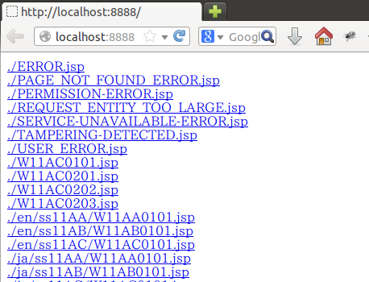

===================================
UI開発基盤の導入
===================================

本節では、Nablarch UI開発基盤をプロジェクトの開発環境に導入する手順を述べる。
UI開発基盤の導入時に以下の手順を実施すればよく、各担当者が個別に実施する必要はない。

以下の手順で使用するインストール用コマンドの詳細仕様については、
:doc:`../plugin_build` を参照すること。

.. tip::

   本節では、UI開発基盤用プロジェクトテンプレートを使用したUI開発基盤の導入手順を記載している。
   UI開発基盤用プロジェクトテンプレートは :doc:`../internals/css_framework` を使用しているため、
   :doc:`../internals/multicol_css_framework` を使用する場合には、 :ref:`apply-multicol-layout`
   を参考に導入用の設定を行うこと。

0. 事前準備
===================================

1. Node.jsのインストール
----------------------------------------------------------

本節の作業を行うには Node.js のインストールが必要である。
インストールイメージを下記URL(2016/10時点)から取得し、インストールする。

 http://nodejs.org/dist/v0.10.26/

バージョンによってはUI開発基盤が動作しないため、動作検証済みのバージョンである 0.10.26 の使用を推奨する。

.. tip::

  なお **Node.js** を必要とするのは初期環境構築作業を行うアーキテクトのみである。
  通常の設計・開発を行う担当者はインストール不要である。

2. 環境変数 **JAVA_HOME** の設定
----------------------------------------------------------

本節で使用する :ref:`ui_demo` は環境変数 **JAVA_HOME** の設定が前提となっているため、
環境変数 **JAVA_HOME** にJDKのインストールディレクトリパスを設定する。

1. プロジェクトの作成
===================================
下記手順を実行することにより、UI開発基盤を使用するためのプロジェクトを作成する。
作成したプロジェクトの構成は以下のようになる。

.. tip::
   
   ここでは、プロジェクト名は仮想のプロジェクト名(web_project)で示す。

.. code-block:: bash

  プロジェクトルート/
        │
        ├── nablarch_plugins_bundle/
        │     ├── bin/
        │     │     ├── setup.bat
        │     │     └── install.bat
        │     ├── node_modules/
        │     │     ├── nablarch-css-base
        │     │     ├── nablarch-css-color-default
        │     │     ├── nablarch-css-common
        │     │     │
        │     │ ## 後略 ##
        │     │
        │     └── package.json
        │
        └── web_project/
              ├── web/
              ├── ui_demo/
              ├── ui_plugins/
              │     └── package.json
              └── ui_test/

.. tip::

  ここで展開される各ディレクトリの内容については
  :doc:`../structure/directory_layout` で解説する。

1. プロジェクトルートの作成
----------------------------------------------------------

ローカルマシン上の任意の場所にプロジェクトルートとなるディレクトリを新規作成する。

2. UI開発基盤の取得
----------------------------------------------------------

「git clone」コマンドでUI開発基盤を取得し、プロジェクトルート直下に配置する。
以下にコマンド例を示す。

.. code-block:: bash

  cd <<プロジェクトルート>>
  git clone https://github.com/nablarch/nablarch-plugins-bundle.git

.. _clone_project_template:

3. UI開発基盤用プロジェクトテンプレートの取得
----------------------------------------------------------

「git clone」コマンドでUI開発基盤用プロジェクトテンプレートを取得し、プロジェクトルート直下に配置する。
以下にコマンド例を示す。

.. code-block:: bash

  cd <<プロジェクトルート>>
  git clone https://github.com/nablarch/nablarch-ui-development-template.git web_project

4. ブランクプロジェクトのセットアップ
----------------------------------------------------------

 :ref:`clone_project_template` で取得したプロジェクトテンプレートにブランクプロジェクトをセットアップする。
 セットアップ方法は、 :doc:`../../../../application_framework/application_framework/blank_project/setup_blankProject/setup_Web` を参照すること。

.. tip::

  ここでは、ブランクプロジェクトを生成する際、 ``artifactId`` に `web` と指定すること。

.. tip::

  mavenのインストールや設定を行っていない場合には、以下を参考にそれぞれを実施してからセットアップを行うこと。
  
  *  :doc:`../../../../application_framework/application_framework/blank_project/maven`
  *  :doc:`../../../../application_framework/application_framework/blank_project/beforeFirstStep`

2. Nablarch UI開発基盤のインストール
========================================
下記手順を実行することにより、Nablarch標準プラグインバンドルの内容と、
各プラグインが依存するサードパーティ製ライブラリがプロジェクトルート配下に取り込まれる。

1. プラグインのセットアップ
----------------------------------------------------------

`nablarch_plugins_bundle/bin/setup.bat` を実行する。

.. tip::

  プロキシ配下でインターネットに接続している場合には、
  以下の環境変数にプロキシのアドレスを設定すること。

  * **http_proxy** ：例）http_proxy=http://proxy.example.com:8080
  * **https_proxy** ：例）https_proxy=http://proxy.example.com:8080

プラグインのセットアップが実行され、以下のようなログが表示される。

.. code-block:: bash

   >setup.bat
   
   >cd <<プロジェクトルート>>/nablarch-plugins-bundle/bin/
   
   >call mvn clean compile dependency:copy-dependencies -f ../node_modules/nablarch-dev-tool-server/ui_test/pom.xml
   [INFO] Scanning for projects...
   [INFO]
   [INFO] ------------------------------------------------------------------------
   [INFO] Building nablarch-dev-tool-server 1.0.0
   [INFO] ------------------------------------------------------------------------
   
   ### 中略 ###
   
   [INFO] ------------------------------------------------------------------------
   [INFO] BUILD SUCCESS
   [INFO] ------------------------------------------------------------------------
   [INFO] Total time: 1.949 s
   [INFO] Finished at: 2016-10-05T16:30:40+09:00
   [INFO] Final Memory: 21M/211M
   [INFO] ------------------------------------------------------------------------
   npm WARN package.json nablarch-css-base@1.0.0 No repository field.
   npm WARN package.json nablarch-css-base@1.0.0 No README data

   ### 中略 ###

   npm http 200 https://registry.npmjs.org/boom
   npm http GET https://registry.npmjs.org/delayed-stream/0.0.5
   npm http 304 https://registry.npmjs.org/delayed-stream/0.0.5
   shelljs@0.2.6 node_modules/shelljs

   requirejs@2.1.11 node_modules/requirejs

   sugar@1.4.1 node_modules/sugar

   jquery@1.11.0 node_modules/jquery

   less@1.4.2 node_modules/less
   ├── mkdirp@0.3.5
   ├── mime@1.2.11
   ├── ycssmin@1.0.1
   └── request@2.34.0

   font-awesome@4.0.3 node_modules/font-awesome
   >

`nablarch_plugins_bundle/bin/setup.bat` では以下の二つの処理を行っており、
セットアップ後の状態はそれぞれ以下のようになる。
  
* :ref:`ui_test_server` で使用するモジュールのビルド

  `nablarch-plugins-bundle/node_modules/nablarch-dev-tool-server/ui_test/tools` 配下に
  サーバ動作確認用のバイナリとライブラリが追加される。
  
  .. code-block:: bash

    プロジェクトルート/
          │
          ├── nablarch_plugins_bundle/
          │     ├── node_modules/
          │     │     ├── nablarch-dev-tool-server
          │     │     │     ├── ui_test
          │     │     │     │     ├── tools
          │     │     │     │     │     ├── bin # (追加)
          │     │     │     │     │     ├── lib # (追加)
          ## (後略) ##

* サードパーティライブラリの取得

  `nablarch_plugins_bundle/node_modules` 配下に
  サードパーティライブラリが追加される。

  .. code-block:: bash

    プロジェクトルート/
          │
          ├── nablarch_plugins_bundle/
          │     ├── bin/
          │     │     ├── setup.bat
          │     │     └── install.bat
          │     ├── doc/
          │     ├── guide/
          │     ├── node_modules/
          │     │     ├── es6-promise   # (追加)
          │     │     ├── font-awesome  # (追加)
          │     │     ├── jquery        # (追加)
          │     │     ├── less          # (追加)
          │     │     ├── nablarch-css-base
          │     │     ├── nablarch-css-color-default
          │     │     ├── nablarch-css-common
          │     │     │
        ## (後略) ##

2. プロジェクトで使用するプラグインの選定
---------------------------------------------------
`web_project/ui_plugins/package.json` を任意のテキストエディタで開く。

このファイルは以下のような構造を持ち、プロジェクトで使用する
:doc:`../structure/plugins` の名称とそのバージョンが列挙されている。

.. code-block:: javascript

    //---- 前略 ----//

    "dependencies":
    { "requirejs"    : "2.1.11"
    , "sugar"        : "1.4.1"
    , "jquery"       : "1.11.0"
    , "requirejs-text": "2.0.10"
    , "font-awesome": "4.0.3"
    , "nablarch-css-color-default": "1.0.0"
    , "nablarch-css-core": "1.0.0"
    , "nablarch-css-conf-wide": "1.0.0"
    , "nablarch-css-conf-compact": "1.0.0"
    , "nablarch-css-conf-narrow": "1.0.0"

    //---- 中略 ----//

    , "nablarch-template-head": "1.0.0"
    , "nablarch-template-js_include": "1.0.0"
    , "nablarch-template-page": "1.0.0"
    }

    //---- 後略 ----//

このエントリを削除することによって、プロジェクト側で使用しないプラグインを
インストールの対象から除去することができる。
各プラグインの内容については :doc:`../structure/plugins` の項を参照すること。

削除したプラグインがlessファイルを含んでいる場合、プロジェクトではそのlessファイルも
使用できなくなるため、 :ref:`lessImport_less` から、当該プラグインのlessファイルの
import定義を削除する必要がある。

:ref:`lessImport_less` には、以下のようにプロジェクトが各表示モードで使用するlessファイルの
import定義が列挙されている。

.. code-block:: css

   @import "../../node_modules/nablarch-css-core/ui_public/css/core/reset";
   @import "../../node_modules/nablarch-css-core/ui_public/css/core/css3";
   @import "../../node_modules/nablarch-css-core/ui_public/css/core/grid";

    //---- 中略 ----//

   @import "../../node_modules/web_project-template-app_nav/ui_public/css/template/topnav";
   @import "../../node_modules/web_project-template-app_nav/ui_public/css/template/topnav-wide";
   @import "../../node_modules/web_project-template-error/ui_public/css/template/errorpage";

上記で削除したプラグインに対応するlessファイルは、それぞれの :ref:`lessImport_less` から削除する必要がある。
本手順の場合は、以下の6ファイルから削除する。

* `web_project/ui_plugins/css/ui_local/compact.less`
* `web_project/ui_plugins/css/ui_local/narrow.less`
* `web_project/ui_plugins/css/ui_local/wide.less`
* `web_project/ui_plugins/css/ui_public/compact.less`
* `web_project/ui_plugins/css/ui_public/narrow.less`
* `web_project/ui_plugins/css/ui_public/wide.less`

.. tip::

  使用するプラグインの選別は、開発中であっても随時実施することが可能である。
  ただ、その場合でも、開発チーム側での誤用を避けるため、
  使用しないプラグインはなるべく早い段階で除いておくことが望ましい。

3. プロジェクトへのプラグインインストール　
---------------------------------------------------
インストールコマンドにプロジェクトルートを設定し実行する。
(コマンドの詳細については :doc:`../plugin_build` を参照)

**1. PROJECT_ROOTの設定**
  `nablarch_plugins_bundle/bin/install.bat` を任意のテキストエディタで開き、
  コメントアウトされているプロジェクトルートを以下のように設定する。

.. code-block:: bat

   @setlocal

   cd %~dp0
   @echo off
   set PROJECT_ROOT=../../web_project # (設定)
   ###(後略)###

**2. インストールコマンドの実行**
  `nablarch_plugins_bundle/bin/install.bat` を実行する。

.. tip::

  なお、このスクリプトは完了までに通常5から10分程度の時間がかかる。

以下のようなログが表示される。

.. code-block:: bash

  > install.bat
  setup plugin: ../node_modules/es6-promise
  setup plugin: ../node_modules/font-awesome
  setup plugin: ../node_modules/jquery
  setup plugin: ../node_modules/less

  ## (中略) ##

  npm http 200 http://127.0.0.1:3000/nablarch-css-conf-compact/-/nablarch-css-conf-compact-1.0.0/package.tgz
  npm http 200 http://127.0.0.1:3000/nablarch-css-conf-wide/-/nablarch-css-conf-wide-1.0.0/package.tgz
  nablarch-css-conf-compact@1.0.0 node_modules/nablarch-css-conf-compact
  nablarch-css-conf-narrow@1.0.0 node_modules/nablarch-css-conf-narrow
  nablarch-css-conf-wide@1.0.0 node_modules/nablarch-css-conf-wide

  halting local repository ...

  ... local repository shutdown.
  >

この処理により、先の手順で **package.json** に指定されていたプラグインが
`web_project/ui_plugins/node_modules` 配下にインストールされる。

.. code-block:: bash

  プロジェクトルート/
        │
        ├── nablarch_plugins_bundle/
        │     │
        │     │
        │   ##(後略)##
        │
        └── web_project/
              ├── web/
              ├── ui_demo/
              ├── ui_plugins/
              │     ├── .npm/  # (追加)
              │     ├── package.json
              │     ├── bin/
              │     │
              │     └── node_modules/
              │           ├── jquery/                       # (追加)
              │           ├── less/                         # (追加)
              │           ├── nablarch-css-base/            # (追加)
              │           ├── nablarch-css-color-default/   # (追加)
              │           ├── nablarch-css-common/          # (追加)
              │           │
              │       ##(後略)##
              │
              └── ui_test/

.. _executing_ui_build:

4. UI部品のビルドと配置
---------------------------------------------------
ビルドコマンド用設定ファイルにデプロイ対象プロジェクトを設定しUIビルドコマンドを実行する。
(設定ファイルとコマンドの詳細については :doc:`../plugin_build` を参照)

**1. デプロイ対象プロジェクトの設定**
  `web_project/ui_plugins/pjconf.json` を任意のテキストエディタで開き、
  デプロイ対象プロジェクト(pathSettings/webProjectPath)を以下のように設定する。

.. code-block:: json

   {
     "pathSettings" :
     { "projectRootPath"   : "../.."
     , "webProjectPath"    : "web/src/main/webapp"  # (設定)
     , "demoProjectPath"   : "ui_demo"
     , "testProjectPath"   : "ui_test"
     , "pluginProjectPath" : "ui_plugins"
     }
     ###(攻略)###

**2. UIビルドコマンドの実行**
  `web_project/ui_plugins/bin/ui_build.bat` を実行する。

  これにより `web_project` 配下の以下のディレクトリに各プラグインから抽出された
  UI資源が展開される。

  =========== ===================================== ========================================================================================
  パス        名称                                  用途
  =========== ===================================== ========================================================================================
  ui_demo/    業務画面モック開発用プロジェクト      | 主に設計工程で作成する業務画面JSPを格納するプロジェクト。
                                                    | サーバサイドの仕組みなしで、画面の表示や動作のデモを行うことができる。
                                                    | 使用方法については、 :ref:`ui_dev-howto_make_jsp` を参照すること。
  
  ui_test/    UI開発基盤テスト用プロジェクト        | UI開発基盤自体の開発に用いるテストスイートを格納するプロジェクト。
                                                    | プロジェクト側でUI基盤のカスタマイズを行う際に、既存機能への影響を確認する場合に
                                                      使用することができる。
                                                    | また、UI基盤部品で問題が発生した場合に、Nablarchの標準プラグインの問題なのか、
                                                      PJ側でのカスタマイズの問題なのかを確認する際にも利用する。
  
  web/        デプロイ対象プロジェクト              | 実際にサーバ環境にデプロイされる資源を格納するプロジェクト。
  
  =========== ===================================== ========================================================================================

5. UIローカルデモ用プロジェクトの動作確認
---------------------------------------------------
`web_project/ui_demo/ローカル画面確認.bat`
を実行すると、ブラウザが起動し、以下の画面が表示される。

この画面には `web_project/ui_demo` 配下にある全てのJSPファイルへのリンクが
表示される。
各リンクを開くことで、当該画面のJSPがJavaScriptによって解釈され、
下記のようなデモ画面を表示することができる。

.. figure:: ../_image/ui_demo_server_preview.png
   :scale: 80
   :align: center

.. _ui_test_server:

6. UI開発基盤テスト用プロジェクトの動作確認
---------------------------------------------------
`web_project/ui_test/サーバ動作確認.bat`
を実行すると、ブラウザが起動し、以下の画面が表示される。

.. figure:: ../_image/ui_test_server_top.png
   :scale: 80
   :align: center

コマンドを実行したコンソール内に以下のようなメッセージが表示されるのを確認できるまで待つ。

.. code-block:: bash

  2014-05-05 16:28:24.022:INFO::Logging to STDERR via org.mortbay.log.StdErrLog
  2014-05-05 16:28:24.058:INFO::jetty-6.1.24
  2014-05-05 16:28:24.300 -INFO- ROO [null] load component config file. file = classpath:web-component-configuration.xml
  2014-05-05 16:28:24.331 -INFO- ROO [null] [nablarch.fw.web.servlet.NablarchServletContextListener#contextInitialized] initialization completed.
  2014-05-05 16:28:24.383:INFO::Started SocketConnector@0.0.0.0:7777

メッセージが確認できたら
ブラウザに表示されているリンクを押すと、以下のような画面に遷移する。

.. figure:: ../_image/ui_test_server_indexpage.png
   :scale: 80
   :align: center

左のメニューから、各UI部品の動作確認用ページに遷移することができる。

7. 開発リポジトリへの登録
---------------------------------------------------
ここまでセットアップした開発基盤を、リポジトリに登録する。

.. important::

  ここでリポジトリへの登録を怠ると、以降のプロジェクト側で行うカスタマイズと、
  Nablarch開発元で行う改修とを正しくマージすることが困難、もしくは不可能となるので、
  必ず実施すること。

**1. UI開発基盤インストール作業ファイルの削除**
  下記のディレクトリおよびその配下のファイルについては、
  インストール作業完了後は不要となるので、コミット前に削除しておく。

  - **nablarch_plugins_bundle/**
  - **web_project/ui_plugins/.npm/**

**2. コミット**
  上述の削除により、プロジェクトのファイル構成は以下の図のようになる。
  これをプロジェクトのリポジトリにコミットする。

.. code-block:: bash

  プロジェクトルート/
        │
        └── web_project/
              ├── web/
              │     │
              │   ##(後略)##
              │
              ├── ui_demo/
              │     ├── .project
              │     │
              │   ##(後略)##
              │
              ├── ui_plugins/
              │     ├── package.json
              │     ├── bin/
              │     │     ├── ui_build.bat
              │     │     ├── ui_build.sh
              │     │     │
              │     │
              │     └── node_modules/
              │           ├── jquery/
              │           ├── less/
              │           ├── nablarch-css-base/
              │           ├── nablarch-css-color-default/
              │           ├── nablarch-css-common/
              │           │
              │       ##(後略)##
              │
              └── ui_test/
                    ├── .project
                    ├── .classpath
                    │
                  ##(後略)##

