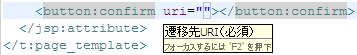

統合開発環境を利用して業務画面JSPを作成する
====================================================================================

統合開発環境(以下、IDE)を利用して業務画面JSPを作成することで、IDEの持つ補完機能やドキュメント参照機能を利用して効率よく開発を行うことができる。

Nablarchでは、標準の開発環境として、 `Eclipse <http://www.eclipse.org/>`_ を提供している。以下に、Nablarchで提供している開発環境での業務画面JSP作成のイメージを示す。

※記載してあるショートカットは、標準から変更していない場合のショートカット。

統合開発環境の補完機能を利用する
-----------------------------------------------------------

画面部品を表すタグを途中まで入力し ``C-SPC`` を押下すると、以下の図のように、利用できるタグのうち、途中まで入力してある文字にマッチするものが表示される。

.. image:: _image/eclipse_completion.png
   :align: center
   :scale: 90

また、 :ref:`eclipse-template` を導入することで、テンプレートを利用した補完も行えるようになる。

以下のように、利用したいを入力して補完候補から選択すると、登録されているテンプレートが展開される。
展開されたテンプレートの入力項目間は ``TAB`` キーで遷移できる。

統合開発環境のドキュメント参照機能を利用する
-----------------------------------------------------------

タグのタグ名や属性にマウスカーソルをフォーカスすると、各項目に関する簡単な説明がポップアップする。（ ``F2`` キー押下でも表示される。）

