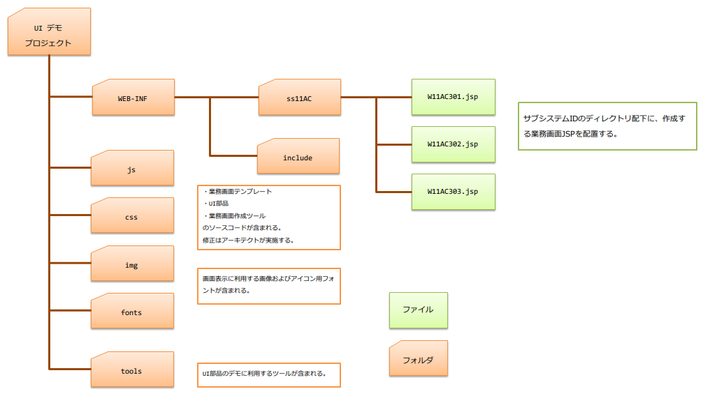

業務画面JSP作成時のディレクトリ構造
==========================================

作成した業務画面JSPのレイアウトや動作をブラウザで確認するためには、以下のようなディレクトリ構造に従ってファイルを配置した上で「ローカル画面確認.bat」を実行する。

なお、上記ディレクトリに格納されるファイルの詳細は以下の通りとなっている。

====================== ========================================================================================
ファイル・ディレクトリ    コンテンツ
====================== ========================================================================================
WEB-INF                  WEB-INF配下の構成は、サーバ上の構成と同じであり、中に含まれるファイルも原則同じものを使用する。|br|
                         以下のようなファイルが含まれている。|br|
                         * 業務画面テンプレート |br|
                         * 業務画面部品（ウィジェット）|br|
                         * 業務画面JSP
                         ※本ディレクトリのコンテンツは、業務設計者・業務開発者は直接修正しない。
---------------------- ----------------------------------------------------------------------------------------
業務画面JSP              サブシステムIDのディレクトリ直下（ **ss11AC/** など）に、作成する業務画面JSPを配置する。|br|
                         ファイル名は、「 **画面ID.jsp** 」とする。|br|
                         モック動作させる場合、これらのファイルをサブディレクトリに配置することはできない。
                         
                         ※WEB-INF配下に配置する
---------------------- ----------------------------------------------------------------------------------------
include                  業務画面内の共通領域の内容を実装したJSPファイル群が配置されている。|br|
                         テンプレートファイルからインクルードされている。|br|
                         
                         ※本ディレクトリのコンテンツは、業務設計者・業務開発者は直接修正しない。 |br|
                         ※WEB-INF配下に配置する
---------------------- ----------------------------------------------------------------------------------------
js                       ブラウザ上で動作するスクリプトが配置されている。|br|
                         ※本ディレクトリのコンテンツは、業務設計者・業務開発者は直接修正しない。
---------------------- ----------------------------------------------------------------------------------------
css                      CSSファイルが配置されている。|br|
                         ※本ディレクトリのコンテンツは、業務設計者・業務開発者は直接修正しない。
---------------------- ----------------------------------------------------------------------------------------
img                      画面表示に利用する画像ファイルが配置されている。|br|
                         ※本ディレクトリのコンテンツは、業務設計者・業務開発者は直接修正しない。
---------------------- ----------------------------------------------------------------------------------------
fonts                    画面表示に利用するアイコン用フォントが配置されている。|br|
                         ※本ディレクトリのコンテンツは、業務設計者・業務開発者は直接修正しない。
---------------------- ----------------------------------------------------------------------------------------
tools                    UI部品の動作デモに利用するツールが含まれる。|br|
                         ※本ディレクトリのコンテンツは、業務設計者・業務開発者は直接修正しない。
====================== ========================================================================================

.. |br| raw:: html

   