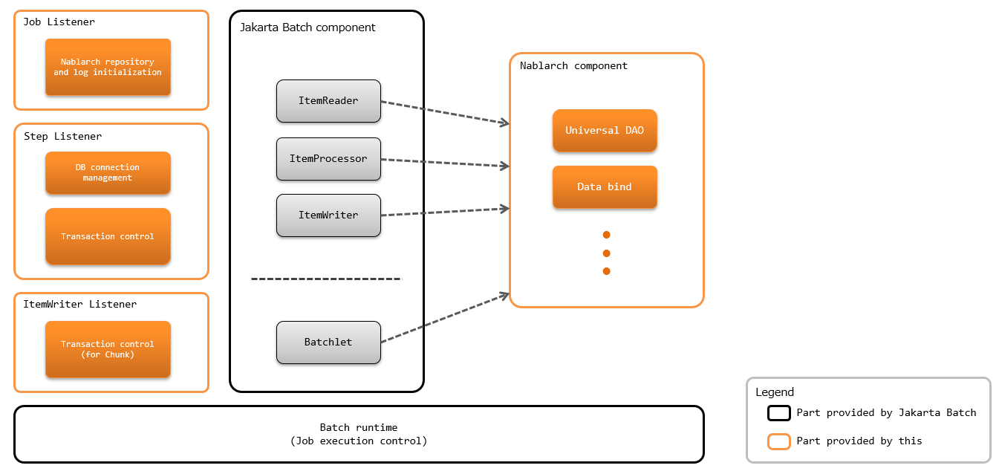

.. _jsr352_architecture:

Architecture Overview
==============================
.. contents:: Table of contents
  :depth: 3
  :local:


Configuration of batch application
--------------------------------------------------
|jsr352| is required for the execution of a batch application compliant with |jsr352|.
The implementation will mainly be selected from the following two, the use of `jBeret(external site) <https://jberet.gitbooks.io/jberet-user-guide/content/>`_ is recommended due to the extensive documentation and ease with which libraries can be obtained from Maven Central.

* `jBeret(external site) <https://jberet.gitbooks.io/jberet-user-guide/content/>`_
* `jBatchof reference implementation(external site) <https://github.com/WASdev/standards.jsr352.jbatch>`_

The configuration is shown below.



.. important::

  Since using the temporary area of JobContext and StepContext (``TransientUserData``) is the same as storing the value in the global area,
  the temporary area must not be used on the application side.

  Since the temporary area of StepContext is used to share values in the steps with :java:extdoc:`StepScoped<nablarch.fw.batch.ee.cdi.StepScoped>`,
  the temporary area of StepContext cannot be used on the application side.

.. tip::

  Since the architecture of :ref:`jsr352_batch` conforms to the configuration defined by |jsr352|,
  the architecture is different from the handler-based architecture,
  as described in the :ref:`nablarch_architecture` .

  In :ref:`jsr352_batch`, traverse processing such as those performed by the handler (log output and transaction control, etc.) is realized by using a listener defined by |jsr352|

  However, the listener is started at a predetermined timing, and is different from the handler in that it does not directly process the input and output.
  Therefore, the listener cannot filter and convert input values, such as those realized by the handler.


.. _jsr352-batch_type:

Batch type
--------------------------------------------------
There are two types of batch implementation methods in |jsr352|, `Batchlet` and `Chunk`.
The type of implementation that is appropriate to use should be determined for each batch with reference to the following.

.. _jsr352-batch_type_batchlet:

Batchlet
  Implements batchlet type in the case of task oriented batches.

  For example, processes that fetch files from an external system or completes processing with 1 SQL statement.

.. _jsr352-batch_type_chunk:

Chunk
  Implements chunk-type batch to execute processes that read records from input data sources such as files and databases and executes business processes.

Process flow of batch application
--------------------------------------------------

.. _jsr352-batch_flow_batchlet:

Batchlet
~~~~~~~~~~~~~~~~~~~~~~~~~~~~~~~~~~~~~~~~~~~~~~~~~~
The process flow of Batchlet type batch application is shown below.

.. image:: images/batchlet-flow.png
  :scale: 75

1. Batch Runtime of JSR352 calls :java:extdoc:`NablarchStepListenerExecutor <nablarch.fw.batch.ee.listener.step.NablarchStepListenerExecutor>` as the callback process before execution of batchlet step.
2. Sequentially executes the listener before executing the batchlet step.
3. `Batchlet` is executed from the Batch Runtime of JSR352.
4. `Batchlet` executes business logic is executed. (For the responsibility assignment of Batchlet, refer to the :ref:`Batchlet responsibility assignment <jsr352-batchlet_design>`).
5. Batch Runtime of JSR352 calls :java:extdoc:`NablarchStepListenerExecutor <nablarch.fw.batch.ee.listener.step.NablarchStepListenerExecutor>` as the callback process after execution of batchlet step.
6. Sequentially executes the listener after executing the batchlet step. (Executes in the reverse order of No 2)

.. _jsr352-batch_flow_chunk:

Chunk
~~~~~~~~~~~~~~~~~~~~~~~~~~~~~~~~~~~~~~~~~~~~~~~~~~
The process flow of Chunk type batch application is shown below.

.. image:: images/chunk-flow.png
  :scale: 75

1. Batch Runtime in JSR352 calls :java:extdoc:`NablarchStepListenerExecutor <nablarch.fw.batch.ee.listener.step.NablarchStepListenerExecutor>` as the callback process before execution of chunk step.

2. Sequentially executes the listener before executing the chunk step.

3. `ItemReader` of chunk step is executed from the Batch Runtime of JSR352.|br|
   `ItemReader` reads data from the input data source.

4. `ItemProcessor` of chunk step is executed from the Batch Runtime of JSR352.|br|

5. `ItemProcessor` executes the business logic using `Form` and `Entity`.|br|
   * Writing and updating of data to the database are not performed in this step.

6. Batch Runtime of JSR352 calls :java:extdoc:`NablarchItemWriteListenerExecutor <nablarch.fw.batch.ee.listener.chunk.NablarchItemWriteListenerExecutor>` as the callback process before execution of the `ItemWriter`.

7. Sequentially executes the listener before executing the `ItemWriter`.

8. `ItemWriter` of chunk step is executed from the Batch Runtime of JSR352.|br|
   `ItemWriter` performs results reflection processing, such as registering (updating, deleting) to a table and file output processing.

9. Batch Runtime of JSR352 calls :java:extdoc:`NablarchItemWriteListenerExecutor <nablarch.fw.batch.ee.listener.chunk.NablarchItemWriteListenerExecutor>` as the callback process after execution of `ItemWriter`.

10. Sequentially executes the listener after executing the `ItemWriter`. (Execute in the reverse order of No 7).

11. Batch Runtime of JSR352 calls :java:extdoc:`NablarchStepListenerExecutor <nablarch.fw.batch.ee.listener.step.NablarchStepListenerExecutor>` as the callback process after execution of chunk step.

12. Sequentially executes the listener after executing the Chunk step. (Executes in the reverse order of No 2)

* No 3 to No 10 are executed repeatedly until the data of the input data source is finished.

For the responsibility assignment of chunk step, see :ref:`responsibility assignment of Chunk <jsr352-chunk_design>`

.. _jsr352-batch_error_flow:

Process flow when an exception (including error) occurs
~~~~~~~~~~~~~~~~~~~~~~~~~~~~~~~~~~~~~~~~~~~~~~~~~~~~~~~~
If an exception occurs during batch execution, Nablarch does not catch the exception and exception handling is performed on the implementation side of JSR352.
Note that this is a specific behavior for JSR352-compliant batch application and is different from other platforms (:ref:`Web application <web_application>` and :ref:`nablarch_batch`, etc.).

.. tip:: 

  The reason why JSR352-compliant batch application adopted such an architecture is as follows.

  JSR352-compliant batch applications provide only components for using Nablarch in JSR352, and execution control is carried out by JSR352 implementation.
  For this reason, it is not possible to catch and handle all exceptions with Nablarch, and this policy is adopted to avoid complex designs that will be required if exception control is distributed between Nablarch and JSR352.
  
Batch status when an exception occurs
```````````````````````````````````````````````
As described above, all controls when an exception occurs are performed by the implementation of JSR352.
Refer to the specification of  |jsr352| for the batch status (batch status and exit status) when an exception occurs.
Retry and continuation status according to the exception type are operations in accordance with the job definition. For details of the job definition, refer to the specification of |jsr352|.

For the return code that is returned by the Java process after the exception, see :ref:`jsr352-failure_monitoring`.

Log output
``````````````````````````````````````````````````
The information of the exception caught by JSR352 implementation is output as a log by JSR352 implementation.
Configure (configuration such as format and output destination) the log by referring to the logging framework manual used by JSR352 implementation.

Error logs, etc. explicitly output by the application can be output to the same log file as that of JSR352
by unifying JSR352 implementation and logging framework using :ref:`log_adaptor`.

.. _jsr352-listener:

Listener used in the batch application
--------------------------------------------------
The batch application compliant with |jsr352| implements the equivalent of Nablarch handler using the listener defined in the |jsr352| specification.

The following listeners are provided as standard.

Job level listener
  Listener that is called back immediately before starting and ending the job

  * :java:extdoc:`Listener that outputs the launch and end logs of the job <nablarch.fw.batch.ee.listener.job.JobProgressLogListener>`
  * :java:extdoc:`Listener to prevent multiple start of the same job <nablarch.fw.batch.ee.listener.job.DuplicateJobRunningCheckListener>`

Step level listener
  Listener that is called back before and after executing the step

  * :java:extdoc:`Listener that outputs the start and end logs of the step <nablarch.fw.batch.ee.listener.step.StepProgressLogListener>`
  * :java:extdoc:`Listener that connects to the database <nablarch.fw.batch.ee.listener.step.DbConnectionManagementListener>`
  * :java:extdoc:`Listener that performs transaction control <nablarch.fw.batch.ee.listener.step.StepTransactionManagementListener>`

Listener of ItemWriter level
  Listener that is called back before and after executing the`ItemWriter`

  * :java:extdoc:`Listener to output the progress log of chunk (deprecated) <nablarch.fw.batch.ee.listener.chunk.ChunkProgressLogListener>`
    (output progress log using :ref:`jsr352-progress_log`)
    
  * :java:extdoc:`Listener that performs transaction control <nablarch.fw.batch.ee.listener.chunk.ItemWriteTransactionManagementListener>`

.. tip::
  The specification that the execution order for the listeners specified in |jsr352| is not guaranteed when multiple listeners are configured.
  For this reason, Nablarch supports the execution of listeners in the specified order by performing the following actions.

  * For each level of listener, configure only listeners for which the execution order of listeners is guaranteed
  * Fetches the listener list from the :ref:`repository` for which the execution order of the listeners is guaranteed and executes the listener in the order defined.

  For information on how to define the listeners, see :ref:`jsr352-listener_definition`.

Minimum listener configuration
--------------------------------------------------
The minimum listener configuration is described below. If the project requirements cannot be met with this configuration, take measures such as adding listeners.

.. list-table:: Minimum listener configuration of job level
  :header-rows: 1
  :class: white-space-normal
  :widths: 5 35 30 30

  * - No.
    - Listener
    - Process immediately before starting a job
    - Process immediately before finishing a job

  * - 1
    - :java:extdoc:`Listener that outputs the launch and end logs of the job <nablarch.fw.batch.ee.listener.job.JobProgressLogListener>`
    - Outputs the job name that is to be started to the log.
    - Outputs the job name and batch status to the log.

.. list-table:: Minimum listener configuration of step level
  :header-rows: 1
  :class: white-space-normal
  :widths: 5 35 30 30

  * - No.
    - Listener
    - Process before step execution
    - Process after step execution

  * - 1
    - :java:extdoc:`Listener that outputs the start and end logs of the job <nablarch.fw.batch.ee.listener.step.StepProgressLogListener>`
    - Outputs the name of the executed step to the log.
    - Outputs the step name and step status to the log.

  * - 2
    - :java:extdoc:`Listener that connects to the database <nablarch.fw.batch.ee.listener.step.DbConnectionManagementListener>`
    - Gets the DB connection.
    - Releases the DB connection.

  * - 3
    - :java:extdoc:`Listener that performs transaction control <nablarch.fw.batch.ee.listener.step.StepTransactionManagementListener>`
    - Begins the transaction.
    - Ends (commits or rollbacks) the transaction.

.. list-table:: `ItemWriter` level minimum listener configuration
  :header-rows: 1
  :class: white-space-normal
  :widths: 5 35 30 30

  * - No.
    - Listener
    - Process before execution of `ItemWriter`
    - Process after execution of `ItemWriter`

  * - 1
    - :java:extdoc:`Listener that performs transaction control <nablarch.fw.batch.ee.listener.chunk.ItemWriteTransactionManagementListener>` [#chunk_tran]_
    - 
    - Ends (commits or rollbacks) the transaction.

.. [#chunk_tran] Transaction control performed by the `ItemWriter` level listener is performed for the transaction started at the step level.

.. _jsr352-listener_definition:

How to specify a listener
--------------------------------------------------
This section describes how to define a listener list for each level.

The steps required to define a listener list are as follows:

1. Configure the listeners for which the execution order of the listeners is guaranteed in the xml file that represents the job definition specified in |jsr352|.
2. Configure the listener list in the component configuration file.

Configure in the job definition file
  .. code-block:: xml

    <job id="chunk-integration-test" xmlns="http://xmlns.jcp.org/xml/ns/javaee" version="1.0">
      <listeners>
        <!-- Job-level listener -->
        <listener ref="nablarchJobListenerExecutor" />
      </listeners>

      <step id="myStep">
        <listeners>
          <!-- Step-level listener -->
          <listener ref="nablarchStepListenerExecutor" />
          <!-- ItemWriter level listener-->
          <listener ref="nablarchItemWriteListenerExecutor" />
        </listeners>

        <chunk item-count="10">
          <reader ref="stringReader">
            <properties>
              <property name="max" value="25" />
            </properties>
          </reader>
          <processor ref="createEntityProcessor" />
          <writer ref="batchOutputWriter" />
        </chunk>
      </step>
    </job>

Configure in the component configuration file
  .. code-block:: xml

      <!-- Default job-level listener list -->
      <list name="jobListeners">
        <component class="nablarch.fw.batch.ee.listener.job.JobProgressLogListener" />
        <component class="nablarch.fw.batch.ee.listener.job.DuplicateJobRunningCheckListener">
          <property name="duplicateProcessChecker" ref="duplicateProcessChecker" />
        </component>
      </list>

      <!-- Default step-level listener list -->
      <list name="stepListeners">
        <component class="nablarch.fw.batch.ee.listener.step.StepProgressLogListener" />
        <component class="nablarch.fw.batch.ee.listener.step.DbConnectionManagementListener">
          <property name="dbConnectionManagementHandler">
            <component class="nablarch.common.handler.DbConnectionManagementHandler" />
          </property>
        </component>
        <component class="nablarch.fw.batch.ee.listener.step.StepTransactionManagementListener" />
      </list>

      <!-- Default ItemWriter level listener list -->
      <list name="itemWriteListeners">
        <component 
            class="nablarch.fw.batch.ee.listener.chunk.ChunkProgressLogListener" />
        <component 
            class="nablarch.fw.batch.ee.listener.chunk.ItemWriteTransactionManagementListener" />
      </list>

      <!-- Overwriting the default job-level listener list -->
      <list name="sample-job.jobListeners">
        <component class="nablarch.fw.batch.ee.listener.job.JobProgressLogListener" />
      </list>

      <!-- Overwriting the default step-level listener list -->
      <!-- This configuration is applied when executing the "sample-step" -->
      <list name="sample-job.sample-step.stepListeners">
        <component class="nablarch.fw.batch.ee.listener.step.StepProgressLogListener" />
      </list>
      
Points
  * Set the component name for the listener list of the default job level as ``jobListeners``.
  * Set the component name for the listener list of the default step-level as ``stepListeners``.
  * Set the component name for the listener list of the default ItemWriter level as ``itemWriteListeners``.
  * When overwriting the definition of the default listener list, set the component name to "job name + "." + component name to be overwritten". |br|
    For example, when overwriting the definition of job-level with "sample-job", define a listener list with the component name as ``sample-job.jobListeners``.
  * To overwrite the default listener list definition in a specific step, set the component name to "job name + "." + step name + "." + component name to be overwritten".  |br|
    For example, to overwrite the default listener list definition of the step-level with the "sample-step" defined in the "sample-job", define the listener list with the component name as ``sample-job.sample-step.stepListeners``.
  * The listener list that can be overwritten in a specific step are only the listener lists of the step level and ItemWriter level.
    
.. |jsr352| raw:: html

  <a href="https://jcp.org/en/jsr/detail?id=352" target="_blank">JSR352(external site)</a>

.. |br| raw:: html

  <br />
