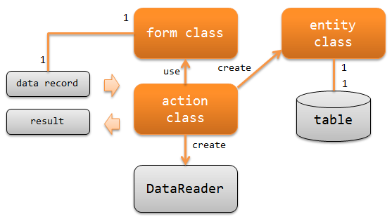

.. _nablarch_batch-application_design:

Responsibility Assignment of Application
====================================================
This section describes the classes to be implemented when creating a Nablarch batch application and their responsibilities.

**Classes and their responsibilities**

Action class
  Action classes perform two things.

  * Generates :java:extdoc:`DataReader<nablarch.fw.DataReader>` used to read input data.
  * Executes the business logic based on the data records read by :java:extdoc:`DataReader<nablarch.fw.DataReader>`
    and returns :java:extdoc:`Result<nablarch.fw.Result>`.

  For example, the following process is performed as business logic in the case of a batch for importing from a file.

  - Creates a form class from data record and performs validation.
  - Creates entity class from the form class and add data to database.
  - Returns :java:extdoc:`Success<nablarch.fw.Result.Success>` as the processing result.

Form class
  Class that maps data records read by :java:extdoc:`DataReader<nablarch.fw.DataReader>`.

  Contains configuration of annotation for validation of data record and logic for correlation validation.
  Depending on external input data, it may have a hierarchical structure (form having a form).

  All of the form class properties must be defined by `String`.
    See :ref:`Bean Validation <bean_validation-form_property>` for the reasons why the property should be `String`.
    In the case of a binary item, the type is defined by a byte array.

  .. tip::
   If the input data such as files received from outside the system are not secure,
   validate and create a form class. If the input data such as a database is secure,
   it is better to create an entity class from data records and execute business logic
   without using the form class.

Entity class
  A class with a one-to-one correspondence with a table.
  The entity class has property corresponding to columns.
