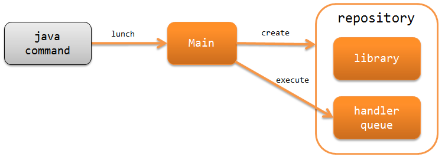

Architecture Overview
==============================

.. contents:: Table of contents
  :depth: 3
  :local:

The Nablarch batch application provides a function to build a batch process
that repeatedly executes the process for each data record stored in the DB or file.

The Nablarch batch application is divided into the following two types:

.. _nablarch_batch-on-demand_batch:

On-demand batch
 Launches the process periodically, that is, daily or monthly, and executes the batch process.

.. _nablarch_batch-resident_batch:

Resident batch
 The process continues to run and executes batch process at regular intervals.
 For example, it is used when request data created by online processing is batch-processed periodically.

.. important::
 Even if a resident batch is executed by multi-threading, there is a possibility
 that a delay may occur in importing the request data as other threads may wait for threads
 that are processed slowly to end.

 For this reason, it is recommended that instead of the resident batch, :ref:`db_messaging`,
 which does not cause the above problems, be used in new development projects.

 Also, in existing projects, the resident batch can be operated without any changes,
 but if there is a possibility for the above problem to occur (if it is already occurring),
 consider changing to :ref:`db_messaging`.

.. _nablarch_batch-structure:

Configuration of Nablarch Batch Application
------------------------------------------------------
The Nablarch batch application runs as a standalone application launched directly from the java command.
Configuration of the Nablarch batch application is shown below.

:ref:`main` (Main)
 Main class is the starting point of Nablarch batch application.
 Launched directly from the java command, initializes the system repository and log,
 and executes the handler queue.

.. _nablarch_batch-resolve_action:

Specify action and request ID based on request path
------------------------------------------------------
In the Nablarch batch application, specify the action to be executed and request ID
with the command line argument (-requestPath).

.. code-block:: properties

 # Format
 -requestPath=Action class name/request ID

 # Example
 -requestPath=com.sample.SampleBatchAction/BATCH0001

The request ID is used as an identifier of each batch process.
When multiple processes executing the same business action class are launched,
the request ID is used as an identifier.

.. _nablarch_batch-process_flow:

Process flow of Nablarch batch application
------------------------------------------------------
The process flow starting from the Nablarch batch application reading the input data to returning the process result is shown below.

.. image:: images/batch-flow.png
  :scale: 80

1. :ref:`The common start-up launcher (Main) <main>` executes the handler queue.
2. :java:extdoc:`DataReader<nablarch.fw.DataReader>` reads the input data
   and provides the data records one by one.
3. :java:extdoc:`DispatchHandler <nablarch.fw.handler.DispatchHandler>` configured in the handler queue
   specifies the action class to be processed based on the request path
   specified by the command line argument (-requestPath) and adds it to the end of the handler queue.
4. The action class executes business logic for each data record using a form class and an entity class.
5. The action class returns :java:extdoc:`Result <nablarch.fw.Result>`, which shows the results.
6. Repeat steps 2-5 until there is no more data to process.
7. :java:extdoc:`StatusCodeConvertHandler (StatusCodeConvertHandler) <nablarch.fw.handler.StatusCodeConvertHandler>`
   set in the handler queue converts the status code of the process result into the process exit code,
   and the process exit code is returned as the processing result of the batch application.

.. _nablarch_batch-handler:

Handlers used in the Nablarch batch application
------------------------------------------------------
Nablarch provides several handlers required for building batch applications.
Build the handler queue in accordance with the requirements of the project.
(a custom handler will have to be created for the project depending on the requirements)

For details of each handler, refer to the links.

Handlers that convert request and response
  * :ref:`status_code_convert_handler`
  * :ref:`data_read_handler`

Handlers that control the execution of the batch
  * :ref:`duplicate_process_check_handler`
  * :ref:`request_path_java_package_mapping`
  * :ref:`multi_thread_execution_handler`
  * :ref:`loop_handler`
  * :ref:`retry_handler`
  * :ref:`process_resident_handler`
  * :ref:`process_stop_handler`

Handlers associated with database
  * :ref:`database_connection_management_handler`
  * :ref:`transaction_management_handler`

Handler associated with error handling
  * :ref:`global_error_handler`

Others
  * :ref:`thread_context_handler`
  * :ref:`thread_context_clear_handler`
  * :ref:`ServiceAvailabilityCheckHandler`
  * :ref:`file_record_writer_dispose_handler`

Minimum handler configuration for on-demand batch
~~~~~~~~~~~~~~~~~~~~~~~~~~~~~~~~~~~~~~~~~~~~~~~~~~~~~~~~~~~~~~~~~~~~~~
When building an on-demand batch, the minimum required handler queue is as below:

With this as the base, add standard handlers of Nablarch or custom handlers created
in the project according to the project requirements.

.. list-table:: Minimum handler configuration for on-demand batch
   :header-rows: 1
   :class: white-space-normal
   :widths: 4,22,12,22,22,22

   * - No.
     - Handler
     - Thread
     - Request process
     - Response process
     - Exception handling

   * - 1
     - :ref:`status_code_convert_handler`
     - Main
     -
     - Converts status code to process exit code.
     -

   * - 2
     - :ref:`global_error_handler`
     - Main
     -
     -
     - Outputs log in the case of a runtime exception or error.

   * - 3
     - :ref:`database_connection_management_handler`
       (for initial processing/end processing)
     - Main
     - Gets the DB connection.
     - Releases the DB connection.
     -

   * - 4
     - :ref:`transaction_management_handler`
       (for initial processing/end processing)
     - Main
     - Begins the transaction.
     - Commit the transaction.
     - Roll back a transaction.

   * - 5
     - :ref:`request_path_java_package_mapping`
     - Main
     - Determine the action to invoke based on the command line arguments.
     -
     -

   * - 6
     - :ref:`multi_thread_execution_handler`
     - Main
     - Creates a sub thread and execute the process of the subsequent handler in parallel.
     - Waits for normal termination of all threads.
     - Waits for the current thread to complete and rethrows the cause exception.

   * - 7
     - :ref:`database_connection_management_handler`
       (for business process)
     - Sub
     - Gets the DB connection.
     - Releases the DB connection.
     -

   * - 8
     - :ref:`loop_handler`
     - Sub
     - Begin a business transaction.
     - Commits the business transaction at each commit interval.
       The loop is continued if the data to be processed is present in the data reader.
     - Rolls back a business transaction.

   * - 9
     - :ref:`data_read_handler`
     - Sub
     - Uses a data reader to read records one by one and pass it as an argument of the subsequent handler.
       Also, :ref:`the execution ID<log-execution_id>` is numbered.
     -
     - Outputs the read record as a log, and resends the original exception.

Minimum handler configuration of resident batch
~~~~~~~~~~~~~~~~~~~~~~~~~~~~~~~~~~~~~~~~~~~~~~~~~~
When building a resident batch, the minimum required handler queue is as below:

With this as the base, add standard handlers of Nablarch or custom handlers created in the project according to the project requirements.

The minimum handler configuration of the resident batch is the same as the on-demand batch excluding the point that the below handlers are added to the main thread.

* :ref:`thread_context_handler` ( required for :ref:`process_stop_handler` )
* :ref:`thread_context_clear_handler`
* :ref:`retry_handler`
* :ref:`process_resident_handler`
* :ref:`process_stop_handler`

.. list-table:: Minimum handler configuration of resident batch
   :header-rows: 1
   :class: white-space-normal
   :widths: 4,22,12,22,22,22

   * - No.
     - Handler
     - Thread
     - Request process
     - Response process
     - Exception handling

   * - 1
     - :ref:`status_code_convert_handler`
     - Main
     -
     - Converts status code to process exit code.
     -

   * - 2
     - :ref:`thread_context_clear_handler`
     - Main
     -
     - Deletes all the values configured on the thread local with :ref:`thread_context_handler`.
     -

   * - 3
     - :ref:`global_error_handler`
     - Main
     -
     -
     - Outputs log in the case of a runtime exception or error.

   * - 4
     - :ref:`thread_context_handler`
     - Main
     - Initializes thread context variables such as request ID and user ID from command line arguments.
     -
     -

   * - 5
     - :ref:`retry_handler`
     - Main
     -
     -
     - Catches a runtime exception that can be retried, and provided that the retry limit has not been reached, re-executes the subsequent handler.

   * - 6
     - :ref:`process_resident_handler`
     - Main
     - Executes the subsequent handler repeatedly at each data monitoring interval.
     - Continues the loop
     - Performs log output and if a runtime exception is thrown, wraps to a retryable exception and sent.
       If an error is sent, it will be rethrow without any change

   * - 7
     - :ref:`process_stop_handler`
     - Main
     - If the process stop flag of the request table is on, a process stop exception
       ( :java:extdoc:`ProcessStop <nablarch.fw.handler.ProcessStopHandler.ProcessStop>` )
       is sent out without performing the subsequent handler process.
     -
     -

   * - 8
     - :ref:`database_connection_management_handler`
       (for initial processing/end processing)
     - Main
     - Gets the DB connection.
     - Releases the DB connection.
     -

   * - 9
     - :ref:`transaction_management_handler`
       (for initial processing/end processing)
     - Main
     - Begins the transaction.
     - Commit the transaction.
     - Roll back a transaction.

   * - 10
     - :ref:`request_path_java_package_mapping`
     - Main
     - Determine the action to invoke based on the command line arguments.
     -
     -

   * - 11
     - :ref:`multi_thread_execution_handler`
     - Main
     - Creates a sub thread and execute the process of the subsequent handler in parallel.
     - Waits for normal termination of all threads.
     - Waits for the current thread to complete and rethrows the cause exception.

   * - 12
     - :ref:`database_connection_management_handler`
       (for business process)
     - Sub
     - Gets the DB connection.
     - Releases the DB connection.
     -

   * - 13
     - :ref:`loop_handler`
     - Sub
     - Begin a business transaction.
     - Commits the business transaction at each commit interval.
       The loop is continued if the data to be processed is present in the data reader.
     - Rolls back a business transaction.

   * - 14
     - :ref:`data_read_handler`
     - Sub
     - Uses a data reader to read records one by one and pass it as an argument
       of the subsequent handler. Also, :ref:`the execution ID<log-execution_id>` is numbered.
     -
     - Outputs the read record as a log, and rethrows the original exception.

.. _nablarch_batch-data_reader:

Data reader used in the Nablarch batch application
------------------------------------------------------
Nablarch provides several data readers required for building batch applications.
For details of each data reader, refer to the links.

* :java:extdoc:`DatabaseRecordReader (read database) <nablarch.fw.reader.DatabaseRecordReader>`
* :java:extdoc:`FileDataReader (read file)<nablarch.fw.reader.FileDataReader>`
* :java:extdoc:`ValidatableFileDataReader (read files with validation function)<nablarch.fw.reader.ValidatableFileDataReader>`
* :java:extdoc:`ResumeDataReader (read with resume function)<nablarch.fw.reader.ResumeDataReader>`

.. tip::
 If the above data readers cannot meet the project requirements,
 create a class that implements the :java:extdoc:`DataReader <nablarch.fw.DataReader>` interface in the project.

.. _nablarch_batch-action:

Action used in the Nablarch batch application
---------------------------------------------------------------------------------
Nablarch provides several standard action classes required for building batch applications.
For details of each action class, refer to the link.

* :java:extdoc:`BatchAction (template class of generic batch action)<nablarch.fw.action.BatchAction>`
* :java:extdoc:`FileBatchAction (template class of batch action for file input)<nablarch.fw.action.FileBatchAction>`
* :java:extdoc:`NoInputDataBatchAction (template class of batch action that does not use input data)<nablarch.fw.action.NoInputDataBatchAction>`
* :java:extdoc:`AsyncMessageSendAction (action class for sending asynchronous message)<nablarch.fw.messaging.action.AsyncMessageSendAction>`
