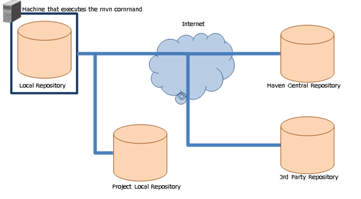

.. _`maven`:

===========================================
Information on Apache Maven
===========================================

.. contents:: Table of contents
  :depth: 3
  :local:

Using `Apache Maven(external site) <https://maven.apache.org/>`_ for module management in Nablarch is recommended.

Since Maven is also used for generating a blank project, the minimum contents including how to install that should be known are described.

What is Maven?
======================

Maven is a build tool developed by Apache Software Foundation. Maven can execute builds and unit tests with a simple configuration file (called pom.xml).

It has the following features.

.. list-table::
  :header-rows: 1
  :class: white-space-normal
  :widths: 11,20

  * - Features
    - Description
  * - Blank project generation function
    - A function to generate a blank project according to a template called an archetype.
      Nablarch projects can also be created with this function.
  * - Dependency management function
    - A function to automatically download the library, which the project depends on, from the repository.
  * - Model-based build
    - For models such as WAR and JAR that are defined in advance, they can be generated without writing a script.
  * - Easy to expand the functionality with plugins
    - Many plugins have been published.Plugins can be included to be automatically executed when compiling the project.|br|
      Standalone activation of the plugin is also possible.

Maven repository
========================

Maven fetches dependent libraries from the Maven repository.

The following are the repositories that appear when developing with Nablarch.

.. list-table::
  :header-rows: 1
  :class: white-space-normal
  :widths: 5,18

  * - Name
    - Description

  * - Local Repository
    - This repository is automatically created on the machine that runs the mvn command \ [#mvn_command]_\.
      The main role is to cache jars obtained from other repositories.

  * - Project Local Repository
    - This repository stores the jar for each project.|br|
      Used for the following applications.It is created for each project.

      * Stores modules that become common components when developing multiple modules.
      * Stores proprietary libraries. Generally, JDBC driver for a proprietary RDBMS.

  * - Maven Central Repository
    - A repository that stores modules on which Nablarch depends, various Maven plugins and various OSS.

  * - 3rd Party Repository
    - Product-specific Maven repository.
      http://maven.seasar.org/maven2/ (external site) where the jar used by gsp-dba-maven-plugin is stored, etc.

.. [#mvn_command] ``mvn`` is the command used to run Maven.

.. tip::

  The repository management tool (Artifactory, etc.) used to manage the Project Local Repository has a function to be the proxy for another repository.

  By using the proxy function, modules can be obtained via the Project Local Repository even in an environment where the machine on which the mvn command is executed cannot directly access the Internet.

How to install Maven
=======================

Install by referring to the following. For the installation version, see :ref:`firstStepPreamble`.

================= ========================================================
Site              URL
================= ========================================================
Download source   https://maven.apache.org/download.cgi (external site)
How to install    https://maven.apache.org/install.html (external site)
================= ========================================================

Although it is also described in the installation method, configure the following environment variables.

=========================== ======================================================================
Environment variable        Description
=========================== ======================================================================
JAVA_HOME                   Configure the directory where JDK is installed.
PATH                        Add the bin directory where maven is installed to the path.
=========================== ======================================================================

.. _mvnSetting:

Configuration of Maven
==============================

The following configuration is required for Maven.

* URL configuration for Project Local Repository and 3rd Party Repository repositories. This is because maven holds the URL of the Maven Central Repository only in the initial state.

Configured in <home directory>/.m2/settings.xml.

.. important::

  The maven configuration file also exists in <Maven installation location>/conf/settings.xml.

  The configuration can be included here, but if both configuration files are used together, the file that is active will not be clear leading to confusion. Use only one of the configuration files.

A configuration example of the Project Local Repository is shown below.

.. code-block:: xml

  <settings>
    <!-- Omitted -->
    <profiles>
      <profile>
        <id>my-repository</id>
        <repositories>
          <repository>
            <id>my-repository-release</id>
            <url><!-- URL of Project Local Release Repository --></url>
            <releases>
              <enabled>true</enabled>
            </releases>
            <snapshots>
              <enabled>false</enabled>
            </snapshots>
          </repository>
          <repository>
            <id>my-repository-snapshot</id>
            <url><!-- URL of Project Local Snapshot Repository --></url>
            <releases>
              <enabled>false</enabled>
            </releases>
            <snapshots>
              <enabled>true</enabled>
            </snapshots>
          </repository>
        </repositories>
        <pluginRepositories>
          <pluginRepository>
            <id>my-repository-release</id>
            <url><!-- URL of Project Local Release Repository --></url>
            <releases>
              <enabled>true</enabled>
            </releases>
            <snapshots>
              <enabled>false</enabled>
            </snapshots>
          </pluginRepository>
          <pluginRepository>
            <id>my-repository-snapshot</id>
            <url><!-- URL of Project Local Snapshot Repository --></url>
            <releases>
              <enabled>false</enabled>
            </releases>
            <snapshots>
              <enabled>true</enabled>
            </snapshots>
          </pluginRepository>
        </pluginRepositories>
      </profile>
    </profiles>

    <!-- Enable the above repository configuration. -->
    <activeProfiles>
      <activeProfile>my-repository</activeProfile>
    </activeProfiles>
    <!-- Omitted -->
  </settings>

.. tip::

  If Maven is configured to use a proxy, describe nonProxyHosts (exclusion configuration) as necessary.

  (exclusion configuration is required if the Project Local Repository is in the local network environment)

  .. code-block:: xml

    <settings>
      <!-- Omitted -->
      <proxies>
        <proxy>
          <id>proxy1</id>
          <active>true</active>
          <protocol>http</protocol>
          <host><!-- Proxy server host --></host>
          <port><!-- Proxy server port--></port>
          <nonProxyHosts>localhost|127.0.0.1|<!-- Project Local Repository --></nonProxyHosts>
        </proxy>
        <proxy>
          <id>proxy2</id>
          <active>true</active>
          <protocol>https</protocol>
          <host><!-- Proxy server host --></host>
          <port><!-- Proxy server port--></port>
          <nonProxyHosts>localhost|127.0.0.1|<!-- Project Local Repository --></nonProxyHosts>
        </proxy>
      </proxies>
      <!-- Omitted -->
    </settings>

Maven goals
===============

Specify the goal when executing Maven. A command example is as follows.

.. code-block:: bat

  mvn clean

The frequently used goals are shown below (all links in the table are links to external sites).

.. list-table::
  :header-rows: 1
  :class: white-space-normal
  :widths: 6,20

  * - Goal
    - Description
  * - `archetype:generate <https://maven.apache.org/archetype/maven-archetype-plugin/generate-mojo.html>`_
    - Used to generate a blank project. The type of projects generated is specified in run-time arguments.
  * - `clean <https://maven.apache.org/plugins/maven-clean-plugin/>`_
    - Deletes the work directory (target directory) used for the build.
  * - `Install <https://maven.apache.org/plugins/maven-install-plugin/>`_
    - Builds the module and installs it in the local repository.
  * - `test <https://maven.apache.org/guides/introduction/introduction-to-the-lifecycle.html#Lifecycle_Reference>`_
    - Executes the unit test.
  * - `package <https://maven.apache.org/guides/introduction/introduction-to-the-lifecycle.html#Lifecycle_Reference>`_
    - Generates war or jar.Which of the two is generated is determined by the configuration file (pom.xml).The goal required for war file generation, such as test, is also executed.
  * - `dependency:tree <https://maven.apache.org/plugins/maven-dependency-plugin/tree-mojo.html>`_
    - Shows the dependent modules as a tree.

.. tip::

  For general goals, see `Introduction to the Build Lifecycle(external site) <https://maven.apache.org/guides/introduction/introduction-to-the-lifecycle.html>`_.

.. _mvnFrequentlyTrouble:

Common problems with Maven
==============================================

----------------------------------------------------------------------------------------
Return code is: 503 , ReasonPhrase:Service Unavailable. is returned
----------------------------------------------------------------------------------------

The error "Return code is: 503" may be output to the console as shown below.

.. code-block:: text

  [ERROR] Failed to execute goal on project myapp-batch: Could not resolve dependencies for project com.example:myapp-batch:jar:0.1.0: Failed to collect dependencies at com.nablarch.profile:nablarch-batch:jar:1.0.4 -> com.nablarch.framework:nablarch-fw-batch:jar:1.0.0: Failed to read artifact descriptor for com.nablarch.framework:nablarch-fw-batch:jar:1.0.0: Could not transfer artifact com.nablarch.framework:nablarch-fw-batch:pom:1.0.0 from/to nablarch-example-release (http://nablarch.intra.tis.co.jp/repository/nablarch-release): Failed to transfer file: http://nablarch.intra.tis.co.jp/repository/nablarch-release/com/nablarch/framework/nablarch-fw-batch/1.0.0/nablarch-fw-batch-1.0.0.pom. Return code is: 503 , ReasonPhrase:Service Unavailable. -> [Help 1]

In this case, it is often not possible to access the Maven repository.

Check that the repository and proxy configurations are correct.

-------------------------------------------------------------------
mvn command results are not as expected
-------------------------------------------------------------------

If the results of the mvn command is not as expected (war contains unexpected files, etc.), this can be sometimes solved by closing the IDE, executing "mvn clean" and executing the goal that was originally to be executed.

This is because the following two factors are often the causes.

* IDE is using the build result automatically.
* Is referring to the result of the previous build.

.. |br| raw:: html

   