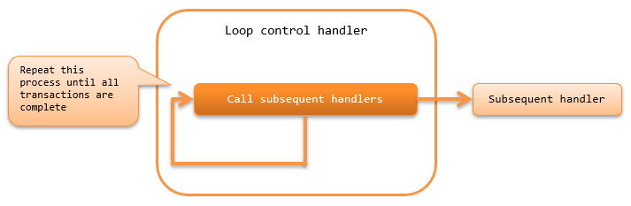

.. _dbless_loop_handler:

Loop Control Handler
==================================================
.. contents:: Table of contents
  :depth: 3
  :local:

This handler, repeatedly executing the processing of the subsequent handlers while the data to be processed is present in the data reader.

.. important::

  Batch applications that require DB connection require transaction management, so use :ref:`loop_handler` instead of this handler.

The process flow is as follows.

Handler class name
--------------------------------------------------
* :java:extdoc:`nablarch.fw.handler.DbLessLoopHandler`

Module list
--------------------------------------------------

.. code-block:: xml

  <dependency>
    <groupId>com.nablarch.framework</groupId>
    <artifactId>nablarch-fw-standalone</artifactId>
  </dependency>

Constraints
------------------------------
None.
