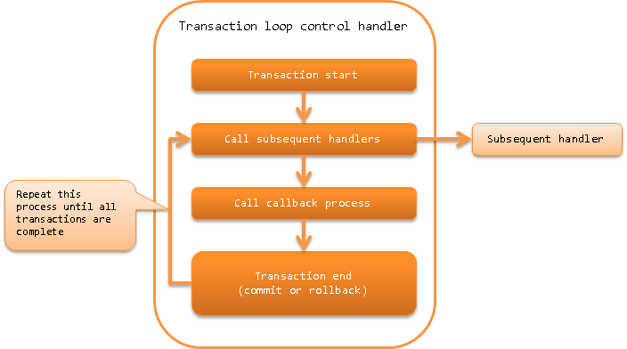

.. _loop_handler:

Transaction Loop Control Handler
==================================================
.. contents:: Table of contents
  :depth: 3
  :local:

This handler, in addition to repeatedly executing the processing of the subsequent handlers,
performs transaction control, and commits the transaction at a certain number of repetitions,
while the data to be processed is present in the data reader.
By increasing the transaction commit interval, it is possible to improve the throughput of batch processing.

* Begin a transaction
* End a transaction (commit or rollback)
* Callback at the end of the transaction

The process flow is as follows.

Handler class name
--------------------------------------------------
* :java:extdoc:`nablarch.fw.handler.LoopHandler`

Module list
--------------------------------------------------

.. code-block:: xml

  <dependency>
    <groupId>com.nablarch.framework</groupId>
    <artifactId>nablarch-fw-standalone</artifactId>
  </dependency>

  <dependency>
    <groupId>com.nablarch.framework</groupId>
    <artifactId>nablarch-core-transaction</artifactId>
  </dependency>

  <!-- Only to control transactions to the database -->
  <dependency>
    <groupId>com.nablarch.framework</groupId>
    <artifactId>nablarch-core-jdbc</artifactId>
  </dependency>

Constraints
------------------------------
Configure after :ref:`database_connection_management_handler`
  When controlling a transaction in a database, a database connection for transaction management must exist in the thread.

Configure the transaction control target
--------------------------------------------------
This handler uses the factory class ( implementation class of :java:extdoc:`TransactionFactory <nablarch.core.transaction.TransactionFactory>`)
configured in the :java:extdoc:`transactionFactory <nablarch.fw.handler.LoopHandler.setTransactionFactory(nablarch.core.transaction.TransactionFactory)>`
property to obtain the control target of the transaction and manage it on the thread.

When managing on a thread, configure a name to identify the transaction.
By default, ``transaction`` is used but to use a different name, configure the name in the :java:extdoc:`transactionName <nablarch.fw.handler.LoopHandler.setTransactionName(java.lang.String)>` property.

.. tip::

  To perform transaction control on the database configured with :ref:`database_connection_management_handler`,
  configure the same value configured in
  :java:extdoc:`DbConnectionManagementHandler#connectionName <nablarch.common.handler.DbConnectionManagementHandler.setConnectionName(java.lang.String)>`
  to :java:extdoc:`transactionName <nablarch.fw.handler.LoopHandler.setTransactionName(java.lang.String)>` property.

  If a value is not configured in :java:extdoc:`DbConnectionManagementHandler#connectionName <nablarch.common.handler.DbConnectionManagementHandler.setConnectionName(java.lang.String)>`,
  then the configuration of :java:extdoc:`transactionName <nablarch.fw.handler.LoopHandler.setTransactionName(java.lang.String)>` can be omitted.

Configure the handler by referring to the configuration file example given below.

.. code-block:: xml

  <!-- Transaction control handler -->
  <component class="nablarch.fw.handler.LoopHandler">
    <property name="transactionFactory" ref="databaseTransactionFactory" />
    <property name="transactionName" value="name" />
  </component>

  <!-- When performing the transaction control on the database, configure JdbcTransactionFactory -->
  <component name="databaseTransactionFactory"
      class="nablarch.core.db.transaction.JdbcTransactionFactory">
    <!-- Property configuration is omitted -->
  </component>

.. _loop_handler-commit_interval:

Specify the commit interval
--------------------------------------------------
Configure the commit interval for batch processing to :java:extdoc:`commitInterval <nablarch.fw.handler.LoopHandler.setCommitInterval(int)>`.
As described in the summary, the throughput of the batch process can be improved by adjusting the commit interval.

A configuration example is shown below.

.. code-block:: xml

  <component class="nablarch.fw.handler.LoopHandler">
    <!-- Specify 1000 for commit interval -->
    <property name="commitInterval" value="1000" />
  </component>

.. _loop_handler-callback:

Execute optional processing at the end of the transaction
-------------------------------------------------------------------------
This handler performs a callback process after subsequent handler processes.

The process to be called back is the handler that implements :java:extdoc:`TransactionEventCallback <nablarch.fw.TransactionEventCallback>` among the handlers configured after this handler.
If multiple handlers implement :java:extdoc:`TransactionEventCallback <nablarch.fw.TransactionEventCallback>`, then the callback process is performed sequentially from the handler that has been configured earlier.

If a subsequent handler finishes the process normally,
the callback process is executed in the same transaction as the subsequent handler. The processing performed in the callback process is collectively committed at the timing of the next commit.

If an exception or error occurs in the subsequent handlers and the transaction is rolled back,
the callback process is performed after the rollback. Therefore, the callback process is performed in a new transaction and is committed when the callback has completed successfully.

.. important::

  Note that if multiple handlers have implemented the callback process and an error or exception occurs during the callback process,
  the callback process for the remaining handlers is not performed.

An example is shown below.

Creating a handler that performs the callback process
  Create a handler that implements :java:extdoc:`TransactionEventCallback <nablarch.fw.TransactionEventCallback>` as shown in the following implementation example.

  Implement the callback process at the time of transaction commit in :java:extdoc:`transactionNormalEnd <nablarch.fw.TransactionEventCallback.transactionNormalEnd(TData,nablarch.fw.ExecutionContext)>`,
  and implement the callback process at the time of transaction rollback in :java:extdoc:`transactionAbnormalEnd <nablarch.fw.TransactionEventCallback.transactionAbnormalEnd(java.lang.Throwable,TData,nablarch.fw.ExecutionContext)>`.

  .. code-block:: java

    public static class SampleHandler
        implements Handler<Object, Object>, TransactionEventCallback<Object> {

      @Override
      public Object handle(Object o, ExecutionContext context) {
        // Implement handler processing
        return context.handleNext(o);
      }

      @Override
      public void transactionNormalEnd(Object o, ExecutionContext ctx) {
        // Implements rollback process if the subsequent handler ends normally
      }

      @Override
      public void transactionAbnormalEnd(Throwable e, Object o, ExecutionContext ctx) {
        // Implement callback process during transaction rollback
      }
    }

Build a handler queue
  Configure the handler that implements callback process in the subsequent handler of this handler as follows.

  .. code-block:: xml

    <list name="handlerQueue">
      <!-- Transaction control handler -->
      <component class="nablarch.fw.handler.LoopHandler">
        <!-- Configuration of property is omitted -->
      </component>

      <!-- Handler that implements callback process -->
      <component class="sample.SampleHandler" />
    </list>
