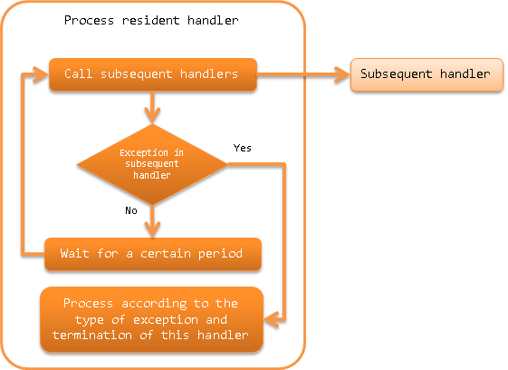

.. _process_resident_handler:

Process Resident Handler
==================================================
.. contents:: Table of contents
  :depth: 3
  :local:

A handler that repeatedly executes the contents of subsequent handler queues at regular intervals.
This handler periodically monitors the input data of a specific data source and performs batch processing and is used in the so-called resident startup type batch process.

This handler performs the following processes:

* Calls subsequent handlers at regular intervals (data monitoring intervals).
* When an exception occurs in a subsequent handler, determines the continuation of the handler.
  For details, see :ref:`process_resident_handler-exception`.

The process flow is as follows.

Handler class name
--------------------------------------------------
* :java:extdoc:`nablarch.fw.handler.ProcessResidentHandler`

Module list
--------------------------------------------------
.. code-block:: xml

  <dependency>
    <groupId>com.nablarch.framework</groupId>
    <artifactId>nablarch-fw-standalone</artifactId>
  </dependency>

Constraints
------------------------------
This handler must be configured after the retry handler.
  If a runtime exception is caught by this handler, rethrows after wrapping it with a retryable exception ( :java:extdoc:`RetryableException <nablarch.fw.handler.retry.RetryableException>` ) and delegates the process continuation control to retry_handler.
  Therefore, this handler must be configured after the retry handler.

Configure the data monitoring interval
--------------------------------------------------
Data monitoring interval is configured in milliseconds in the :java:extdoc:`dataWatchInterval <nablarch.fw.handler.ProcessResidentHandler.setDataWatchInterval(int)>` property.
The default value when the configuration is omitted is 1000 milliseconds (1 second).

An example is shown below.

.. code-block:: xml

  <component name="settingsProcessResidentHandler"
      class="nablarch.fw.handler.ProcessResidentHandler">

    <!-- Configure 5 seconds (5000) for data monitoring interval -->
    <property name="dataWatchInterval" value="5000" />
    <!-- Other properties are omitted -->
  </component>

.. _process_resident_handler-normal_end:

How to terminate the process resident handler
--------------------------------------------------
This handler stops subsequent handler calls and terminates processing if an exception indicating the normal termination of the process has been thrown.
By default, this handler ends when the :ref:`process_stop_handler` processing stop exception ( :java:extdoc:`ProcessStop <nablarch.fw.handler.ProcessStopHandler.ProcessStop>` (including subclasses)) is thrown.

To change the exception that indicates successful completion of a process, configure the :java:extdoc:`normalEndExceptions <nablarch.fw.handler.ProcessResidentHandler.setNormalEndExceptions(java.util.List)>` property to a list of exception classes.
When the exception list is configured, the default configuration is overwritten, and :java:extdoc:`ProcessStop <nablarch.fw.handler.ProcessStopHandler.ProcessStop>` has to be configured without fail.

An example is shown below.

.. code-block:: xml

  <component name="settingsProcessResidentHandler"
      class="nablarch.fw.handler.ProcessResidentHandler">

    <!-- Exception list indicating the normal termination of the process -->
    <property name="normalEndExceptions">
      <list>
        <!-- Exception class indicating default process stop of Nablarch -->
        <value>nablarch.fw.handler.ProcessStopHandler$ProcessStop</value>
        <!-- Exception class indicating project custom process stop (subclasses are also covered) -->
        <value>sample.CustomProcessStop</value>
      </list>
    </property>

    <!-- Other properties are omitted -->
  </component>

.. _process_resident_handler-exception:

Handling exceptions that occur in subsequent handlers
--------------------------------------------------------------------
In this handler, processing is switched between continuation or termination depending on the type of exception that has occurred in the subsequent handler.

The following shows the processing details of each exception.

Exception during service shutdown( :java:extdoc:`ServiceUnavailable <nablarch.fw.results.ServiceUnavailable>` )
  In the case of an exception during service shutdown, executes the subsequent handler again after waiting for the time set in the data monitoring interval.

Retryable exception
  In the case of retryable exception ( :java:extdoc:`RetryUtil#isRetryable() <nablarch.fw.handler.retry.RetryUtil.isRetryable(java.lang.Throwable)>` returns true), rethrows the exception that is caught without doing anything.

Exception that terminates the process abnormally
  For exceptions indicating abnormal termination, rethrows the caught exception without doing anything.

  Configure exceptions that terminates the process abnormally to the :java:extdoc:`abnormalEndExceptions <nablarch.fw.handler.ProcessResidentHandler.setAbnormalEndExceptions(java.util.List)>` property.
  By default, :java:extdoc:`ProcessAbnormalEnd <nablarch.fw.launcher.ProcessAbnormalEnd>` (including subclasses) is the target class for abnormal termination.

Exception that terminates the process normally
  The process ends with the result object returned from the subsequent handler as the return value of this handler.

  See :ref:`process_resident_handler-normal_end` for the exception that terminates the process normally.

Exceptions other than the above
  Records the exception information in the log, and rethrows after wrapping with retryable exception ( :java:extdoc:`RetryableException <nablarch.fw.handler.retry.RetryableException>` ).

