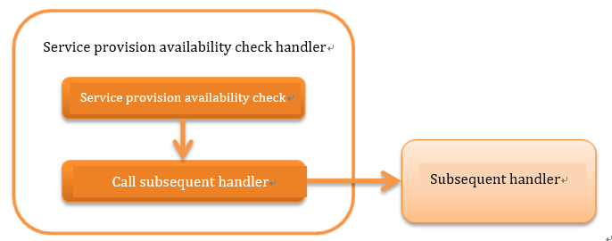

.. _`ServiceAvailabilityCheckHandler`:

Service Availability Check Handler
=============================================

.. contents:: Table of contents
  :depth: 3
  :local:

This handler performs :ref:`ServiceAvailabilityCheckHandler-request_checking`.

The service availability check is performed using :ref:`service_availability` from the library.
To use this handler,
it is necessary to configure a class that implements :java:extdoc:`ServiceAvailability <nablarch.common.availability.ServiceAvailability>` in this handler.

This handler performs the following process.

* Service availability check

The process flow is as follows.

Handler class name
--------------------------------------------------
* :java:extdoc:`nablarch.common.availability.ServiceAvailabilityCheckHandler`

Module list
--------------------------------------------------
.. code-block:: xml

  <dependency>
    <groupId>com.nablarch.framework</groupId>
    <artifactId>nablarch-common-auth</artifactId>
  </dependency>

Constraints
------------------------------
Place after :ref:`thread_context_handler`
  Since this handler performs service availability check based on the request ID set in the thread context,
  this handler must be placed after :ref:`thread_context_handler`.

Place after :ref:`forwarding_handler`
  To perform a service availability check based on the request ID of the forward destination ( :ref:`Internal Request ID <internal_request_id>` ) when an internal forward is performed,
  this handler must be placed after :ref:`forwarding_handler`.
  In addition, add :java:extdoc:`InternalRequestIdAttribute <nablarch.common.handler.threadcontext.InternalRequestIdAttribute>` to ``attributes`` of :ref:`thread_context_handler` .

.. _ServiceAvailabilityCheckHandler-request_checking:

Service availability check for request
--------------------------------------------------------------
Get the request ID from :java:extdoc:`ThreadContext <nablarch.core.ThreadContext>` to perform service availability check.
For details of check, see :ref:`service_availability`.

If OK (service can be provided)
 Call the subsequent handler.

If Not OK (service cannot be provided)
 :java:extdoc:`ServiceUnavailable <nablarch.fw.results.ServiceUnavailable>` (503) is thrown.

To change the request ID of the check target to the forward request ID, specify "true" in
:java:extdoc:`ServiceAvailabilityCheckHandler.setUsesInternalRequestId <nablarch.common.availability.ServiceAvailabilityCheckHandler.setUsesInternalRequestId(boolean)>`.
The default is "false".

