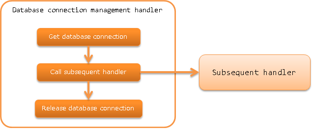

.. _database_connection_management_handler:

Database Connection Management Handler
==================================================

.. contents:: Table of contents
  :depth: 3
  :local:

This handler manages the database connection on the thread for use by the subsequent handler and library.

For details of database access, see :ref:`database`.

.. important::

  :ref:`transaction_management_handler` has to be configured to use this handle.
  Since the transaction control is not implemented if the transaction control handler is not configured, all subsequent changes to the database will be discarded.

This handler performs the following process.

* Get a database connection
* Release the database connection

The process flow is as follows.

Handler class name
--------------------------------------------------
* :java:extdoc:`nablarch.common.handler.DbConnectionManagementHandler`

Module list
--------------------------------------------------
.. code-block:: xml

  <dependency>
    <groupId>com.nablarch.framework</groupId>
    <artifactId>nablarch-core-jdbc</artifactId>
  </dependency>
  <dependency>
    <groupId>com.nablarch.framework</groupId>
    <artifactId>nablarch-common-jdbc</artifactId>
  </dependency>

Constraints
------------------------------
None.

Configure the connection destination of the database
-------------------------------------------------------------
This handler gets the database connection using the factory class (:java:extdoc:`ConnectionFactory <nablarch.core.db.connection.ConnectionFactory>` implementation class)
configured in the :java:extdoc:`connectionFactory <nablarch.common.handler.DbConnectionManagementHandler.setConnectionFactory(nablarch.core.db.connection.ConnectionFactory)>` property.

Refer to the following configuration file example to configure the factory class in the
:java:extdoc:`connectionFactory <nablarch.common.handler.DbConnectionManagementHandler.setConnectionFactory(nablarch.core.db.connection.ConnectionFactory)>` property.

.. code-block:: xml

  <!-- Database connection management handler -->
  <component class="nablarch.common.handler.DbConnectionManagementHandler">
    <property name="connectionFactory" ref="connectionFactory" />
  </component>

  <!-- Configuration of the factory class that acquires the database connection object -->
  <component name="connectionFactory"
      class="nablarch.core.db.connection.BasicDbConnectionFactoryForDataSource">
    <!-- Property configuration is omitted -->
  </component>

.. important::

  For details on the factory class to obtain the database connection object, see :ref:`database-connect`.

Use Multiple Database Connections (Transactions) in an Application
----------------------------------------------------------------------------------------------------
There may be cases where one application requires multiple database connections.
In this case, multiple handlers are configured on the handler queue to manage the situation.

This handler manages the database connection object on the thread with a database connection name.
Database connection names in a thread must be unique.

The database connection name is configured in the :java:extdoc:`connectionName <nablarch.common.handler.DbConnectionManagementHandler.setConnectionName(java.lang.String)>`
property of this handler. If the configuration to
:java:extdoc:`connectionName <nablarch.common.handler.DbConnectionManagementHandler.setConnectionName(java.lang.String)>` is omitted,
this connection will become the default database connection and can be used easily.
For this reason, configure the most frequently used database connection as the default, and assign arbitrary names to other database connections.

A configuration example for the database connection name is shown below.

.. code-block:: xml

  <!-- Factory configuration to get the database connection is omitted -->

  <!-- Configure the default database connection  -->
  <component class="nablarch.common.handler.DbConnectionManagementHandler">
    <property name="connectionFactory" ref="connectionFactory" />
  </component>

  <!-- Register the database connection with the name userAccessLog -->
  <component class="nablarch.common.handler.DbConnectionManagementHandler">
    <property name="connectionFactory" ref="userAccessLogConnectionFactory" />
    <property name="connectionName" value="userAccessLog" />
  </component>

The following is an example of database access from an application with the handler settings mentioned above.
For details on how to use the database access components, see :ref:`database`.

Use the default database connection
  An argument is not required to be specified when calling :java:extdoc:`DbConnection#getConnection <nablarch.core.db.connection.DbConnectionContext.getConnection()>`.
  If an argument is not specified, the default database connection is returned automatically.

  .. code-block:: java

    AppDbConnection connection = DbConnectionContext.getConnection();

Use the userAccessLog database connection
  Use :java:extdoc:`DbConnection#getConnection(String) <nablarch.core.db.connection.DbConnectionContext.getConnection(java.lang.String)>` and specify the database connection name in the argument.
  The database connection name must match the value configured in the :java:extdoc:`connectionName <nablarch.common.handler.DbConnectionManagementHandler.setConnectionName(java.lang.String)>` property.

  .. code-block:: java

    AppDbConnection connection = DbConnectionContext.getConnection("userAccessLog");
