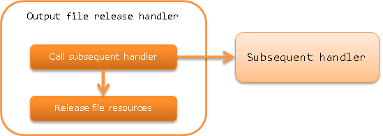

.. _file_record_writer_dispose_handler:

Output File Release Handler
========================================

.. contents:: Table of contents
  :depth: 3
  :local:

This handler closes the output file opened by business action or handler (release resources).

.. important::

  The release target for this handler is the output file opened using :java:extdoc:`FileRecordWriterHolder <nablarch.common.io.FileRecordWriterHolder>`.
  Close the resources opened using other APIs (for example: `java.io` package) individually.

The process flow is as follows.

Handler class name
--------------------------------------------------
* :java:extdoc:`nablarch.common.io.FileRecordWriterDisposeHandler`

Module list
--------------------------------------------------
.. code-block:: xml

  <!-- General data format -->
  <dependency>
    <groupId>com.nablarch.framework</groupId>
    <artifactId>nablarch-core-dataformat</artifactId>
  </dependency>

Constraints
------------------------------
None

Configuration to the handler queue
--------------------------------------------------
This handler automatically closes the output file opened by the subsequent handlers and business actions just by configuring it on the handler queue.
Therefore, this handler must be configured before all the handlers that perform file output.

