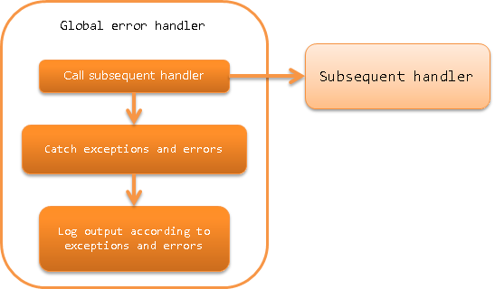

.. _global_error_handler:

Global Error Handler
========================================
.. contents:: Table of contents
  :depth: 3
  :local:

This handler catches uncaught exceptions and errors that occur in the subsequent handler, performs log output and returns a result.

The process flow is as follows.

Handler class name
--------------------------------------------------
* :java:extdoc:`nablarch.fw.handler.GlobalErrorHandler`

Module list
--------------------------------------------------
.. code-block:: xml

  <dependency>
    <groupId>com.nablarch.framework</groupId>
    <artifactId>nablarch-fw</artifactId>
  </dependency>

Constraints
--------------------------------------------------

This handler should be placed at the beginning of the handler queue as far as possible
  Since this handler processes exceptions, it should be placed at the start of the handler queue as far as possible, unless there is a particular reason.

  If an exception has occurred in a handler that is placed before this handler, exception handling will be performed by the web application server or JVM.

  If you want to output thread context information to the log when an exception is raised, put it after :ref:`thread_context_clear_handler`.

Process details according to the exceptions and errors
-------------------------------------------------------------------------
This handler generates the following process and results depending on the contents of the exceptions and errors that are caught.

Process details according to the exception
  .. list-table::
    :header-rows: 1
    :class: white-space-normal
    :widths: 25 75

    * - Exception class
      - Process details

    * - :java:extdoc:`ServiceError <nablarch.fw.results.ServiceError>`

        (Including subclass)

      - Calls :java:extdoc:`ServiceError#writeLog <nablarch.fw.results.ServiceError.writeLog(nablarch.fw.ExecutionContext)>` and outputs log.

        The log level differs depending on the implementation class of :java:extdoc:`ServiceError <nablarch.fw.results.ServiceError>`.

        After log output, returns :java:extdoc:`ServiceError <nablarch.fw.results.ServiceError>` as the processing result of the handler.

    * - :java:extdoc:`Result.Error <nablarch.fw.Result.Error>`

        (Including subclass)

      - Performs FATAL level log output.

        After log output, returns :java:extdoc:`Result.Error <nablarch.fw.Result.Error>` as the processing result of the handler.

    * - Exception classes other than the above

      - Performs FATAL level log output.

        After log output, generates :java:extdoc:`InternalError <nablarch.fw.results.InternalError>` with the exception that is caught as the cause and returns it as the processing result of the handler.

Process details according to the error
  .. list-table::
    :header-rows: 1
    :class: white-space-normal
    :widths: 25 75

    * - Error class
      - Process details

    * - :java:extdoc:`ThreadDeath <java.lang.ThreadDeath>`

        (Including subclass)

      - Performs INFO level log output.

        After log output, the error that has been caught is rethrown.

    * - :java:extdoc:`StackOverflowError <java.lang.StackOverflowError>`

        (Including subclass)

      - Performs FATAL level log output.

        After log output, generates :java:extdoc:`InternalError <nablarch.fw.results.InternalError>` with the error that has been caught as the cause and returns it as the processing result of the handler.

    * - :java:extdoc:`OutOfMemoryError <java.lang.OutOfMemoryError>`

        (Including subclass)

      - Performs FATAL level log output.

        Since there is a possibility that FATAL level log output may fail (`OutOfMemoryError` may reoccur), the occurrence of `OutOfMemoryError` is output to the standard error output before the log output.

        After log output, generates :java:extdoc:`InternalError <nablarch.fw.results.InternalError>` with the error that has been caught as the cause and returns it as the processing result of the handler.

    * - :java:extdoc:`VirtualMachineError <java.lang.VirtualMachineError>`

        (Including subclass)

      - Performs FATAL level log output.

        After log output, the error that has been caught is rethrown.

        .. tip::

          Classes other than :java:extdoc:`StackOverflowError <java.lang.StackOverflowError>` and :java:extdoc:`OutOfMemoryError <java.lang.OutOfMemoryError>` are covered.

    * - Error classes other than the above

      - Performs FATAL level log output.

        After log output, generates :java:extdoc:`InternalError <nablarch.fw.results.InternalError>` with the error that has been caught as the cause and returns it as the processing result of the handler.

If the global error handler cannot satisfy the requirements
-------------------------------------------------------------------------
The implementation cannot be switched by configuration for this handler.
For this reason, a project-specific error processing handler has to be created
if the requirements cannot be satisfied with this implementation.

For example, a new handler may be created instead of using this handler to switch the log level in detail.

