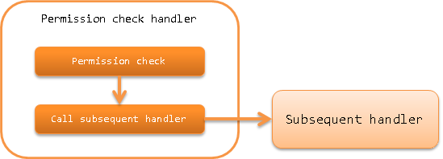

.. _`permission_check_handler`:

Permission Check Handler
=======================================

.. contents:: Table of contents
  :depth: 3
  :local:

This handler performs :ref:`permission_check_handler-request_checking`.

The permission check is performed using :ref:`permission_check` from the library.
Therefore, to use this handler, it is necessary to configure a class that implements :java:extdoc:`PermissionFactory <nablarch.common.permission.PermissionFactory>` in this handler.

This handler performs the following process.

* Permission check

The process flow is as follows.

Handler class name
--------------------------------------------------
* :java:extdoc:`nablarch.common.permission.PermissionCheckHandler`

Module list
--------------------------------------------------
.. code-block:: xml

  <dependency>
    <groupId>com.nablarch.framework</groupId>
    <artifactId>nablarch-common-auth</artifactId>
  </dependency>

Constraints
------------------------------
Place after :ref:`thread_context_handler`
  Since this handler performs permission check based on the request ID and user ID set in the thread context,
  this handler must be placed after :ref:`thread_context_handler`.

Place after :ref:`forwarding_handler`
  To perform an permission check based on the request ID of the forward destination ( :ref:`Internal Request ID <internal_request_id>` ) when an internal forward is performed,
  this handler must be placed after :ref:`forwarding_handler`.
  In addition, add :java:extdoc:`InternalRequestIdAttribute <nablarch.common.handler.threadcontext.InternalRequestIdAttribute>` to ``attributes`` of :ref:`thread_context_handler` .

Place after :ref:`http_error_handler`
  To specify the error page to be displayed when a permission check error occurs,
  this handler must be placed after :ref:`http_error_handler`.

.. _permission_check_handler-request_checking:

Permission check for request
--------------------------------------------------------------
Check whether the logged-in user has permission for the current request (request ID).
For details of check, see :ref:`permission_check`.

If permission is available
 :java:extdoc:`Permission <nablarch.common.permission.Permission>` used for permission check is configured in the thread local
 so that it can be referenced by :ref:`business logic <permission_check-server_side_check>` and :ref:`screen display control <permission_check-view_control>`.
 Then the subsequent handler is called.

If permission is not available
 :java:extdoc:`Forbidden(403) <nablarch.fw.results.Forbidden>` is thrown.

To change the request ID of the check target to the forward request ID, specify "true" in
:java:extdoc:`PermissionCheckHandler.setUsesInternalRequestId <nablarch.common.permission.PermissionCheckHandler.setUsesInternalRequestId(boolean)>`.
The default is "false".

Specify the error page to be displayed when permission is not available
----------------------------------------------------------------------------------------
The error page displayed when permission is not available is specified in the HTTP error control handler.
For more information, see :ref:`HttpErrorHandler_DefaultPage`.

Exclude specific requests from permission check
--------------------------------------------------------------
If there are requests to be excluded from permission check, such as requests before login, they are specified in
:java:extdoc:`PermissionCheckHandler.setIgnoreRequestIds <nablarch.common.permission.PermissionCheckHandler.setIgnoreRequestIds(java.lang.String...)>`.

.. code-block:: xml

  <component name="permissionCheckHandler"
             class="nablarch.common.permission.PermissionCheckHandler">
    <property name="permissionFactory" ref="permissionFactory"/>
    <!-- Specify request IDs to be excluded from permission check separated by commas -->
    <property name="ignoreRequestIds" value="/action/login,/action/logout" />
  </component>
