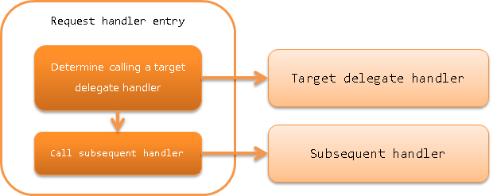

.. _request_handler_entry:

Request Handler Entry
========================================
.. contents:: Table of contents
  :depth: 3
  :local:

This handler is a special handler that calls a delegate handler only for a specific request path. By using this handler,
it is possible to implement functions such as "handler processing is performed only for a specific URL in the web application"
without modifying the handler.

The main purpose of this handler is to implement the "batch process for downloading of static contents" function using :ref:`resource_mapping`.
In addition, this handler can also be used for purposes such as "changing the database connection that uses only a specific URL"
by using the handler together with :ref:`database_connection_management_handler` and :ref:`transaction_management_handler`.

This handler performs the following process.

* Determine whether the request path matches and call the delegate handler if it is a target.

The process flow is as follows.

Handler class name
--------------------------------------------------
* :java:extdoc:`nablarch.fw.RequestHandlerEntry`

Module list
--------------------------------------------------
.. code-block:: xml

  <dependency>
    <groupId>com.nablarch.framework</groupId>
    <artifactId>nablarch-core</artifactId>
  </dependency>

Constraints
------------------------------
None.

.. _request_handler_entry_usage:

Usage example of this handler
-----------------------------------

When using this handler, the ``requestPattern`` property that specifies the request path for processing,
and the ``handler`` property that specifies the delegate handler are configured.

A configuration example for downloading the static contents of JPEG files using :ref:`resource_mapping` is shown below.

.. code-block:: xml

  <!-- Handler for downloading static resources of image files-->
  <component name="imgMapping"
             class="nablarch.fw.web.handler.ResourceMapping">
    <property name="baseUri" value="/"/>
    <property name="basePath" value="servlet:///"/>
  </component>

  <!-- Handler queue configuration -->
  <component name="webFrontController"
             class="nablarch.fw.web.servlet.WebFrontController">

    <property name="handlerQueue">
      <list>

        <component class="nablarch.fw.handler.GlobalErrorHandler"/>
        <component class="nablarch.fw.web.handler.HttpCharacterEncodingHandler"/>
        <component class="nablarch.common.io.FileRecordWriterDisposeHandler" />
        <component class="nablarch.fw.web.handler.HttpResponseHandler"/>

        <!-- Configuration for downloading static JPG files with the file extension ".jpg"-->
        <component class="nablarch.fw.RequestHandlerEntry">
          <property name="requestPattern" value="//*.jpg"/>
          <property name="handler" ref="imgMapping"/>
        </component>

        <!--
          For requests other than downloading JPEG files ending with "*.jpg",
          the following handler is called
          -->
        <component-ref name="multipartHandler"/>
        <component-ref name="sessionStoreHandler" />

Variation of request pattern specification
--------------------------------------------------

As seen from the configuration example of :ref:`request_handler_entry_usage`, the ``requestPattern`` property specified in this handler
can be configured in a format similar to Glob expression such as ``//*.jpg``.

A configuration example for wildcard is shown below.

       +----------------+------------------+-------------------------------------------+
       | requestPattern | Request path     | Results                                   |
       +================+==================+===========================================+
       | /              |  /               | Is called                                 |
       |                +------------------+-------------------------------------------+
       |                |  /index.jsp      | Is not called                             |
       +----------------+------------------+-------------------------------------------+
       | /*             | /                | Is called                                 |
       |                +------------------+-------------------------------------------+
       |                | /app             | Is called                                 |
       |                +------------------+-------------------------------------------+
       |                | /app/            | Is not called (* does not match '/')      |
       |                +------------------+-------------------------------------------+
       |                | /index.jsp       | Is not called (* does not match '.')      |
       +----------------+------------------+-------------------------------------------+
       | /app/\*.jsp    | /app/index.jsp   | Is called                                 |
       |                +------------------+-------------------------------------------+
       |                | /app/admin       | Is not called                             |
       +----------------+------------------+-------------------------------------------+
       | /app/\*/test   | /app/admin/test  | Is called                                 |
       |                +------------------+-------------------------------------------+
       |                | /app/test/       | Is not called                             |
       +----------------+------------------+-------------------------------------------+

When the '/' in the last line is overlapped with '//', a notation determining that the match is successful if the string before is a forward match can also be used.

A configuration example is shown below.

       +----------------+-------------------------+-------------------------------------------+
       | requestPattern | Request path            | Results                                   |
       +================+=========================+===========================================+
       | /app//         | /                       | Is not called                             |
       |                +-------------------------+-------------------------------------------+
       |                | /app/                   | Is called                                 |
       |                +-------------------------+-------------------------------------------+
       |                | /app/admin/             | Is called                                 |
       |                +-------------------------+-------------------------------------------+
       |                | /app/admin/index.jsp    | Is called                                 |
       +----------------+-------------------------+-------------------------------------------+
       | //\*.jsp       | /app/index.jsp          | Is called                                 |
       |                +-------------------------+-------------------------------------------+
       |                | /app/admin/index.jsp    | Is called                                 |
       |                +-------------------------+-------------------------------------------+
       |                | /app/index.html         | Is not called (does not match '\*.jsp')   |
       +----------------+-------------------------+-------------------------------------------+
