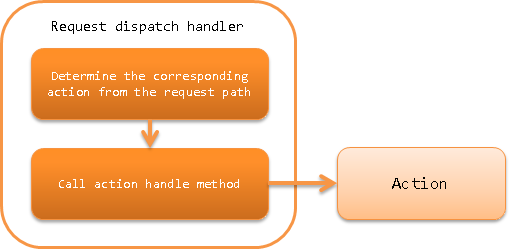

.. _request_path_java_package_mapping:

Request Dispatch Handler
========================================
.. contents:: Table of contents
  :depth: 3
  :local:

This handler delegates processing to an action that describes the process to be performed for each function of the application.
This handler is mainly a function for :ref:`messaging <messaging>`, and is used for dispatching to an arbitrary action.

In this handler, the dispatch destination action is selected based on the request path acquired by
:java:extdoc:`Request#getRequestPath() <nablarch.fw.Request.getRequestPath()>`.
The request path format assumes the following:

Request path format\: /\<basePath\>/\<className\>

Each of the parts enclosed by \<\> in the format above have the following meanings.

============= =================================================================
Label         Meaning
============= =================================================================
basePath      Base path representing the dispatch target
className     Class name (required)
============= =================================================================

For example, when calling the class ``xxx.yyy.ExampleBatchAction``,
if the base path is ``batch``, specify a request path like ``/batch/ExampleBatchAction``.

.. important::
  Normally, the request path acquired by :java:extdoc:`Request#getRequestPath() <nablarch.fw.Request.getRequestPath()>` is
  specified by the ``-requestPath`` option when launched in the command line as described in :ref:`main`.

This handler performs the following process.

* Parses the request path and calls the handle method of the corresponding action.

The process flow is as follows.

Handler class name
--------------------------------------------------
* :java:extdoc:`nablarch.fw.handler.RequestPathJavaPackageMapping`

Module list
--------------------------------------------------
.. code-block:: xml

  <dependency>
    <groupId>com.nablarch.framework</groupId>
    <artifactId>nablarch-fw</artifactId>
  </dependency>

Constraints
------------------------------

None

.. _request_path_java_package_mapping_path_setting:

Base package and base path settings
------------------------------------------------------------

The base package for placing the dispatch destination class of this handler,
and the base path added to the request path can be configured with the properties ``basePackage`` and ``basePath``.

An example of configuring the base package to ``nablarch.application`` and the base path to ``/app/action`` is shown below.

.. code-block:: xml

  <component class="nablarch.fw.handler.RequestPathJavaPackageMapping">
    <property name="basePath"    value="/app/action/" />
    <property name="basePackage" value="nablarch.application" />
  </component>

.. _request_path_java_package_mapping_multi_package_dispatch:

Dispatch to classes of multiple packages
------------------------------------------------------------------------------------------------------------------------

When dispatching using this handler, multiple dispatch destination classes can be allotted by specifying the request path.
At this time, specify the relative package name from the base package in the location where the class name is specified with the request path.

For example, when :ref:`request_path_java_package_mapping_path_setting` is configured,
specify ``/app/action/xxx/ExampleBatchAction`` in the request path when dispatching to the ``nablarch.application.xxx.ExampleBatchAction`` class.

Configuration of class name prefix and suffix
------------------------------------------------------------------------------------------------------------------------

If you do not want to provide a class name prefix and suffix in the request path,
the specification in the request path can be omitted by configuring ``classNamePrefix`` and ``classNameSuffix`` of this handler.

For example, when following the rule that specifies ``XxxProject`` as the prefix and ``BatchAction`` as the suffix,
for a class name ``XxxProjectXxxxBatchAction``, the request path can be omitted like ``/app/action/Xxxx`` by configuring as follows:

.. code-block:: xml

  <component class="nablarch.fw.handler.RequestPathJavaPackageMapping">
    <property name="basePath"    value="/app/action/" />
    <property name="basePackage" value="nablarch.application" />
    <property name="classNamePrefix" value="XxxProject" />
    <property name="classNameSuffix" value="BatchAction" />
  </component>

.. _request_path_java_package_mapping_optional_package_dispatch:

Dispatch to complex packages
------------------------------------------------------------------------------------------------------------------------

The method shown in :ref:`request_path_java_package_mapping_multi_package_dispatch` has a constraint that
"the packages where actions are placed must be grouped into sub-packages under the same package".
This handler provides a method for separately configuring the package in which actions are placed for each request path when there is a problem with such a dispatch.

Consider an example where the following request path and dispatch destination are configured.

========================================== ======================================
Request path                               Class to be dispatched
========================================== ======================================
/admin/AdminApp                            nablarch.sample.apps1.admin.AdminApp
/user/UserApp                              nablarch.sample.apps2.user.UserApp
/BaseApp                                   nablarch.sample.base.BaseApp
========================================== ======================================

To perform such a dispatch, the ``optionalPackageMappingEntries`` is configured using the
:java:extdoc:`JavaPackageMappingEntry <nablarch.fw.handler.JavaPackageMappingEntry>` class as follows.

.. code-block:: xml

  <component class="nablarch.fw.handler.RequestPathJavaPackageMapping">
      <property name="optionalPackageMappingEntries">
        <!-- Describe the combination of the request path pattern and Java package in the order to be matched. -->
        <list>
          <component class="nablarch.fw.handler.JavaPackageMappingEntry">
            <property name="requestPattern" value="/admin//" />
            <property name="basePackage" value="nablarch.sample.apps1" />
          </component>
          <component class="nablarch.fw.handler.JavaPackageMappingEntry">
            <property name="requestPattern" value="/user//" />
            <property name="basePackage" value="nablarch.sample.apps2" />
          </component>
        </list>
      </property>
      <!-- Java package used when there is no match for optionalPackageMappingEntries -->
      <property name="basePackage" value="nablarch.sample.base" />
  </component>

.. _request_path_java_package_mapping_optional_immediate:

Lazy execution of the class to be dispatched
------------------------------------------------------------------------------------------------------------------------

By default, delegation to the dispatched class is performed immediately.
If you want to delegate to the dispatched class after the execution of subsequent handlers on the handler queue, set the ``immediate`` property to false by referring to the following example.

.. code-block:: xml

    <component class="nablarch.fw.handler.RequestPathJavaPackageMapping">
      <property name="basePackage" value="${nablarch.commonProperty.basePackage}" />
      <property name="immediate" value="false" />
    </component>
