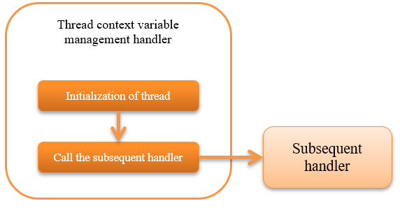

.. _thread_context_handler:

Thread Context Variable Management Handler
================================================

.. contents:: Table of contents
  :depth: 3
  :local:

This handler performs the initialization process for each attribute value of thread context for each request.

Thread context is a mechanism for storing shared values within the same processing thread, 
such as request ID and user ID, in the thread local area.

.. important::
  Use :ref:`thread_context_clear_handler`  to delete the value in the thread-local configured by this handler in response processing.
  Since the value cannot be obtained if the thread context is accessed by the handler before this handler in request processing,
  be careful that the thread context is not accessed before this handler.

.. tip::
 Many of the thread context attribute values are configured by this handler, 
 but it is also possible to set arbitrary variables from handlers other than this handler and business actions.

This handler performs the following process.

* :ref:`thread_context_handler-initialization`

The process flow is as follows.

Handler class name
--------------------------------------------------
* :java:extdoc:`nablarch.common.handler.threadcontext.ThreadContextHandler`

Module list
--------------------------------------------------
.. code-block:: xml

  <dependency>
    <groupId>com.nablarch.framework</groupId>
    <artifactId>nablarch-fw</artifactId>
  </dependency>

  <!-- Only when creating a screen to select a language or time zone with internationalization  -->
  <dependency>
    <groupId>com.nablarch.framework</groupId>
    <artifactId>nablarch-fw-web</artifactId>
  </dependency>

Constraints
---------------------------------------
None.

.. _thread_context_handler-initialization:

Initialize the thread context for each request
-----------------------------------------------------------
Initializes the thread context using a class that implements :java:extdoc:`ThreadContextAttribute interface <nablarch.common.handler.threadcontext.ThreadContextAttribute>`.

The following classes are provided by default:

Request ID, internal request ID
 * :java:extdoc:`RequestIdAttribute <nablarch.common.handler.threadcontext.RequestIdAttribute>`
 * :java:extdoc:`InternalRequestIdAttribute <nablarch.common.handler.threadcontext.InternalRequestIdAttribute>`

User ID
 * :java:extdoc:`UserIdAttribute <nablarch.common.handler.threadcontext.UserIdAttribute>`
 * :java:extdoc:`UserIdAttributeInSessionStore <nablarch.common.web.handler.threadcontext.UserIdAttributeInSessionStore>`

Language
 * :java:extdoc:`LanguageAttribute <nablarch.common.handler.threadcontext.LanguageAttribute>`
 * :java:extdoc:`HttpLanguageAttribute <nablarch.common.web.handler.threadcontext.HttpLanguageAttribute>`
 * :java:extdoc:`LanguageAttributeInHttpCookie <nablarch.common.web.handler.threadcontext.LanguageAttributeInHttpCookie>`
 * :java:extdoc:`LanguageAttributeInHttpSession <nablarch.common.web.handler.threadcontext.LanguageAttributeInHttpSession>`

Time zone
 * :java:extdoc:`TimeZoneAttribute <nablarch.common.handler.threadcontext.TimeZoneAttribute>`
 * :java:extdoc:`TimeZoneAttributeInHttpCookie <nablarch.common.web.handler.threadcontext.TimeZoneAttributeInHttpCookie>`
 * :java:extdoc:`TimeZoneAttributeInHttpSession <nablarch.common.web.handler.threadcontext.TimeZoneAttributeInHttpSession>`

Execution ID
 * :java:extdoc:`ExecutionIdAttribute <nablarch.common.handler.threadcontext.ExecutionIdAttribute>`

These classes are used by adding definitions to the component configuration file.

.. code-block:: xml

 <component class="nablarch.common.handler.threadcontext.ThreadContextHandler">
   <property name="attributes">
     <list>

       <!-- Request ID -->
       <component class="nablarch.common.handler.threadcontext.RequestIdAttribute" />

       <!-- Internal request ID -->
       <component class="nablarch.common.handler.threadcontext.InternalRequestIdAttribute" />

       <!-- User ID -->
       <component class="nablarch.common.handler.threadcontext.UserIdAttribute">
         <property name="sessionKey"  value="user.id" />
         <property name="anonymousId" value="guest" />
       </component>

       <!-- Language -->
       <component class="nablarch.common.handler.threadcontext.LanguageAttribute">
         <property name="defaultLanguage" value="ja" />
       </component>

       <!-- Time zone -->
       <component class="nablarch.common.handler.threadcontext.TimeZoneAttribute">
         <property name="defaultTimeZone" value="Asia/Tokyo" />
       </component>

       <!-- Execution ID -->
       <component class="nablarch.common.handler.threadcontext.ExecutionIdAttribute" />
     </list>
   </property>
 </component>

.. _thread_context_handler-user_id_attribute_setting:

Setting a User ID
^^^^^^^^^^^^^^^^^^^^^^^^^^^^^^^^^^^^^^^^^^^^^^^^^^^^^^^^^^
:java:extdoc:`UserIdAttributeInSessionStore <nablarch.common.web.handler.threadcontext.UserIdAttributeInSessionStore>` gets the user ID from the session store by default.
Because the framework does not set the user ID in the session store, it must be set in the application in the login process and so on.
By default, "user.id" is used as the key for setting the user ID in the session store.
To overwrite it, set the value to the :java:extdoc:`UserIdAttribute#sessionKey <nablarch.common.handler.threadcontext.UserIdAttribute.setSessionKey(java.lang.String)>`.
The following is an example of how to override "login_id".

.. code-block:: xml

  <component name="threadContextHandler" class="nablarch.common.handler.threadcontext.ThreadContextHandler">
    <property name="attributes">
      <list>
        <!-- User ID -->
        <component class="nablarch.common.web.handler.threadcontext.UserIdAttributeInSessionStore">
          <property name="sessionKey" value="login_id"/>
          <property name="anonymousId" value="${nablarch.userIdAttribute.anonymousId}"/>
        </component>
        <!-- Other component definitions are omitted. -->
      </list>
    </property>
  </component>

The following is an example implementation of setting the user ID in the session store with a default key.

.. code-block:: java

  SessionUtil.put(context, "user.id", userId);

Also, instead of storing the user ID directly in the session store, you may want to store the login information together.
In that case, the user ID can be obtained from an arbitrary source by overriding
:java:extdoc:`UserIdAttribute#getUserIdSession <nablarch.common.handler.threadcontext.UserIdAttribute.getUserIdSession(nablarch.fw.ExecutionContext-java.lang.String)>` as shown below.
The following is an example of how to get the user ID from an object set in the session store using the "userContext" key.
In the following case, you still need to set up the object in the session store in your application.

.. code-block:: java

  public class SessionStoreUserIdAttribute extends UserIdAttribute {
      @Override
      protected Object getUserIdSession(ExecutionContext ctx, String skey) {
          LoginUserPrincipal userContext = SessionUtil.orNull(ctx, "userContext");
          if (userContext == null) {
              return null;
          }
          return String.valueOf(userContext.getUserId());
      }
  }

.. code-block:: xml

 <component class="nablarch.common.handler.threadcontext.ThreadContextHandler">
   <property name="attributes">
     <list>
        <!-- User ID -->
        <component class="com.nablarch.example.proman.web.common.handler.threadcontext.SessionStoreUserIdAttribute">
          <property name="anonymousId" value="${nablarch.userIdAttribute.anonymousId}"/>
        </component>
        <!-- Other component definitions are omitted. -->
     </list>
   </property>
 </component>

.. _thread_context_handler-attribute_access:

Set/get attribute value of thread context
-----------------------------------------------------------
Use :java:extdoc:`ThreadContext <nablarch.core.ThreadContext>`  to access the thread context.

.. code-block:: java

 // Get request ID
 String requestId = ThreadContext.getRequestId();

.. _thread_context_handler-language_selection:

Create a screen for the user to select a language
-----------------------------------------------------------
In some cases, users are required to be able to select a language, such as for internationalization. 
In such cases, using one of the following classes and :java:extdoc:`LanguageAttributeInHttpUtil <nablarch.common.web.handler.threadcontext.LanguageAttributeInHttpUtil>` will enable the user to select the language.

* :java:extdoc:`LanguageAttributeInHttpCookie <nablarch.common.web.handler.threadcontext.LanguageAttributeInHttpCookie>`
* :java:extdoc:`LanguageAttributeInHttpSession <nablarch.common.web.handler.threadcontext.LanguageAttributeInHttpSession>`

Here, an implementation example of a screen in which a language is stored in a cookie and language is selected by a link is shown.

Configuration example
 .. code-block:: xml

  <!-- Set the component name to "languageAttribute",
       to use LanguageAttributeInHttpUtil. -->
  <component name="languageAttribute"
             class="nablarch.common.web.handler.threadcontext.LanguageAttributeInHttpCookie">
    <property name="defaultLanguage" value="ja" />
    <property name="supportedLanguages" value="ja,en" />
  </component>

Implementation example of JSP
  .. code-block:: jsp

    <%-- Output link using n:submitLink tag,
         send a different language for each link using the n:param tag. --%>

    <n:submitLink uri="/action/menu/index" name="switchToEnglish">

      English

      <n:param paramName="user.language" value="en" />
    </n:submitLink>
    <n:submitLink uri="/action/menu/index" name="switchToJapanese">

      Japanese

      <n:param paramName="user.language" value="ja" />
    </n:submitLink>

Implementation example of handler
 .. code-block:: java

  // Handler for holding the language selected by the user.
  // Implement as a handler assuming that the user selects the language on multiple screens.
  public class I18nHandler implements HttpRequestHandler {

      public HttpResponse handle(HttpRequest request, ExecutionContext context) {
          String language = getLanguage(request, "user.language");
          if (StringUtil.hasValue(language)) {

              // Call keepLanguage method of LanguageAttributeInHttpUtil,
              // and configure the selected language for cookie.
              // Language is also set in the thread context.
              // If the specified language is not supported,
              // cookies and thread context are not configured.
              LanguageAttributeInHttpUtil.keepLanguage(request, context, language);
          }
          return context.handleNext(request);
      }

      private String getLanguage(HttpRequest request, String paramName) {
          if (!request.getParamMap().containsKey(paramName)) {
              return null;
          }
          return request.getParam(paramName)[0];
      }
  }

.. _thread_context_handler-time_zone_selection:

Create a screen for the user to select a time zone
-----------------------------------------------------------
In some cases, users are required to be able to select a time zone, such as for internationalization. 
In such cases, using one of the following classes and :java:extdoc:`TimeZoneAttributeInHttpUtil <nablarch.common.web.handler.threadcontext.TimeZoneAttributeInHttpUtil>` will enable the user to select the time zone.

* :java:extdoc:`TimeZoneAttributeInHttpCookie <nablarch.common.web.handler.threadcontext.TimeZoneAttributeInHttpCookie>`
* :java:extdoc:`TimeZoneAttributeInHttpSession <nablarch.common.web.handler.threadcontext.TimeZoneAttributeInHttpSession>`

Here, an implementation example of a screen in which a time zone is stored in a cookie and time zone is selected by a link is shown.

Configuration example
 .. code-block:: xml

  <!-- Set the component name to "timeZoneAttribute",
       to use TimeZoneAttributeInHttpUtil. -->
  <component name="timeZoneAttribute"
             class="nablarch.common.web.handler.threadcontext.TimeZoneAttributeInHttpCookie">
    <property name="defaultTimeZone" value="Asia/Tokyo" />
    <property name="supportedTimeZones" value="Asia/Tokyo,America/New_York" />
  </component>

Implementation example of JSP
 .. code-block:: jsp

  <%-- Output link using n:submitLink tag,
       send a different time zone for each link using the n:param tag. --%>

  <n:submitLink uri="/action/menu/index" name="switchToNewYork">

    New York

    <n:param paramName="user.timeZone" value="America/New_York" />
  </n:submitLink>
  <n:submitLink uri="/action/menu/index" name="switchToTokyo">

    Tokyo

    <n:param paramName="user.timeZone" value="Asia/Tokyo" />
  </n:submitLink>

Implementation example of handler
 .. code-block:: java

  // Handler for holding the time zone selected by the user.
  // Implement as a handler assuming that the user selects the time zone on multiple screens.
  public class I18nHandler implements HttpRequestHandler {

      public HttpResponse handle(HttpRequest request, ExecutionContext context) {
          String timeZone = getTimeZone(request, "user.timeZone");
          if (StringUtil.hasValue(timeZone)) {

              // Call keepTimeZone method of TimeZoneAttributeInHttpUtil,
              //  and configure the selected time zone for cookie.
              // Time zone is also set in the thread context.
              // If the specified time zone is not supported,
              // cookies and thread context are not configured.
              TimeZoneAttributeInHttpUtil.keepTimeZone(request, context, timeZone);
          }
          return context.handleNext(request);
      }

      private String getTimeZone(HttpRequest request, String paramName) {
          if (!request.getParamMap().containsKey(paramName)) {
              return null;
          }
          return request.getParam(paramName)[0];
      }
  }
