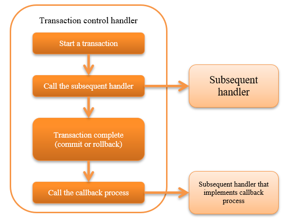

.. _transaction_management_handler:

Transaction Control Handler
==================================================

.. contents:: Table of contents
  :depth: 3
  :local:

This handler realizes transparent transactions in subsequent processes using resources corresponding to transactions such as databases and message queues.

For transaction details, see :ref:`transaction` .

This handler performs the following process.

* Begin a transaction
* End a transaction (commit or rollback)
* Callback at the end of the transaction

The process flow is as follows.

Handler class name
--------------------------------------------------
* :java:extdoc:`nablarch.common.handler.TransactionManagementHandler`

Module list
--------------------------------------------------
.. code-block:: xml

  <dependency>
    <groupId>com.nablarch.framework</groupId>
    <artifactId>nablarch-core-transaction</artifactId>
  </dependency>

  <!-- Only to control transactions to the database -->
  <dependency>
    <groupId>com.nablarch.framework</groupId>
    <artifactId>nablarch-core-jdbc</artifactId>
  </dependency>

  <!-- Only when executing an optional process at the end of the transaction -->
  <dependency>
    <groupId>com.nablarch.framework</groupId>
    <artifactId>nablarch-core</artifactId>
  </dependency>

Constraints
------------------------------
Place after :ref:`database_connection_management_handler` 
  When controlling a transaction in a database, a database connection for transaction management must exist in the thread.
  Therefore, this handler must be placed after the :ref:`database_connection_management_handler` .

Configure the transaction control target
--------------------------------------------------
This handler uses the factory class ( :java:extdoc:`TransactionFactory <nablarch.core.transaction.TransactionFactory>` implementation class) configured in the :java:extdoc:`transactionFactory <nablarch.common.handler.TransactionManagementHandler.setTransactionFactory(nablarch.core.transaction.TransactionFactory)>` property to obtain the control target of the transaction and manage it on the thread.

When managing on a thread, configure a name to identify the transaction.
By default,  ``transaction``  is used but to use a different name, configure the name in the  :java:extdoc:`transactionName <nablarch.common.handler.TransactionManagementHandler.setTransactionName(java.lang.String)>` . 
:ref:`When using multiple transactions <transaction_management_handler-multi_transaction>` , it is required to set the value to the  :java:extdoc:`transactionName <nablarch.common.handler.TransactionManagementHandler.setTransactionName(java.lang.String)>`  property.

.. tip::

  To perform transaction control on the database configured with :ref:`database_connection_management_handler` , 
  configure the same value configured in :java:extdoc:`DbConnectionManagementHandler#connectionName <nablarch.common.handler.DbConnectionManagementHandler.setConnectionName(java.lang.String)>`  to the :java:extdoc:`transactionName <nablarch.common.handler.TransactionManagementHandler.setTransactionName(java.lang.String)>`  property.

  If a value is not configured in  :java:extdoc:`DbConnectionManagementHandler#connectionName <nablarch.common.handler.DbConnectionManagementHandler.setConnectionName(java.lang.String)>` , 
  then the configuration of :java:extdoc:`transactionName <nablarch.common.handler.TransactionManagementHandler.setTransactionName(java.lang.String)>` can be omitted.

Configure the handler by referring to the configuration file example given below.

.. code-block:: xml

  <!-- Transaction control handler -->
  <component class="nablarch.common.handler.TransactionManagementHandler">
    <property name="transactionFactory" ref="databaseTransactionFactory" />
    <property name="transactionName" value="name" />
  </component>

  <!-- When performing transaction control on the database, configure JdbcTransactionFactory -->
  <component name="databaseTransactionFactory"
      class="nablarch.core.db.transaction.JdbcTransactionFactory">
    <!-- Property configuration is omitted -->
  </component>

Commit a transaction in the case of specific exception
----------------------------------------------------------------------------------------------------
All errors and exceptions are subject to rollback in the default operation of this handler, 
but you may want to commit transaction depending on the contents of the exception that was thrown.

In this case, configure the exception class of the commit target for the :java:extdoc:`transactionCommitExceptions <nablarch.common.handler.TransactionManagementHandler.setTransactionCommitExceptions(java.util.List)>` property. 
The subclass of the configured exception class will also be a target for commit.

A configuration example is shown below.

.. code-block:: xml

  <component class="nablarch.common.handler.TransactionManagementHandler">
    <!-- Configure the exception class of commit target in transactionCommitExceptions property with FQCN. -->
    <property name="transactionCommitExceptions">
      <list>
        <!-- example.TransactionCommitException is targeted for commit -->
        <value>example.TransactionCommitException</value>
      </list>
    </property>
  </component>

Execute optional processing at the end of the transaction
----------------------------------------------------------------
This handler performs the callback process when the transaction ends (commit or rollback).

The process to be called back is the handler that implements :java:extdoc:`TransactionEventCallback <nablarch.fw.TransactionEventCallback>`  among the handlers configured after this handler. 
If multiple handlers implement :java:extdoc:`TransactionEventCallback <nablarch.fw.TransactionEventCallback>` , then the callback process is performed sequentially from the handler that has been configured earlier.

When rolling back a transaction, the callback process is executed after roll back. 
Therefore, the callback process is performed in a new transaction and is committed when the callback has completed successfully.

.. important::

  Note that if multiple handlers have implemented the callback process and an error or exception occurs during the callback process, 
  the callback process for the remaining handlers is not performed.

An example is shown below.

Creating a handler that performs callback process
  Create a handler that implements :java:extdoc:`TransactionEventCallback <nablarch.fw.TransactionEventCallback>`  as shown in the following implementation example.

  Implement the callback process at the time of transaction commit in :java:extdoc:`transactionNormalEnd <nablarch.fw.TransactionEventCallback.transactionNormalEnd(TData,nablarch.fw.ExecutionContext)>` , 
  and implement the callback process at the time of transaction rollback in :java:extdoc:`transactionAbnormalEnd <nablarch.fw.TransactionEventCallback.transactionAbnormalEnd(java.lang.Throwable,TData,nablarch.fw.ExecutionContext)>`.

  .. code-block:: java

    public static class SampleHandler
        implements Handler<Object, Object>, TransactionEventCallback<Object> {

      @Override
      public Object handle(Object o, ExecutionContext context) {
        // Implement handler processing
        return context.handleNext(o);
      }

      @Override
      public void transactionNormalEnd(Object o, ExecutionContext ctx) {
        // Implement callback process when committing a transaction
      }

      @Override
      public void transactionAbnormalEnd(Throwable e, Object o, ExecutionContext ctx) {
        // Implement callback process during transaction rollback
      }
    }

Build a handler queue
  Configure the handler that implements callback process in the subsequent handler of this handler as follows.

  .. code-block:: xml

    <list name="handlerQueue">
      <!-- Transaction control handler -->
      <component class="nablarch.common.handler.TransactionManagementHandler">
        <!-- Configuration of property is omitted -->
      </component>

      <!-- Handler that implements callback process -->
      <component class="sample.SampleHandler" />
    </list>

.. _transaction_management_handler-multi_transaction:

Using multiple transactions in an application
----------------------------------------------------------------------------------------------------
There may be cases where one application requires multiple transaction controls. 
In this case, multiple handlers are configured on the handler queue to manage the situation.

A configuration example for controlling transactions of multiple database connections is shown below.

.. code-block:: xml

  <!-- Configure default database connection -->
  <component name="defaultDatabaseHandler"
      class="nablarch.common.handler.DbConnectionManagementHandler">

    <property name="connectionFactory" ref="connectionFactory" />

  </component>

  <!-- Register a database connection with the name userAccessLog -->
  <component name="userAccessLogDatabaseHandler"
      class="nablarch.common.handler.DbConnectionManagementHandler">

    <property name="connectionFactory" ref="userAccessLogConnectionFactory" />
    <property name="connectionName" value="userAccessLog" />

  </component>

  <!-- Configure transaction control for the default database connection -->
  <component name="defaultTransactionHandler"
      class="nablarch.common.handler.TransactionManagementHandler">

    <property name="transactionFactory" ref="databaseTransactionFactory" />

  </component>

  <!-- Transaction control configuration for the database connection userAccessLog -->
  <component name="userAccessLogTransactionHandler"
      class="nablarch.common.handler.TransactionManagementHandler">

    <property name="transactionFactory" ref="databaseTransactionFactory" />
    <property name="transactionName" value="userAccessLog" />

  </component>

An example where the above handler is configured in the handler queue is shown.

.. code-block:: xml

  <!-- Handlers other than database and transaction control are omitted -->

  <list name="handlerQueue">
    <!-- Connection to default database and transaction control -->
    <component-ref name="defaultDatabaseHandler" />
    <component-ref name="defaultTransactionHandler" />

    <!-- Connection and transaction control of userAccessLog database -->
    <component-ref name="userAccessLogDatabaseHandler" />
    <component-ref name="userAccessLogTransactionHandler" />
  </list>

