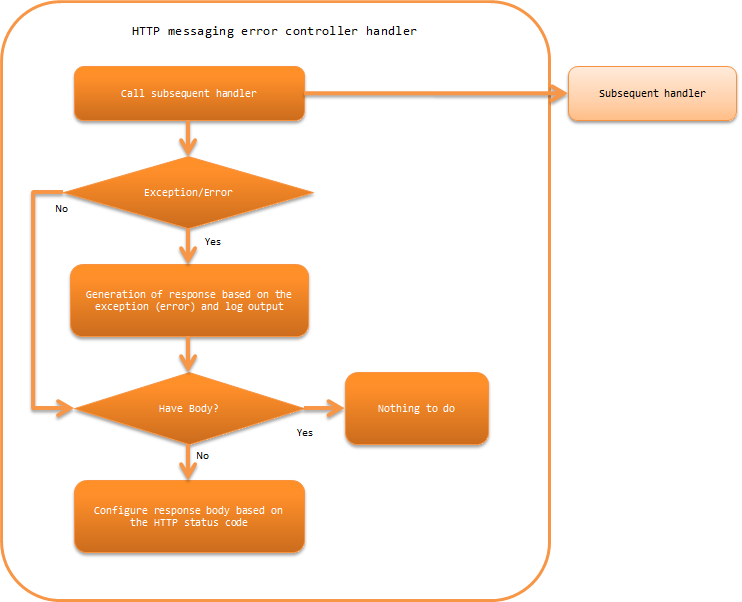

.. _http_messaging_error_handler:

HTTP Messaging Error Control Handler
==================================================
.. contents:: Table of contents
  :depth: 3
  :local:

This handler catches exceptions and errors that occur in subsequent handlers, performs log output and generates response according to the exceptions (errors).
If the response body is not configured in the subsequent handler, configures the default body corresponding to the HTTP status code in the response.

This handler performs the following processes:

* Outputs the log output and generates response according to the exception (error).
  For details, see :ref:`http_messaging_error_handler-error_response_and_log`.

* Configures the default response body.
  For details, see :ref:`http_messaging_error_handler-default_page`.

The process flow is as follows.

Handler class name
--------------------------------------------------
* :java:extdoc:`nablarch.fw.messaging.handler.HttpMessagingErrorHandler`

Module list
--------------------------------------------------
.. code-block:: xml

  <dependency>
    <groupId>com.nablarch.framework</groupId>
    <artifactId>nablarch-fw-messaging-http</artifactId>
  </dependency>

Constraints
------------------------------
Place this handler after the :ref:`http_response_handler`
  :java:extdoc:`HttpResponse <nablarch.fw.web.HttpResponse>` generated by this handler is processed by the :ref:`http_response_handler`.
  Therefore, it is necessary that this handler is configured after the :ref:`http_response_handler`.

.. _http_messaging_error_handler-error_response_and_log:

Processes the log output and generates response according to the exception type
---------------------------------------------------------------------------------------------------------
:java:extdoc:`nablarch.fw.NoMoreHandlerException`
  :Log level: INFO
  :Response: 404
  :Description: It is recorded as a trace log since it means that the handler to process the request is not available.
         The HTTP status code generates a response of *404*, which means that there was no *action class* to process.

:java:extdoc:`nablarch.fw.web.HttpErrorResponse`
  :Log level: No log output
  :Response: :java:extdoc:`HttpErrorResponse#getResponse() <nablarch.fw.web.HttpErrorResponse.getResponse()>`
  :Description: Log is not output because it means that a business exception (exception as a result of validation, etc.) was raised in a subsequent handler.

:java:extdoc:`nablarch.fw.Result.Error`
  :Log level: Depends on the configuration
  :Response: :java:extdoc:`Error#getStatusCode() <nablarch.fw.Result.Error.getStatusCode()>`
  :Description: Sed :ref:`http_messaging_error_handler-write_failure_log_pattern`.

:java:extdoc:`nablarch.core.message.ApplicationException` and :java:extdoc:`nablarch.fw.messaging.MessagingException`
  :Log level: \-
  :Response: 400
  :Description: The HTTP status code generates a response of *400* because of an exception indicating that the request from the client is incorrect.

Exceptions and errors other than the above
  :Log level: FATAL
  :Response: 500
  :Description: For exceptions and errors that do not correspond to the above, log is output as a failure.
         The response is **500** because it is an unexpected exception or error.

.. _http_messaging_error_handler-write_failure_log_pattern:

Log output of nablarch.fw.Result.Error
~~~~~~~~~~~~~~~~~~~~~~~~~~~~~~~~~~~~~~~~~~~~~~
If the exception raised in the subsequent handler is :java:extdoc:`Error <nablarch.fw.Result.Error>`,
then whether to output the log changes depending on the value configured in :java:extdoc:`writeFailureLogPattern <nablarch.fw.web.handler.HttpErrorHandler.setWriteFailureLogPattern(java.lang.String)>`.
A regular expression can be configured to this property, and if the regular expression matches :java:extdoc:`Error#getStatusCode() <nablarch.fw.Result.Error.getStatusCode()>`, a `FATAL` level log is output.

.. _http_messaging_error_handler-default_page:

Setting a default response when the response body is empty
--------------------------------------------------------------------------------------------------
For details, see :ref:`Configuration of the default page of HTTP error control handler <HttpErrorHandler_DefaultPage>`.
