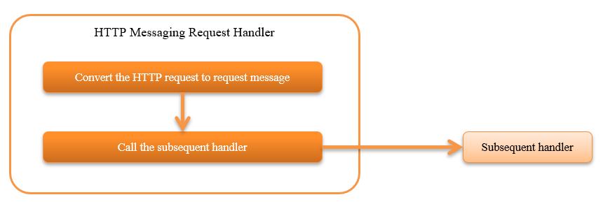

.. _http_messaging_request_parsing_handler:

HTTP Messaging Request Conversion Handler
==================================================
.. contents:: Table of contents
  :depth: 3
  :local:

This handler converts the HTTP request (:java:extdoc:`HttpRequest<nablarch.fw.web.HttpRequest>`) to the request message (:java:extdoc:`RequestMessage<nablarch.fw.messaging.RequestMessage>`).

This handler performs the following processes:

* Convert the HTTP request to request message.
  For details, see :ref:`http_messaging_request_parsing_handler-convert` .

The process flow is as follows.

  
Handler class name
--------------------------------------------------
* :java:extdoc:`nablarch.fw.messaging.handler.HttpMessagingRequestParsingHandler`

Module list
--------------------------------------------------
.. code-block:: xml

  <dependency>
    <groupId>com.nablarch.framework</groupId>
    <artifactId>nablarch-fw-messaging-http</artifactId>
  </dependency>

Constraints
------------------------------

Place this handler after the :ref:`http_response_handler` 
  Since this handler returns the response with the specified status code to the client when the conversion process fails, 
  it must be placed after the  :ref:`http_response_handler` .

Place this handler after the :ref:`thread_context_handler` 
  Since :java:extdoc:`DataRecordFormatter<nablarch.core.dataformat.DataRecordFormatter>` , which converts the request message and response message is obtained based on the request ID set in the thread context, 
  the handler must be placed after the :ref:`thread_context_handler` .

.. _http_messaging_request_parsing_handler-convert:

Convert the HTTP request to request message
--------------------------------------------------------------
The conversion contents are as given below.

.. list-table::
   :header-rows: 1
   :class: white-space-normal
   :widths: 30,30,40

   * - HTTP request (conversion source)
     - Request message (conversion destination)
     - Supplementary notes

   * - Request ID
     - Request path of request message
     -

   * - X-Message-Id request header
     - Message ID of request message
     - If this header is not present, returns ``400`` to the client.

   * - X-Correlation-Id request header
     - Correlation message ID of request message
     - Not configured if this header does not exist.

   * - Remaining request header
     - Request message protocol header
     -

   * - Request body
     - Framework control header and data record
     - For details, see  :ref:`Conversion of request body<http_messaging_request_parsing_handler-convert_body>` .   

.. _http_messaging_request_parsing_handler-convert_body:

Conversion of request body
 Request body conversion is performed by :ref:`data_format` . 
 The format definition file has to be prepared based on the following rules.

  Logical name of the format definition file when it is received
   <Request ID> + "_RECEIVE"

  Logical name of the format definition file when it is sent
   <Request ID> + "_SEND"

 The read data is handled as structured data by default, but each item is not configured for the framework control header. 
 Therefore, when configuring each item of the framework control header, add :java:extdoc:`StructuredFwHeaderDefinition<nablarch.fw.messaging.reader.StructuredFwHeaderDefinition>` to the component configuration file and specify the key information when acquiring the header information from the message.

 The configuration example is shown below.

 Point
   * The key information is specified in :java:extdoc:`StructuredFwHeaderDefinition#fwHeaderKeys<nablarch.fw.messaging.reader.StructuredFwHeaderDefinition.setFwHeaderKeys(java.util.Map)>`.
   * Specify the field name for the key and the position in the message for the value in the :java:extdoc:`StructuredFwHeaderDefinition#fwHeaderKeys<nablarch.fw.messaging.reader.StructuredFwHeaderDefinition.setFwHeaderKeys(java.util.Map)>` property. 
     Describe the key information after converting the structured data into Map for the position on the message. 
     Refer to :ref:`data_format-structured_data` for key information when converting from structured data to Map.

 .. code-block:: xml

  <component class="nablarch.fw.messaging.handler.HttpMessagingRequestParsingHandler">
    <property name="fwHeaderDefinition" ref="fwHeaderDefinition"/>
  </component>

  <component name="fwHeaderDefinition"
             class="nablarch.fw.messaging.reader.StructuredFwHeaderDefinition">
    <property name="FwHeaderKeys">
      <map>
        <entry key="userId"     value="_nbctlhdr.userId"/>
        <entry key="resendFlag" value="_nbctlhdr.resendFlag"/>
        <entry key="statusCode" value="_nbctlhdr.statusCode"/>
      </map>
    </property>
  </component>

 When handling fixed-length or variable length data, specify the standard framework control header definition.

 .. code-block:: xml

  <component name="fwHeaderDefinition"
             class="nablarch.fw.messaging.StandardFwHeaderDefinition" />

Exception handling during conversion
 The exceptions caught during conversion and processing contents are shown below. 
 Exceptions that are not shown below are not caught.

 :java:extdoc:`nablarch.fw.results.RequestEntityTooLarge`
  :Log level: INFO
  :Response: 413
  :Description: Since the size limit of the request body was exceeded, recorded as a trace log. 
         HTTP status code generates the response *413*  to indicate that the size has been exceeded.

 :java:extdoc:`nablarch.fw.messaging.MessagingException`
  :Log level: INFO
  :Response: 400
  :Description: Since the request body is invalid, it is recorded as a trace log. 
         To indicate a client error, the HTTP status code generates the response  *400*  .

 :java:extdoc:`nablarch.core.dataformat.InvalidDataFormatException`
  :Log level: INFO
  :Response: 400
  :Description: Since the request body format is invalid, it is recorded as a trace log. 
         To indicate a client error, the HTTP status code generates the response  *400*  .

.. _http_messaging_request_parsing_handler-limit_size:

To prevent requests of large size
--------------------------------------------------------------
If a large size request body is requested, 
the system may not operate normally as the disk resources may be used up completely.

Therefore, if size limit of the request body is exceeded, 
this handler outputs INFO log as a trail and returns ``400`` to the client.

The upper limit of the request body size is configured with the number of bytes. 
If the value is not configured, the value of  :java:extdoc:`Integer#MAX_VALUE<java.lang.Integer>`  is used.

A configuration example is shown below.

.. code-block:: xml

  <component class="nablarch.fw.messaging.handler.HttpMessagingRequestParsingHandler">
    <!-- Upload size (content-Length) upper limit (about 10M) -->
    <property name="bodyLengthLimit" value="10000000" />
  </component>
