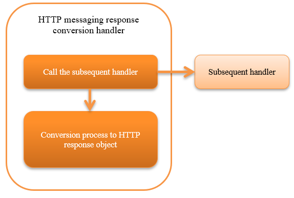

.. _http_messaging_response_building_handler:

HTTP Messaging Response Conversion Handler
==================================================
.. contents:: Table of contents
  :depth: 3
  :local:

This handler converts the response message object created by the subsequent handler to a HTTP response object. 
The value of the protocol header in the response message object is set in the corresponding HTTP header, and serialized to a format such as XML or JSON.

This handler performs the following processes:

* Converts the contents of response message object to HTTP response object.

The process flow is as follows.

  
Handler class name
--------------------------------------------------
* :java:extdoc:`nablarch.fw.messaging.handler.HttpMessagingResponseBuildingHandler`

Module list
--------------------------------------------------
.. code-block:: xml

  <dependency>
    <groupId>com.nablarch.framework</groupId>
    <artifactId>nablarch-fw-messaging-http</artifactId>
  </dependency>

Constraints
------------------------------

Configure this handler after the :ref:`http_response_handler` 
  As the :java:extdoc:`HTTP response object <nablarch.fw.web.HttpResponse>`  generated by this handler is returned by the :ref:`http_response_handler`  to the client.

.. _http_messaging_response_building_handler-header:

Value set in the response header
--------------------------------------------------
Configure the following response header based on the response message object created by the subsequent handler.

:Status-Code:
  Configures the status code of the response message object.

:Content-Type:
  Acquires and configures the following values from the formatter (:java:extdoc:`InterSystemMessage.getFormatter() <nablarch.fw.messaging.InterSystemMessage.getFormatter()>`) of the response message object.

  * MIME(:java:extdoc:`DataRecordFormatterSupport#getMimeType() <nablarch.core.dataformat.DataRecordFormatterSupport.getMimeType()>`
  * cherset(:java:extdoc:`DataRecordFormatterSupport#getDefaultEncoding() <nablarch.core.dataformat.DataRecordFormatterSupport.getDefaultEncoding()>`

  When MIME is  ``application/json`` and charset is  ``utf-8`` , Content-Type will have the following value.

  **application/json;charset=utf-8**

:Correlation message ID: Configures the value of  ``CorrelationId``  configured in the response message object to the response header  ``X-Correlation-Id`` .

.. important::
  This handler cannot configure response headers not described above.

  To use a response header other than the above, create a handler in the project.

Change the layout of the framework control header
--------------------------------------------------
When changing the definition of the framework control header in the response message, the definition of the framework control header extended in the project has to be configured. 
If it is not configured, the default  :java:extdoc:`StructuredFwHeaderDefinition <nablarch.fw.messaging.reader.StructuredFwHeaderDefinition>`  will be used.

For details of the framework control header, see  :ref:`framework control header <http_system_messaging-fw_header>` .

A configuration example is shown below.

.. code-block:: xml

  <component class="nablarch.fw.messaging.handler.HttpMessagingResponseBuildingHandler">
    <!-- Configuring the framework control header -->
    <property name="fwHeaderDefinition">
      <component class="sample.SampleFwHeaderDefinition" />
    </property>
  </component> 

.. |br| raw:: html

   
